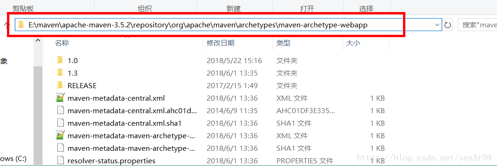
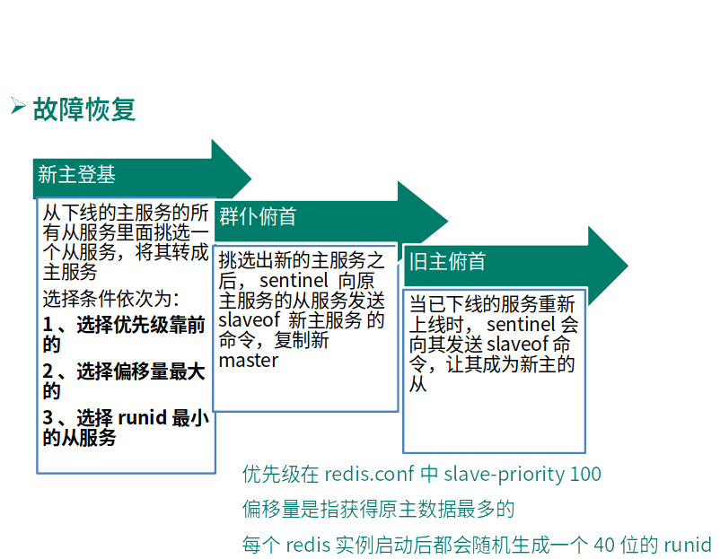

Big Data --Senior

## VScode

vscode 目录树的缩进设置：

[](https://iknow-pic.cdn.bcebos.com/c2fdfc039245d6880c54608eabc27d1ed21b2442)

文件-设置-首选项-搜索 treein ，改一下控制树缩进就好

### html

插件：

```
HTML CSS Support
HTML Snippets
HTML Preview
open in browser
```

## IDEA

```
Ctrl + Shift + E：访问最近写代码的位置
```


## Java Web

BS架构：Browser/Server，有浏览器端/客户端 和服务器

CS架构：Client/Server，有安装包/客户端和服务器


### 1. HTML

#### 1. 什么是HTML

1. HTML指的==超文本标记语言(Hyper Text Markup Language)==，是一种用来描述网页的语言。超文本指的是除了可以包含文字之外，还可以包含图片、链接、音乐、视频、程序等内容。

2. HTML网页的组成

   

3. 常用的HTML标签

   1. html     根标记

   2. head     头标记

   3. body     体标记

   4. a           超链接

      ```html
      <!-- 超链接  href:可以指定应用内或者是应用外的任意地址 -->
       <a href="http://www.baidu.com">点我查看</a>
      ```
   
      ==相对路径：==
   
      ```html
      <!--   ../../ 表示上两级目录    -->
      <a href="../../target.html">hhh</a>
      ```
   
      ==target==属性：设置要跳转的页面在何处打开
   
   >_self : 默认，在当前页面打开
      >
   >_blank: 在新的标签页打开
   
      ==base== 可 设置全局的target属性
   
      ```html
   <base target="_blank">
      ```

      
   
   5. form     表单
   
      - 使用form标签创建一个表单
   
      - action属性：指定服务器地址（表单将被提交的地址）
   
      - method属性：指定表单的请求方式
   
        > get：默认值，发送一个GET请求，用户输入的数据通过地址栏传输
        >
        > post：发送一个POST请求，用户输入的数据通过请求体进行传输
        >
        > 区别：get的地址栏会显示name属性的键值对，post不会显示。但是按F12，点network监听一下，header里会显示用户和密码，http协议本身就是不安全的
   
      
   
      - 表单中的表达项用input表示，不同的表单项通过type指定，value属性指定按钮上显示的文字 
      - 用户输入数据通过name属性进行携带，并以键值对的形式发送到服务器，多个键值对之间用&分隔
      -   键值对如：`username=cxy&password=123456 `，name相当于键，用户输入的内容为值
   
      ```html
      <!-- 表单: 收集用户的信息，提交到后台服务器 -->
      <form action="success.html" method="POST">
          
          用户名：<input type="text" name="username"><br/>
          密码：<input type="password" name="password"><br/>
          <input type="submit" value="登录">
      
      </form>
      ```
   
   6. table     表格
   
      - tr   行
   
      - th   标题列  自带居中并加粗的效果
   
      - td   普通列
   
      - colspan 跨列合并单元格
   
      - rowspan 跨行合并单元格
   
      - align = “center” 居中
   
        ```html
        <table border = "lpx" align="center" width = "60" cellspacing = 0>
                <tr>
                    <th>ID</th>
                    <th>name</th>
                    <th>gender</th>
                    <th>age</th>
                    <th>birthday</th>
        
                </tr>
                <tr align="center">
                    <td align="center">100</td>
                    <td>cxy</td>
                    <!-- 跨行合并单元格 -->
                    <td rowspan="2">female</td>
                    <td>23</td>
                    <td>-</td>
                </tr>
        
                <tr align="center">
                    <td align="center">100</td>
                    <td>cc</td>
                    <td>female</td>
                    <td>23</td>
                    <td>-</td>
                </tr>
        
                <tr align="center">
                    <td align="center">100</td>
                    <td>wwh</td>
                    <td>male</td>
                    <!-- 跨列合并单元格 设置colspan属性 -->
                    <td colspan="2" align="center"> 22</td>
                </tr>
        
            </table>
        ```

### 2. CSS

- 整个标签

  > 标签选择器

- 标签里面设置属性

  > id选择器
  >
  > 类选择器

- 分组选择器

  > 为不同类别的选择器设置相同的属性

```css
<head>
    <style type="text/css">
    /*标签选择器*/
    h1{
        color: yellow;
    }
    h2{
        background-color: antiquewhite;
    }

    /*id选择器
      格式：#id属性值
    */
    #p1{
        color: aqua;
    }

    /*类选择器
      格式：.class属性值
    */
    .p2{
        color: yellowgreen;
    }

    /*分组：将各个选择器用逗号分隔*/
    #p1,.p2{
        font-size: 22px;
    }
    </style>
</head>
```

颜色的表示方式：

1. 英文单词：red

2. rgb 值 ：rgb(250,0,0)

3. 使用 16 进制数：#FF0000  不区分大小写，从左到右两位一组，分别表示 R G B

   

### 3. Web

 [01_JavaWeb.html](ref/01_JavaWeb.html) 

#### web服务器

服务器主要用来接收或响应客户端发来的请求，当前使用最广的服务器：==Tomcat==

修改端口号：修改安装目录下的 `conf/service.xml` 里的启动端口号8080

#### 第一个web动态工程

[IDEA创建web工程](<https://www.cnblogs.com/wfhking/p/9395774.html>)

1. 运行web工程会自动展示此页面，工作空间内的此页面会被自动copy到服务器，然后在服务器中访问web/index.html页面

2. web/WEB-INF下需要自己建两个文件夹：**classes**（设置输出路径到此处,运行工程后工作空间内的类会加载到此处）, **lib**（设置为 dependency 后，用来放工程jar包）

3. 工程中服务器的工作路径选择 tomcat 的源路径。Eclipse中==web 目录会被 copy 到 tomcat 的 webapps下，同时把 web 改为工程名==。IDEA 中需自己设置路径，即 project structure 中 artifact 的目录。

4. index页面中按 F12，刷新看index的Headers 

   报文：分为 行、头、体

   > 浏览器发给服务器的是 ==请求报文==，分为请求行、请求头、请求体
   >
   > ```
   > //请求头
   > Request Headers
   > //请求行
   > GET /Web_tomcat_war_exploded/ HTTP/1.1
   > //请求体
   > Host: localhost:8080
   > Connection: keep-alive
   > Cache-Control: max-age=0
   > Upgrade-Insecure-Requests: 1
   > User-Agent: Mozilla/5.0 (X11; Linux x86_64) AppleWebKit/537.36 (KHTML, like Gecko) Chrome/80.0.3987.149 Safari/537.36
   > Sec-Fetch-Dest: document
   > Accept: text/html,application/xhtml+xml,application/xml;q=0.9,image/webp,image/apng,*/*;q=0.8,application/signed-exchange;v=b3;q=0.9
   > Sec-Fetch-Site: none
   > Sec-Fetch-Mode: navigate
   > Sec-Fetch-User: ?1
   > Accept-Encoding: gzip, deflate, br
   > Accept-Language: zh-CN,zh;q=0.9
   > Cookie: Idea-c3466856=bdab302f-9076-4c60-a7e9-778b2a6ffd03
   > If-None-Match: W/"714-1584880762014"
   > If-Modified-Since: Sun, 22 Mar 2020 12:39:22 GMT
   > ```
   >
   > 服务器发给浏览器的是 ==响应报文==，分为响应行、响应头、响应体
   >
   > ```
   > //响应头
   > Response Headers
   > //响应行
   > HTTP/1.1 200
   > //响应体
   > Date: Sun, 22 Mar 2020 12:43:30 GMT
   > Accept-Ranges: bytes
   > ETag: W/"714-1584880762014"
   > Last-Modified: Sun, 22 Mar 2020 12:39:22 GMT
   > Content-Type: text/html
   > Content-Length: 714
   > ```

#### 3.1 登录功能实现—LoginServlet

1)        Servlet  

2)        Request请求对象

3)        Response响应对象

##### 1 什么是Servlet

1. Servlet是Sun公司制定的一套技术标准，包含与Web应用相关的一系列接口，是Web应用实现方式的<u>宏观解决方案</u>。而具体的 ==Servlet 容器（Tomcat）负责提供标准的实现==。

2. Servlet作为服务器端的一个组件，它的本意是“服务器端的小程序”（==Tomcat中会有多个Servlet，每一个Servlet都负责处理一件事，如登录、注册==）。Servlet的实例对象由Servlet容器负责创建；Servlet的方法由容器在特定情况下调用；Servlet容器会在Web应用卸载时销毁Servlet对象的实例。

   ```mermaid
   graph LR
   
   	Cient --HTTP--> Servlet_登录
   	Servlet_登录 --HTTP--> Cient
   	subgraph Tomcat
   	Servlet_注册
   	Servlet_登录
   	Servlet_忘记密码
   	...
   	end
   ```

3. 简单可以理解为  ==Servlet就是用来处理客户端的请求的== 

##### 2 Servlet开发规则

新建一个Servlet

##### 3 Servlet类的相关方法

- doGet：处理客户端的get方式的请求

- doPost：处理客户端的post方式的请求

- service：根据具体的请求方式去调用对应的doGet、doPost 方法

  >  ①      在Servlet的顶层实现中，在service方法中调用的具体的doGet或者是doPost
  >
  >  ②      在实际开发Servlet的过程中，可以选择重写doGet以及doPost  或者 直接重写service方法来处理请求。

#####4 Servlet在web.xml中的配置

```xml
<!--注册Servlet-->
<servlet>
  <!-- 给Servlet取名，一般写类名.取的名字前后必须一致-->
  <servlet-name>helloServlet</servlet-name>
  <!-- 配置Servlet实现类的全类名，Servlet容器会利用反射帮我们创建对象-->
  <servlet-class>com.atguigu.servlet.helloServlet</servlet-class>
</servlet>
    
<!--映射Servlet。如果用户发送多个请求，需要知道是谁发的-->
<servlet-mapping>
  <servlet-name>helloServlet</servlet-name>
  <!--配置映射的请求地址,在浏览器的地址栏输入MyFirstServlet的时候才发起请求-->
  <url-pattern>/MyFirstServlet</url-pattern>
</servlet-mapping>
```

Servlet 3.0之后可以在Servlet中使用注解直接配置URL。需要在Servlet中导入`import javax.servlet.annotation.WebServlet;` 。然后使用

```java
@WebServlet(name = "AutoServlet",urlPatterns = "/AutoServlet")
//注意urlPatterns那里要写/  
//也可以如下：
@WebServlet("/AutoServlet")
```

==name  和 urlPatterns 对应 web.xml 中的 <url-name> 和 <url-pattern>== 

就可以直接配置了，然后通过所输入的URL可以直接访问到。

##### 5 request 和 response 的使用

==request== 的作用

- 获取请求参数

- 获取项目虚拟路径

- 转发

  

==response== 的作用

- 给浏览器响应一个字符串或一个页面
- 重定向

==转发和重定向的区别：==

1. 转发只发一次请求，即AutoServlet。重定向发了2次请求：AutoServlet 和 success.html
2. 转发浏览器地址栏无变化，重定向有变化
3. 转发可以访问WEB-INF目录下的资源，==重定向不可以访问WEB-INF目录下的资源==
4. 转发可以共享request域中的内容，重定向不可以

##### 6. 登录之获取链接


##### 7. 绝对路径与相对路径

因为在login中使用 相对路径 ../LoginServlet 导致二次登录时又到了上级目录，所以使用绝对路径来解决此问题

绝对路径

- 以 ==/ 开头的路径即为绝对路径==     / 代表的意义：

  > 1. 如果地址由浏览器解析， / 代表： http://localhost:8080/。如：
  >
  >    > - html标签中的路径，如：
  >    >
  >    >   > - a 标签中的 href 属性中的路径
  >    >   > - form 标签中的 action 属性中的路径等
  >    >
  >    > - 重定向中的路径
  >    >
  >    >   
  >
  > 2. 如果由服务器解析， / 代表： http://localhost:8080/Web_Exercise_war_exploded/ (即服务器中项目的地址。注意==不要随便改tomcat自动创建的URL地址==，如：http://localhost:8080/Web_Exercise_war_exploded/，不要强行去掉_war_exploded，就算把artifact中的路径一起改也不行），如：
  >
  >    > - web.xml中url-pattern标签中的路径
  >    > - 转发中的路径
  >
  > 

- ==head 里==的 base 标签中的href可以将相对路径变为绝对路径，因为它会加到body里href属性里的地址前面

  	```html
    	<head>
    	  <meta charset="UTF-8">
    	  <title>Insert title here</title>   
    	  <base href="http://localhost:8080/Web_Exercise_war_exploded/"></head>
  ```

index.html , login.html, login_success.html , LoginServlet.java 中的路径也需改为绝对路径

#### 3.2 登录页面中的错误提示

- JSP页面
- EL 表达式
- js 的简单应用

##### 1. JSP

- JSP全称Java Server Pages，顾名思义就是**运行在java服务器中的页面**，也就是在我们JavaWeb中的动态页面，其==本质就是一个Servlet==。
- 其本身是一个动态网页技术标准，它的主要构成有HTML网页代码、Java代码片段、JSP标签几部分组成，后缀是 .jsp
- 相比于Servlet，JSP更加善于处理显示页面，而Servlet跟擅长处理业务逻辑，两种技术各有专长，所以一般我们会将Servlet和JSP结合使用，Servlet负责业务，JSP负责显示。
- 一般情况下， 都是Servlet处理完的数据，转发到JSP，JSP负责显示数据的工作
- JSP的基本语法:

- 本质上就是一个Servlet

  

  **JSP基本语法**

- 1. ==JSP脚本片段== 

     作用：用来在里面写Java代码

     ```jsp
     <!-- 1.JSP脚本片段
     		作用：用来在里面写Java代码
     	 -->
     	 <%
     	 	for(int i = 0 ; i < 5 ; i ++){
     	 		//out.print("今天天气好晴朗，处处好风光！");
     	 %>		
     	 <h2>今天天气好晴朗，处处好风光！</h2>
     	 <%
     	 	}
     	 %>
     ```

  2. ==JSP表达式==

     - - 作用：用来输出对象

     - - ```jsp
         <%="我是通过JSP表达式输出的" %>
         ```

  3. JSP 的隐含对象

     - out（JspWriter）：相当于response.getWriter()获取的对象，用于在页面中显示信息。
     - config（ServletConfig）：对应Servlet中的ServletConfig对象。
     - page（Object）：对应当前Servlet对象，实际上就是this。
     - ==pageContext==（PageContext）：当前页面的上下文，也是一个域对象。
     - exception（Throwable）：错误页面中异常对象
     - ==request==（HttpServletRequest）：HttpServletRequest对象
     - response（HttpServletResponse）：HttpServletResponse对象
     - ==application==（ServletContext）：ServletContext对象
     - ==session==（HttpSession）：HttpSession对象

     只需要掌握高亮的4个域对象

  4. ==JSP 的四个域对象==

     ==这4个域对象有不同的生命周期==

     - page域

       > 范围：当前页面（页面关掉 对象消失）
       > ==对应的域对象==：即用来调用域内方法的对象
       >
       > > page对应的域对象 ： pageContext
       >
       > 域对象的类型：PageContext

     - request域

       > 范围：当前请求（一次请求，转发还是一次请求，重定向是新的请求）
       > 对应的域对象：request
       > 域对象的类型：HttpServletRequest

     - session域

       > 范围：当前会话（一次会话，只要浏览器不关闭都可以拿到它的请求）
       > 对应的域对象：session
       > 域对象的类型：HttpSession

     - application域

       >范围：当前 Web 应用（服务器关掉应用停止）
       >对应的域对象：application
       >域对象的类型：ServletContext

     

     四个域对象都以下三个方法：

     - void setAttribute(String key , Object value)
     - Object getAttribute(String key)
     - void removeAttribute(String key)

     ```jsp
     <%
     	 	pageContext.setAttribute("pageKey", "pageValue");
     	 	request.setAttribute("reqKey", "reqValue");
     	 	session.setAttribute("sessKey", "sessValue");
     	 	application.setAttribute("appKey", "appValue");
     %>
     	 <h1>在当前页面中获取四个域中的属性值</h1>
     	 page域中的属性值：<%=pageContext.getAttribute("pageKey") %><br>
     	 request域中的属性值：<%=request.getAttribute("reqKey") %><br>
     	 session域中的属性值：<%=session.getAttribute("sessKey") %><br>
     	 application域中的属性值：<%=application.getAttribute("appKey") %><br>
     ```

     

     四个域对象的使用规则：能用小的就不用大的

     

**登录失败后添加错误提示**

在LoginServlet 判断用户名密码的时候 加入

```java
request.setAttribute("msg","用户名或密码不正确");
```

然后在登录界面中：

```jsp
用户名称：<input type="text" name=username><span style="color: red"><%= request.getAttribute("msg") == null ? "": request.getAttribute("msg")%></span> 
```

##### 2. EL（Expression Language）

- 格式：==${表达式}==
- 作用：主要用来输出域对象中的属性值

1. EL是JSP内置的表达式语言，用以访问页面的上下文以及不同作用域中的对象 ，==输出对象属性的值==，或执行简单的运算或判断操作。EL在得到某个数据时，会自动进行数据类型的转换。
2. **EL** 表达式用于代替JSP表达式 `<%= %>` 在页面中做输出操作。
3. EL表达式仅仅用来读取数据，而不能对数据进行修改。
4. 使用EL表达式输出数据时，**如果有则输出数据，如果为null则什么也不输出。**
5. EL 表达式的语法

> EL表达式查询的规则：
>
> > 1. 先从page域中开始查找，找到后直接返回，不再向其他域中查找，如果找不到再去request域中查找，以此类推...
> >
> > 2. 如果在application域中仍找不到则返回空串
> >
> > 3. ==EL 提供了四个Scope对象==，用来精确获取指定域中的属性值。优先级由高到低:
> >
> >    > - pageScope
> >    >
> >    >   > 获取page域中的属性值
> >    >
> >    > - requestScope
> >    >
> >    >   > 获取request域中的属性值
> >    >
> >    > - sessionScope
> >    >
> >    >   > 获取session域中的属性值
> >    >
> >    > - applicationScope	
> >    >
> >    >   > 获取application域中的属性值
>
> > ```jsp
> > <%
> > //创建Employee对象
> > Employee employee = new Employee(1,"吴秀波",new Department(1001,"出轨门"));
> > //将employe对象放到page域中
> > pageContext.setAttribute("star", employee);
> > %>
> > 
> > 通过EL表达式输出Employee对象的lastName：${pageScope.star.lastName }<br>
> > 通过EL表达式输出Employee对象的dept属性的name属性值：${pageScope.star.dept.name }<br>
> > 
> > 通过EL表达式输出Employee类中getOutName方法的返回值：${pageScope.star.outName }<br>
> > 
> > star.后面调用的是employee对象里的get的方法，名字是将get方法去掉get，首字母变成小写
> > ```

##### 3. JavaScript

1. 在1995年时，由[Netscape](http://baike.baidu.com/view/153922.htm)公司的[Brendan 	Eich](http://baike.baidu.com/view/2135520.htm)，在[网景导航者](http://baike.baidu.com/view/1350596.htm)浏览器上首次设计实现而成。[Netscape](http://baike.baidu.com/view/153922.htm)在最初将其脚本语言命名为[LiveScript](http://baike.baidu.com/view/2373233.htm)，因为[Netscape](http://baike.baidu.com/view/153922.htm)与[Sun](http://baike.baidu.com/subview/24856/10322735.htm)合作，网景公司管理层希望它外观看起来像[Java](http://baike.baidu.com/subview/29/12654100.htm)，因此取名为JavaScript。

2. 特性

   > - 脚本语言。JavaScript是一种解释型的脚本语言,C、C++、Java等语言先编译后执行,	而JavaScript是在程序的运行过程中逐行进行解释。
   > - 基于对象。JavaScript是一种基于对象的脚本语言,它不仅可以创建对象,也能使用现有的对象。
   > - 简单。JavaScript语言中采用的是弱类型的变量类型,对使用的数据类型未做出严格的要求,是基于Java基本语句和控制的脚本语言。
   > - 动态性。JavaScript是一种采用事件驱动的脚本语言,它不需要经过Web服务器就可以对用户的输入做出响应。
   > - 跨平台性。JavaScript脚本语言不依赖于操作系统,仅需要浏览器的支持。因此一个JavaScript脚本在编写后可以带到任意机器上使用,前提是机器上的浏览器支	持JavaScript脚本语言,目前JavaScript已被大多数的浏览器所支持

3. 编写位置

   1.  编写到HTML中<script>标签中

      ```html
      <head>
        <script type="text/javascript">
          
        </script>
      </head>
      ```

   2.  写在外部的 .js 文件中。然后通过script标签引入

   ```html
   <script type="text/javascript" src="script.js"></script>
   ```

4. JavaScript的事件驱动

   - 用户事件：用户操作，例如单击、鼠标移入、鼠标移出等

   - 系统事件：由系统触发的事件，例如文档加载完成

   - 常用的事件

     > onload：当整个文档都加载完成之后再执行函数中的内容
     >
     >  onclick：给按钮对象绑定单击事件
     >
     >  onblur
     >
     >  onfocus
     >
     >  onmouseover
     >
     >  onmouseout

5. ==BOM==

   - Borwser Object Model 浏览器对象模型
   - 浏览器对象模型提供了独立于内容的、可以与浏览器窗口进行互动的对象结构。BOM由多个对象组成，其中代表浏览器窗口的Window对象是BOM的顶层对象，其他对象都是该对象的子对象
   - 常用的对象(window的子对象)

    document  history    location    screen   navigator    frames

6. ==DOM==

   - Document Object Model 文档对象模型

   - document对象: window对象的一个属性，代表当前HTML文档，包含了整个文档的树形结构。获	取document对象的本质方法是：window.document，而“window.”可以省略

   - DOM树

     

   - 元素查询

     

     | 功能               | API                                     | 返回值             |
     | ------------------ | --------------------------------------- | ------------------ |
     | 根据id值查询       | document.getElementById(“id值”)         | 一个具体的元素节点 |
     | 根据标签名查询     | document.getElementsByTagName(“标签名”) | 元素节点数组       |
     | 根据name属性值查询 | document.getElementsByName(“name值”)    | 元素节点数组       |


#### 3.3 注册

##### 1 jQuery

1. jQuery是为了==简化==JavaScript开发而生的一个小型的框架，jQuery和 \$ 是相等的，我们==通常使用 \$ 代替 jQuery 这个单词==

   ```javascript
   <script type="text/javascript" src="script/jquery-1.7.2.js"></script>
   <script type="text/javascript">
     			//当整个文档都加载完成之后再执行函数中的内容
   
   //在JavaScript中
   window.onload = function(){
     //1.获取按钮对象
     var btnEle = document.getElementById("btnId");
     //2.给按钮对象绑定单击事件
     btnEle.onclick = function(){
     //3.弹出提示框
     alert("Hello JavaScript!");
     };
   };
   
   //在jQuery中
   $(function(){
   		//获取按钮对象并给它绑定单击事件
   		$("#btnId").click(function(){
   			//弹出提示框
   			alert("Hello jQuery!");
   		});
	});
   </script>
   ```
```
   

   
   - 基本选择器
   
  > - ID选择器 ：`$("#id属性值")`
     > - 类选择器：`$(".class属性值")`
  > - 标签选择器：$("html标签")
   
   - 常用的方法
   
     > 1. attr()
     >
     >    - 获取或设置标签的属性值
     >    - 对象.attr("属性名")：获取属性值
     >    - 对象.attr("属性名","属性值")：设置属性值
     >
     > 2. text()和html()方法
     >
     >    - 获取或设置成对出现的标签中的文本值
     >
     >    - 对象.text()：获取文本值
     >
     >    - 对象.text("新值")：设置文本值
     >
     >    - html()方法与text()方法的唯一区别是html方法可以解析html标签
     >
     >      详见：Java_Web/day03/Web_Ex/项目下的 login.js
     >
     > 3. val()
     >
     >    - 获取或设置input标签的value属性值
     >
     >    - 对象.val()：获取value属性值
     >
     >    - 对象.val("新值")：设置value属性值
     >
     >      详见：Java_Web/day03/Web_Ex/项目下的 login.js
     >
     > 4. 事件
     >
     >    - click()：单击事件
     >    - change()：内容改变的事件
     >
     > 5. 正则表达式
     >
     >    ```javascript
     >    $(function(){
     >      //给提交按钮绑定单击事件
     >      $("#sub").click(function(){
     >    	//获取用户输入的用户名
     >    	var username = $("#username").val();
     >    	//设置一个验证用户名是否符合规则的正则表达式
     >    	//var userReg = /a/;//  /a/表示只要用户名内有a就可以提交表单
     >      // ^设置开头的格式限制，_-表示允许_和-开头{}内的内容限制用户名长度
     >    	var userReg = /^[a-zA-Z0-9_-]{3,6}$/;
     >    	//验证用户名是否符合规则
     >    	var flag = userReg.test(username);
     >    	if(!flag){
     >    		alert("请输入3-6位的字母、数字、下划线或减号的用户名！");
     >    		return false;
     >    	}
  >      });
     >    });
     >    ```
   
   

#####  2. Ajax

- AJAX 是 Asynchronous JavaScript And XML 的简称。直译为，异步的 JS 和XML。
- AJAX的实际意义是，不发生页面跳转、异步载入内容并改写页面内容的技术。
- AJAX也可以简单的理解为通过 JS 向服务器发送请求。

1. 同步处理

​	AJAX出现之前，我们访问互联网时一般都是同步请求，也就是当我们通过一个页面向	服务器发送一个请求时，在服务器响应结束之前，我们的整个页面是不能操作的，也就	是直观上来看他是卡主不动的。

​	这就带来了非常糟糕的用户体验。首先，同步请求时，用户只能等待服务器的响应，而	不能做任何操作。其次，如果请求时间过长可能会给用户一个卡死的感觉。最后，同步	请求的最大缺点就是即使整个页面中只有一小部分内容发生改变我们也要刷新整个页	面。

2. 异步处理

 而异步处理指的是我们在浏览网页的同时，通过AJAX向服务器发送请求，发送请求的过程中我们浏览网页的行为并不会收到任何影响，甚至主观上感知不到在向服务器发送请求。当服务器正常响应请求后，响应信息会直接发送到AJAX中，AJAX可以根据服务器响应的内容做一些操作。

 使用AJAX的异步请求基本上完美的解决了同步请求带来的问题。首先，发送请求时不会影响到用户的正常访问。其次，即使请求时间过长，用户不会有任何感知。最后，AJAX可以根据服务器的响应信息局部的修改页面，而不需要整个页面刷新。

**通过 $.ajax 发送 Ajax请求**

​```javascript
$("#btnId").click(function(){
	//通过$.ajax()方法发送Ajax请求
	/*
		url：必须的。用来设置请求地址
		type：可选的。用来设置发送请求的请求方式，默认是get
		data：可选的。用来设置请求参数
		success：可选的。用来设置回调函数，响应成功之后系统会自动调用该函数，
				响应数据会以参数的形式传入到该函数中
		dataType：可选的。用来设置响应数据的类型，默认是text，还可以设置xml、json等		
	*/
	$.ajax({
		url:"${pageContext.request.contextPath }/AjaxServlet",
		type:"get",
		data:"username=admin&password=123456",
		success:function(res){
			//将响应信息设置到span标签中
			$("#res").text(res);
		},
		dataType:"text"
	});
});
```

**通过 \$.get() 或 \$.post() 发送Ajax请求**

get 和 post 指请求的 method，post请求用\$.post

```javascript
$("#btnId2").click(function(){
	//通过$.get/post()方法发送Ajax请求
	/*
		$.get(url, [data], [callback], [type])
			url：必须的。用来设置请求地址
			data：可选的。用来设置请求参数
			callback：可选的。用来设置一个回调函数，响应成功之后系统会自动调用该函数，
					响应数据会以参数的形式传入到该函数中
			type：可选的。用来设置响应数据的类型		
	*/
	//设置请求地址
	var url = "${pageContext.request.contextPath }/AjaxServlet";
	//设置请求参数
	var params = "username=admin&password=666666";
// 			$.get(url,params,function(res){
// 				//将响应数据设置到span标签中
// 				$("#res2").text(res);
// 			},"text");
	//通过$.post()发送一个post请求
	$.post(url);
});
```

##### 3. JSTL

- JSP 的标准标签库，使用它需要导入以下jar包

  > jstl.jar
  >
  > standard.jar

- 使用c标签需要导入核心标签库

  ```javascript
  <%@ taglib uri=*"http://java.sun.com/jsp/jstl/core"* prefix=*"c"* %> 
  ```

- if 标签

  ```javascript
   	 <%
  	 	int age = 86;
  	 	pageContext.setAttribute("age", age);
  	 %>
  	 <c:if test="${age < 18 }">
  	 	禁止未成年人入内！
  	 </c:if>
  	  <c:if test="${age > 18 }">
  	 	请尽情浏览，注意身体！！！
  	 </c:if>
  	 <%
  ```

- forEach 标签

 ```javascript
<%
  List<String> list = new ArrayList();
 	 	list.add("吉沢明步");
 	 	list.add("蓝泽润");
 	 	list.add("京香JULIA");
 	 	list.add("潘金莲");
 	 	list.add("文章");
 	 	list.add("白百何");
 	 	list.add("李小璐");
 	 	list.add("林丹");
 	 	list.add("吴秀波");
  //将list放到page域中
  pageContext.setAttribute("stars", list);
%>
<hr>
<!-- forEach标签：相当于Java中的for循环
    items属性：接收一个要遍历的集合
    var属性：设置一个遍历接收遍历到的值，同时会以变量值为key将遍历到的值放到page域中
 -->
<c:forEach items="${stars }" var="star">
  <a href="#">${pageScope.star }</a><br>
</c:forEach>
<!--
 ```


- empty运算符

- > 用来判断一个字符串或一个集合是否为空
  >
  > ```javascript
  > empty运算符：主要用来判断一个字符串或一个集合是否为空
  >  -->
  > <c:if test="${empty pageScope.stars }">
  >   世界很美好，没有人乱搞！！！
  > </c:if>
  > ```

#### 3.4 登录功能实现-登录成功跳转主页面

- Session会话 
- Cookie  
- [JSTL](#3. JSTL)

##### 1. Cookie

**Cookie的运行原理**

​      1.第一次向服务器发送请求时在服务器端创建一个Cookie对象

​      2.将Cookie对象发送给浏览器

​      3.以后浏览器再发请求就会携带着该Coolie对象

​      4.服务器通过不同的Cookie来区别不同的用户

1. HTTP是==无状态协议==，服务器不能记录浏览器的访问状态，也就是说==服务器不能区分中两次请求是否由一个客户端发出==。这样的设计严重阻碍的Web程序的设计。如：在我们进行网购时，买了一条裤子，又买了一个手机。由于http协议是无状态的，如果不通过其他手段，服务器是不能知道用户到底买了什么。而Cookie就是解决方案之一。

2. Cookie实际上就是服务器==保存在浏览器上==的一段信息。浏览器有了Cookie之后，每次向服务器发送请求时都会同时将该信息发送给服务器，服务器收到请求后，就可以根据该信息处理请求。

   

 **Cookie的用途**

1. 网上商城购物车
2. 用户登录状态的保持

**Cookie的限制性**

1. Cookie作为请求或响应报文发送，无形中增加了网络流量

2. Cookie是明文传送的安全性差

3. 各个浏览器对Cookie有限制，使用上有局限

   

##### 2. session

**Session的运行原理：**

1. 第一次向服务器发送请求时==在服务器端创建一个Session对象==，该对象有一个全球唯一的ID
2. 在创建Session对象的同时会创建一个特殊的Cookie对象，该Cookie对象的名字是一个固定值：==JSESSIONID==， 该Cookie对象的==值==就是Session对象的==ID==值，并且将该Cookie对象发送给浏览器
3. 以后浏览器再发送请求就会携带着这个特殊的Cookie对象
4. 服务器获取Cookie对象的值之后寻找与之对应的Session对象，以此来区分不同的用户 


##### 3.5 完成注销功能及钝化和活化

==注销==：使session对象失效

==钝化==：服务器关闭时，session及session里的用户从内存持久化到硬盘，叫钝化

==活化==：服务器再启动时，会从硬盘反序列化到内存，叫活化

##### 3.6 主页面访问权限控制

**过滤器**

    1) 对于WEB应用来说，过滤器是一个驻留在服务器中的WEB组件，他可以截取客户端和WEB资源之间的请求和响应信息。WEB资源可能包括Servlet、JSP、HTML页面等
    2) 当服务器收到特定的请求后，会先将请求交给过滤器，程序员可以在过滤器中对请求信息进行读取修改等操作，然后将请求信息再发送给目标资源。目标资源作出响应后，服务器会再次将响应转交给过滤器，在过滤器中同样可以对响应信息做一些操作，然后再将响应发送给服务器。
    3) 也就是说过滤器可以在WEB资源收到请求之前，浏览器收到响应之前，对请求和响应信息做一些相应的操作。
    4) 在一个WEB应用中可以部署多个过滤器，多个过滤器就组成了一个过滤器链，请求和响应必须在经过多个过滤器后才能到达目标

**过滤器的使用**
    1) 通过实现Filter接口完成过滤器的开发

```java
//filterSevelet设置，urlPatterns的值表示拦截地址，也可以用 servletNames
//拦截路径发出请求时，filter将决定是否拦截
@WebFilter(filterName = "HelloFilter",urlPatterns = "/index.jsp")
//放行请求,不写此句则表示拦截
chain.doFilter(req, resp);
```

- 作用：用来==拦截用户的请求==，但是Filter只拦截请求==不拦截响应==

- 我们还可以为同一个资源设置多个过滤器，多个过滤器的拦截顺序由web.xml中的filter-mapping　标签对，在前的先拦截，在后的后拦截。如果不设置，则按filter创建的先后顺序，后创建的优先。

  

- 以拦截index.jsp页面为例创建两个拦截器

- - HelloFilter
  - HelloFIlter2

##### 3.5 在线人数统计

**监听器**

- Lisener 监听器用来监听ServletRequest、HttpSession、ServletContext对象的生命周期和三个域中的属性变化

- 分类

  > 1. 1. 生命周期 
  >    2. 数据绑定			

- 掌握==ServletContext==的生命周期监听器

- > ServletContextListener
  >
  > > - 通过该接口创建的监听器服务器已启动该对象就被创建
  > >
  > > - 服务器关闭该对象就销毁

- - 

## Maven

#### XML

1. XML--可扩展标记语言eXtensible Markup Language
2. 由W3C组织发布，目前推荐遵守的是W3C组织于2000年发布的XML1.0规范
3. XML的使命，就是以一个统一的格式，组织有关系的数据，为不同平台下的应用程序服务
4. XML用来==传输和存储数据==，HTML用来显示数据
5. XML没有预定义标签，均为==自定义标签==

##### xml 用途

1. 配置文件

   > -  JavaWeb 中的 web.xml
   > - C3P0中的c3p0-config.xml

2. 数据交换格式

   > - ==Ajax==
   > -  WebService

3. 数据存储

    保存关系型数据

   

##### xml 语法

1. XML文档组成

   > - XML声明
   >
   >   > 1. version属性指定XML版本，固定值是1.0
   >   > 2. encoding指定的字符集，是告诉解析器使用什么字符集进行解码，而编码是由文本		编辑器决定的
   >
   > - CDATA区
   >
   >   > 1. 当XML文档中需要写一些程序代码、SQL语句或其他不希望XML解析器进行解析的内容时，就可以写在CDATA区中
   >   >
   >   > 2. XML解析器会将CDATA区中的内容原封不动的输出
   >   >
   >   >    > CDATA区的定义格式：`<![CDATA[…]]>`

2. 语法规则

   - XML声明要么不写，要写就写在第一行，并且前面没有任何其他字符
   - 只能有一个根标签
   - 标签必须正确结束
   - 标签不能交叉嵌    
   - 严格区分大小写
   - 属性必须有值，且必须加引号
   - 标签不能以数字开头
   - 注释不能嵌套

3. xml解析

   >- XML解析是指通过解析器读取XML文档，解释语法，并将文档转化成对象
   >- 常用的解析方式
   >
   >> DOM（Document Object Model）
   >>
   >>  SAX（Simple API for XML）
   >
   >- DOM 和SAX解析的对比
   >
   >  
   >
   >- Dom4j解析示例
   >
   >  ```java
   >  				//创建解析对象
   >          SAXReader saxReader = new SAXReader();
   >  
   >          //解析xml文档
   >          Document document = saxReader.read("students.xml");
   >  
   >          //获取根标签student
   >          Element rootElement = document.getRootElement();
   >  
   >          //获取所有的student标签
   >          List<Element> stus = rootElement.elements("student");
   >  ```

   

#### JSON

1. AJAX一开始使用的时XML的数据格式，XML的数据格式非常简单清晰，容易编写，但是由于XML中包含了过多的标签，以及十分复杂的结构，解析起来也相对复杂，所以目前来讲，AJAX中已经几乎不使用XML来发送数据了。取而代之的是一项新的技术JSON。
2. JSON是 **JavaScript Object Notation** 的缩写，是JS提供的一种数据交换格式。
3. JSON对象本质上就是一个JS对象，但是这个对象比较特殊，它可以直接转换为字符串，在不同语言中进行传递，通过工具又可以转换为其他语言中的对象。
4. 如下一个JSON对象：

```json
1 {“name”:”sunwukong” , ”age”:18 , ”address”:”beijing” }
2 这个对象中有三个属性name、age和address
3 如果将该对象使用单引号引起了，那么他就变成了一个字符串
4 ‘{“name”:”sunwukong” , ”age”:18 , ”address”:”beijing” }’
5 变成字符串后有一个好处，就是可以在不同语言之间传递。
6 比如，将JSON作为一个字符串发送给Servlet，在Java中就可以把JSON字符串转换为一个Java对象。
```

##### JSON 的数据类型

1. 字符串

   用“”表示，不能使用单引号。

2. 数字 ： 123.4

3. 布尔值：true、false

4. null

5. 对象：{“name”:”sunwukong”, ”age”:18}

6. 数组：[1,”str”,true]

##### JS中操作JSON

1. 创建JSON对象

   ```json
   //对象用{}括起来，属性名必须使用""括起来；属性名和属性值之间使用冒号分隔；多个属性之间使用逗号分隔
   var jsonObj = {"name":"孙悟空","age":520};
   ```

2. 创建JSON数组

   ```json
   var jsonArray = ["猪八戒",1000,false,null,jsonObj];
   ```

3. JSON对象转换为JSON字符串

   ```json
   var objToStr = JSON.stringify(jsonObj);
   ```

4. 声明一个JSON字符串

   ```json
   var jsonStr = '{"name":"白骨精","age":18}';
   ```

5. 将JSON字符串转换为JSON对象

      ```json
   var strToObj = JSON.parse(jsonStr);
   ```


##### 在Java中操作JSON

1. 在Java中可以从文件中读取JSON字符串，也可以是客户端发送的JSON字符串，所以第一个问题，我们先来看如何将一个JSON字符串转换成一个Java对象。

2. 首先解析JSON字符串我们需要导入第三方的工具，目前主流的解析JSON的工具大概有三种json-lib、jackson、gson。三种解析工具相比较json-lib的使用复杂，且效率较差。而Jackson和gson解析效率较高。使用简单，这里我们以gson为例讲解。

3. Gson是Google公司出品的解析JSON工具，使用简单，解析性能好。

4. Gson中解析JSON的核心是Gson的类，解析操作都是通过该类实例进行。

5. JSON字符串转换为对象

   ```json
   String json = "{\"name\":\"张三\",\"age\":18}";
   Gson gson = new Gson();
   //转换为集合
   Map<String,Object> stuMap = gson.fromJson(json, Map.class);
   //如果编写了相应的类也可以转换为指定对象
   Student fromJson = gson.fromJson(json, Student.class);
   ```

6. 对象转换为JSON字符串

   ```json
   Student stu = new Student("李四", 23);
   Gson gson = new Gson();
   //{"name":"李四","age":23}
   String json = gson.toJson(stu);
   		
   Map<String , Object> map = new HashMap<String, Object>();
   map.put("name", "孙悟空");
   map.put("age", 30);
   //{"age":30,"name":"孙悟空"}
   String json2 = gson.toJson(map);
   List<Student> list = new ArrayList<Student>();
   list.add(new Student("八戒", 18));
   list.add(new Student("沙僧", 28));
   list.add(new Student("唐僧", 38));
   //[{"name":"八戒","age":18},{"name":"沙僧","age":28},
   {"name":"唐僧","age":38}]
   String json3 = gson.toJson(list);		
        // 如果将一个数组格式的json字符串转换成java对象需要用到
        //Gson提供的一个匿名内部类： TypeToken
   	TypeToken tk= new TypeToken<List<User>>(){};
   	List<User> list2 = gson.fromJson(json,tk.getType());
   	System.out.println(list2.get(0));
   ```

   


#### 第一个Maven工程

1. 创建约定的目录结构

Hello

> - src
>
> > - main
> >
> > > - java
> > >
> > > - resources
> >
> > - test
> >
> > > - java
> > >
> > > - resources
>
> - pom.xml

```
main目录用于存放主程序。
test目录用于存放测试程序。
java目录用于存放源代码文件。
resources目录用于存放配置文件和资源文件。
```

2. 创建Maven的核心配置文件pom.xml

   ```pom
   <?xml version="1.0" ?>
   <project xmlns="http://maven.apache.org/POM/4.0.0" xmlns:xsi="http://www.w3.org/2001/XMLSchema-instance" xsi:schemaLocation="http://maven.apache.org/POM/4.0.0 http://maven.apache.org/xsd/maven-4.0.0.xsd">
   	<modelVersion>4.0.0</modelVersion>
   
   	<groupId>com.atguigu.maven</groupId>
   	<artifactId>Hello</artifactId>
   	<version>0.0.1-SNAPSHOT</version>
   
   	<name>Hello</name>
   	  
   	<dependencies>
   		<dependency>
   			<groupId>junit</groupId>
   			<artifactId>junit</artifactId>
   			<version>4.0</version>
   			<scope>test</scope>
   		</dependency>
   	</dependencies>
   </project>
   
   ```

3. 编写主代码

   在src/main/java/com/atguigu/maven目录下新建文件Hello.java

   ```java
   package com.atguigu.maven;
   
   public class Hello {
       public String sayHello(String name) {
           return "Hello"+name + "!";
       }
   }
   ```

4. 编写测试代码

   ```java
   package com.atguigu.maven;
   import org.junit.Test;
   import static junit.framework.Assert.*;
   
   public class HelloTest {
       public void testHello(String name) {
           Hello hello = new Hello();
           String results = hello.sayHello("caixiyu");
           assertEquals("Hello caixiyu",results);
       }
   }
   ```

5. 运行几个基本的Maven命令

   ```shell
   #打开终端，进入Hello项目根目录(pom.xml文件所在目录)：
   $ mvn compile  #查看根目录变化
   $ mvn clean    #再次查看根目录变化
   $ mvn  compile  #查看根目录变化
   $mvn  test-compile  #查看target目录的变化
   $ mvn  test  #查看target目录变化
   $ mvn  package  #查看target目录变化
   $ mvn  install  #查看本地仓库的目录变化
   ```

   **Maven 核心概念**

   1. 1. POM

         Project Object Model：项目对象模型。将Java工程的相关信息封装为对象作为便于操作和管理的模型。Maven工程的核心配置。可以说学习Maven就是学习pom.xml文件中的配置。

      2. 约定的目录结构

         现在JavaEE开发领域普遍认同一个观点：约定>配置>编码。意思就是能用配置解决的问题就不编码，能基于约定的就不进行配置。而Maven正是因为指定了特定文件保存的目录才能够对我们的Java工程进行自动化构建。目录结构含义参见前面的描述。

      3. 坐标

         - Maven的坐标

           > 使用如下三个向量在Maven的仓库中唯一的确定一个Maven工程。
           >
           > - ==g==roupId：公司或组织的域名倒序+当前项目名称
           >
           > - ==a==rtifactId：当前项目的模块名称
           >
           > - ==v==ersion：当前模块的版本
           >
           >   ```pom
           >   <groupId>com.atguigu.maven</groupId>
           >   <artifactId>Hello</artifactId>
           >   <version>0.0.1-SNAPSHOT</version>
           >   ```

         - 如何通过坐标到仓库中查找jar包？

         > 1. 将 gav三个向量连起来
         >
         >    ```
         >    com.atguigu.maven+Hello+0.0.1-SNAPSHOT
         >    ```
         >
         > 2. 以连起来的字符串作为目录结构到仓库中查找
         >
         >    ```
         >    com/atguigu/maven/Hello/0.0.1-SNAPSHOT/Hello-0.0.1-SNAPSHOT.jar
         >    ```

         ※注意：我们自己的Maven工程必须 `mvn install`才会进入仓库。

         

      4. **依赖**

         1. 

         - 当A jar包需要用到B jar包中的类时，我们就说A对B有依赖。配置的基本形式是使用dependency标签指定目标jar包的坐标。例如：

           ```pom
           <dependencies>
           		<dependency>
           			<groupId>junit</groupId>
           			<artifactId>junit</artifactId>
           			<scope>test</scope>
           </dependency>
           ```

         - 直接依赖和间接依赖

         如果A依赖B，B依赖C，那么A→B和B→C都是直接依赖，而A→C是间接依赖。

         1. 

         **依赖的范围**

         - compile

           > - main目录下的Java代码**可以**访问这个范围的依赖
           >
           > - test目录下的Java代码**可以**访问这个范围的依赖
           >
           > - 部署到Tomcat服务器上运行时**要**放在WEB-INF的lib目录下
           >
           >   例如：对Hello的依赖。主程序、测试程序和服务器运行时都需要用到

         

         - test

           > - main目录下的Java代码**不能**访问这个范围的依赖
           > - test目录下的Java代码**可以**访问这个范围的依赖
           > - 部署到Tomcat服务器上运行时**不会**放在WEB-INF的lib目录下
           >
           > 例如：对junit的依赖。仅仅是测试程序部分需要。

         - provided

           > - main目录下的Java代码**可以**访问这个范围的依赖
           > - test目录下的Java代码**可以**访问这个范围的依赖
           > - 部署到Tomcat服务器上运行时**不会**放在WEB-INF的lib目录下
           >
           > 例如：servlet-api在服务器上运行时，Servlet容器会提供相关API，所以部署的时候不需要。

         - 其它

           > runtime、import、system等。各个依赖范围的作用可以概括为下图：
           >
           > 

         

         **依赖的传递性**

         当存在间接依赖的情况时，主工程对间接依赖的jar可以访问吗？这要看间接依赖的jar包引入时的依赖范围——只有依赖范围为compile时可以访问。

         

         **依赖的原则：解决jar包冲突**

         1. 路径最短者优先

            

         2. 路径相同时先声明者优先

         ​			

         这里“声明”的先后顺序指的是dependency标签配置的先后顺序。

         

         **依赖的排除**

         1. 有的时候为了确保程序正确可以将有可能重复的间接依赖排除。请看如下的例子：

         假设当前工程为public，直接依赖environment。environment依赖commons-logging的1.1.1对于public来说是间接依赖。当前工程public直接依赖commons-logging的1.1.2 

         加入exclusions配置后可以在依赖environment的时候排除版本为1.1.1的commons-logging的间 接依赖

         1. ```pom
            <dependency>
            	<groupId>com.atguigu.maven</groupId>
            	<artifactId>Environment</artifactId>
            	<version>0.0.1-SNAPSHOT</version>
            	<!-- 依赖排除 -->
            	<exclusions>
            		<exclusion>
            			<groupId>commons-logging</groupId>
            			<artifactId>commons-logging</artifactId>
            		</exclusion>
            	</exclusions>
            </dependency>
            <dependency>
            	<groupId>commons-logging</groupId>
            	<artifactId>commons-logging</artifactId>
            	<version>1.1.2</version>
            </dependency>
            ```

         2. 

         **统一管理目标jar包的版本**

         以对Spring的jar包依赖为例：Spring的每一个版本中都包含spring-core、spring-context等jar包。我们应该导入版本一致的Spring jar包，而不是使用4.0.0的spring-core的同时使用4.1.1的spring-context。

         问题是如果我们想要将这些jar包的版本统一升级为4.1.1，是不是要手动一个个修改呢？显然，我们有统一配置的方式

         

         

      5. 仓库

         - 分类

         > 本地仓库：为当前本机电脑上的所有Maven工程服务。
         >
         > 远程仓库
         >
         > 
         >
         > > 1.  私服：架设在当前局域网环境下，为当前局域网范围内的所有Maven工程服务。
         > > 2. 中央仓库：架设在Internet上，为全世界所有Maven工程服务。
         > > 3. 中央仓库的镜像：架设在各个大洲，为中央仓库分担流量。减轻中央仓库的压力，同时更快的响应用户请求。

         - 仓库中的文件

           1. Maven的插件
           2. 我们自己开发的项目的模块
           3. 第三方框架或工具的jar包

           ​	※不管是什么样的jar包，在仓库中都是按照坐标生成目录结构，所以可以通过统一的方式查询或依赖。

           

      6. 生命周期

         ​	Maven生命周期定义了各个构建环节的执行顺序，有了这个清单，Maven就可以自动化的执行构	建命令了。

         

         Maven有三套相互独立的生命周期，分别是：

         > - Clean Lifecycle在进行真正的构建之前进行一些清理工作。
         > - Default Lifecycle构建的核心部分，编译，测试，打包，安装，部署等等。
         > - Site Lifecycle生成项目报告，站点，发布站点。

         再次强调一下它们是**相互独立的**，你可以仅仅调用clean来清理工作目录，仅仅调用site来生成站点。当然你也可以直接运行 **mvn clean install site** 运行所有这三套生命周期。

         

         每套生命周期都由一组阶段(Phase)组成，我们平时在命令行输入的命令总会对应于一个特定的阶段。比如，运行mvn clean，这个clean是Clean生命周期的一个阶段。有Clean生命周期，也有clean阶段。

         1. 

         **clean生命周期**

         Clean生命周期一共包含了三个阶段：

         > - pre-clean 执行一些需要在clean之前完成的工作
         >
         > - clean 移除所有上一次构建生成的文件
         > - post-clean 执行一些需要在clean之后立刻完成的工作

         

         **Site生命周期**

         > - pre-site 执行一些需要在生成站点文档之前完成的工作
         > - site 生成项目的站点文档
         > - post-site 执行一些需要在生成站点文档之后完成的工作，并且为部署做准备
         > - site-deploy 将生成的站点文档部署到特定的服务器上

         1. 这里经常用到的是site阶段和site-deploy阶段，用以生成和发布Maven站点，这可是Maven相当强大的功能，Manager比较喜欢，文档及统计数据自动生成，很好看。

         

         **Default生命周期**

         Default生命周期是Maven生命周期中最重要的一个，绝大部分工作都发生在这个生命周期中。这里，只解释一些比较重要和常用的阶段：

         > - validate
         > - generate-sources
         > - process-sources
         > - generate-resources
         > - process-resources 复制并处理资源文件，至目标目录，准备打包。
         > - **compile** 编译项目的源代码。
         > - process-classes
         > - generate-test-sources
         > - process-test-sources
         > - generate-test-resources
         > - process-test-resources 复制并处理资源文件，至目标测试目录。
         > - **test-compile** 编译测试源代码。
         > - process-test-classes
         > - **test** 使用合适的单元测试框架运行测试。这些测试代码不会被打包或部署。
         > - prepare-package
         > - **package** 接受编译好的代码，打包成可发布的格式，如JAR。
         > - pre-integration-test
         > - integration-test
         > - post-integration-test
         > - verify
         > - **install**将包安装至本地仓库，以让其它项目依赖。
         > - deploy将最终的包复制到远程的仓库，以让其它开发人员与项目共享或部署到服务器上运行。

         

         **生命周期与自动化构建**

         **运行任何一个阶段的时候，它前面的所有阶段都会被运行**，例如我们运行mvn install 的时候，代码会被编译，测试，打包。这就是Maven为什么能够自动执行构建过程的各个环节的原因。此外，Maven的插件机制是完全依赖Maven的生命周期的，因此理解生命周期至关重要。

      7. 插件和目标

         - Maven的核心仅仅定义了抽象的生命周期，具体的任务都是交由插件完成的。
         - 每个插件都能实现多个功能，每个功能就是一个插件目标。
         - Maven的生命周期与插件目标相互绑定，以完成某个具体的构建任务。

         例如：compile就是插件maven-compiler-plugin的一个功能；pre-clean是插件maven-clean-plugin的一个目标。

         

      8. 继承

         由于非compile范围的依赖信息是不能在“依赖链”中传递的，所以有需要的工程只能单独配置。此时如果项目需要将各个模块的junit版本统一为4.9，那么到各个工程中手动修改无疑是非常不可取的。使用继承机制就可以将这样的依赖信息统一提取到父工程模块中进行统一管理。

         **创建父工程**

         创建父工程和创建一般的Java工程操作一致，唯一需要注意的是：打包方式处要设置为pom。

         在子工程中引用父工程

         在父工程中管理依赖

      9. 聚合

         将多个工程拆分为模块后，需要手动逐个安装到仓库后依赖才能够生效。修改源码后也需要逐个手动进行clean操作。而使用了聚合之后就可以批量进行Maven工程的安装、清理工作。

         在总的聚合工程中使用modules/module标签组合，指定模块工程的相对路径即可

         ```
         <modules>
         	<module>../Hello</module>
         	<module>../HelloFriend</module>
         	<module>../MakeFriends</module>
         </modules>
         ```

         

6. 

#### 第二个Maven工程

关键：对Hello的依赖

这里Hello就是我们的第一个Maven工程，现在HelloFriend对它有依赖。那么这个依赖能否成功呢？更进一步的问题是：HelloFriend工程会到哪里去找Hello呢？

答案是：本地仓库。任何一个Maven工程会根据坐标到本地仓库中去查找它所依赖的jar包。如果能够找到则可以正常工作，否则就不行。


##  Spring

### 概述

1. Spring是一个开源框架 	

2. Spring为==简化==企业级开发而生，使用Spring，JavaBean就可以实现很多以前要靠EJB(Enterprise Java Beans)才能实现的功能。同样的功能，在EJB中要通过繁琐的配置和复杂的代码才能够实现，而在Spring中却非常的优雅和简洁。 	

3. Spring是一个**IOC**(DI)和**AOP**容器框架。

4. Spring的优良特性

   > **依赖注入**：DI——Dependency Injection，反转控制(IOC)最经典的实现。
   >
   >  **面向切面编程**：Aspect Oriented Programming——AOP
   >
   >  **一站式**：在IOC和AOP的基础上可以整合各种企业应用的开源框架和优秀的第三方    类库（实际上Spring 自身也提供了表述层的SpringMVC和持久层的Spring JDBC）。

5. Spring模块

   

6.  什么是==IOC容器==

   - IOC不是一种技术，只是一种思想，一个重要的面向对象编程的法则，它能指导我们如何设计出松耦合，更优良的程序。传统应用程序都是由我们在类内部主动创建依赖对象，从而导致类与类之间高耦合，难于测试；

   - 有了IOC容器后，把==创建和查找依赖对象的控制权交给了容器==，由容器进行注入组合对象，所以对象与对象之间是松散耦合，这样也方便测试，==利于功能复用==，更重要的使程序的整个体系结构变得非常灵活。在运行期，在外部容器动态的将依赖对象注入组件，当外部容器启动后，外部容器就会初始化。创建并管理bean对象，以及销毁他，这种应用本身不负责依赖对象的创建和维护，依赖对象的创建和维护是由外部容器负责的称为控制反转。

   - 2.IOC（控制反转）和 DI（依赖注入）

     ==IOC（Inversion of Control==，控制反转）。这是spring的核心，贯穿始终。所谓IOC，对于spring框架来说，就是由spring来负责控制对象的生命周期和对象间的关系。

   - DI（依赖注入）。IOC的一个重点是在系统运行中，动态的向某个对象提供它所需要的其他对象。这一点是通过DI（Dependency Injection，依赖注入）来实现的


### 搭建Spring环境

#### 1.创建Maven版的Java工程

此处不用选archetype,直接next ,创建springMVC的时候才选勾上,然后选web项目


**注: Eclipse中, 在Springboot之前,packaging都是选war包**

#### 2. 在pom.xml 中加入Spring相关jar包的依赖Tips: Spring自身JAR包：

> spring-beans-4.0.0.RELEASE.jar
>
> spring-context-4.0.0.RELEASE.jar
>
> spring-core-4.0.0.RELEASE.jar
>
> spring-expression-4.0.0.RELEASE.jar
>
>  commons-logging-1.1.1.jar


在加入依赖时，==**实际**只需要加入对 spring-context的依赖==即可,Maven会根据依赖信息，将其他的jar包的依赖一并导入

```xml
 <dependencies>
        <!-- beans  -->
        <dependency>
            <groupId>org.springframework</groupId>
            <artifactId>spring-beans</artifactId>
            <version>4.0.0.RELEASE</version>
        </dependency>

        <!-- context -->
        <dependency>
            <groupId>org.springframework</groupId>
            <artifactId>spring-context</artifactId>
            <version>4.0.0.RELEASE</version>
        </dependency>

        <!-- core -->
        <dependency>
            <groupId>org.springframework</groupId>
            <artifactId>spring-core</artifactId>
            <version>4.0.0.RELEASE</version>
        </dependency>

        <!-- expression -->
        <dependency>
            <groupId>org.springframework</groupId>
            <artifactId>spring-expression</artifactId>
            <version>4.0.0.RELEASE</version>
        </dependency>

 </dependencies>
```

下载依赖包的过程可能比较慢，可从本地导入，但不建议：

```shell
mvn install:install-file -Dfile=spring-context-4.0.0.RELEASE.jar  -DgroupId=org.springframework -DartifactId=spring-context  -Dversion=4.0.0 -Dpackaging=jar

mvn install:install-file -Dfile=spring-beans-4.0.0.RELEASE.jar  -DgroupId=org.springframework -DartifactId=spring-beans  -Dversion=4.0.0 -Dpackaging=jar

mvn install:install-file -Dfile=spring-core-4.0.0.RELEASE.jar -DgroupId=org.springframework -DartifactId=spring-core  -Dversion=4.0.0 -Dpackaging=jar

mvn install:install-file -Dfile=spring-expression-4.0.0.RELEASE.jar -DgroupId=org.springframework -DartifactId=spring-expression  -Dversion=4.0.0 -Dpackaging=jar

mvn install:install-file -Dfile= commons-logging-1.1.1.jar -DgroupId=org.springframework -DartifactId= commons-logging  -Dversion=4.0.0 -Dpackaging=jar

mvn install:install-file -Dfile=spring-context-support-4.0.0.RELEASE.jar -DgroupId=org.springframework -DartifactId= spring-context-support  -Dversion=4.0.0 -Dpackaging=jar
spring-context-support-4.0.0.RELEASE.jar
```

#### 3.在Spring Tool Suite工具中通过如下步骤创建Spring的配置文件

> - src/main/resources 下：New XML file->Spring Bean Configuration File
>
> - 为文件取名字 例如：applicationContext.xml
>
>   ```xml
>   <?xml version="1.0" encoding="UTF-8"?>
>   <beans xmlns="http://www.springframework.org/schema/beans"
>          xmlns:xsi="http://www.w3.org/2001/XMLSchema-instance"
>          xsi:schemaLocation="http://www.springframework.org/schema/beans http://www.springframework.org/schema/beans/spring-beans.xsd">
>   
>       <!-- 配置bean
>           id属性：配置bean的名称，该属性值在IOC容器中是唯一的，自动设置为类名的首字母小写
>           class属性：配置bean的全类名，Spring会利用反射技术实例化该bean
>       -->
>       <bean id="helloWorld" class="com.atguigu.spring.helloworld.HelloWorld">
>           <!-- 通过property标签给bean的属性赋值,会调用set方法给各个属性赋值 -->
>           <property name="name" value="Spring"></property>
>       </bean>
>   </beans>
>   ```

#### 4. 写一个类HelloWorld，在类中写set方法

​	

### HelloWorld

1. 目标：使用Spring创建对象，为属性赋值

2. 创建HelloWorld类

   ```java
   public class HelloWorld {
       private String name;
   
       public HelloWorld() {
           System.out.println("HelloWorld对象被创建了");
       }
   
       public void setName(String name) {
           System.out.println("setName方法被调用了");
           this.name = name;
       }
   
       public void sayHello(){
           System.out.println("Hello ," + name);
       }
   }
   ```

3. 测试

   ```java
   public class HelloWorldTest {
       @Test
       void test(){
           //创建IOC容器对象
           ApplicationContext ioc = new ClassPathXmlApplicationContext("applicationContext.xml");
   
           //从IOC容器中获取HelloWorld对象
           HelloWorld helloWold = (HelloWorld) ioc.getBean("helloWorld");
   
           //调用sayHello方法
           helloWold.sayHello();
       }
   }
   ```

   

4. 报错解决：

> - 版本号5已过时：将Settings中的Java compiler中的 Target codebite version 在Project structure中改为 和当前工程下当前Project下的Java version ， current language level 以及 Module 中的 language level同步
> - 一直不能更新dependency，看看是不是没有更改maven的仓库的位置

### Spring Bean 的配置

#### IOC 和 DI 简介

##### IOC(Inversion of Control)：反转控制

在应用程序中的组件需要获取资源时，传统的方式是组件==主动==的从容器中获取所需要的资源，在这样的模式下开发人员往往需要知道在具体容器中特定资源的获取方式，增加了学习成本，同时降低了开发效率。

反转控制的思想完全颠覆了应用程序组件获取资源的传统方式：==反转了资源的获取方向==——改由容器主动的将资源推送给需要的组件，开发人员不需要知道容器是如何创建资源对象的，只需要提供接收资源的方式即可，极大的降低了学习成本，提高了开发的效率。这种行为也称为查找的==被动形式==。


#####  DI(Dependency Injection)：依赖注入

IOC的另一种表述方式：即**组件以一些预先定义好的方式(例如：setter 方法)接受来自于容器的资源注入**。相对于IOC而言，这种表述更直接。

IOC 描述的是一种思想，而DI 是对IOC思想的具体实现.

#### Bean配置解释

```xml
<bean>: 让IOC容器管理一个具体的对象.
				id:  唯一标识
    		class: 类的全类名. 通过反射的方式创建对象. 
			  Class cls = Class.forName("com.atguigu.spring.helloWorld.Person");
				Object obj  = cls.newInstance(); 无参数构造器
			<property>: 给对象的属性赋值.
				name: 指定属性名 ，要去对应类中的set方法. 
				value:指定属性值	
```


#### 获取Bean的方式

1. 从IOC容器中获取bean时，除了通过id值获取，还可以通过bean的类型获取。但如果同一个类型的bean在XML文件中配置了多个，则获取时会抛出异常，所以==同一个类==的bean在容器中必须是==唯一==的。

   ```java
   HelloWorld helloWold = (HelloWorld) ioc.getBean("helloWorld");
   ```

2. 或者可以使用另外一个重载的方法，id值。也可以同时指定id和类，但不建议

   ```java
   HelloWorld helloWorld2 = ioc.getBean(HelloWorld.class);
   ```

#### 给bean的属性赋值

1. 普通类型的 value 或者使用<value>子标签

2. 引用类型的值

   如果Employee类中定义了Department类型的成员变量.

```xml
<bean id="employee" class="com.atguigu.spring.beans.Employee">
        <property name="id" value="100"></property>
        <property name="lastName" value="zaitianlin"></property>
        <property name="email" value="ztl@163.com"></property>
        <property name="dept" ref="department"></property>
        <!-- 通过级联属性修改属性值-->
        <property name="dept.id" value="1002"></property>
    </bean>

    <bean id="department" class="com.atguigu.spring.beans.Department">
        <property name="id" value="1001"></property>
        <property name="name" value="造假部"></property>
    </bean>
```

#### 引用外部属性文件

​	当bean的配置信息逐渐增多时，查找和修改一些bean的配置信息就变得愈加困难。这时可以将一部分信息提取到bean配置文件的外部，以properties格式的属性文件保存起来，同时在bean的配置文件中引用properties属性文件中的内容，从而实现一部分属性值在发生变化时仅修改properties属性文件即可。这种技术多用于连接数据库的基本信息的配置。

##### 直接配置

```xml
<!--直接配置数据源-->
    <bean id="dataSource" class="com.alibaba.druid.pool.DruidDataSource">
        <property name="username" value="root"></property>
        <property name="password" value="12345c"></property>
        <property name="url" value="jdbc:mysql://localhost:3306/test"></property>
        <property name="driverClassName" value="com.mysql.jdbc.Driver"></property>
    </bean>
```

#####使用外部的属性文件

1. 创建properties属性文件

```properties
jdbc.username=root
jdbc.password=root
jdbc.url=jdbc:mysql://localhost:3306/test
jdbc.driverClassName=com.mysql.jdbc.Driver
jdbc.initialSize=10
jdbc.minIdle=5
jdbc.maxActive=20
jdbc.maxWait=5000
```

2. 引入context命名空间

​	

在编辑区，直接输入想要配置的标签，然后输入冒号(：)，自动提示了可能需要配置的标签以及对应的命名空间。选择我们对应的标签，命名空间自动就导入了

3. 指定properties属性文件的位置

```xml
    <context:property-placeholder location="druid.properties"/>
```

 4.从properties属性

```xml
    <context:property-placeholder location="druid.properties"/>
    <!--从properties属性文件中引入属性值 -->
    <bean id="dataSource" class="com.alibaba.druid.pool.DruidDataSource">
        <property name="username" value="${jdbc.username}"/>
        <property name="password" value="${jdbc.password}"/>
        <property name="url" value="${jdbc.url}"/>
        <property name="driverClassName" value="${jdbc.driverClassName}"/>
        <property name="initialSize" value="${jdbc.initialSize}"/>
        <property name="minIdle" value="${jdbc.minIdle}"/>
        <property name="maxActive" value="${jdbc.maxActive}"/>
        <property name="maxWait" value="${jdbc.maxWait}"/>
    </bean>
```

### 基于注解配置bean

#### 1. 自动装配

##### 自动装配的概念

1. 手动装配：以value或ref的方式**明确指定属性值**都是手动装配。
2. 自动装配：根据指定的装配规则，**不需要明确指定**，Spring**自动**将匹配的属性值**注入**bean中。

##### 装配模式

1. 根据**类型**自动装配：将类型匹配的bean作为属性注入到另一个bean中。若IOC容器中有多个与目标bean类型一致的bean，Spring将无法判定哪个bean最合适该属性，所以不能执行自动装配
2. 根据**名称**自动装配：必须将目标bean的名称和属性名设置的完全相同
3. 通过构造器自动装配：当bean中存在多个构造器时，此种自动装配方式将会很复杂。不推荐使用。

##### 选用建议

​	相对于使用注解的方式实现的自动装配，在XML文档中进行的自动装配略显笨拙，在项目中更多的使用==注解==的方式实现。


#### 2. 通过注解配置bean

#####概述

​	相对于XML方式而言，通过注解的方式配置bean更加简洁和优雅，而且和MVC组件化开发的理念十分契合，是开发中常用的使用方式。


##### 使用注解标识组件

1. 普通组件：@Componen：标识一个受Spring IOC容器管理的组件
2. 持久化层组件：@Repository：标识一个受Spring IOC容器管理的持久化层组件
3. 业务逻辑层组件：@Service：标识一个受Spring IOC容器管理的业务逻辑层组件
4. 表述层控制器组件：@Controller：标识一个受Spring IOC容器管理的表述层控制器组件
5. 组件命名规则

​	①默认情况：使用组件的简单类名==首字母小写==后得到的字符串作为bean的id

​	②使用组件注解的value属性指定bean的id

​	注意：事实上Spring并没有能力识别一个组件到底是不是它所标记的类型，即使将@Respository注解用在一个表述层控制器组件上面也不会产生任何错误，所以			@Respository、@Service、@Controller这几个注解仅仅是为了让开发人员自己明确当前的组件扮演的角色。

#####扫描组件

​	组件被上述注解标识后还需要通过Spring进行扫描才能够侦测到。

1. 指定被扫描的package

```xml
<context:component-scan base-package="com.atguigu.spring.annotation"></context:component-scan>
```

1. 详细说明:

- **base-package**属性指定一个需要扫描的基类包，Spring容器将会扫描这个基类包及其子包中的所有类。
- 当需要扫描多个包时可以使用逗号分隔。
- 如果仅希望扫描特定的类而非基包下的所有类，可使用==resource-pattern==属性过滤特定的类，示例：

```xml
<context:component-scan base-package="com.atguigu.spring.annotation" resource-pattern="dao/*.class"/>
```

- 包含与排除

  > `<context:include-filter>` 子节点表示要==包含==的目标类
  >
  > > 注意：通常需要与==use-default-filters==属性配合使用才能够达到“仅包含某些			组件”这样的效果。即：通过将use-default-filters属性设置为false，			禁用默认过滤器，然后扫描的就只是include-filter中的规则指定组件了
  >
  > `<context:exclude-filter>` 子节点表示要==排除在外==的目标类

​		

component-scan下可以拥有若干个include-filter和exclude-filter子节点

```xml
<!--    <context:component-scan base-package="com.atguigu.spring.annotation"></context:component-scan>-->
<!--    &lt;!&ndash;不扫描dao包下的类&ndash;&gt;-->
<!--    <context:component-scan base-package="com.atguigu.spring.annotation" resource-pattern="dao/*.class"/>-->

<!--    <context:component-scan base-package="com.atguigu.spring.annotation" use-default-filters="false">-->
<!--            &lt;!&ndash;-->
<!--            子标签context:include-filter :用来设置扫描哪个包下的类-->
<!--            注意：此时需要将父标签的use-default-filters="false"-->
<!--                    如果type="annotation"，则expression对应的是注解的全类名-->
<!--                    如果type="assignable"，则expression对应的是接口或实现类的全类名-->
<!--            &ndash;&gt;-->
<!--&lt;!&ndash;            <context:include-filter type="annotation" expression="org.springframework.stereotype.Repository"/>&ndash;&gt;-->
<!--            <context:include-filter type="assignable" expression="com.atguigu.spring.annotation.dao.UserDao"/>-->
<!--        </context:component-scan>-->

    <context:component-scan base-package="com.atguigu.spring.annotation" use-default-filters="false">
        <!--
        子标签context:include-filter :用来设置不扫描哪个包下的类
        注意：此时需要将父标签的use-default-filters="false"
                如果type="annotation"，则expression对应的是注解的全类名
                如果type="assignable"，则expression对应的是接口或实现类的全类名
        -->
                    <context:exclude-filter type="annotation" expression="org.springframework.stereotype.Repository"/>
        <context:exclude-filter type="assignable" expression="com.atguigu.spring.annotation.dao.UserDao"/>
    </context:component-scan>
```

#####组件装配

2. **需求**

​	Controller组件中往往需要用到Service组件的实例，Service组件中往往需要用到	Repository组件的实例。Spring可以通过注解的方式帮我们实现属性的装配。

2. **实现依据**[了解]

​	在指定要扫描的包时，<context:component-scan> 元素会自动注册一个bean的后置处理器：AutowiredAnnotationBeanPostProcessor的实例。该后置处理器可以 自动装配标记了**@Autowired**、**@Resource**或 **@Inject**注解的属性。

3. **@Autowired注解**

> ①根据类型实现自动装配。
>
> ②构造器、普通字段(即使是非public)、一切具有参数的方法都可以应用@Autowired注解
>
> ③默认情况下，所有使用@Autowired注解的属性都需要被设置。当Spring找不到匹		  配的bean装配属性时，会抛出异常。
>
> ④若某一属性允许不被设置，可以设置==@Autowired注解的required属性为 false==
>
> ⑤默认情况下，当IOC容器里存在多个类型兼容的bean时，Spring会尝试匹配bean的id值是否与变量名相同，
>
> > 如果相同则进行装配。
> >
> > 如果bean的id值不相同，通过类型的自动装配将无法工作。此时可以在@Qualifier注解里提供bean的名称。Spring甚至允许在方法的形参上标注@Qualifiter注解以指定注入bean的名称。
>
> ⑥@Autowired注解也可以应用在数组类型的属性上，此时Spring将会把所有匹配的bean进行自动装配。
>
> ⑦@Autowired注解也可以应用在集合属性上，此时Spring读取该集合的类型信息，然后自动装配所有与之兼容的bean。
>
> ⑧@Autowired注解用在java.util.Map上时，若该Map的键值为String，那么 Spring将自动装配与值类型兼容的bean作为值，并以bean的id值作为键。

​		

4. ###### @Resource

​	@Resource注解要求提供一个bean名称的属性，若该属性为空，则自动采用标注处的变量或方法名作为bean的名称。

5.**@Inject**

​	@Inject和@Autowired注解一样也是按类型注入匹配的bean，但没有reqired属性。

## Spring Web MVC (SpringMVC)

### 1. SpringMVC 概述

1. 一种轻量级的、基于MVC的Web层应用框架。偏前端而不是基于业务逻辑层。Spring框架的一个后续产品。 	
2. Spring 为展现层提供的基于 MVC 设计理念的优秀的 Web 框架，是目前最主流的MVC 框架之一
3. Spring MVC 通过一套 MVC 注解，让 POJO 成为处理请求的控制器，而无须实现任何接口

### 2. SpringMVC HelloWorld

1. [创建Maven版的Web工程](#1.创建Maven版的Java工程)

2. 在讲Spring时导入 的jar包依赖的基础上，加入对web相关jar包的依赖

   ```xml
    <!-- context -->
   <dependency>
         <groupId>org.springframework</groupId>
         <artifactId>spring-context</artifactId>
         <version>4.0.0.RELEASE</version>
   </dependency>
       
   <!--webmvc-->
   <dependency>
             <groupId>org.springframework</groupId>
             <artifactId>spring-webmvc</artifactId>
             <version>4.0.0.RELEASE</version>
   </dependency>
   ```

   Tips: 实际需要加入spring-web与spring-webmvc的jar包，因为spring-webmvc 依赖

   ​		  了spring-web, Maven会自动维护此依赖，因此只需加入对spring-webmvc的依   

   ​          赖.

3. 在==web.xml==中配置DispatcherServlet

   ```xml
   <!-- 前端控制器/核心控制器 :DispatcherServlet -->
   	<servlet>
   		<servlet-name>springDispatcherServlet</servlet-name>
   		<servlet-class>org.springframework.web.servlet.DispatcherServlet</servlet-class>
   		<init-param>
   			<param-name>contextConfigLocation</param-name>
   			<param-value>classpath:springmvc.xml</param-value>
   		</init-param>
   		<load-on-startup>1</load-on-startup>
   	</servlet>
   
   <!--配置映射请求地址-->
   	<servlet-mapping>
   		<servlet-name>springDispatcherServlet</servlet-name>
   		<url-pattern>/</url-pattern>
   	</servlet-mapping>
   ```

   

4. 加入SpringMVC的配置文件 ==springmvc.xml==

   - 添加命名空间

   - 配置组件扫描 和视图解析器

     ```xml
     <!-- 组件扫描 -->
     <context:component-scan base-package="com.atguigu.springmvc"></context:component-scan>
     
     <!-- 视图解析器 -->
     <bean id="viewResolver" class="org.springframework.web.servlet.view.InternalResourceViewResolver">
             <property name="prefix" value="/WEB-INF/views/"></property>
             <property name="suffix" value=".jsp"></property>
     </bean>
     ```

5. 创建一个入口页面，index.jsp

   在页面中编写超链接:

   `<a href="${pageContext.request.contextPath }/hello">Hello Springmvc </a>` 

6. 编写请求处理器

   ```java
   /**
    * 请求处理器
    */
   @Controller
   public class HelloWorldHandler {
   	/**
   	 * 请求处理方法
   	 * 浏览器端: http://localhost:8080/Springmvc01/hello
        * 方法的返回值会被SpringMVC配置文件中的InternalResourceViewResolver这个试图解析器解析为真实的物理地址
        * 然后自动进行请求的转发
        * 真实的物理视图 = 前缀 + 方法返回值 + 后缀
        * 即: /WEB-INF/views/success.jsp
        * @return
        */
   	@RequestMapping(value="/hello")
   	public  String   handleHello() {
   		System.out.println("Hello Springmvc .");
   		return "success";   
   	}	
   }
   ```

7. 编写视图页面

   在/WEB-INF/views下新建success.jsp页面

8. 部署测试

   注: 如果浏览器跳转的页面乱码,可能是web.xml版本问题,解决如下:

   问题描述：用idea的maven新建一个webapp项目，自动生成的web.xml默认版本是2.3版本（这版本连EL表达式都默认不能使用，无语了）。

   Servlet 2.3：

   [](javascript:void(0);)

   ```xml
   <?xml version="1.0" encoding="UTF-8"?>
   <!DOCTYPE web-app
       PUBLIC "-//Sun Microsystems, Inc.//DTD Web Application 2.3//EN"
       "http://java.sun.com/dtd/web-app_2_3.dtd">
   <web-app>
   </web-app>
   ```

   [](javascript:void(0);)

   1. **临时解决办法：**

   把web.xml删掉。在Project Structure 里面的Modules重新添加一个Web.xml，能够生成并选择版本，但是这只是作用于当前项目。 

   

   **2. 永久解决办法：**

   修改默认版本，具体步骤如下：

    

   

    

   

    

    进入“1.3”文件夹，找到jar包，如下图

    

   

    

   用解压软件打开文件,记住不是解压

    

   

    

   按下图这个路径依次打开，找到web.xml文件：

   

   

    

   直接打开web.xml，修改头文件，保存就可以了(注意：是在解压软件打开的的界面直接打开并修改web.xml，而不是解压成文件夹之后修改，也就是要保证jar包本来的结构不变)。

   下面这个就是3.0的web.xml头文件，直接复制就可以。

   ```xml
   <?xml version="1.0" encoding="UTF-8"?>
   <web-app xmlns:xsi="http://www.w3.org/2001/XMLSchema-instance" 　　　　　xmlns="http://java.sun.com/xml/ns/javaee" 　　　　  xsi:schemaLocation="http://java.sun.com/xml/ns/javaee http://java.sun.com/xml/ns/javaee/web-app_3_0.xsd" id="WebApp_ID" version="3.0">
   ```

    

   原因：用maven新建webapp项目时，就是以这个***1.3.jar包里的web.xml为模板去生成新项目的web.xml，所以修改它就等于修改了模板。

   

   如果转发找不到页面,但路径正确 . ==看是不是自己没有导入spring-context依赖==.

   

9. 流程解析

   


### 3. @RequestMapping 映射请求注解

#### 1. @RequestMapping 概念

- 1. SpringMVC使用@RequestMapping注解为控制器==指定可以处理哪些URL请求==
  2. 作用：DispatcherServlet 截获请求后，就通过控制器上@RequestMapping 提供的映射信息确定请求所对应的处理方法。 			

#### 2. @RequestMapping 可标注的位置

```java
真实的物理视图 = 前缀 + 方法返回值 + 后缀
即: /WEB-INF/views/success.jsp
 
URL = 当前项目地址 + 类的 @RequestMapping 的value + 方法的 @RequestMapping 的value
```

@RequestMapping 可标注的位置: 方法或类 . 如果类没有 @RequestMapping ,则默认为 /


#### 3. @RequestMapping 映射请求URL与 请求方式

##### @RequestMapping 注解中的属性:

1. value属性

   用来设置要==请求的地址==(即在浏览器地址栏的请求地址), 值的类型是String类型的数组. 如果映射多个请求地址,需要加大括号{}. value属性名可以不写

2. method属性

   用来设置要映射的请求方式. 如果没有设置该属性,则不管请求方式,只看请求地址对不对


### 4. 处理请求数据

#### 1 请求处理方法签名

1. Spring MVC 通过分析处理方法的签名，将HTTP请求信息绑定到处理方法的相应入参中。
2. Spring MVC 对控制器处理方法签名的限制是很宽松的，几乎可以按喜欢的任何方式对方法进行签名。

#### 2 @RequestParam注解

- 用来映射请求参数

  如果Handler的方法的==入参==(注入参数)中的参数名与请求参数名一致,那么该注解可以省略不写(不建议)

- 该注解的属性

  > 1）在处理方法入参处使用@RequestParam可以把==请求参数传递给请求方法==
  >
  > 2）value：参数名
  >
  > 3）required：是否必须。==默认为 true==, 表示请求参数中必须包含对应的参数，若不存在，将抛出异常
  >
  > 4）defaultValue: 默认值，当没有传递参数时使用该值


#### 3 使用POJO作为参数

传参数可能要传的参数很多, 能传对象的话会简单很多

1. 使用 ==POJO (Plain Old/Ordinary Java Object)==对象绑定请求参数值
2. Spring MVC **会按请求参数名和** **POJO** **属性名进行自动匹配，自动为该对象填充属性值**。**支持级联属性**。如：dept.deptId、dept.address.tel 等
3. 解决jsp页面中文乱码:<%@page contentType="text/html;charset=utf-8"%>

#### 4 使用Servlet原生API作为参数

1. MVC 的 Handler 方法可以接受哪些 ServletAPI 类型的参数

> 1. ★HttpServletRequest
>
> 2. ★HttpServletResponse
>
> 3. ★HttpSession
>
> 4. java.security.Principal
>
> 5. Locale
>
> 6. InputStream
>
> 7. OutputStream
>
> 8. Reader
>
> 9. Write

###  5. 处理响应数据

#### 1 SpringMVC 处理响应数据概述

1. **ModelAndView**: 处理方法返回值类型为 ModelAndView 时, 方法体即可通过该对象添加模型数据  

2. **Map** **及** **Model**:入参为 

   org.springframework.ui.Model, 

   org.springframework.ui.ModelMap 

   或 java.uti.Map 时，

   处理方法返回时，Map 中的数据会自动添加到模型中。

#### 2 处理响应数据之 ModelAndView

1. 控制器处理方法的返回值如果为 ModelAndView, 则其既包含视图信息，也包含模型

数据信息。

2. 添加模型数据:

```java
MoelAndView addObject(String attributeName, Object attributeValue)

ModelAndView addAllObject(Map<String, ?> modelMap)
```

3. 设置视图:

```java
void setView(View view)

void setViewName(String viewName)
```

```java
    /**
     *处理数据响应方式一: 将Handler的方法返回值设置为ModelAndView
     */
    @RequestMapping("/testModelAndView")
    public ModelAndView testModelAndView(){
        //创建ModelAndView对象
        ModelAndView mv = new ModelAndView();
        //假设从数据库中查询出一个Employee对象
        Employee employee = new Employee(1,"张三丰","zsf@qq.com",null);
        //将模型数据设置到ModelAndView中
        mv.addObject("emp",employee);
        //设置视图名
        mv.setViewName("success");
        //返回ModelAndView对象
        return mv;
    }
```


#### 3 处理响应数据之 Map 、Model

- Spring MVC 在内部使用了一个 org.springframework.ui.Model 接口存储模型数据

- **Spring MVC** **在调用方法前会创建一个隐含的模型对象作为模型数据的存储容器**。

- 如果方法的入参为 **Map** **或** **Model** **类型**，Spring MVC 会将隐含模型的引用传递给这些入参。

- 在方法体内，开发者可以通过这个入参对象访问到模型中的所有数据，也可以向模型中添加**新的属性数据**

  ```java
      /**
       * ★处理数据响应方式二: 将Handler的方法中传入Map/Model/ModelMap
       * 不管将Handler的方法返回值设置为ModelAndView还是 将Handler的方法中传入Map/Model/ModelMap
       * SpringMVC都会转换为一个ModelAndView对象
       */
      @RequestMapping("/testMap")
      public String testMap(Map<String,Object> map){
          //假设从数据库中查询出一个Employee对象
          Employee employee = new Employee(1,"张无忌","zwj@zzr.com",null);
          //将employee对象放到map中,最后会放到request域中
          map.put("emp",employee);
          return "success";
      }
  ```

  

#### 4 @ResponseBody注解

​	在Handler方法上添加该注解之后，方法的返回值将以==字符串的形式==直接响应给浏览器,而不是和前缀后缀一起作为真实地址转发。

#### 5 重定向

2. 一般情况下，控制器方法返回字符串类型的值会被当成逻辑视图名处理

4. 如果返回的字符串中带 **forward:** **或** **redirect:** 前缀时，SpringMVC 会对他们进行特殊处理：将 forward: 和 redirect: 当成指示符，其后的字符串作为 URL 来处理

6. redirect:success.jsp：会完成一个到 success.jsp 的重定向的操作

8. forward:success.jsp：会完成一个到 success.jsp 的转发操作

#### 6. 处理静态资源[了解]

在springmvc的配置文件中加入如下两个配置:

```xml
<!--配置处理静态资源-->
<mvc:default-servlet-handler/>
<!--配置了处理静态资源后,Handler方法上的@RequestMaping注解将失效,此时必须重新配置以下标签:-->
<mvc:annotation-driven></mvc:annotation-driven>
```

1. 

###6. Spring 与 Springmvc的整合

#### 1 Spring 与SpringMVC的整合问题：

1. 需要进行 Spring 整合 SpringMVC 吗 ? 

   - 不整合

     > 将所有的配置都配置到SpringMVC配置文件中
     >
     > 将其他配置文件用过import标签导入SpringMVC文件中

   - 整合

     > Spring的IOC的容器负责配置Dao,Service,数据源,事务以及其他框架的整合
     >
     > SpringMVC负责配置Handler,视图解析器等

   问题一:

   > IOC容器如何初始化?
   >
   > > Java工程: new ClassPathApplicationCOntext(“beans.xml”)
   > >
   > > Web工程: 在web.xml中配置ContextLoaderListener监听器,需新建一个Spring的配置文件:bea

   问题二:

   > Handler和Service对象创建了2次
   >
   > 解决:
   >
   > > Spring(配置文件beans)不扫描Handler
   > >
   > > SpringMVC(配置文件springmvc)只扫描Handler

2. 还是否需要再加入 Spring 的 IOC 容器 ?  

3. 是否需要在web.xml 文件中配置启动 Spring IOC 容器的 ContextLoaderListener ?

   - 需要: 通常情况下, 类似于数据源, 事务, 整合其他框架都是放在 Spring 的配置文件中(而不是放在 SpringMVC 的配置文件中).实际上放入 Spring 配置文件对应的 IOC 容器中的还有 Service 和 Dao.
   - 不需要: 都放在 SpringMVC 的配置文件中. 也可以分多个 Spring 的配置文件, 然后使

​       用 import 节点导入其他的配置文件 

#### Spring整合SpringMVC_解决方案配置监听器

1. 监听器配置:web.xml
2. ```xml
   <!--配置监听器-->
   <context-param>
           <param-name>contextConfigLocation</param-name>
           <param-value>classpath:beans.xml</param-value>
   </context-param>
   <listener>
           <listener-class>org.springframework.web.context.ContextLoaderListener</listener-class>
   </listener>
   ```

3. 创建Spring的bean的配置文件：beans.xml
4. ```xml
   <context:component-scan base-package="com.atguigu.ss">
   ```

5. springmvc配置文件：springmvc.xml

```xml
<!-- 设置自动扫描的包-->
<context:component-scan base-package="com.atguigu.ss" ></context:component-scan>
```

​	在HelloWorldHandler、UserService类中增加构造方法，启动服务器，查看构造器执行情况。

问题: 若 Spring 的 IOC 容器和 SpringMVC 的 IOC 容器扫描的包有重合的部分, 就会导致有的 bean 会被==创建 2 次==.

**解决****:**

使 Spring 的 IOC 容器扫描的包和 SpringMVC 的 IOC 容器扫描的包没有重合的部分.

使用 exclude-filter 和 include-filter 子节点来规定只能扫描的注解

​	**springmvc.xml** :

```xml
<!--这是Spring的配置文件-->
<context:component-scan base-package="com.atguigu.ss">
        <!--设置不扫描Handler-->
        <context:exclude-filter type="annotation" expression="org.springframework.stereotype.Controller"/>
</context:component-scan>
```

**beans.xml** :

```xml
<!-- 设置自动扫描的包-->
<context:component-scan base-package="com.atguigu.ss" use-default-filters="false">
        <!--设置只扫描Handler-->
        <context:include-filter type="annotation" expression="org.springframework.stereotype.Controller"/>
</context:component-scan>
```

####SpringIOC 容器和 SpringMVC IOC 容器的关系

SpringMVC 的 IOC 容器中的 bean 可以来引用 Spring IOC 容器中的 bean.

返回来呢 ? 反之则不行. Spring IOC 容器中的 bean 却不能来引用 SpringMVC IOC 容器中的 bean 

1. 

## SpringBoot

### 1 分布式架构

#### 1.1 流行分布式架构


#### 1.2 Spring分布式架构


### 2 SpringBoot起步

#### 2.1 概述

Spring Boot是由Pivotal团队提供的全新框架，其设计目的是用来简化新Spring应用的初始搭建以及开发过程。

该框架使用了特定的方式来进行配置，从而使开发人员不再需要定义样板化的配置。

通过这种方式，Spring Boot致力于在蓬勃发展的快速应用开发领域(rapid application development)成为领导者。

本章内容只是在web项目中应用基本的Spring Boot技术，如果想要学习完整Spring Boot课程内容，请访问Spring Boot官网进行学习。

此课件基于Maven创建项目，如果对于Maven工具不是很了解，请自行学习相关课件

#### 2.2 为什么使用Spring Boot？

说到为什么使用Spring Boot, 就不得不提到Spring框架的前世今生

Spring框架由于其繁琐的配置，一度被人认为“配置地狱”，各种XML、Annotation配置混合使用，让人眼花缭乱，而且如果出错了也很难找出原因。

通过SpringMVC框架部署和发布web程序，需要和系统外服务器进行关联，操作繁琐不方便。

Spring Boot是由Spring官方推出的一个新框架，对Spring进行了高度封装，是Spring未来的发展方向。使用Spring Boot框架后，可以帮助开发者快速搭建Spring框架，也可以帮助开发者快速启动一个Web服务，无须依赖外部Servlet容器，使编码变得简单，使配置变得简单，使部署变得简单，使监控变得简单。

#### 2.3 Spring前世今生

##### 2.3.1 Spring1.x 时代

在Spring1.x时代，都是通过xml文件配置bean

随着项目的不断扩大，需要将xml配置分放到不同的配置文件中

需要频繁的在java类和xml配置文件中切换。

##### 2.3.2 Spring2.x时代

随着JDK 1.5带来的注解支持，Spring2.x可以使用注解对Bean进行申明和注入，大大的减少了xml配置文件，同时也大大简化了项目的开发。 

那么，问题来了，究竟是应该使用xml还是注解呢？

​			最佳实践： 		应用的基本配置用xml，比如：数据源、资源文件等； 		 		 		业务开发用注解，比如：Service中注入bean等； 		 		 	

##### 2.3.3 Spring3.x到Spring4.x

从Spring3.x开始提供了Java配置方式，使用Java配置方式可以更好的理解你配置的Bean，

现在我们就处于这个时代，并且Spring4.x和Spring boot都推荐使用java配置的方式。 

```
Spring 		1.X  使用基本的框架类及配置文件（.xml）实现对象的声明及对象关系的整合。  org.springframework.core.io.ClassPathResource  org.springframework.beans.factory.xml.Xm**l****BeanFactory**  org.springframework.context.support.ClassPathXmlApplicationContext 		 		 	

Spring 		2.X  使用注解代替配置文件中对象的声明。简化配置。  org.springframework.stereotype.@Component  org.springframework.stereotype.@Controller  org.springframework.stereotype.@Service  org.springframework.stereotype.@Repository  org.springframework.stereotype.@Scope  org.springframework.beans.factory.annotation.@Autowired 		 		 		

Spring 		3.X  使用更强大的注解完全代替配置文件。  org.springframework.context.annotation.AnnotationConfigApplicationContext  org.springframework.context.annotation.@Configuration  org.springframework.context.annotation.@Bean  org.springframework.context.annotation.@Value  org.springframework.context.annotation.@Import 		 		 		

Spring 		4.X  使用条件注解强化之前版本的注解。  org.springframework.context.annotation.@Conditional 		 		 	
```

##### 2.3.4 Spring作者

​			Rod 		Johnson在2002年编著的《Expert 		one on one J2EE design and development》一书中，对Java 		EE 系统框架臃肿、低效、脱离现实的种种现状提出了质疑，并积极寻求探索革新之道。 		以此书为指导思想，他编写了interface21框架，这是一个力图冲破J2EE传统开发的困境，从实际需求出发，着眼于轻便、灵巧，易于开发、测试和部署的轻量级开发框架。 		Spring框架即以interface21框架为基础，经过重新设计，并不断丰富其内涵，于2004年3月24日，发布了1.0正式版。 		同年他又推出了一部堪称经典的力作《Expert 		one-on-one J2EE Development without 		EJB》，该书在Java世界掀起了轩然大波，不断改变着Java开发者程序设计和开发的思考方式。 		在该书中，作者根据自己多年丰富的实践经验，对EJB的各种笨重臃肿的结构进行了逐一的分析和否定，并分别以简洁实用的方式替换之。 		至此一战功成，Rod 		Johnson成为一个改变Java世界的大师级人物。 	

##### Spring和SpringMVC以及SpringBoot的区别

Spring 是一个开源框架，为简化企业级应用开发而生。Spring 可以是使简单的 JavaBean 实现以前只有 EJB 才能
实现的功能。Spring 是一个 IOC 和 AOP 容器框架。
Spring 容器的主要核心是：
控制反转（IOC），传统的 java 开发模式中，当需要一个对象时，我们会自己使用 new 或者 getInstance 等直接
或者间接调用构造方法创建一个对象。而在 spring 开发模式中，spring 容器使用了工厂模式为我们创建了所需要的对
象，不需要我们自己创建了，直接调用 spring 提供的对象就可以了，这是控制反转的思想。
依赖注入（DI），spring 使用 javaBean 对象的 set 方法或者带参数的构造方法为我们在创建所需对象时将其属
性自动设置所需要的值的过程，就是依赖注入的思想。
面向切面编程（AOP），在面向对象编程（oop）思想中，我们将事物纵向抽成一个个的对象。而在面向切面编程
中，我们将一个个的对象某些类似的方面横向抽成一个切面，对这个切面进行一些如权限控制、事物管理，记录日志等
公用操作处理的过程就是面向切面编程的思想。AOP 底层是动态代理，如果是接口采用 JDK 动态代理，如果是类采用
CGLIB 方式实现动态代理。

而SpringMVC是SpringMVC是基于Spring功能之上添加的Web框架，想用SpringMVC必须先依赖Spring。 

SpringMVC是一个类似于struts的MVC模式的WEB开发框架;

Spring是一个通用解决方案, 最大的用处就是通过Ioc/AOP解耦, 降低软件复杂性, 所以Spring可以结合SpringMVC等很多其他解决方案一起使用, 不仅仅只适用于WEB开发

SpringBoot不是Spring官方的框架模式，而是一个团队在Spring4.0版本上二次开发并开源公布出来的。简而言之，SpringBoot就是一个轻量级，简化配置和开发流程的web整合框架，我们可以说是因为SpringBoot才有了Spring这么火。

那么SpringBoot和Spring有什么区别呢？

    Spring Boot可以建立独立的Spring应用程序；
    内嵌了如Tomcat，Jetty和Undertow这样的容器，也就是说可以直接跑起来，用不着再做部署工作了；
    无需再像Spring那样搞一堆繁琐的xml文件的配置；
    可以自动配置(核心)Spring。SpringBoot将原有的XML配置改为Java配置，将bean注入改为使用注解注入的方式(@Autowire)，并将多个xml、properties配置浓缩在一个appliaction.yml配置文件中。
    提供了一些现有的功能，如量度工具，表单数据验证以及一些外部配置这样的一些第三方功能；
    整合常用依赖（开发库，例如spring-webmvc、jackson-json、validation-api和tomcat等），提供的POM可以简化Maven的配置。当我们引入核心依赖时，SpringBoot会自引入其他依赖。

------------------------------------------------
版权声明：本文为CSDN博主「qq_1959227206」的原创文章，遵循 CC 4.0 BY-SA 版权协议，转载请附上原文出处链接及本声明。
原文链接：https://blog.csdn.net/yjt520557/java/article/details/88115402

#### 2.4 自动创建一个Spring Boot_HelloWorld（必须联网）

1. 打开IDEA，点击 +Create New Project. 开始创建一个新项目。

　　

 

2. 在左侧菜单找到并点击 Spring Initializr，点击next。注意，这里idea默认使用https://start.spring.io提供的在线模板，所以需要保证网络畅通。

当然也可以选择下面的Custom从指定的链接加载模板。

​    这时，就有小朋友要问了。要是没网不就GG了，我还是用eclipse吧。放心，IDEA不可能这么菜。如何在本地搭建spring Initializr服务器，

请自行百度。后面会写一篇教程，先在这里立个flag吧。


 

3.按实际情况依次填写项目信息。其中Type属性可以下拉选择project或者pom，Packaging属性可下拉选择jar


 

4.最激动人心的界面来了！！！你可以从左面选择大类，然后在窗口中间勾选需要的依赖。右边可以看到已选择的依赖项。

上边下拉框可以选择Spring Boot的版本，这里使用最新版2.2.0 M4。完成后点击 Next。

这里我选择了“Web”类别下的“Spring Web Starter”、“Template”类别下的“Thymeleaf”以及“SQL”类别下的“Spring Data JPA”和“Mysql Driver”。

   

 

5. 终于，最后一步了。设置项目名称Project name 和 工程保存路径 Project location。完成后，点击 Finish。

 

 

 6.等待IDEA构建好项目后，项目结构如下图所示。根据每个人在第4步选择的依赖不同，目录结构大同小异。


 

 7.再看看pom.xml，我们需要的依赖都静静的躺在里面。是不是so easy，妈妈再也不用担心我找依赖了。

 

 

 8.写个简单页面试试新建的工程好不好使。

> spring boot，启动。


 

   9.访问看看效果如何，http://localhost:8080 


### 3. SpringBoot项目整合案例

- @ComponentScan注解:

  用来设置自动扫描的包,如果没有指定basePackage属性,默认扫描当前类所在的包及子包. 

  但其实新版本的springboot的@SpringBootApplication会自动扫描

  ```java
  @SpringBootApplication
  public class SpringbootApplication {
  
      public static void main(String[] args) {
          SpringApplication.run(SpringbootApplication.class, args);
      }
  }
  ```

- @RestController 注解

  ```java
  /**
   * @RestController = @Controller + @ResponseBody
   */
  @RestController
  //@Controller
  public class EmployeeHandler {
  
  //    @ResponseBody
      @RequestMapping("/getEmp")
      public Object getEmployee(){
          //创建一个Map
          Map<String, Object> map = new HashMap<>();
          //向map中放Employee对象
          map.put("emp",new Employee(1,"潘金莲","pjl@xmq.com",new Department(1001,"外交部")));
          return map;
      }
  }
  ```


## Linux

### 1. Linux文件与目录结构

#### Linux文件

Linux系统中一切皆文件。

#### Linux目录结构


==**/bin**==：
 bin是Binary的缩写, 这个目录存放着最经常使用的命令。

**/sbin**：
 s就是Super User的意思，这里存放的是系统管理员使用的系统管理程序。

**==/home==**：
用户的主目录，在Linux中，每个用户都有一个自己的目录，一般该目录名是以用户的账号命名的。

==**/root**==：
该目录为系统管理员，也称作超级权限者的用户主目录。

**==/boot==：**
这里存放的是启动Linux时使用的一些核心文件，包括一些连接文件以及镜像文件。

**/dev ：**
dev是Device(设备)的缩写, 该目录下存放的是Linux的外部设备，在Linux中访问设备的方式和访问文件的方式是相同的。

**==/etc==：**
这个目录用来存放所有的系统管理所需要的配置文件和子目录。

==**/lib**==：
这个目录里存放着系统最基本的动态连接共享库，其作用类似于Windows里的DLL文件。几乎所有的应用程序都需要用到这些共享库。

**/lost+found**：
这个目录一般情况下是空的，当系统非法关机后，这里就存放了一些文件。

**==/media==**：
 linux系统会自动识别一些设备，例如U盘、光驱等等，当识别后，linux会把识别的设备挂载到这个目录下。

**==/mnt==**：
系统提供该目录是为了让用户临时挂载别的文件系统的，我们可以将光驱挂载在/mnt/上，然后进入该目录就可以查看光驱里的内容了。

**==/opt==**：
 这是给主机额外安装软件所摆放的目录。比如你安装一个ORACLE数据库则就可以放到这个目录下。默认是空的。

**/proc**：
这个目录是一个虚拟的目录，它是系统内存的映射，我们可以通过直接访问这个目录来获取系统信息。
这个目录的内容不在硬盘上而是在内存里，我们也可以直接修改里面的某些文件，比如可以通过下面的命令来屏蔽主机的ping命令，使别人无法ping你的机器：


**/selinux**：
 这个目录是Redhat/CentOS所特有的目录，Selinux是一个安全机制，类似于windows的防火墙，但是这套机制比较复杂，这个目录就是存放selinux相关的文件的。

**/srv**：
 该目录存放一些服务启动之后需要提取的数据。

**/sys**：

 这是linux2.6内核的一个很大的变化。该目录下安装了2.6内核中新出现的一个文件系统 sysfs 。

sysfs文件系统集成了下面3种文件系统的信息：针对进程信息的proc文件系统、针对设备的devfs文件系统以及针对伪终端的devpts文件系统。

该文件系统是内核设备树的一个直观反映。

当一个内核对象被创建的时候，对应的文件和目录也在内核对象子系统中被创建。

**/tmp**：
这个目录是用来存放一些临时文件的。

==**/usr**==：
 这是一个非常重要的目录，用户的很多应用程序和文件都放在这个目录下，类似于windows下的program files目录。

**/usr/bin：**
系统用户使用的应用程序。

**/usr/sbin：**
超级用户使用的比较高级的管理程序和系统守护程序。

**/usr/src：**
内核源代码默认的放置目录。

**==/var==**：
这个目录中存放着在不断扩充着的东西，我们习惯将那些经常被修改的目录放在这个目录下。包括各种日志文件。

**/run**：
是一个临时文件系统，存储系统启动以来的信息。当系统重启时，这个目录下的文件应该被删掉或清除。如果你的系统上有 /var/run 目录，应该让它指向 run。

### 2. VI/VIM编辑器

- VI是Unix操作系统和类Unix操作系统中最通用的文本编辑器。

- VIM编辑器是从VI发展出来的一个性能更强大的文本编辑器。可以主动的以==字体颜色==辨别语法的正确性，方便程序设计。VIM与VI编辑器完全兼容。

  

#### 三种模式

##### 1. 一般模式

以vi打开一个档案就直接进入一般模式了（这是**默认的模式**）。在这个模式中， 你可以使用『上下左右』按键来移动光标，你可以使用『删除字符』或『删除整行』来处理档案内容， 也可以使用『复制、贴上』来处理你的文件数据。

| yy        | ==复制==游标所在的那一行(常用)                               |
| :-------- | ------------------------------------------------------------ |
| p, P      | p 为将已复制的数据==粘贴==在光标下一行，P 则为粘贴在游标上一行 |
| u         | ==撤销==上一步                                               |
| y数字y    | 复制多行。在行首输入: y想要复制的行数y,在想要粘贴处按p       |
| dd        | ==删除==光标所在的一整行                                     |
| x         | 向后删除一个字符 (相当于 [del] 按键)                         |
| X         | 向前删除一个字符(相当于 [backspace] 亦即是退格键) 	(常用) |
| yw        | 复制一个词                                                   |
| dw        | 删除一个词                                                   |
| shift+^   | 移动到行头                                                   |
| shift+$   | **移动到行尾**                                               |
| gg或者1+G | **移动到页头**                                               |
| G         | **移动到页尾**                                               |
| 数字+G    | **移动到目标行**                                             |
|           |                                                              |

##### 2. 编辑模式

在一般模式中可以进行删除、复制、粘贴等的动作，但是无法编辑文件内容！要等到你按下『i, I, o, O, a, A, r, R』等任何一个字母之后才会进入编辑模式。

注意了！通常在Linux中，按下这些按键时，在画面的左下方会出现『INSERT或 REPLACE』的字样，此时才可以进行编辑。而如果要回到一般模式时， 则必须要按下『Esc』这个按键即可退出编辑模式。

| 进入输入或取代的编辑模式 |                                                              |
| ------------------------ | ------------------------------------------------------------ |
| i, I                     | 进入输入模式(Insert mode)：  	i 为『从目前光标所在处输入』， I 为『在目前所在行的第一个非空格符处开始输入』。 	(常用) |
| a, A                     | 进入输入模式(Insert mode)：  	a 为『从目前光标所在的下一个字符处开始输入』， A 	为『从光标所在行的最后一个字符处开始输入』。(常用) |
| o, O                     | 进入输入模式(Insert mode)：  	这是英文字母 o 的大小写。o 为『在目前光标所在的下一行处输入新的一行』； 	O 为在目前光标所在处的上一行输入新的一行！(常用) |
| r, R                     | 进入取代模式(Replace mode)：  	r 只会取代光标所在的那一个字符一次；R会一直取代光标所在的文字，直到按下 	ESC 为止；(常用) |
| [Esc]                    | 退出编辑模式，回到一般模式中(常用)                           |

##### 3.指令模式

**在一般模式当中**，输入『 **: / ?**』3个中的任何一个按钮，就可以将光标移动到最底下那一行。

在这个模式当中， 可以提供你『搜寻资料』的动作，而读取、存盘、大量取代字符、离开 vi 、显示行号等动作是在此模式中达成的！

**基本语法**

| :w             | 写入/==保存==                                  |
| -------------- | ---------------------------------------------- |
| :!             | ==强制执行==                                   |
| :q             | ==离开== vi                                    |
| :wq            | 储存后离开，若为 :wq! 则为强制储存后离开       |
| **:wq!**       | 强制保存退出                                   |
| / 要查找的词   | n 查找下一个，N 往上查找                       |
| ? 要查找的词   | n是查找上一个，N是往下查找                     |
| :set nu        | 显示行号                                       |
| :set nonu      | 关闭行号                                       |
| ZZ（shift+zz） | 没有修改文件直接退出，如果修改了文件保存后退出 |

##### 模式间转换


### 查看网络IP和网关


##### 设置

1. 停止Network-manager的服务

   ```shell
   $ sudo service network-manager stop
   ```

2. 设置IP地址

   ```shell
   #备份原有配置文件
   $ cp /etc/network/interfaces  /etc/network/interfacesbak   
   
   $ sudo vim /etc/network/interfaces
   
   #输入下面的设置
   auto eth0  #开机自动连接网络
   iface eth0 inet static   #static表示使用固定ip，dhcp表述使用动态ip
   address 192.168.1.10   #设置ip地址
   netmask 255.255.255.0  #设置子网掩码
   gateway 192.168.1.2    #设置网关
   ```

3. 设置DNS服务器

   ```shell
   #备份原有dns配置文件
   $ cp  /etc/resolv.conf   /etc/resolv.confbak    
   
   #编辑配置文件
   $ sudo vim /etc/resolv.conf
   
   #添加以下内容
   nameserver 114.114.114.114   #设置首选dns
   nameserver 8.8.8.8   #设置备用dns
   ```

4. 启动Network-manager的服务

```
sudo service network-manager start
```

5. ping

   

   ping一下 wlp1s0 inet处的ip地址，看是否能通

### 修改主机名称

修改linux的主机映射文件（hosts文件）

（1）进入Linux系统查看本机的主机名。通过hostname命令查看

（2）如果感觉此主机名不合适，我们可以进行修改。通过编辑/etc/sysconfig/network文件

###关闭防火墙

- 基本语法

  > service 服务名 start		：开启服务
  >
  > service  服务名 stop		：关闭服务
  >
  > service  服务名 restart	：功能描述：重新启动服务
  >
  > service  服务名 status	 ：功能描述：查看服务状态

- chkconfig 设置后台服务的自启配置

  > chkconfig   		 ：查看所有服务器自启配置
  >
  > chkconfig 服务名 off   ：关掉指定服务的自动启动
  >
  > chkconfig 服务名 on   ：开启指定服务的自动启动
  >
  > chkconfig 服务名 --list	：查看服务开机启动状态

- 


### Linux 常用命令

#### 1. man

man ：获得帮助信息

```shell
man [命令或配置文件]		（功能描述：获得帮助信息）
```

| 信息        | 功能                   |
| ----------- | ---------------------- |
| NAME        | 命令的名称和单行描述   |
| SYNOPSIS    | 怎样使用命令           |
| DESCRIPTION | 命令功能的深入讨论     |
| EXAMPLES    | 怎样使用命令的例子     |
| SEE ALSO    | 相关主题（通常是手册页 |

#### 2. help 获得shell内置命令的帮助信息

help 命令	（功能描述：获得shell内置命令的帮助信息）

#### 3. 常用快捷键

| ctrl + C | 停止进程                |
| -------- | ----------------------- |
| ctrl + L | 清屏；彻底清屏是：reset |
| ctrl+ Q  | 退出                    |

#### 4. 文件目录类命令

- pwd ：显示当前工作目录的绝对路径

- ls ：列出目录的内容

  > - -a ：全部的文件，连同隐藏档( 开头为 . 的文件) 一起列出来(常用)
  > - -l ：长数据串列出，包含文件的属性与权限等等数据；(常用)

- cd 切换目录

  > - cd ~或 cd：回到自己的家目录
  > - ==cd -==  ： 回到上一次所在目录
  > - cd ..  ：回到当前目录的上一级目录
  > - cd -P ：跳转到实际物理路径，而非快捷方式路径

- mkdir：创建一个新的目录

  > 参数-p ：创建多级目录

- rmdir：删除一个空的目录

- touch： 创建空文件

  > 可直接 `vim 文件名`  , 这样可以直接打开

- cp： 复制文件或目录

  > ```
  > cp [选项] source dest 				: 复制source文件到dest
  > ```
  >
  > 参数 -r ：递归复制整个文件夹

- rm： 移除文件或目录

  > ```
  > rm [选项] deleteFile			（功能描述：递归删除目录中所有内容）
  > ```
  >
  > > -r : ==递归删除目录==中所有内容
  > > -f : 强制执行删除操作，而不提示用于进行确认。
  > > -v :显示指令的详细执行过程

- mv : 移动文件与目录或重命名

- cat： 查看文件内容

  > -n ：显示所有行的行号，包括空行。

- more： 文件内容分屏查看器

  > more指令是一个基于VI编辑器的文本过滤器，它以全屏幕的方式按页显示文本文件的内容。more指令中内置了若干快捷键，详见操作说明。
  >
  > ```
  > more 要查看的文件
  > ```
  >
  > 操作说明：
  >
  > - 空白键 (space) ：代表向下翻一页；
  > - Enter：代表向下翻『一行』；
  > - q：代表立刻离开 more ，不再显示该文件内容。
  > - Ctrl+F：滚动一屏
  > - Ctrl+B：返回上一屏
  > - = ：输出当前行的行号
  > - :f ：输出文件名和当前行的行号

- less ：分屏显示文件内容

  less指令用来分屏查看文件内容，它的功能与more指令类似，但是比more指令更加强大，支持各种显示终端。less指令在显示文件内容时，并不是一次将整个文件加载之后才显示，而是根据显示需要加载内容，对于显示**大型文件具有较高的效率**。

  > ```
  > less 要查看的文件
  > ```
  >
  > - 空格键：翻动一页；
  > - [pagedown]：向下翻动一页
  > - [pageup]：向上翻动一页；
  > - /字串：向下搜寻『字串』的功能；n：向下查找；N：向上查找；
  > - ?字串 ：向上搜寻『字串』的功能；n：向上查找；N：向下查找；
  > - q：离开 less 

- echo：输出内容到控制台

  ```
  echo [选项] [输出内容]
  ```

  > -e： 支持反斜线控制的字符转换
  >
  > 转义字符：
  >
  > > - `\\`   : 输出\本身
  > > - \n：换行符
  > > - \t： 制表符，也就是Tab键

- head ：显示文件头部内容

  head用于显示文件的开头部分内容，默认情况下head指令显示文件的前10行内容。

  > ```
  > head 文件
  > ```
  >
  > > -n <行数> ：指定显示头部内容的行数
  > >
  > > ```
  > > head -n 5 文件      （功能描述：查看文件头5行内容，5可以是任意行数）
  > > ```

- tail :输出文件尾部内容
  tail用于输出文件中尾部的内容，默认情况下tail指令显示文件的后10行内容。

  > -n<行数> ：输出文件尾部n行内容
  > -f ：显示文件最新追加的内容，监视文件变化

- ==`>` ：覆盖 和 >> ：追加==

  > （1）ll >文件       ：列表的内容写入文件a.txt中（**覆盖写**）
  >
  > （2）ll >>文件	 ：列表的内容**追加**到文件aa.txt的末尾
  >
  > （3）cat 文件1 > 文件2	（功能描述：将文件1的内容覆盖到文件2）
  >
  > （4）echo “内容” >> 文件

- ln ：软链接
  软链接也成为符号链接，类似于windows里的==桌面快捷方式==，有自己的数据块，主要存放了链接其他文件的路径。

  > ```
  > ln -s [原文件或目录] [软链接名]	
  > ```
  >
  > 经验技巧
  >
  > > 删除软链接： rm -rf 软链接名，而不是rm -rf 软链接名/
  > >
  > > 查询：通过ll就可以查看，列表属性第1位是l，尾部会有位置指向。

- history： 查看已经执行过历史命令

#### 5. 时间日期类

- date [OPTION]... [+FORMAT]

> - -d<时间字符串> ：显示指定的“时间字符串”表示的时间，而非当前时间
>
> - -s<日期时间> ：设置系统日期时间
>
> - <+日期时间格式> ：指定显示时使用的日期时间格式
>
>   > - date								（功能描述：显示当前时间）
>   > - date +%Y					  （功能描述：显示当前年份）
>   > - date +%m					（功能描述：显示当前月份）
>   > - date +%d					 （功能描述：显示当前是哪一天）
>   > - date "+%Y-%m-%d %H:%M:%S"		（功能描述：显示年月日时分秒）

- cal： ==查看日历==

  ```
  cal ： 显示本月日历
  cal [年份]			：显示某年日历
  ```

#### 6. 用户管理命令

- useradd： 添加新用户

  ```
  useradd [选项]用户名
  ```

  > useradd -g 组名 用户名	（功能描述：添加新用户到某个组）

- passwd ：设置用户密码

  ```
  passwd 用户名
  ```

- id： 查看用户是否存在

  ```
  id 用户名
  ```

- cat  /etc/passwd： 查看创建了哪些用户

- su ：切换用户

  > su 用户名称 ：切换用户，只能获得用户的执行权限，不能获得环境变量
  >
  > su - 用户名称 ：切换到用户并获得该用户的环境变量及执行权限

- userdel： 删除用户

  > userdel 用户名：删除用户但保存用户主目录
  >
  > userdel -r 用户名：用户和用户主目录，都删除

- who ：查看登录用户信息

  > whoami：显示自身用户名称
  >
  > who am i：显示**登录用户**的用户名

- sudo ：设置普通用户具有root权限

- usermod ：修改用户

  > ```
  > usermod -g 用户组 用户名
  > ```
  >
  > -g : 修改用户的初始登录组，给定的组必须存在

  

#### 7. 用户组管理命令

- groupadd: 新增组

  ```
  groupadd 组名
  ```

- groupdel ：删除组

  ```
  groupdel 组名
  ```

- groupmod 修改组

  ```
  groupmod -n 新组名 老组名
  ```

- cat  /etc/group ：查看创建了哪些组

  

#### 8. 文件权限类

Linux系统是一种典型的多用户系统，不同的用户处于不同的地位，拥有不同的权限。为了保护系统的安全性，Linux系统对不同的用户访问同一文件（包括目录文件）的权限做了不同的规定。在Linux中我们可以使用ll或者ls -l命令来显示一个文件的属性以及文件所属的用户和组。

每个文件的属性由左边第一部分的10个字符来确定：


##### 1. 位：

> - 0首位表示类型
>
>   > 在Linux中第一个字符代表这个文件是目录、文件或链接文件等等
>   >
>   > - \- ：文件
>   > - d： 代表目录
>   > -  l： 链接文档(link file)；
>
> - 第1-3位确定属主（该文件的所有者）拥有该文件的权限。---User
>
> - 第4-6位确定属组（所有者的同组用户）拥有该文件的权限，---Group
>
> - 第7-9位确定其他用户拥有该文件的权限 ---Other


##### 2. rxw作用文件和目录的不同解释

- 作用到文件：

  > - [ r ]代表可读(read): 可以读取，查看
  > - [ w ]代表可写(write): 可以修改，但是**不代表可以删除该文件，删除一个文件的前提条件是对该文件所在的目录有写权限，才能删除该文件.**
  > - [ x ]代表可执行(execute):可以被系统执行

- 作用到目录：

  > - [ r ]代表可读(read): 可以读取，ls查看目录内容
  > - [ w ]代表可写(write): 可以修改，目录内创建+删除+重命名目录
  > - [ x ]代表可执行(execute):可以进入该目录


如果查看到是文件：链接数指的是硬链接个数。创建硬链接方法：

```
ln [原文件] [目标文件]	
```

如果查看的是文件夹：链接数指的是子文件夹个数。

#####  3. chmod 改变权限


第一种方式变更权限

```
chmod [{ugoa}{+-=}{rwx}] 文件或目录
```

> u:所有者 g:所有组 o:其他人 a:所有人(u、g、o的总和

第二种方式变更权限

```
chmod  [mode=421 ]  [文件或目录]
```

> r=0x100   w=0x010  x=0x001      rwx=4+2+1=7

##### 5. chown 改变所有者

```
chown [选项] [最终用户] [文件或目录]  ： 改变文件或者目录的所有者
```

> -R ：递归操作

##### chgrp 改变所属组

```
chgrp [最终用户组] [文件或目录]
```


#### 9. 文件查找类

- find ：查找文件或者目录

  find指令将从指定目录向下递归地遍历其各个子目录，将满足条件的文件显示在终端。

  ```
  find [搜索范围/路径] [选项]
  ```

  > - -name<查询方式> ：按照指定的文件名查找模式查找文件
  >
  >   ```shell
  >    find xiyou/ -name “*.txt”
  >   ```
  >
  > - -user<用户名> ：查找属于指定用户名所有文件
  >
  >   ```shell
  >   find xiyou/ -user cxy
  >   ```
  >
  > - -size<文件大小> ：按照指定的文件大小查找文件。
  >
  >   ```sh
  >   find /home -size +204800
  >   ```

- grep 过滤查找及“|”管道符

  管道符，“|”，表示==将前一个命令的处理结果输出传递给后面的命令处理==

  ```
  grep [选项 ] [查找内容] [源文件]
  ```

  > -n : 显示匹配行及行号。
  >
  > ```
  > ll  |  grep -n test
  > ```
  >
  > ==-r : 递归操作==

- which ：查找命令
  查找命令在==哪个目录下==

  ```
  which [命令]
  ```

#### 10. 压缩和解压类

- gzip/gunzip 压缩

  ```
  gzip [文件]	 ：压缩文件，只能将文件压缩为*.gz文件
  gunzip [文件.gz]	 ：解压缩文件命令
  ```

  > 经验技巧
  >
  > - **只能压缩文件**不能压缩目录
  >
  > - **不保留原来的文件**

- zip/unzip 压缩

  > ```
  > zip  [选项] [XXX.zip]  [将要压缩的内容] ：压缩文件和目录的命令）
  > ```
  >
  > > -r : 压缩目录
  >
  > ```
  > unzip [选项] [XXX.zip] ：解压缩文件）
  > ```
  >
  > > -d<目录> : 指定解压后文件的存放目录

  zip 压缩命令在window/linux都通用，可以压缩目录且保留源文件。

  

- ==tar 打包==

  > ```
  > tar  [选项] [XXX.tar.gz]  [将要打包进去的内容]：打包目录，压缩后的文件格式.tar.gz
  > ```
  >
  > - -z ：打包同时压缩
  >
  > - ==-c==：产生.tar打包文件
  >
  > - -v ：显示详细信息
  >
  > - -f：指定压缩后的文件名
  >
  > - ==-x==：解包.tar文件
  >
  >   ```shell
  >   #可将多个文件或目录打包，放在后面用空格隔开即可
  >   tar -zcvf xiyou.tar.gz xiyou/ xiyou/
  >   
  >   #解压到当前目录
  >   tar -zxvf houma.tar.gz
  >   #解压到其它路径，需加 -C
  >   tar -zxvf xiyou.tar.gz -C /opt
  >   ```

  

#### 11. 磁盘分区类

- df : 查看磁盘空间使用情况 

  ```
  df  [选项]
  ```

  > -h : 以人们较易阅读的 GBytes, MBytes, KBytes 等格式自行显示；

-  fdisk :查看分区 

  > -l : 显示所有硬盘的分区列表

- mount/umount :挂载/卸载

  对于Linux用户来讲，不论有几个分区，分别分给哪一个目录使用，它总归就是一个根目录、一个独立且唯一的文件结构。

  Linux中每个分区都是用来组成整个文件系统的一部分，它在用一种叫做“挂载”的处理方法，它整个文件系统中包含了一整套的文件和目录，并将一个分区和一个目录联系起来，要载入的那个分区将使它的存储空间在这个目录下获得。

  > ```
  > mount [-t vfstype] [-o options] [device dir ]：挂载设备
  > umount [设备文件名或挂载点] ：卸载设备
  > ```
  >
  > > - -t vfstype: 指定文件系统的类型，通常不必指定。mount 会自动选择正确的类型。常用类型有：
  > >
  > >   > - 光盘或光盘镜像：iso9660
  > >   > - DOS fat16文件系统：msdos
  > >   > - Windows 9x fat32文件系统：vfat
  > >   > - Windows NT ntfs文件系统：ntfs
  > >   > - Mount Windows文件网络共享：smbfs
  > >   > - UNIX(LINUX) 文件网络共享：nfs
  > >
  > > - -o options : 主要用来描述设备或档案的挂接方式。常用的参数有：
  > >
  > >   > - loop：用来把一个文件当成硬盘分区挂接上系统
  > >   > - ro：采用只读方式挂接设备
  > >   > - rw：采用读写方式挂接设备
  > >   > - iocharset：指定访问文件系统所用字符集
  > >
  > > - device : 要挂接(mount)的设备
  > >
  > > - dir :设备在系统上的挂接点(mount point)

  

#### 12. 进程线程类

进程是正在执行的一个程序或命令，每一个进程都是一个运行的实体，都有自己的地址空间，并占用一定的系统资源。

- ps :查看当前系统进程状态

  > ```
  > ps aux  | grep xxx	：查看系统中所有进程
  > ```
  >
  > > -a : 选择所有进程
  > > -u : 显示所有用户的所有进程
  > > -x :显示没有终端的进程
  >
  > ps aux显示信息说明:
  >
  > > - USER：该进程是由哪个用户产生的
  > > - PID：进程的ID号
  > > - %CPU：该进程占用CPU资源的百分比，占用越高，进程越耗费资源；
  > > - %MEM：该进程占用物理内存的百分比，占用越高，进程越耗费资源；
  > > - VSZ：该进程占用虚拟内存的大小，单位KB；
  > > - RSS：该进程占用实际物理内存的大小，单位KB；
  > > - TTY：该进程是在哪个终端中运行的。其中tty1-tty7代表本地控制台终端，tty1-tty6是本地的字符界面终端，tty7是图形终端。pts/0-255代表虚拟终端。
  > > - STAT：进程状态。常见的状态有：R：运行、S：睡眠、T：停止状态、s：包含子进程、+：位于后台
  > > - START：该进程的启动时间
  > > - TIME：该进程占用CPU的运算时间，注意不是系统时间
  > > - COMMAND：产生此进程的命令名
  >
  > ```
  > ps -ef | grep xxx ：可以查看子父进程之间的关系
  > ```
  >
  > ps -ef显示信息说明: 
  >
  > > UID：用户ID
  > >
  > > PID：进程ID
  > >
  > > PPID：父进程ID
  > >
  > > C：CPU用于计算执行优先级的因子。数值越大，表明进程是CPU密集型运算，执行优先级会降低；数值越小，表明进程是I/O密集型运算，执行优先级会提高
  > >
  > > STIME：进程启动的时间
  > >
  > > TTY：完整的终端名称
  > >
  > > TIME：CPU时间
  > >
  > > CMD：启动进程所用的命令和参数


- kill :终止进程

```
kill  [选项] 进程号 ：通过进程号杀死进程
killall 进程名称 ：通过进程名称杀死进程，也支持通配符，这在系统因负载过大而变得很慢时很有用
```

> -9 ：表示强迫进程立即停止

- pstree 查看进程树

```
pstree [选项]
```

> -p：显示进程的PID 
> -u：显示进程的所属用户

- top 查看系统健康状态

```
top [选项]	
```

> -d 秒数 ：指定top命令每隔几秒更新。默认是3秒在top命令的交互模式当中可以执行的命令
>
> -i：使top不显示任何闲置或者僵死进程。
> -p：通过指定监控进程ID来仅仅监控某个进程的状态。

操作说明

> | 操作 | 功能                          |
> | ---- | ----------------------------- |
> | P    | 以CPU使用率排序，默认就是此项 |
> | M    | 以内存的使用率排序            |
> | N    | 以PID排序                     |
> | q    | 退出top                       |


查询结果字段解释

第一行信息为任务队列信息

第二行为进程信息

第三行为CPU信息

- netstat: 显示网络统计信息和端口占用情况

```
	netstat -anp |grep 进程号	（功能描述：查看该进程网络信息）
	netstat -nlp	| grep 端口号	（功能描述：查看网络端口号占用情况）
```

> -n: 拒绝显示别名，能显示数字的全部转化成数字
> -l：仅列出有在listen（监听）的服务状态
> -p：表示显示哪个进程在调用

#### 13. crond：服务管理

重新启动crond服务

```
service crond restart
```

##### crontab 定时任务设置

```
crontab [选项]
```

> -e: 编辑crontab定时任务
> -l：查询crontab任务
> -r：删除当前用户所有的crontab任务

参数说明:

> 1. `crontab -e` 进入crontab编辑界面。会打开vim编辑你的工作。
>
>    \* * * * * 执行的任务
>
>    > | 项目    | 含义                     | 范围                    |
>    > | ------- | ------------------------ | ----------------------- |
>    > | 第一个* | 一小时当中的第几==分==钟 | 0-59                    |
>    > | 第二个* | 一天当中的第几小==时==   | 0-23                    |
>    > | 第三个* | 一个月当中的第几==天==   | 1-31                    |
>    > | 第四个* | 一年当中的第几==月==     | 1-12                    |
>    > | 第五个* | 一周当中的==星期==几     | 0-7（0和7都代表星期日） |
>
> 2. 特殊符号
>
>    | *    | 代表任何时间。比如第一个“*”就代表一小时中每分钟都执行一次的意思 |
>    | ---- | ------------------------------------------------------------ |
>    | ，   | 代表不连续的时间。比如“0 8,12,16 * * * 命令”，就代表在每天的8点0分，12点0分，16点0分都执行一次命令 |
>    | -    | 代表连续的时间范围。比如“0 5  *  *  1-6命令”，代表在周一到周六的凌晨5点0分执行命令 |
>    | */n  | 代表每隔多久执行一次。比如“*/10  *  *  *  *  命令”，代表每隔10分钟就执行一遍命令 |
>
> 3. 特定时间执行命令
>
>    | 命令         | 含义                                       |
>    | ------------ | ------------------------------------------ |
>    | 45 22 * * *  | 在22点45分执行命令                         |
>    | 0 17 * * 1   | 每周1 的17点0分执行命令                    |
>    | 0 5 1,15 * * | 每月1号和15号的凌晨5点0分执行命令          |
>    | 40 4 * * 1-5 | 每周一到周五的凌晨4点40分执行命令          |
>    | */10 4 * * * | 每天的凌晨4点，每隔10分钟执行一次命令      |
>    | 0 0 1,15 * 1 | 每月1号和15号，每周1的0点0分都会执行命令。 |
>
>    ------
>
>    注意：星期几和几号最好不要同时出现，因为他们定义的都是天。非常容易让管理员混乱。
>
>    ```shell
>    # 每隔1分钟，向/root/bailongma.txt文件中添加一个11的数字
>    */1 * * * * /bin/echo ”11” >> /root/bailongma.txt
>    ```

#### 14. 软件包管理

##### RPM

RPM（RedHat Package Manager），RedHat软件包管理工具，类似windows里面的setup.exe

 是Linux这系列操作系统里面的打包安装工具，它虽然是RedHat的标志，但理念是通用的。

RPM包的名称格式：

```
Apache-1.3.23-11.i386.rpm

apache ： 软件名称
1.3.23-11：软件的版本号，主版本和此版本
i386：是软件所运行的硬件平台，Intel 32位微处理器的统称
rpm：文件扩展名，代表RPM包
```

- RPM查询命令（rpm -qa）

  ```
  rpm -qa	：查询所安装的所有rpm软件包
  rpm -qa | grep [rpm软件包]：查询和筛选所安装的rpm软件包
  ```

- RPM卸载命令（rpm -e）

  ```
  rpm -e [选项]
  ```

  > -e：卸载软件包
  > --nodeps：卸载软件时，不检查依赖。这样的话，那些使用该软件包的软件在此之后可能就不能正常工作了。

- RPM安装命令（rpm -ivh）

  ```
  rpm [选项] [RPM包全名]
  ```

  > -i：-i=install，安装
  > -v：-v=verbose，显示详细信息
  > -h：-h=hash，进度条
  > --nodeps：--nodeps，不检测依赖进度

- 

##### YUM仓库配置

YUM（全称为 ==Yellow dog Updater, Modified==）是一个在Fedora和RedHat以及CentOS中的Shell前端软件包管理器。基于RPM包管理，能够从指定的服务器自动下载RPM包并且安装，可以自动处理依赖性关系，并且一次安装所有依赖的软件包，无须繁琐地一次次下载、安装


**常用命令**

```
yum [选项] [参数]
```

> 选项说明：
>
> > -y：对所有提问都回答“yes”
>
> 参数说明：
>
> > install：安装rpm软件包
> > update：更新rpm软件包
> > check-update：检查是否有可用的更新rpm软件包
> >
> > remove：删除指定的rpm软件包
> > list：显示软件包信息
> > clean：清理yum过期的缓存
> > deplist：显示yum软件包的所有依赖关系


## Redis

### NoSQL


### Redius 简介

​	Redis是一个开源的key-value存储系统。和Memcached类似，它支持存储的value类型相对更多，包括string(字符串)、list(链表)、set(集合)、zset(sorted set --有序集合)和hash（哈希类型）。这些数据类型都支持push/pop、add/remove及取交集并集和差集及更丰富的操作，而且这些操作都是原子性的。在此基础上，Redis支持各种不同方式的排序。与memcached一样，为了保证效率，数据都是缓存在内存中。区别的是Redis会周期性的把更新的数据写入磁盘或者把修改操作写入追加的记录文件，并且在此基础上实现了master-slave(主从)同步。

redis端口: 6379

和Memcached的区别:

1. Memcached不支持持久化,Redius支持持久化

   

2. Memcached只支持简单的key-value存储,Redius还支持string、list、set、zset(sorted set --有序集合)和hash类型

3. Memcached: 串行 vs 多线程+锁 

   Redius :单线程+多路IO复用

   

   

###  Redis的基本使用

#### 1. 启动与关闭

```shell
#启动命令
$ redis-server

#进入Redius
$ redis-cli

#单实例关闭
#未进入Redius 关闭
$ redis-cli shutdown
#已进入Redius 关闭
```

#### 2. Redis的数据类型


##### 1. Key

- ==keys  *==  

  >  查询当前库的所有key

- ==exists==  <key>

  > 判断某个key是否存在

- ==type==  <key>

  > 查看key的类型

- ==del==  <key>

  > 删除某个key

- ==expire==   <key>   <seconds>

  > 为key设置过期时间，单位秒

- ==ttl==   <key>

  > 查看还有多少秒过期，**-1**表示永不过期，**-2**表示已过期

- ==dbsize==

  > 查看当前数据库的key的数量

- ==flushdb==

  > 清空当前库

- ==flushall==

  > 通杀全部库

##### 2. String

> - String是Redis最基本的类型，你可以理解成与Memcached一模一样的类型，一个key对应一个value。
> - String类型是二进制安全的。意味着Redis的string可以包含任何数据。比如jpg图片或者序列化的对象 。
> - String类型是Redis最基本的数据类型，一个Redis中字符串value最多可以是512M


- ==get==   <key>

  >  查询对应键**值**

- ==set==   <key>  <value>

  > 添加键值对

- ==append==  <key>  <value>

  > 将给定的<value> 追加到原值的末尾

- ==strlen==  <key>

  > 获得值的长度

- ==setnx==  <key>  <value>

  > 只有在 key 不存在时设置 key 的值

- ==incr==  <key>

  > 将 key 中储存的数字值增1
  > 只能对数字值操作，如果为空，新增值为1

- ==decr==  <key>

  > 将 key 中储存的数字值减1
  > 只能对数字值操作，如果为空，新增值为-1

- ==incrby / decrby== <key>  <步长>

  > 将 key 中储存的数字值增减。自定义步长

- ==mset==  <key1>  <value1>  <key2>  <value2>  .....   <key>

  >  同时设置一个或多个 key-value对

- ==mget==  <key1>   <key2>   <key3> ....

  > 同时获取一个或多个 value

- ==msetnx== <key1>  <value1>  <key2>  <value2>  ..... 

  > 获得值的长度

- ==getrange== <key>  <起始位置>  <结束位置>

  > 获得值的范围，类似java中的substring

- ==setrange== <key>  <起始位置>  <value>

  > 用 <value>  覆写<key> 所储存的字符串值，从<起始位置>开始

- ==setex==  <key>  <过期时间>   <value>

  > 设置键值的同时，设置过期时间，单位秒

- ==getset== <key>  <value>

  > 以新换旧，设置了新值同时获得旧值


##### 3.list


- ==lpush/rpush==  <key>  <value1>  <value2>  <value3> ....

  >  从左边/右边插入一个或多个==值==

- ==lpop/rpop==  <key> 

  > 从左边/右边吐出一个值
  >
  > ==值在键在，值亡键亡==

- ==rpoplpush==<key1>  <key2>

  > 从<key1>列表右边吐出一个值，插到<key2>列表左边

- ==lrange== <key> <start> <stop>

  > 按照索引下标获得元素(从左到右)

- ==lindex== <key> <index>

  > 按照索引下标获得元素(从左到右)

- ==llen== <key>

  > 获得列表长度

- ==linsert== <key>  ==before== <value>  <newvalue>   

  > 在<value>的前面插入<newvalue> 

-  ==lrem== <key> <n>  <value>

  > 从左边删除n个value(从左到右)

  


##### 4.set


- ==sadd== <key>  <value1>  <value2> .....  

- > 将一个或多个 member 元素加入到集合 key 当中，已经存在于集合的 member 元素将被忽略

- ==smembers== <key>

  > 取出该集合的所有值

- ==sismember== <key>  <value>   

  > 判断集合<key>是否为含有该<value>值，有返回1，没有返回0

- ==scard==   <key>  

  > 返回该集合的元素个数

- ==srem== <key> <value1> <value2> ....

  > 删除集合中的某个元素

- ==spop== <key> 

  > 随机从该集合中吐出一个值

- ==srandmember== <key> <n>

  > 随机从该集合中取出n个值。
  > 不会从集合中删除

- ==sinter==<key1> <key2>  

  > 返回两个集合的交集元素

- ==sunion==<key1> <key2>   

  > 返回两个集合的并集元素

- ==sdiff==<key1> <key2>  

  > 返回两个集合的差集元素


##### 5. hash

- Redis  hash 是一个键值对集合。
- Redis hash是一个string类型的field和value的映射表，hash特别适合用于存储对象。
- 类似Java里面的Map<String,Object>


- ==hset== <key>  <field>  <value> 

  >  给<key>集合中的  <field>键赋值<value>

- ==hget== <key1>  <field>

  > 从<key1>集合<field> 取出 value 

- ==hmset== <key1>  <field1> <value1> <field2> <value2>...  

  > 批量设置hash的值

- ==hexists key==  <field>

  > 查看哈希表 key 中，给定域 field 是否存在

- ==hkeys== <key>  

  > 列出该hash集合的所有field

- ==hvals== <key>

  > 列出该hash集合的所有value

- ==hincrby== <key> <field>  <increment>

  > 为哈希表 key 中的域 field 的值加上增量 increment

- ==hsetnx== <key>  <field> <value>

  > 将哈希表 key 中的域 field 的值设置为 value ，当且仅当域 field 不存在 

  


##### 5. zset(sorted set)

​		Redis有序集合zset与普通集合set非常相似，是一个没有重复元素的字符串集合。不同之处是有序集合的所有成员都关联了一个评分（score） ，这个评分（score）被用来按照从最低分到最高分的方式排序集合中的成员。集合的成员是唯一的，但是评分可以是重复了 。

​		因为元素是有序的, 所以你也可以很快的根据评分（score）或者次序（position）来获取一个范围的元素。访问有序集合的中间元素也是非常快的,因此你能够使用有序集合作为一个没有重复成员的智能列表


- ==zadd==  <key> <score1> <value1>  <score2> <value2>…

- ==zrange== <key>  <start> <stop>  [WITHSCORES] 

  > 返回有序集 key 中，下标在<start> <stop>之间的元素
  > 带WITHSCORES，可以让分数一起和值返回到结果集

- ==zrangebyscore key min max== [withscores] [limit offset count]

  > 返回有序集 key 中，所有 score 值介于 min 和 max 之间(包括等于 min 或 max )的成员。有序集成员按 score 值递增(从小到大)次序排列

- ==zrevrangebyscore key max min== [withscores] [limit offset count]

  > 同上，改为从大到小排列

- ==zincrby== <key> <increment> <value>

  > 为元素的score加上增量

- ==zrem==  <key>  <value>

  > 删除该集合下，指定值的元素 

- ==zcount== <key>  <min>  <max> 

  > 统计该集合，分数区间内的元素个数

-  ==zrank== <key>  <value>

  > 返回该值在集合中的排名，从0开始

  

#### 3. Java的Redis客户端Jedis

1. [创建Maven版的Java工程](#1.创建Maven版的Java工程)

2. 加入依赖

   ```xml
   			<dependency>
               <groupId>redis.clients</groupId>
               <artifactId>jedis</artifactId>
               <version>2.9.0</version>
           </dependency>
   ```

3. 在终端中打开redis

   ```shell
   $ redis-server
   ```

4. 测试链接

   ```java
   public class Demo01 {
       public static void main(String[] args) {
           //连接本地的 Redis 服务
           Jedis jedis = new Jedis("127.0.0.1",6379);
           //查看服务是否运行，打出pong表示OK
           System.out.println("connection is OK==========>: " + jedis.ping());
       }
   }
   ```

5. 其它操作

   ```java
   				//向Jedis中添加String类型的数据
           jedis.set("k5","v5");
           String k5 = jedis.get("k5");
           System.out.println("k5对应的值是:" + k5);
   
           //获取redis中所有key
           Set<String> keys = jedis.keys("*");
           for (String key : keys){
               System.out.println(key);
           }
           jedis.close();
   ```

###  Redis事务


#### 1. 为什么要有事务

想想一个场景： 有很多人有你的账户,同时去参加双十一抢购


#### 2. 悲观锁&乐观锁

==**悲观锁**==(Pessimistic Lock), 顾名思义，就是很悲观，每次去拿数据的时候都认为别人会修改，所以每次在拿数据的时候都会上锁，这样别人想拿这个数据就会block直到它拿到锁。**传统的关系型数据库里边就用到了很多这种锁机制**，比如行锁，表锁等，读锁，写锁等，都是在做操作之前先上

==**乐观锁**==(Optimistic Lock), 顾名思义，就是很乐观，每次去拿数据的时候都认为别人不会修改，所以不会上锁，但是在更新的时候会判断一下在此期间别人有没有去更新这个数据，可以使用版本号等机制。**乐观锁适用于多读的应用类型，这样可以提高吞吐量。Redis就是利用这种check-and-set机制实现事务的**


##### 乐观锁的操作


#### 3. 事务的三特性

- 单独的隔离操作 
  事务中的所有命令都会序列化、按顺序地执行。事务在执行的过程中，不会被其他客户端发送来的命令请求所打断。

- 没有隔离级别的概念 
  队列中的命令没有提交之前都不会实际的被执行，因为事务提交前任何指令都不会被实际执行，也就不存在“事务内的查询要看到事务里的更新，在事务外查询不能看到”这个让人万分头痛的问题

- 不保证原子性 
  Redis同一个事务中如果有一条命令执行失败，其后的命令仍然会被执行，没有回滚 


###  Redis的持久化


#### RDB

在指定的时间间隔内将内存中的数据集快照写入磁盘，也就是行话讲的Snapshot快照，它恢复时是将快照文件直接读到内存里。

**备份是如何执行的**:

Redis会单独创建（fork）一个子进程来进行持久化，会先将数据写入到一个临时文件中，待持久化过程都结束了，再用这个临时文件替换上次持久化好的文件。整个过程中，主进程是不进行任何IO操作的，这就确保了极高的性能如果需要进行大规模数据的恢复，且对于数据恢复的完整性不是非常敏感，那RDB方式要比AOF方式更加的高效。RDB的缺点是最后一次持久化后的数据可能丢失

**fork**:

   在Linux程序中，fork()会产生一个和父进程完全相同的子进程，但子进程在此后多会exec系统调用，出于效率考虑，Linux中引入了“写时复制技术”，一般情况父进程和子进程会共用同一段物理内存，只有进程空间的各段的内容要发生变化时，才会将父进程的内容复制一份给子进程


修改rdb文件的快照保存地址:

```shell
/var/log/redis/redis-server.log
```


/var/lib/redis


#### AOF

==以日志的形式来记录每个写操==作，将Redis执行过的所有写指令记录下来(读操作不记录)，只许追加文件但不可以改写文件，Redis启动之初会读取该文件重新构建数据，换言之，==Redis重启的话就根据日志文件的内容将写指令从前到后执行一次以完成数据的恢复工作==


##### AOF和RDB同时开启，redis听谁的？


##### Rewrite

AOF采用文件追加方式，文件会越来越大为避免出现此种情况，新增了重写机制,当AOF文件的大小超过所设定的阈值时，Redis就会启动AOF文件的内容压缩，只保留可以恢复数据的最小指令集.可以使用命令bgrewriteaof

**Redis如何实现重写:**

AOF文件持续增长而过大时，会fork出一条新进程来将文件重写(也是先写临时文件最后再rename)，遍历新进程的内存中数据，每条记录有一条的Set语句。重写aof文件的操作，并没有读取旧的aof文件，而是将整个内存中的数据库内容用命令的方式重写了一个新的aof文件，这点和快照有点类似


### Redis的主从复制


####一主二仆模式

 配置 : 配从(服务器)不配主(服务器)

- ==拷贝多个redis.conf文件include==
- 开启daemonize yes
- ==Pid文件名字pidfile==
- ==指定端口port==
- Log文件名字
- ==Dump.rdb名字dbfilename==
- Appendonly 关掉或者换名字


##### 一主二仆的演示

==先 `service redis stop`关闭redis==.conf对应的redis进程!!!  不然shutdown 6379时.,从机看到的主机状态仍然是up

新建conf文件,命名为: **redis6379.conf**,根据上面高亮部分,从主服务器配置文件中复制过来,将末尾改为如下:

```
include /etc/redis/redis.conf
pidfile /var/run/redis/redis6379.pid
port 6379
dbfilename dump6379.rdb
```

将redis6379.conf复制两份,命名为redis6380.conf, redis6381.conf. 并用如下语句将里面的6379全部重命名为对应的数字

```shell
:%s/6379/6380
:%s/6379/6381
```

开启三个终端 分别执行:

```shell
sudo redis-server redis6379.conf
redis-cli -p 6379
#打印主从复制的相关信息
127.0.0.1:6379> info replication
#主机写内容
127.0.0.1:6379> set k1 v1

$sudo redis-server redis6380.conf
$redis-cli -p 6380
127.0.0.1:6380> info replication
#"拜师", 请求变为6379的从机
127.0.0.1:6380> slaveof 127.0.0.1 6379
127.0.0.1:6380> info replication
#可以从主机读取key,但不可以写
127.0.0.1:6380> get k1


$sudo redis-server redis6381.conf
$redis-cli -p 6381
127.0.0.1:6381> info replication
#"拜师", 请求变为6379的从机
127.0.0.1:6381> slaveof 127.0.0.1 6379
127.0.0.1:6381> info replication
#可以从主机读取key,但不可以写
127.0.0.1:6381> get k1
```

**问题:**

1 切入点问题？slave1、slave2是从头开始复制还是从切入点开始复制?比如从k4进来，那之前的123是否也可以复制

> 答:从头开始复制

2 从机是否可以写？set可否？

> 答:不可以 

3 主机shutdown后情况如何？从机是上位还是原地待命

> 答:原地待命

4 主机又回来了后，主机新增记录，从机还能否顺利复制？

> 答:可以

5 其中一台从机down后情况如何？依照原有它能跟上大部队吗？

> 答: 不可以


##### 复制原理

- 每次==从机联通==后，都会给主机发送sync指令

- 主机立刻进行存盘操作，发送RDB文件给从机

- 从机收到RDB文件后，进行全盘加载

- 之后每次==主机的写操作==，都会立刻发送给从机，从机执行相同的命令

  

#### 薪火相传

上面这种模式,主机的压力太大

- 上一个slave可以是下一个slave的Master，slave同样可以接收其他slaves的连接和同步请求，那么该slave作为了链条中下一个的master, ==可以有效减轻master的写压力==,去中心化降低风险。

- 用 slaveof  <ip>  <port>

- 中途变更转向:会清除之前的数据，重新建立拷贝最新的

- **风险** : 一旦某个slave宕机，后面的slave都没法备份

  

##### 规避风险: 反客为主

- 当一个master宕机后，后面的slave可以立刻升为master，其后面的slave不用做任何修改
- 用 `slaveof  no one`  ==将从机变为主机==(需手动输入该命令才能变为主机, 哨兵模式可自动监测,当主机down掉了, 会自动将一个从机变为主机)


#### 哨兵模式(sentinel)

反客为主的自动版，能够后台监控主机是否故障，如果故障了根据投票数自动将从库转换为主库


##### 配置哨兵

- 在redis.conf中找到 `slave-priority 100` 语句,将其复制到待继位的从机的配置文件下,100改为10(值越小,优先级越高)

- 调整为一主二仆模式

- 自定义的 redis.conf 所在目录下新建 sentinel.conf 文件

  在配置文件中填写内容：

  ```
  sentinel  monitor  mymaster  127.0.0.1  6379  1
  ```

  其中mymaster为监控对象起的服务器名称， 1 为 至少有多少个哨兵同意迁移的数量

##### 启动哨兵

```shell
$ redis-sentinel  sentinel.conf
```

##### 故障恢复




### redis的集群

1. 容量不够，redis如何进行扩容？
2. 并发写操作， redis如何分摊？


#### 1. 分布式与集群


##### 单机结构

我想大家最最最熟悉的就是单机结构，一个系统业务量很小的时候所有的代码都放在一个项目中就好了，然后这个项目部署在一台服务器上就好了。整个项目所有的服务都由这台服务器提供。这就是单机结构。

那么，单机结构有啥缺点呢？我想缺点是显而易见的，单机的处理能力毕竟是有限的，当你的业务增长到一定程度的时候，单机的硬件资源将无法满足你的业务需求。此时便出现了集群模式，往下接着看。

##### 集群结构

集群模式在程序猿界有各种装逼解释，有的让你根本无法理解，其实就是一个很简单的玩意儿，且听我一一道来。

单机处理到达瓶颈的时候，你就把==单机复制几份==，这样就构成了一个“集群”。集群中每台服务器就叫做这个集群的一个“节点”，所有节点构成了一个集群。每个节点都提供相同的服务，那么这样系统的处理能力就相当于提升了好几倍（有几个节点就相当于提升了这么多倍）。

但问题是用户的请求究竟由哪个节点来处理呢？最好能够让此时此刻负载较小的节点来处理，这样使得每个节点的压力都比较平均。要实现这个功能，就需要在所有节点之前增加一个“调度者”的角色，用户的所有请求都先交给它，然后它根据当前所有节点的负载情况，决定将这个请求交给哪个节点处理。这个“调度者”有个牛逼了名字——==负载均衡服务器==。

集群结构的好处就是系统扩展非常容易。如果随着你们系统业务的发展，当前的系统又支撑不住了，那么给这个集群再增加节点就行了。但是，当你的业务发展到一定程度的时候，你会发现一个问题——无论怎么增加节点，貌似整个集群性能的提升效果并不明显了。这时候，你就需要使用微服务结构了。

##### 分布式结构

先来对前面的知识点做个总结。

从单机结构到集群结构，你的代码基本无需要作任何修改，你要做的仅仅是==多部署几台服务器==，每台服务器上运行相同的代码就行了。但是，当你要从集群结构演进到微服务结构的时候，之前的那套代码就需要发生较大的改动了。所以对于新系统我们建议，系统设计之初就采用微服务架构，这样后期运维的成本更低。但如果一套老系统需要升级成微服务结构的话，那就得对代码大动干戈了。所以，对于老系统而言，究竟是继续保持集群模式，还是升级成微服务架构，这需要你们的架构师深思熟虑、权衡投入产出比。

OK，下面开始介绍所谓的分布式结构。

分布式结构就是将一个完整的系统，按照业务功能，拆分成一个个独立的子系统，在分布式结构中，每个子系统就被称为“服务”。这些子系统能够独立运行在web容器中，它们之间通过RPC方式通信。

举个例子，假设需要开发一个在线商城。按照微服务的思想，我们需要按照功能模块拆分成多个独立的服务，如：用户服务、产品服务、订单服务、后台管理服务、数据分析服务等等。这一个个服务都是一个个独立的项目，可以独立运行。如果服务之间有依赖关系，那么通过RPC方式调用。

这样的好处有很多：

1. 系统之间的耦合度大大降低，可以独立开发、独立部署、独立测试，系统与系统之间的边界非常明确，排错也变得相当容易，开发效率大大提升。
2. 系统之间的耦合度降低，从而系统更易于扩展。我们可以针对性地扩展某些服务。假设这个商城要搞一次大促，下单量可能会大大提升，因此我们可以针对性地提升订单系统、产品系统的节点数量，而对于后台管理系统、数据分析系统而言，节点数量维持原有水平即可。
3. 服务的复用性更高。比如，当我们将用户系统作为单独的服务后，该公司所有的产品都可以使用该系统作为用户系统，无需重复开发。

#### 2. 什么是集群

Redis 集群实现了对Redis的水平扩容，即==启动N个redis节点==，将整个数据库分布存储在这N个节点中，每个节点存储总数据的1/N。

Redis 集群通过分区（partition）来提供一定程度的可用性（==availability==）： 即使集群中有<u>一部分节点失效或者无法进行通讯， 集群也可以继续处理命令请求</u>

#### 3. 集群环境搭建


## Git & GitHub


### 1. Git

#### 1. 工作区,本地库(Repository)和暂存区


##### 1. 创建版本库

在项目文件夹内，执行:  

```
git  init
```

##### 2. 提交文件

新建文件后，通过

```shell
git  status  #进行查看文件状态
git  add [ 文件名] #将文件添加到暂存区
git  commit #提交文件到本地库
编写注释 ，完成提交
git  commit  –m “注释内容”# 直接带注释提交
```

##### 3. 查看文件提交记录

```shell
git  log  [文件名]     #进行查看历史记录
git log  --pretty=oneline [文件名]      #简易信息查看
```

##### 4.回退历史

```shell
git  reset  --hard HEAD^   #回退到上一次提交
git  reset  --hard HEAD~n  #回退n次操作
```

##### 5. 版本穿越

```shell
git  reflog  [文件名]   #查看历史记录的版本号
git  reset  --hard  版本号  #回退n次操作
```

#####6. 还原文件

```shell
git  checkout -- [文件名]   #还原文件
```

##### 7. 删除某个文件

先删除文件
再git add 再提交

#### 2. 分支


##### 创建分支

```shell
git  branch  <分支名> # 创建分支
git branch –v   #查看分支
```

#####切换分支

```shell
git checkout  <分支名>
git checkout  –b  <分支名> #创建并切换分支
```

#####合并分支
```shell
git  checkout  master #先切换到主干   
git  merge  <分支名>
```

**冲突：**


### 2. GitHub


##### 1. 增加远程地址

```shell
git remote add  <远端代号>   <远端地址> 
git  remote  add  origin  https://github.com/user111/Helloworld.git
```

> <==远端代号==> 是指远程链接的代号，一般直接用origin作代号，也可以自定义。
> <==远端地址==> 默认远程链接的url

##### 2. 增加远程地址推送到远程库

```shell
git  push   <远端代号>    <本地分支名称>
git  push  origin  master
```

>  <分支名称>  是指要提交的分支名字，比如master。

##### 3. 从GitHub上克隆一个项目

```shell
git  clone   <远端地址>   <新项目目录名>

#命令执行完后，会自动为这个远端地址建一个名为origin的代号
git  clone  https://github.com/user111/Helloworld.git   hello_world 
```

> <项目目录名>  是指为克隆的项目在本地新建的目录名称，可以不填，默认是GitHub的项目名

##### 4. 从GitHub更新项目

```shell
git  pull   <远端代号>   <远端分支名>
git pull origin  master
```


### 3. 在idea中使用Git

### 4. 分支

#### Git开发流程

简单来说就是，一个项目的成员们在工作中统一使用Git的工作方式


#### 分支种类

- 主干分支 master
       主要负责管理正在运行的生产环境代码。永远保持与正在运行的生产环境完全一致。

- 开发分支   develop
       主要负责管理正在开发过程中的代码。一般情况下应该是最新的代码

- bug修理分支  ==hotfix==
       主要负责管理生产环境下出现的紧急修复的代码。 从主干分支分出，修理完毕并测试上线后，并回主干分支。并回后，视情况可以删除该分支

- 发布版本分支  release
       较大的版本上线前，会从开发分支中分出发布版本分支，进行最后阶段的集成测试。该版本上线后，会合并到主干分支。生产环境运行一段阶段较稳定后可以视情况删除

- 功能分支    feature
       为了不影响较短周期的开发工作，一般把中长期开发模块，会从开发分支中独立出来。 开发完成后会合并到开发分支。

  

  

### GitLab —“自架私服版”的GitHub


##### 1. 增加远程地址

```shell
git remote add  <远端代号>   <远端地址> 
```

##### 1. 增加远程地址

```shell
git remote add  <远端代号>   <远端地址> 
```

##### 1. 增加远程地址

```shell
git remote add  <远端代号>   <远端地址> 
```

## Shell

**什么是SHELL？**

​	    [Shell](https://www.baidu.com/s?wd=Shell&tn=SE_PcZhidaonwhc_ngpagmjz&rsv_dl=gh_pc_zhidao)俗称壳（用来区别于内核），是指“提供使用者使用界面”的软件，就是一个==命令行解释器==。

**SHELL的版本**
　　早在UNIX年代，发展者众多，所以由于shell依据发展者的不同就有许多版本，比如sh,C SHell,K SHell,还有TCSH等，每一种Shell都各有特点。当然也有我们的bash,bash这个shell是Bourne  Shell的增强版本，也是基于GNU的架构下发展出来的。

**sh和bash的区别**
　　bash是sh的增强版本。bash 是一个为[GNU](https://www.baidu.com/s?wd=GNU&tn=SE_PcZhidaonwhc_ngpagmjz&rsv_dl=gh_pc_zhidao)项目编写的Unix [shell](https://www.baidu.com/s?wd=shell&tn=SE_PcZhidaonwhc_ngpagmjz&rsv_dl=gh_pc_zhidao)，也就是[linux](https://www.baidu.com/s?wd=linux&tn=SE_PcZhidaonwhc_ngpagmjz&rsv_dl=gh_pc_zhidao)用的[shell](https://www.baidu.com/s?wd=shell&tn=SE_PcZhidaonwhc_ngpagmjz&rsv_dl=gh_pc_zhidao)。


查看shell版本：

```shell
cxy@Cxy:~$ cat /etc/shells
# /etc/shells: valid login shells
/bin/sh
/bin/bash
/bin/rbash
/bin/dash
```

### Shell 脚本

Shell 脚本（shell script），是一种为 shell 编写的脚本程序。业界所说的 shell 通常都是指 shell 脚本，但读者朋友要知道，shell 和 shell script 是两个不同的概念。简单的说**shell脚本可以放平时我们操作终端的命令**

### 1．Shell脚本入门

脚本以

```shell
# !/bin/bash
```

开头，意在指定解析器

#### 第一个Shell脚本：helloworld

1. 创建脚本

```sh
vim [文件名].sh
```

2. 写脚本

```shell
#!/bin/bash
echo "helloworld"
```

####  脚本的常用执行方式

1. 采用bash或sh+脚本的相对路径或绝对路径（不用赋予脚本+x权限）

```shell
$ sh helloworld.sh 
$ bash helloworld.sh 
```

2. 采用输入脚本的绝对路径或相对路径执行脚本（必须具有可执行权限+x）

   ```shell
   chmod 777 helloworld.sh
    ./helloworld.sh 
   ```

==注意==：第一种执行方法，本质是bash解析器帮你执行脚本，所以脚本本身不需要执行权限。第二种执行方法，本质是脚本需要自己执行，所以需要执行权限。

#### 第二个Shell脚本：多命令处理

```shell
$ touch batch.sh
$ vi batch.sh

#在batch.sh中输入如下内容

\#!/bin/bash

cd /home/atguigu
touch cls.txt
echo "I love cls" >>cls.txt
```

### 2. Shell中的变量

#### 1.系统变量

常用系统变量

`$HOME、$PWD、$SHELL、$USER等`

```shell
#查看系统变量的值
echo $HOME

#显示当前Shell中所有变量
set
```

#### 2 自定义变量

1．基本语法

（1）定义变量：变量=值

（2）撤销变量：==unset== 变量

（3）声明静态变量：readonly变量，注意：不能unset

2．变量定义规则

​	（1）变量名称可以由字母、数字和下划线组成，但是不能以数字开头，环境变量名建议大写。

​	（2==）等号两侧不能有空格==

​	（3）在bash中，==变量默认类型都是字符串类型==，无法直接进行数值运算。

​	（4）变量的值如果有空格，需要使用双引号或单引号括起来。

3．案例实操

```shell
A=5
echo $A

unset A
echo $A

D="I love banzhang"
```

#### 3.特殊变量

##### $n

1．基本语法

​	`$n`	:   n为数字

- `$0`代表该脚本名称
- `$1-$9`代表第1到第9个参数，10以上的参数，10以上的参数需要用大括号包含，如${10}

```shell
$ vim parameter.sh

#输入：
\#!/bin/bash

echo "$0  $1   $2"

$ bash parameter.sh cls  xz
```

##### $#

```
$# ：获取所有输入参数个数，常用于循环
```

```shell
$ vim parameter.sh

#输入：
\#!/bin/bash

echo "$#"

$ bash parameter.sh cls  xz cl
```

##### `$*、$@`

```
$* ：代表命令行中所有的参数，把所有的参数看成一个整体 
@* : 代表命令行中所有的参数，	把每个参数区分对待
```

```shell
$ vim parameter.sh

#输入：
\#!/bin/bash

\#!/bin/bash

echo "$0  $1   $2"
echo $#
echo $*
echo $@

cxy@Cxy:~$ bash t.sh 1 2 3
t.sh  1   2
3
1 2 3
1 2 3
```

##### $？

1．基本语法

$？ ：最后一次执行的命令的返回状态。

> 如果这个变量的值为0，证明上一个命令正确执行
>
> 如果这个变量的值为非0，则证明上一个命令执行不正确了

### 3. 运算符

- `$((运算式))`
- `$[运算式]`
- expr + , - , \*,  /,  %    加，减，乘，除，取余

注意：==expr运算符间要有空格==

```shell
S=$(((2+3)*4))
#20

S=$[(2+3)*4]
#20

$ expr 2 + 3
5

expr `expr 2 + 3` \* 4
20
```

###4. 条件判断

```
[ condition ]
```

注意：

- condition前后要有空格
- 条件非空即为true，[ atguigu ]返回true，[] 返回false。


常用判断条件

- 两个整数之间比较

  > | -lt 小于（less than）						-le 小于等于（less equal） |      |
  > | ------------------------------------------------------------ | ---- |
  > | -eq 等于（equal）							-gt 大于（greater than） |      |
  > | -ge 大于等于（greater equal）	-ne 不等于（Not equal）     |      |

- 按照文件==权限==进行判断

  > - -r 有读的权限（read）	
  > - -w 有写的权限（write）
  > - -x 有执行的权限（execute）

- 按照文件==类型==进行判断

  > - -f 文件存在并且是一个常规的文件（file）
  > - -e 文件存在（existence）		
  > - -d 文件存在并是一个目录（directory）

```shell
$ [ 23 -ge 22 ]
$ echo $?
0

$ [ -w helloworld.sh ]
$ echo $?
0

$ [ -e /home/atguigu/cls.txt ]
$ echo $?
```

- 多条件判断（&& 表示前一条命令执行成功时，才执行后一条命令，|| 表示上一条命令执行失败后，才执行下一条命令）

  ```shell
  $ [ condition ] && echo OK || echo notok
  OK
  
  $ [ condition ] && [ ] || echo notok
  notok
  ```

### 5. 流程控制（重点）

#### if 判断

```shell
if [ 条件判断式 ];then 
  程序 
fi

#或者 

if [ 条件判断式 ]
then
					程序 
					elif [ 条件判断式 ]
					then
										程序
					else
										程序
fi 
```

（1）[ 条件判断式 ]，中括号和条件判断式之间必须有空格

（2）==if后要有空格==

```shell
#!/bin/bash
if [ $1 -eq "1" ]
then
        echo "banzhang zhen shuai"
elif [ $1 -eq "2" ]
then
				echo "cls zhen mei"
fi
```

#### case 语句

```shell
case $变量名 in 
  "值1"）
		如果变量的值等于值1，则执行程序1
		;; 

  "值2"）
	  如果变量的值等于值2，则执行程序2
	   ;; 
	   
	   …省略其他分支… 
  *）

		如果变量的值都不是以上的值，则执行此程序 
	  ;; 
esac
```

注意事项：

1. case行尾必须为单词“in”，每一个模式匹配必须以右括号“）”结束。
2. 双分号“**;;**”表示命令序列结束，相当于java中的break。
3. 最后的“==*）==”表示默认模式，相当于java中的default。

```shell
#!/bin/bash

case $1 in
"1")
		 echo "banzhang"
;;

"2")
			echo "cls"
;;

*)
			echo "renyao"
;;
esac
```

#### for 循环

1. 基本for循环

```shell
for (( 初始值;循环控制条件;变量变化 )) 
do 
  			程序 
done
```

```shell
\#!/bin/bash
s=0
for((i=0;i<=100;i++))
do
			s=$[$s+$i]
done
echo $s
```

2. foreach循环

```shell
for 变量 in 值1 值2 值3…
do 
			 程序 
done
```

```shell
#!/bin/bash
for i in $*
do 
			 echo "ban zhang love $i "
done
```

**比较`$*`和`$@`区别**

（a）$*和$@都表示传递给函数或脚本的所有参数，不被双引号“”包含时，都以`$1 $2 …$n`的形式输出所有参数。

（b）当它们被双引号“”包含时，`"$*"`会将所有的参数作为一个整体，以`$1, $2 ,…$n`的形式输出所有参数；`"$@"`会将各个参数分开，以“$1” “$2”…”$n”的形式输出所有参数。

```shell
\#!/bin/bash
for i in "$*"
\#$*中的所有参数看成是一个整体，所以这个for循环只会循环一次
do
			echo "ban zhang love $i"
done

for j in "$@"
\#$@中的每个参数都看成是独立的，所以“$@”中有几个参数，就会循环几次
do
			echo "ban zhang love $j" 
done
```


[atguigu@hadoop101 datas]$ chmod 777 for.sh

[atguigu@hadoop101 datas]$ bash for.sh cls xz bd

ban zhang love cls xz bd

ban zhang love cls

ban zhang love xz

ban zhang love bd

####while 循环

```shell
while [ 条件判断式 ] 
do 
			程序
done
```

```shell
#!/bin/bash
s=0
i=1
while [ $i -le 100 ]
do
			 s=$[$s+$i]
       i=$[$i+1]
done
echo $s
```

### 6. read读取控制台输入

```
read(选项)(参数)
```

> 选项：
>
> - -p：指定读取值时的提示符
> - -t：指定读取值时等待的时间（秒
>
> 参数：
>
> - 变量：指定读取值的变量名

```shell
#!/bin/bash

read -t 7 -p "Enter your name in 7 seconds " NAME
echo $NAME
```


### 7. 函数

#### 系统函数

1．==basename==基本语法

```shell
basename [string / pathname] [suffix]  ：basename命令会删掉所有的前缀包括最后一个（‘/’）字符，然后将字符串显示出来
```

> suffix为后缀，如果suffix被指定了，basename会将pathname或string中的suffix去掉。

```shell
$ basename /home/atguigu/banzhang.txt 
banzhang.txt

$ basename /home/atguigu/banzhang.txt .txt
banzhang
```


2. ==dirname==基本语法

```shell
dirname 文件绝对路径 ：从给定的包含绝对路径的文件名中去除文件名（非目录的部分），然后返回剩下的路径（目录的部分）
```

> ```shell
> $ dirname /home/atguigu/banzhang.txt 
> /home/atguigu
> ```

####自定义函数

1．基本语法

```shell
[ function ] funname[()]
{
			Action;
      [return int;]

}

funname
```


2．经验技巧

​	（1）必须在调用函数地方之前，先声明函数，==shell脚本是逐行运行==。不会像其它语言一样先编译。

​	（2）函数返回值，==只能通过$?系统变量获得==，可以显示加：return返回，如果不加，将以最后一条命令运行结果，作为返回值。return后跟数值 n(0-255)。==返回值代表是否成功==

3．案例实操

​	（1）计算两个输入参数的和

```shell
#!/bin/bash
function sum()
{
     s=0
     s=$[ $1 + $2 ]
     echo "$s"
}

read -p "Please input the number1: " n1;
read -p "Please input the number2: " n2;
sum $n1 $n2;
```

###8. Shell工具（重点）

#### 1. cut

cut的工作就是“剪”，具体的说就是在文件中负责==剪切数据==用的。cut 命令从文件的每一行剪切字节、字符和字段并将这些字节、字符和字段输出。

1. 基本用法

```shell
cut [选项参数] filename
```

> 说明：默认分隔符是制表符

2.选项参数说明

> | 选项参数 | 功能                         |
> | -------- | ---------------------------- |
> | -f       | 列号，提取第几列             |
> | -d       | 分隔符，按照指定分隔符分割列 |
> | -c       | 指定具体的字符               |


3.案例实操

```shell
数据：
dong shen
guan zhen
wo  wo
lai  lai
le  le

# 切割cut.txt第一列
$ cut -d " " -f 1 cut.txt 

#切割cut.txt第二、三列
[atguigu@hadoop101 datas]$ cut -d " " -f 2,3 cut.txt 

#在cut.txt文件中切割出guan
$ cat cut.txt | grep "guan" | cut -d " " -f 1
```

```shell
$ echo $PATH
/usr/lib64/qt-3.3/bin:/usr/local/bin:/bin:/usr/bin:/usr/local/sbin:/usr/sbin:/sbin:/home/atguigu/bin
#选取系统PATH变量值，第2个“：”开始后的所有路径：
$ echo $PATH | cut -d : -f 2-

#切割ifconfig 后打印的IP地址
$ ifconfig eth0 | grep "inet addr" | cut -d : -f 2 | cut -d" " -f1
192.168.1.102
```

#### 2. sed

sed是一种==流编辑器==，它一次处理一行内容。处理时，把==当前处理的行==存储在临时缓冲区中，称为“模式空间”，接着用sed命令处理缓冲区中的内容，处理完成后，把缓冲区的内容送往屏幕。接着处理下一行，这样不断重复，直到文件末尾。文件内容并没有改变，除非你使用重定向存储输出。

1. 基本用法

```shell
sed [选项参数] ‘command’  filename
```

2. 选项参数说明

1. 

> | 选项参数 | 功能                         |
> | -------- | ---------------------------- |
> | -f       | 列号，提取第几列             |
> | -d       | 分隔符，按照指定分隔符分割列 |
> | -c       | 指定具体的字符               |

3. 命令功能描述

1. 

> | 命令 | 功能                                      |
> | ---- | ----------------------------------------- |
> | a    | ==新增==，a的后面可以接字串，在下一行出现 |
> | d    | ==删除==                                  |
> | s    | ==查找并替换==                            |


##### 正则匹配

```
\   转义
^   一行的开头
    ^R------表示以R开头的行
$   匹配一行的结束
    R$表示以R结尾的行

*   表示上一个子式匹配0次或多次，贪心匹配
    Zo*-----
            Z
            Zo
            Zooo
    .   匹配一个任意的字符
    .*匹配任意字符串
    []  表示匹配某个范围内的字符
    [a-z]------匹配一个a-z之间的字符
    [a-z]*-----匹配任意字母字符串
```

4. 案例实操

```shell
数据：
dong shen
guan zhen
wo  wo
lai  lai
le  le
```

```shell
#将“mei nv”这个单词插入到sed.txt第二行下，打印。
$ sed '2a mei nv' sed.txt 
```

>  注意：==文件并没有改变==

```shell
#删除sed.txt文件所有包含wo的行
$ sed '/wo/d' sed.txt
```

>  注意：‘==g’表示global==，全部替换

```shell
#将sed.txt文件中wo替换为ni
$ sed 's/wo/ni/g' sed.txt 
```

####3. awk

一个强大的文本分析工具，把文件逐行的读入，以空格为默认分隔符将==每行切片，切开的部分再进行分析处理==。

1. 基本用法

```shell
awk [选项参数] 'pattern1{action1}  pattern2{action2}...' filename

pattern：表示AWK在数据中查找的内容，就是匹配模式

action：在找到匹配内容时所执行的一系列命令
```

1. 注意：

2. - 只有==匹配了pattern的行才会执行action==
   - 正则表达式用//包起来

3. 

2. 选项参数说明

> | 选项参数 | 功能                 |
> | -------- | -------------------- |
> | -F       | 指定输入文件折分隔符 |
> | -v       | 赋值一个用户定义变量 |


3. 案例实操

1. ==这里的 \$ n 表示第几列==

```shell
#数据准备
$ sudo cp /etc/passwd ./

#搜索passwd文件以root关键字开头的所有行，并输出该行的第7列。
[atguigu@hadoop102 datas]$ awk -F : '/^root/{print $7}' passwd
/bin/bash

#搜索passwd文件以root关键字开头的所有行，并输出该行的第1列和第7列，中间以“，”号分割。
$ awk -F : '/^root/{print $1","$7}' passwd 
root,/bin/bash
```

```shell
#只显示/etc/passwd的第一列和第七列，以逗号分割，且在所有行前面添加列名user，shell ，在最后一行添加"dahaige，/bin/zuishuai"。
$ awk -F : 'BEGIN{print "user, shell"} {print $1","$7} END{print "dahaige,/bin/zuishuai"}' passwd
```

> 注意：==BEGIN== 在所有数据读取行之前执行；==END==在所有数据执行之后执行

```shell
#将passwd文件中的用户id增加数值1并输出
$ awk -v i=1 -F: '{print $3+i}' passwd
```

4. awk的内置变量

1. 

> | 选项参数 | 说明                                   |
> | -------- | -------------------------------------- |
> | FILENAME | 文件名                                 |
> | NR       | 已读的记录数(行)                       |
> | NF       | 浏览记录的域的个数（切割后，列的个数） |


5. 案例实操

```shell
#统计passwd文件名，每行的行号，每行的列数
$ awk -F: '{print "filename:"  FILENAME ", linenumber:" NR  ",columns:" NF}' passwd 

#切割IP
$ ifconfig eth0 | grep "inet addr" | awk -F: '{print $2}' | awk -F " " '{print $1}' 

#查询sed.txt中空行所在的行号
$ awk '/^$/{print NR}' sed.txt 
```


#### 4. sort

sort命令是在Linux里非常有用，它将文件进行排序，并将排序结果标准输出。

1. 基本语法

   ```
   sort(选项)(参数)
   ```

   

> | 选项 | 功能                     |
> | ---- | ------------------------ |
> | -n   | 依照数值的大小排序       |
> | -r   | 以相反的顺序来排序       |
> | -t   | 设置排序时所用的分隔字符 |
> | -k   | 指定需要排序的列         |

>  **参数**：指定待排序的文件列表


```shell
$ cat passwd | grep ^a | sort -t : -k 3 -n
```


# 企业真实面试题

## Shell

####京东

1. 使用Linux命令查询file1中空行所在的行号

```shell
$ awk /^$/{print NR} file1.txt
```

2. 有文件chengji.txt内容如下:

张三 40

李四 50

王五 60

使用Linux命令计算第二列的和并输出

```shell
cat chengji.txt | awk -F " " '{sum+=$2} END{print sum}'
#or
awk -F " " '{sum+=$2} END{print sum}' chengji.txt
```


####搜狐&和讯网

1. Shell脚本里如何检查一个文件是否存在？如果不存在该如何处理？

```shell
#!/bin/bash
if [ -f file.txt ]; then
   echo "文件存在!"
else
   echo "文件不存在!"
fi
```


#### 新浪

1. 用shell写一个脚本，对文本中无序的一列数字排序,并求和

```shell
$cat test.txt
9
8
7
6
5
4
3
2
10
1
$sort -n test.txt | awk '{a+=$0;print $0}END{print "SUM="a}'
```


####金和网络

1.请用shell脚本写出查找当前文件夹（/home）下所有的文本文件内容中包含有字符”shen”的文件名称

```shell
$ awk 
$ grep -r "shen" /home |cut -d ":" -f 1
# -r表示递归操作 ，grep -r "shen" /home表示对/home目录进行递归操作，找出所有包含"shen"的路径
```