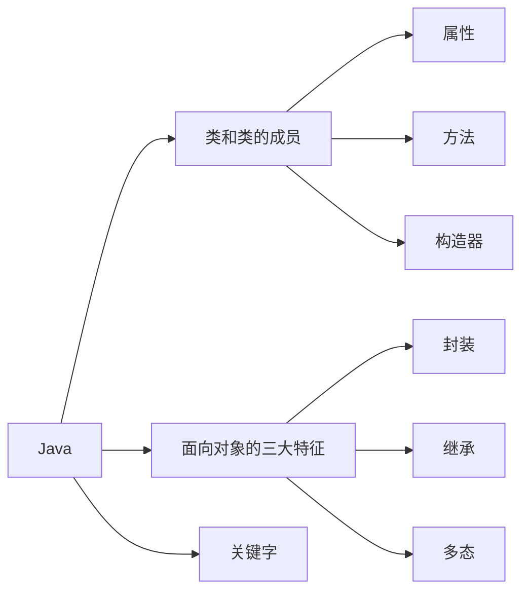
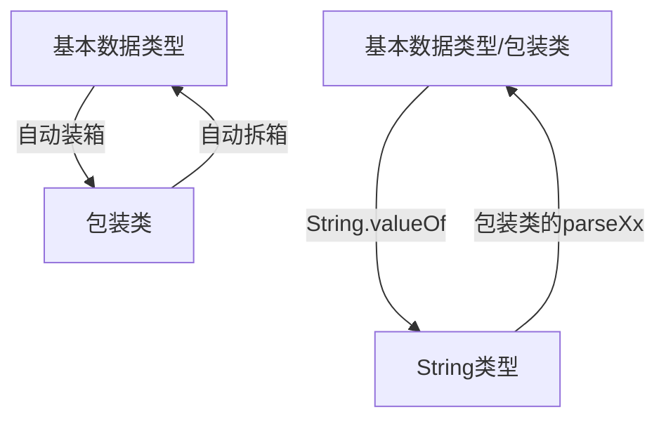
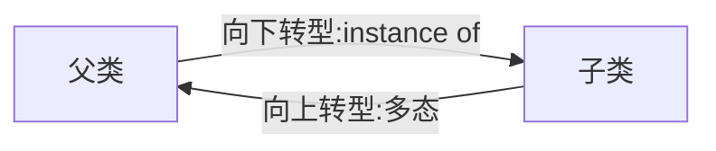
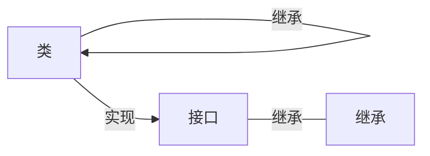
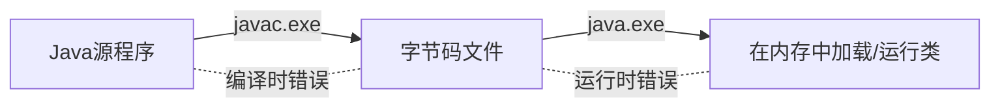

# Big-data
Big data exploring


# VS Code + Java

## VS Code快捷键

```shell
Alt + Up : 上移选中代码

Ctrl + B : 隐藏/展开左侧菜单
Ctrl + G : 挑到指定行号
Ctrl + T : 查看选中类或方法的源码

Ctrl + w : 关闭当前窗口
Ctrl + Shift+ w : 关闭当前窗口

Ctrl + Home/End : 光标在单词间移动
Ctrl + Shift + Home/End : 选中光标👈或👉边的单词

Ctrl + Shift + k : 删除当前行
Ctrl + Shift + X : 将小写变为大写
Ctrl + Shift + P  + "New Java Project" ： 新建Java项目 
Ctrl + Shift + O 自动导包
```

在vscode中导入IDEA的快捷键包，可用下列快捷键

```shell
fori  : 生成变量为i的for循环
Alt + enter : 创建对象
```


## VS Code使用JUnit

The `Test` annotation tells JUnit that the `public void` method to which it is attached can be run as a test case. To run the method, JUnit first constructs a fresh instance of the class then invokes the annotated method. Any exceptions thrown by the test will be reported by JUnit as a failure. If no exceptions are thrown, the test is assumed to have succeeded.

A simple test looks like this:

```java
import org.junit.Test;
public class Example {
    @Test
    public void method() {
       org.junit.Assert.assertTrue( new ArrayList().isEmpty() );
    }
}
```

```java
//若JUnit找不到包，界面不能运行，提示缺少main方法，在.project中nature标签处 加上下面语句：
	<natures>
		<nature>org.eclipse.jdt.core.javanature</nature>
	</natures>
//并在.classpath中 src和bin设置的中间 加上下面语句
<classpathentry kind="con" path="org.eclipse.jdt.junit.JUNIT_CONTAINER/4"/>

//更简单的方式是直接复制别的项目的.classpath 和.project文件
```


### 创建包

报错：[The declared package does not match the expected package Java](https://www.cnblogs.com/linux-centos/p/10784037.html)

用创建文件夹的形式创建包 如com/atguigu/java后，要先将当前文件添加到路径后才能正确导包。选中Java文件，Add foder to Java source path.

# Java basic

## Java学习的三条主线




​	

#### 数组

基本数据类型的值传递 ：值传递

引用数据类型（字符串、数组）的的传递：地址传递

#### Object 类

##### == 和 equals() 的区别

<u>基本数据类型用==，引用数据类型用equals()</u>。

 \* ====== 运算符 :

- 1. 以使用在基本数据类型变量和引用数据类型变量中

  2. 如果比较的是基本数据类型变量：比较两个变量保存的数据是否相等。（不一定类型要相同）

  3. 如果比较的是引用数据类型变量：比较两个对象的地址值是否相同.即两个引用是否指向同一个对象实体

     \* 补充： == 符号使用时，必须保证符号左右两边的变量类型一致。

==equals()方法==

- 1. 是一个方法，而非运算符

  2. 只能适用于引用数据类型

  3. Object类中equals()的定义：

     ```java
     public boolean equals(Object obj) {
           return (this == obj);
     }
     ```

     说明：Object类中定义的equals()和==的作用是相同的：比较两个对象的地址值是否相同.即两个引用是否指向同一个对象实体

  4. 像==String、Date、File、包装类等==都重写了Object类中的equals()方法。重写以后，比较的不是两个引用的地址是否相同，而是比较两个对象的"实体内容"是否相同。

  5. 通常情况下，我们自定义的类如果使用equals()的话，也通常是比较两个对象的"实体内容"是否相同。那么，我们就需要对Object类中的equals()进行重写

  6. ==重写==的原则：比较两个对象的"实体内容"（属性）是否相同.==注意是重写==

### 1. 类


类的成分：属性、方法、构造器

| 权限修饰符 | 类内部 | 同一个包 | 不同包的==子类== | 同一个工程 |
| ---------- | ------ | -------- | ---------------- | ---------- |
| private    | √      |          |                  |            |
| 缺省       | √      | √        |                  |            |
| protected  | √      | √        | √                |            |
| public     | √      | √        | √                | √          |
|            |        |          |                  |            |

重载（overload）和重写（override/overwrite）的区别:

1. 概念
2. 具体规则
3. 重写表现为多态性（晚绑定），重载（早绑定）不表现

#### 包装类

为了让基本数据类型更强大，引入了包装类。变成类以后就具有了类的特征

| **基本数据类型** |      | byte | short | int     | long | float | double | boolean | char |
| ---------------- | ---- | ---- | ----- | ------- | ---- | ----- | ------ | ------- | ---- |
| **包装类**       |      | Byte | Short | Integer | Long | Float | Double | Boolean | Char |

包装类的父类是Number

包装类的转换



- String类型 --->基本数据类型、包装类：调用包装类的parseXxx(String s)

  JDK 5.0 新特性：==自动装箱== 与==自动拆箱==

```java
//自动装箱：基本数据类型 --->包装类
int num2 = 10;
Integer in1 = num2;//自动装箱
		
boolean b1 = true;
Boolean b2 = b1;//自动装箱
		
//自动拆箱：包装类--->基本数据类型
System.out.println(in1.toString());
int num3 = in1;//自动拆箱
```

- 基本数据类型、包装类--->String类型：调用String重载的valueOf(Xxx xxx)

  ```java
  int num1 = 10;
  //方式1：连接运算
  String str1 = num1 + "";
  //方式2：调用String的valueOf(Xxx xxx)
  float f1 = 12.3f;
  String str2 = String.valueOf(f1);//"12.3"
  Double d1 = new Double(12.4);
  String str3 = String.valueOf(d1);
  ```

  - String类型 --->基本数据类型、包装类：调用包装类的parseXxx(String s)

    ```java
    String str1 = "123";
    //错误的情况：
    //int num1 = (int)str1;
    //Integer in1 = (Integer)str1;
    //可能会报NumberFormatException
    int num2 = Integer.parseInt(str1);
    System.out.println(num2 + 1);
    
    String str2 = "true1";
    boolean b1 = Boolean.parseBoolean(str2);
    ```

    ```java
    //面试题
    Object o1 = true ? new Integer(1) : new Double(2.0);
    System.out.println(o1);// 1.0，自动类型提升
    
    Object o2;
    if (true)
    	o2 = new Integer(1);
    else
    	o2 = new Double(2.0);
    System.out.println(o2);// 1
    
    //Integer内部定义了IntegerCache结构，IntegerCache中定义了Integer[],
    //保存了从-128~127范围的整数。如果我们使用自动装箱的方式，给Integer赋值的范围在
    //-128~127范围内时，可以直接使用数组中的元素，不用再去new了。目的：提高效率
    Integer m = 1;
    Integer n = 1;
    System.out.println(m == n);//true
    
    Integer x = 128;//相当于new了一个Integer对象
    Integer y = 128;//相当于new了一个Integer对象
    System.out.println(x == y);//false
    ```

#### 代码块

- 代码块的作用：用来初始化类、对象
- 代码块如果有修饰的话，只能使用static.
- 分类：静态代码块  vs 非静态代码块
- - ==静态代码块==
  - - 内部可以有输出语句
    - 随着类的加载而执行,而且只执行一次
    - 作用：初始化类的信息
    - 如果一个类中定义了多个静态代码块，则按照声明的先后顺序执行
    - 静态代码块的执行要优先于非静态代码块的执行
    - 静态代码块内只能调用静态的属性、静态的方法，不能调用非静态的结构
- - ==非静态代码块==
    - 内部可以有输出语句
    - 随着对象的创建而执行
    - 每创建一个对象，就执行一次非静态代码块
    - 作用：可以在创建对象时，对对象的属性等进行初始化
    - 如果一个类中定义了多个非静态代码块，则按照声明的先后顺序执行
    - 非静态代码块内可以调用静态的属性、静态的方法，或非静态的属性、非静态的方法

==对属性可以赋值的位置==（执行顺序：1 - 2/5 - 3 - 4 ，2和5的顺序看它们排放的顺序）

- 1. 默认初始化（静态）
- 1. 显式初始化（类内开始的地方初始化，且赋值。eg. int a = 5;）
- 1. 构造器中初始化
- 1. 有了对象以后，对象.属性 或对象.方法
- 1. 在<u>代码块</u>中赋值

静态代码块的应用情景：属性中不能对数值进行操作，如：`int a; a=1;`是错的。有些赋值想要是一次性的，不能写在方法中，也不能写在属性中，于是就有了静态代码块。既能只给对象赋值一次，又能调静态方法。

#### 内部类

- Java中允许将一个类A声明在另一个类B中，则类A就是内部类，类B称为外部类

- 内部类的分类：成员内部类（静态、非静态）  vs 局部内部类(方法内、代码块内、构造器内)

- ==成员内部类==： 

- - - 一方面，作为外部类的成员：
    - - - 调用外部类的结构
        - 可以被static修饰
        - 可以被4种不同的权限修饰
    - 另一方面，作为一个类：
    - - - 类内可以定义属性、方法、构造器等
        - 可以被final修饰，表示此类不能被继承。言外之意，不使用final，就可以被继承
        - 可以被abstract修饰

- 关注如下的3个问题：

  - 如何实例化成员内部类的对象

    //静态成员内部类

    Person.Dog dog = new Person.Dog();

    //非静态成员内部类

    Person p = new Person();

    Person.Bird bird = new p.Bird bird ();

  - 如何在成员内部类中区分调用外部类的结构

  - 开发中局部内部类的使用  见《InnerClassTest1.java》

在局部内部类的方法中（比如：show）如果调用局部内部类所声明的方法(比如：method)中的局部变量(比如：num)的话, 要求此局部变量声明为final的。

​     \* jdk 7及之前版本：要求此局部变量显式的声明为final的

​     \* jdk 8及之后的版本：可以省略final的声明

### 2. 面向对象的三大特征

#### 2.1 封装性

#### 2.2 继承性

继承格式：权限修饰符 + class + 子类名 + extends 父类名

==super== : 在子类中，当子类和父类的属性或方法出现重叠时，既想显示父类又想要子类就用super代表父类，this代表子类（默认是子类）。如：

```java
//假设子类(id=1002)和父类(id=1001)中都有id
System.out.println(id);//1002
System.out.println(this.id);//1002
System.out.println(super.id);//1001
```

super还可以调用父类中的构造器：

```java
super(name,age);
```

类的构造器中 this(形参列表) 和 super(形参列表) 只能二选一。

super可以继承父类的属性、方法、构造器

继承的时候，父类的形参列表是(int a , int... arr),子类的形参列表是(int a ,int[] arr)，也是可以用重写的

#### 2.3 多态性

对象的多态性，父类的引用指向子类的对象

```java
Person p = new Man();
```

多态的使用：当调用子父类同名同参数的方法时，编译是认为是父类的方法，执行时执行子类方法（实际执行的是子类重写父类的方法） ---==虚拟方法调用==


对象的多态性，只适用于方法，不适用于属性：

==方法== ： 编译看左边，运行看右边

==属性== ：编译和运行都看左边


多态是运行时行为(真正运行时才知道真正new的是谁)，详见InterViewTest.java


==早绑定/静态绑定==： 对于重载来说，在方法调用之前，编译器就已经确定了要调用的方法。

==晚绑定/静态绑定==： 对于多态，只有到方法调用的那一刻，解释运行器才知道索要调用的具体方法。




- **向上转型** : 通过子类对象(小范围)实例化父类对象(大范围),这种属于自动转换

  当我们需要多个同父的对象调用某个方法时,通过向上转换后,则可以确定参数的统一.方便程序设计

  ==向上转型时==(注意条件),父类只能调用父类方法或者子类覆写后的方法,而子类中的单独方法则是无法调用的。

- **向下转型** : 通过父类对象(大范围)实例化子类对象(小范围),这种属于强制转换

  向下转型则是为了,通过父类强制转换为子类,从而来调用子类<u>独有的方法</u>


为了避免在向下转型时出现异常，在向下转型前先用instanceof 判断

==A instanceof B== : 判断A是否是B 或者B的实例


### 3. 关键字

#### static:静态的

- static可以用来修饰：==属性、方法、代码块、内部类==

- 使用static修饰属性：静态变量（或类变量）

- - - 属性，按是否使用static修饰，又分为：静态属性  vs 非静态属性(实例变量)
    - - ==实例变量==：我们创建了类的多个对象，每个对象都独立的拥有一套类中的非静态属性。当修改其中一个对象中的非静态属性时，不会导致其他对象中同样的属性值的修改。
      - 静态变量：我们创建了类的多个对象，多个对象共享同一个静态变量。当通过某一个对象修改静态变量时，会导致其他对象调用此静态变量时，是修改过了的。

- static修饰属性的其他说明：

  ① 静态变量随着类的加载而加载。可以通过"类.静态变量"的方式进行调用

  ② 静态变量的加载要早于对象的创建。

  ③ 由于类只会加载一次，则静态变量在内存中也只会存在一份：存在方法区的静态域中。

  ④

  |      | 类变量 | 实例变量 |
  | ---- | ------ | -------- |
  | 类   | yes    | no       |
  | 对象 | yes    | yes      |

- - - 静态方法中，只能调用静态的方法或属性  (==静态属性==举例：System.out;  Math.PI;)
  - - 非静态方法中，既可以调用非静态的方法或属性，也可以调用静态的方法或属性

- static注意点：

- - - 在静态的方法内，不能使用this关键字、super关键字。==this();super();可分别调用当前;父类的的构造器==
  - - 关于静态属性和静态方法的使用，大家都从生命周期的角度去理解。

- 开发中，如何确定一个==属性==是否要声明为static的？
- - - 属性是可以被多个对象所共享的，不会随着对象的不同而不同的。
- - - 类中的常量也常常声明为static
- 开发中，如何确定一个==方法==是否要声明为static的？
- - - 操作静态属性的方法，通常设置为static的
    - 工具类中的方法，习惯上声明为static的。 比如：Math、Arrays、Collections


#### main

 \* 1. main()方法作为程序的入口

 \* 2. main()方法也是一个普通的静态方法

 \* 3. main()方法可以作为我们与控制台交互的方式。（之前：使用Scanner）

```shell
//去掉包名，在命令行中执行下面语句也是可以的
javac MainDemo.java
java MainDemo  22 33 44
```

#### final

- final可以用来修饰的结构：==类、方法、变量==
- final 用来修饰一个==类==:此类不能被其他类所继承。比如：==String类、System类、StringBuffer类==
- final 用来修饰==方法==：表明此方法不可以被重写，比如：==Object类中getClass()==
- final 用来修饰==变量==：此时的"变量"就称为是一个常量
- - - final修饰<u>属性</u>：可以考虑赋值的位置有：==显式初始化、代码块中初始化、构造器中初始化==
    - final修饰<u>局部变量</u>：
    - - - 尤其是使用final修饰<u>形参</u>时，表明此形参是一个常量。当我们调用此方法时，给常量形参赋一个实参。一旦赋值以后，就只能在方法体内使用此形参，但不能进行重新赋值。
- static final 用来修饰属性：全局常量

#### abstract -- 抽象类与抽象方法

- abstract可以用来修饰的结构：==类、方法==

- abstract修饰类：抽象类

- - - 此类不能实例化（不能建对象）
    - 抽象类中一定有构造器，便于子类实例化时调用（涉及：子类对象实例化的全过程）
    - 开发中，都会提供抽象类的子类，让子类对象实例化，完成相关的操作

- abstract修饰方法：抽象方法

- - - 抽象方法只有方法的声明，没有方法体

    - 包含抽象方法的类，一定是一个抽象类。反之，抽象类中可以没有抽象方法的

    - 若子类重写了父类中的所有的抽象方法后，此子类方可实例化

      若子类没有重写父类中的所有的抽象方法，则此子类也是一个抽象类，需要使用abstract修饰

- abstract不能用来修饰私有方法、静态方法、final的方法、final的类


#### Interface -- 接口

- 接口使用interface来定义
- Java中，接口和类是并列的两个结构
- 如何定义接口：定义接口中的成员
- - JDK7及以前：只能定义全局常量和抽象方法
- - - - 全局常量：==public static final==的.但是书写时，可以省略不写
    - - 抽象方法：==public abstract== 的
- - JDK8：除了定义全局常量和抽象方法之外，还可以定义==静态方法、默认方法==（略）
  - - - 接口中定义的全局常量只能接口用，不能通过实现该接口的类的对象用
      - 通过实现类的对象，可以调用接口中的默认方法。若对象重写了默认方法，则执行的是重写的方法
      - 如果子类(或实现类)继承的  父类 和 实现的接口 中声明了同名同参数的<u>默认方法</u>(不是属性)，那么子类在<u>没有重写</u>此方法的情况下，默认调用的是父类中的同名同参数的方法。-->类优先原则
      - 如果实现类实现了多个接口，而这多个接口中定义了同名同参数的默认方法，那么在实现类没有重写此方法的情况下，报错。-->接口冲突。这就需要我们必须在实现类中重写此方法
- 接口中不能定义构造器的！意味着接口不可以实例化
- Java开发中，接口通过让类去实现(==implements==)的方式来使用
- - - 如果实现类覆盖了接口中的所有抽象方法，则此实现类就可以实例化
    - 如果实现类没有覆盖接口中所有的抽象方法，则此实现类仍为一个抽象类
- Java类可以实现多个接口   --->弥补了Java单继承性的局限性
- - - class AA extends BB implements CC,DD,EE
- 接口与接口之间可以继承，而且可以多继承



- 接口的具体使用，体现多态性
- 接口，实际上可以看做是一种规范

## Java高级

### 异常处理



#### 异常体系结构

 \* 

 \* java.lang.Throwable

 \*      |-----java.lang.Error:一般不编写针对性的代码进行处理。

 \*      |-----java.lang.Exception:可以进行异常的处理

 \*          |------编译时异常(checked)

 \*                  |-----IOException

 \*                      |-----FileNotFoundException

 \*                  |-----ClassNotFoundException

 \*          |------运行时异常(unchecked,RuntimeException)

 \*                  |-----NullPointerException

 \*                  |-----ArrayIndexOutOfBoundsException

 \*                  |-----ClassCastException

 \*                  |-----NumberFormatException

 \*                  |-----InputMismatchException

 \*                  |-----ArithmeticException

#### 异常处理机制

##### 1. try-catch-finally

- 过程一：=="抛"==：

  程序在正常执行的过程中，一旦出现异常，就会在异常代码处生成一个对应异常类的对象。并将此对象抛出。 一旦抛出对象以后，其后的代码就不再执行。

- - - - 关于异常对象的产生：

        ① 系统自动生成的异常对象

        ② ==手动==的生成一个异常对象，并抛出（==throw==）​         

- 过程二：=="抓"==：可以理解为异常的处理方式：① try-catch-finally  ② ==throws==

- try-catch-finally的使用

  ```java
   * try{
   * 		//可能出现异常的代码
   * 
   * }catch(异常类型1 变量名1){
   * 		//处理异常的方式1
   * }catch(异常类型2 变量名2){
   * 		//处理异常的方式2
   * }catch(异常类型3 变量名3){
   * 		//处理异常的方式3
   * }
   * ....
   * finally{
   * 		//一定会执行的代码
   * }
  ```

  - 1. finally是可选的。
  - 1. 使用try将可能出现异常代码包装起来，在执行过程中，一旦出现异常，就会生成一个对应异常类的对象，根据此对象的类型，去catch中进行匹配
  - 1. 一旦try中的异常对象匹配到某一个catch时，就进入catch中进行异常的处理。一旦处理完成，就跳出当前的 try-catch结构（在没有写finally的情况）。继续执行其后的代码
  - 1. catch中的异常类型如果没有子父类关系，则谁声明在上，谁声明在下无所谓。如果满足子父类关系，则要求子类一定声明在父类的上面。否则，报错
  - 1. 常用的异常对象处理的方式： ① String  getMessage()    ② printStackTrace()
  - 1. 在try结构中声明的变量，再出了try结构以后，就不能再被调用
  - 1. try-catch-finally结构可以嵌套
    2. finally中声明的是一定会被执行的代码。即使catch中又出现异常了，try中有return语句，catch中有return语句等情况。
    3. 像<u>数据库连接、输入输出流、网络编程Socket等资源</u>，JVM是不能自动的回收的，我们需要自己手动的进行资源的释放。此时的资源释放，就需要声明在finally中。


- 体会1：使用try-catch-finally处理编译时异常，是得程序在编译时就不再报错，但是运行时仍可能报错。相当于我们使用try-catch-finally将一个编译时可能出现的异常，延迟到运行时出现。
- 体会2：开发中，由于运行时异常比较常见，所以我们通常就不针对运行时异常编写try-catch-finally了。针对于编译时异常，我们说一定要考虑异常的处理。

##### 2.throws+异常类型

1. "throws + 异常类型"写在方法的声明处。指明此方法执行时，可能会抛出的异常类型。一旦当方法体执行时，出现异常，仍会在异常代码处生成一个异常类的对象，此对象满足throws后异常类型时，就会被抛出。异常代码后续的代码，就不再执行！

2. 体会：try-catch-finally:真正的将异常给处理掉了。throws的方式只是将异常抛给了方法的调用者。  并没有真正将异常处理掉。 

3. 子类重写的方法抛出的异常类型不大于父类被重写的方法抛出的异常类型

4. 开发中如何选择使用try-catch-finally 还是使用throws？

   4.1 如果父类中被重写的方法没有throws方式处理异常，则子类重写的方法也不能使用throws，意味着如果子类重写的方法中有异常，必须使用try-catch-finally方式处理。

   4.2 执行的方法a中，先后又调用了另外的几个方法，这几个方法是递进关系执行的。我们建议这几个方法使用throws的方式进行处理。而执行的方法a可以考虑使用try-catch-finally方式进行处理。

5. 

##### 3.如何自定义异常类

- 继承于现有的异常结构：RuntimeException 、Exception
- 提供全局常量：serialVersionUID
- 提供重载的构造器

### IntelliJ与多线程

**IntelliJ 配置**

- 鼠标滚轮放大字体

  Editor --> Genneral --> Mouse -->change fontsize(Zoom)....

- 鼠标悬浮提示

  Editor --> Genneral -->Show quick documentation on mouse move

- 自动导包

  Insert imports on paste:All

  Editor --> Genneral -->auto Import -->选择：

  Add unambiguous imports on the fly
  Optimize imports on the fly(for current project)

- 显示分隔符

  Editor --> Genneral -->Apperence-->Show method separators

- 设置取消单行显示tabs的操作

  Editor --> Genneral -->Editor Tabs -->Show tabs in one row

- 注解

  Editor --> Genneral -->Code Style -->File and Code Templates --> Include -->File Header -->输入：

  ```java
  /**
      @author cxy
      @create ${YEAR}-${MONTH}-${DAY}-${TIME}
  */
  ```

- 更改编码方式

  Editor --> Genneral -->Code Style -->File Encoding-->全部改为UTF-8

- 自动编译

  Build,Execution,Deployment --> Compiler -->勾选

  Compile independent modules in parallel 
  Rebuild module on dependency change


| software | Eclipse   | IntelliJ idea |
| -------- | --------- | ------------- |
| 等价     | workspace | project       |
| 等价     | project   | module        |

==线程==： 一条*线程* 指的是进程中一个单一顺序的控制流，是操作系统能够进行运算调度的最小单位。

==进程==：是计算机中的程序关于某数据集合上的一次运行活动，是系统进行资源分配和调度的基本单位。一个进程包含多个线程。

==CPU==：

- 单核CPU：假的多线程，一个时间单元内只能执行一个线程的任务，其它任务虽打开，但被挂起。
- 多核CPU：一个时间单元内能执行多个线程的任务

==并行==: 多个CPU同时执行多个任务

==并发==: 一个CPU（采用时间片）同时执行多个任务，如秒杀

#### 多线程的优点

1. 提高应用程序的响应
2. 提高CPU的利用率
3. 改善程序结构

#### 多线程的创建方式

##### 1. 继承于Thread类

```
 * 1. 创建一个继承于java.lang.Thread类的子类
 * 2. 重写Thread类的run() --> 将此线程执行的操作声明在run()中
 * 3. 创建Thread类的子类的对象
 * 4. 通过此对象调用start()  
```

- start 方法的作用：①启动当前线程 ② 调用当前线程的run()
- 我们不能通过直接调用 run() 的方式启动线程
- 不可以让已经start()的线程去执行，会报IllegalThreadStateException。需要重新创建一个线程的对象

**Thread类中常用方法** 

1. start():启动当前线程；调用当前线程的run()
2. run(): 通常需要重写Thread类中的此方法，将创建的线程要执行的操作声明在此方法中
3. currentThread():静态方法，返回执行当前代码的 *线程* 
4. getName():获取当前线程的名字
5. setName():设置当前线程的名字
6. yield():释放当前CPU的执行权
7. join():在线程a中调用线程b的join(),此时线程a就进入阻塞状态，直到线程b完全执行完以后，线程a才结束阻塞状态。
8. stop():已不用了。当执行此方法时，强制结束当前线程
9. sleep(long millitime):让当前线程“睡眠”指定的millitime毫秒。在指定的millitime毫秒时间内，当前线程是阻塞状态。
10. isAlive():判断当前线程是否存活

**线程的优先级**

- 1. 
- - - MAX_PRIORITY：10
  - - MIN _PRIORITY：1
  - - NORM_PRIORITY：5  -->默认优先级
- 1. 如何获取和设置当前线程的优先级
- - - getPriority():获取线程的优先级
  - - setPriority(int p):设置线程的优先级

- 说明：高优先级的线程要抢占低优先级线程cpu的执行权。但是只是从概率上讲，高优先级的线程高概率的情况下被执行。并不意味着只有当高优先级的线程执行完以后，低优先级的线程才执行

##### 2. 实现Runnable接口

- 创建一个实现了Runnable接口的类
- 实现类去实现Runnable中的抽象方法：run()
- 创建实现类的对象
- 将此对象作为参数传递到Thread类的构造器中，创建Thread类的对象
- 通过Thread类的对象调用start() 。==谁start了线程就是谁的==


#### 方式比较:  继承于Thread类 vs. 实现Runnable接口

- 开发中：优先选择：实现Runnable接口的方式

  ​	原因：1.  实现的方式没有类的单继承性的局限性

  ​		    2. 实现的方式更适合来处理多个线程有==共享数据==的情况。

- 联系：public class Thread implements Runnable，==Thread本身也实现了Runnable接口==（因为Thread的子类可以实现Runnable接口）

- 相同点：两种方式都需要重写run(),将线程要执行的逻辑声明在run()中。