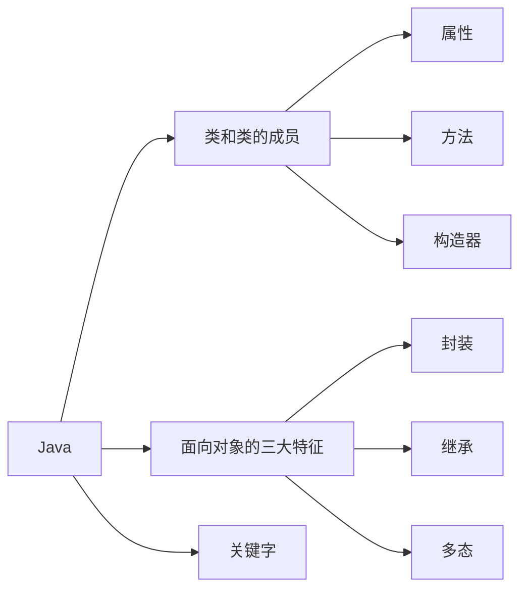
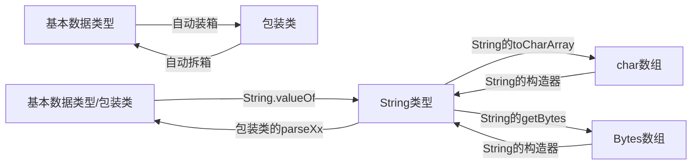
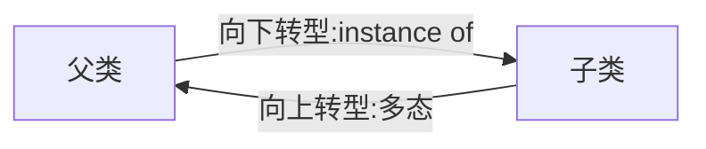
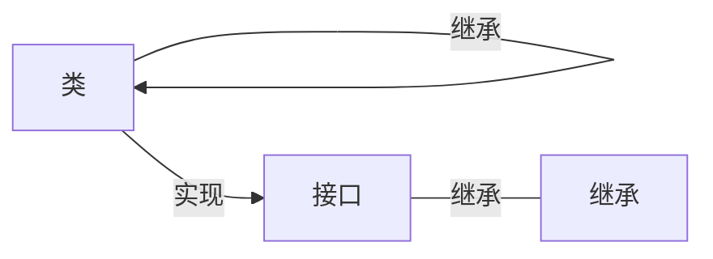
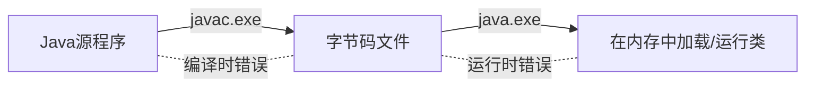
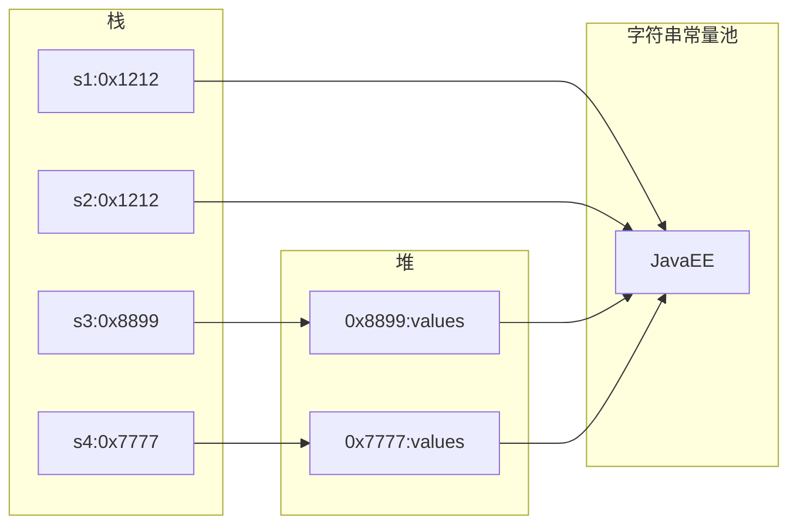

# VS Code + Java

## VS Code快捷键

```shell
Alt + Up : 上移选中代码

Ctrl + B : 隐藏/展开左侧菜单
Ctrl + G : 挑到指定行号
Ctrl + T : 查看选中类或方法的源码

Ctrl + w : 关闭当前窗口
Ctrl + Shift+ w : 关闭当前窗口
Ctrl + D : 复制当前行代码

Ctrl + Home/End : 光标在单词间移动
Ctrl + Shift + Home/End : 选中光标👈或👉边的单词

Ctrl + Shift + k : 删除当前行
Ctrl + Shift + X : 将小写变为大写
Ctrl + Shift + P  + "New Java Project" ： 新建Java项目 
Ctrl + Shift + O 自动导包/在源码中查找类
```

在vscode中导入IDEA的快捷键包，可用下列快捷键

```shell
fori  : 生成变量为i的for循环
Alt + enter : 创建对象
```

IDEA快捷键：

```shell
想要输出内容.sout ： 打印输出内容
Alt + Shift + Up/Down : 将选中代码上/下移

Ctrl + Shift + - ： 折叠所有代码
Ctrl + Shift + + ： 展开所有代码

Ctrl + Alt + B：查看源码

Shift + Esc ：折叠左侧Project文件浏览窗口

Ctrl + H: 查看当前类的继承关系
Ctrl + N：全局搜索
Ctrl + F12：查找当前类中方法
```


## VS Code使用JUnit

The `Test` annotation tells JUnit that the `public void` method to which it is attached can be run as a test case. To run the method, JUnit first constructs a fresh instance of the class then invokes the annotated method. Any exceptions thrown by the test will be reported by JUnit as a failure. If no exceptions are thrown, the test is assumed to have succeeded.

A simple test looks like this:

```java
import org.junit.Test;
public class Example {
    @Test
    public void method() {
       org.junit.Assert.assertTrue( new ArrayList().isEmpty() );
    }
}
```

```java
//若JUnit找不到包，界面不能运行，提示缺少main方法，在.project中nature标签处 加上下面语句：
	<natures>
		<nature>org.eclipse.jdt.core.javanature</nature>
	</natures>
//并在.classpath中 src和bin设置的中间 加上下面语句
<classpathentry kind="con" path="org.eclipse.jdt.junit.JUNIT_CONTAINER/4"/>

//更简单的方式是直接复制别的项目的.classpath 和.project文件
```


### 创建包

报错：[The declared package does not match the expected package Java](https://www.cnblogs.com/linux-centos/p/10784037.html)

用创建文件夹的形式创建包 如com/atguigu/java后，要先将当前文件添加到路径后才能正确导包。选中Java文件，Add foder to Java source path.

# Java basic

## Java学习的三条主线




​	

#### 数组

基本数据类型的值传递 ：值传递

引用数据类型（字符串、数组）的的传递：地址传递

#### Object 类

##### == 和 equals() 的区别

<u>基本数据类型用==，引用数据类型用equals()</u>。

 \* ====== 运算符 :

- 1. 以使用在基本数据类型变量和引用数据类型变量中

  2. 如果比较的是基本数据类型变量：比较两个变量保存的数据是否相等。（不一定类型要相同）

  3. 如果比较的是引用数据类型变量：比较两个对象的地址值是否相同.即两个引用是否指向同一个对象实体

     \* 补充： == 符号使用时，必须保证符号左右两边的变量类型一致。

==equals()方法==

- 1. 是一个方法，而非运算符

  2. 只能适用于引用数据类型

  3. Object类中equals()的定义：

     ```java
     public boolean equals(Object obj) {
           return (this == obj);
     }
     ```

     说明：Object类中定义的equals()和==的作用是相同的：比较两个对象的地址值是否相同.即两个引用是否指向同一个对象实体

  4. 像==String、Date、File、包装类等==都重写了Object类中的equals()方法。重写以后，比较的不是两个引用的地址是否相同，而是比较两个对象的"实体内容"是否相同。

  5. 通常情况下，我们自定义的类如果使用equals()的话，也通常是比较两个对象的"实体内容"是否相同。那么，我们就需要对Object类中的equals()进行重写

  6. ==重写==的原则：比较两个对象的"实体内容"（属性）是否相同.==注意是重写==

### 1. 类


类的成分：属性、方法、构造器

| 权限修饰符 | 类内部 | 同一个包 | 不同包的==子类== | 同一个工程 |
| ---------- | ------ | -------- | ---------------- | ---------- |
| private    | √      |          |                  |            |
| 缺省       | √      | √        |                  |            |
| protected  | √      | √        | √                |            |
| public     | √      | √        | √                | √          |
|            |        |          |                  |            |

重载（overload）和重写（override/overwrite）的区别:

1. 概念
2. 具体规则
3. 重写表现为多态性（晚绑定），重载（早绑定）不表现

#### 包装类

为了让基本数据类型更强大，引入了包装类。变成类以后就具有了类的特征

| **基本数据类型** |      | byte | short | int     | long | float | double | boolean | char |
| ---------------- | ---- | ---- | ----- | ------- | ---- | ----- | ------ | ------- | ---- |
| **包装类**       |      | Byte | Short | Integer | Long | Float | Double | Boolean | Char |

包装类的父类是Number

##### 包装类的转换



- String类型 --->基本数据类型、包装类：调用包装类的parseXxx(String s)

  JDK 5.0 新特性：==自动装箱== 与==自动拆箱==

```java
//自动装箱：基本数据类型 --->包装类
int num2 = 10;
Integer in1 = num2;//自动装箱
		
boolean b1 = true;
Boolean b2 = b1;//自动装箱
		
//自动拆箱：包装类--->基本数据类型
System.out.println(in1.toString());
int num3 = in1;//自动拆箱
```

- 基本数据类型、包装类--->String类型：调用String重载的valueOf(Xxx xxx)

  ```java
  int num1 = 10;
  //方式1：连接运算
  String str1 = num1 + "";
  //方式2：调用String的valueOf(Xxx xxx)
  float f1 = 12.3f;
  String str2 = String.valueOf(f1);//"12.3"
  Double d1 = new Double(12.4);
  String str3 = String.valueOf(d1);
  ```

  - String类型 --->基本数据类型、包装类：调用包装类的parseXxx(String s)

    ```java
    String str1 = "123";
    //错误的情况：
    //int num1 = (int)str1;
    //Integer in1 = (Integer)str1;
    //可能会报NumberFormatException
    int num2 = Integer.parseInt(str1);
    System.out.println(num2 + 1);
    
    String str2 = "true1";
    boolean b1 = Boolean.parseBoolean(str2);
    ```

    [面试题](#1.包装类)

#### 代码块

- 代码块的作用：用来初始化类、对象
- 代码块如果有修饰的话，只能使用static.
- 分类：静态代码块  vs 非静态代码块
- - ==静态代码块==
  - - 内部可以有输出语句
    - 随着类的加载而执行,而且只执行一次
    - 作用：初始化类的信息
    - 如果一个类中定义了多个静态代码块，则按照声明的先后顺序执行
    - 静态代码块的执行要优先于非静态代码块的执行
    - 静态代码块内只能调用静态的属性、静态的方法，不能调用非静态的结构
- - ==非静态代码块==
    - 内部可以有输出语句
    - 随着对象的创建而执行
    - 每创建一个对象，就执行一次非静态代码块
    - 作用：可以在创建对象时，对对象的属性等进行初始化
    - 如果一个类中定义了多个非静态代码块，则按照声明的先后顺序执行
    - 非静态代码块内可以调用静态的属性、静态的方法，或非静态的属性、非静态的方法

==对属性可以赋值的位置==（执行顺序：1 - 2/5 - 3 - 4 ，2和5的顺序看它们排放的顺序）

- 1. 默认初始化（静态）
- 1. 显式初始化（类内开始的地方初始化，且赋值。eg. int a = 5;）
- 1. 构造器中初始化
- 1. 有了对象以后，对象.属性 或对象.方法
- 1. 在<u>代码块</u>中赋值

静态代码块的应用情景：属性中不能对数值进行操作，如：`int a; a=1;`是错的。有些赋值想要是一次性的，不能写在方法中，也不能写在属性中，于是就有了静态代码块。既能只给对象赋值一次，又能调静态方法。

#### 内部类

- Java中允许将一个类A声明在另一个类B中，则类A就是内部类，类B称为外部类

- 内部类的分类：成员内部类（静态、非静态）  vs 局部内部类(方法内、代码块内、构造器内)

- ==成员内部类==： 

- - - 一方面，作为外部类的成员：
    - - - 调用外部类的结构
        - 可以被static修饰
        - 可以被4种不同的权限修饰
    - 另一方面，作为一个类：
    - - - 类内可以定义属性、方法、构造器等
        - 可以被final修饰，表示此类不能被继承。言外之意，不使用final，就可以被继承
        - 可以被abstract修饰

- 关注如下的3个问题：

  - 如何实例化成员内部类的对象

    //静态成员内部类

    Person.Dog dog = new Person.Dog();

    //非静态成员内部类

    Person p = new Person();

    Person.Bird bird = new p.Bird bird ();

  - 如何在成员内部类中区分调用外部类的结构

  - 开发中局部内部类的使用  见《InnerClassTest1.java》

在局部内部类的方法中（比如：show）如果调用局部内部类所声明的方法(比如：method)中的局部变量(比如：num)的话, 要求此局部变量声明为final的。

​     \* jdk 7及之前版本：要求此局部变量显式的声明为final的

​     \* jdk 8及之后的版本：可以省略final的声明

### 2. 面向对象的三大特征

#### 2.1 封装性

#### 2.2 继承性

继承格式：权限修饰符 + class + 子类名 + extends 父类名

==super== : 在子类中，当子类和父类的属性或方法出现重叠时，既想显示父类又想要子类就用super代表父类，this代表子类（默认是子类）。如：

```java
//假设子类(id=1002)和父类(id=1001)中都有id
System.out.println(id);//1002
System.out.println(this.id);//1002
System.out.println(super.id);//1001
```

super还可以调用父类中的构造器：

```java
super(name,age);
```

类的构造器中 this(形参列表) 和 super(形参列表) 只能二选一。

super可以继承父类的属性、方法、构造器

继承的时候，父类的形参列表是(int a , int... arr),子类的形参列表是(int a ,int[] arr)，也是可以用重写的

#### 2.3 多态性

对象的多态性，父类的引用指向子类的对象

```java
Person p = new Man();
```

多态的使用：当调用子父类同名同参数的方法时，编译是认为是父类的方法，执行时执行子类方法（实际执行的是子类重写父类的方法） ---==虚拟方法调用==


对象的多态性，只适用于方法，不适用于属性：

==方法== ： 编译看左边，运行看右边

==属性== ：编译和运行都看左边


多态是运行时行为(真正运行时才知道真正new的是谁)，详见InterViewTest.java


==早绑定/静态绑定==： 对于重载来说，在方法调用之前，编译器就已经确定了要调用的方法。

==晚绑定/静态绑定==： 对于多态，只有到方法调用的那一刻，解释运行器才知道索要调用的具体方法。




- **向上转型** : 通过子类对象(小范围)实例化父类对象(大范围),这种属于自动转换

  当我们需要多个同父的对象调用某个方法时,通过向上转换后,则可以确定参数的统一.方便程序设计

  ==向上转型时==(注意条件),父类只能调用父类方法或者子类覆写后的方法,而子类中的单独方法则是无法调用的。

- **向下转型** : 通过父类对象(大范围)实例化子类对象(小范围),这种属于强制转换

  向下转型则是为了,通过父类强制转换为子类,从而来调用子类<u>独有的方法</u>


为了避免在向下转型时出现异常，在向下转型前先用instanceof 判断

==A instanceof B== : 判断A是否是B 或者B的实例


### 3. 关键字

#### static:静态的

- static可以用来修饰：==属性、方法、代码块、内部类==

- 使用static修饰属性：静态变量（或类变量）

- - - 属性，按是否使用static修饰，又分为：静态属性  vs 非静态属性(实例变量)
    - - ==实例变量==：我们创建了类的多个对象，每个对象都独立的拥有一套类中的非静态属性。当修改其中一个对象中的非静态属性时，不会导致其他对象中同样的属性值的修改。
      - 静态变量：我们创建了类的多个对象，多个对象共享同一个静态变量。当通过某一个对象修改静态变量时，会导致其他对象调用此静态变量时，是修改过了的。

- static修饰属性的其他说明：

  ① 静态变量随着类的加载而加载。可以通过"类.静态变量"的方式进行调用

  ② 静态变量的加载要早于对象的创建。

  ③ 由于类只会加载一次，则静态变量在内存中也只会存在一份：存在方法区的静态域中。

  ④

  |      | 类变量 | 实例变量 |
  | ---- | ------ | -------- |
  | 类   | yes    | no       |
  | 对象 | yes    | yes      |

- - - 静态方法中，只能调用静态的方法或属性  (==静态属性==举例：System.out;  Math.PI;)
  - - 非静态方法中，既可以调用非静态的方法或属性，也可以调用静态的方法或属性

- static注意点：

- - - 在静态的方法内，不能使用this关键字、super关键字。==this();super();可分别调用当前;父类的的构造器==
  - - 关于静态属性和静态方法的使用，大家都从生命周期的角度去理解。

- 开发中，如何确定一个==属性==是否要声明为static的？
- - - 属性是可以被多个对象所共享的，不会随着对象的不同而不同的。
- - - 类中的常量也常常声明为static
- 开发中，如何确定一个==方法==是否要声明为static的？
- - - 操作静态属性的方法，通常设置为static的
    - 工具类中的方法，习惯上声明为static的。 比如：Math、Arrays、Collections


#### main

 \* 1. main()方法作为程序的入口

 \* 2. main()方法也是一个普通的静态方法

 \* 3. main()方法可以作为我们与控制台交互的方式。（之前：使用Scanner）

```shell
//去掉包名，在命令行中执行下面语句也是可以的
javac MainDemo.java
java MainDemo  22 33 44
```

#### final

- final可以用来修饰的结构：==类、方法、变量==
- final 用来修饰一个==类==:此类不能被其他类所继承。比如：==String类、System类、StringBuffer类==
- final 用来修饰==方法==：表明此方法不可以被重写，比如：==Object类中getClass()==
- final 用来修饰==变量==：此时的"变量"就称为是一个常量
- - - final修饰<u>属性</u>：可以考虑赋值的位置有：==显式初始化、代码块中初始化、构造器中初始化==
    - final修饰<u>局部变量</u>：
    - - - 尤其是使用final修饰<u>形参</u>时，表明此形参是一个常量。当我们调用此方法时，给常量形参赋一个实参。一旦赋值以后，就只能在方法体内使用此形参，但不能进行重新赋值。
- static final 用来修饰属性：全局常量

#### abstract -- 抽象类与抽象方法

- abstract可以用来修饰的结构：==类、方法==

- abstract修饰类：抽象类

- - - 此类不能实例化（不能建对象）
    - 抽象类中一定有构造器，便于子类实例化时调用（涉及：子类对象实例化的全过程）
    - 开发中，都会提供抽象类的子类，让子类对象实例化，完成相关的操作

- abstract修饰方法：抽象方法

- - - 抽象方法只有方法的声明，没有方法体

    - 包含抽象方法的类，一定是一个抽象类。反之，抽象类中可以没有抽象方法的

    - 若子类重写了父类中的所有的抽象方法后，此子类方可实例化

      若子类没有重写父类中的所有的抽象方法，则此子类也是一个抽象类，需要使用abstract修饰

- abstract不能用来修饰私有方法、静态方法、final的方法、final的类


#### Interface -- 接口

- 接口使用interface来定义
- Java中，接口和类是并列的两个结构
- 如何定义接口：定义接口中的成员
- - JDK7及以前：只能定义全局常量和抽象方法
- - - - 全局常量：==public static final==的.但是书写时，可以省略不写
    - - 抽象方法：==public abstract== 的
- - JDK8：除了定义全局常量和抽象方法之外，还可以定义==静态方法、默认方法==（略）
  - - - 接口中定义的全局常量只能接口用，不能通过实现该接口的类的对象用
      - 通过实现类的对象，可以调用接口中的默认方法。若对象重写了默认方法，则执行的是重写的方法
      - 如果子类(或实现类)继承的  父类 和 实现的接口 中声明了同名同参数的<u>默认方法</u>(不是属性)，那么子类在<u>没有重写</u>此方法的情况下，默认调用的是父类中的同名同参数的方法。-->类优先原则
      - 如果实现类实现了多个接口，而这多个接口中定义了同名同参数的默认方法，那么在实现类没有重写此方法的情况下，报错。-->接口冲突。这就需要我们必须在实现类中重写此方法
- 接口中不能定义构造器的！意味着接口不可以实例化
- Java开发中，接口通过让类去实现(==implements==)的方式来使用
- - - 如果实现类覆盖了接口中的所有抽象方法，则此实现类就可以实例化
    - 如果实现类没有覆盖接口中所有的抽象方法，则此实现类仍为一个抽象类
- Java类可以实现多个接口   --->弥补了Java单继承性的局限性
- - - class AA extends BB implements CC,DD,EE
- 接口与接口之间可以继承，而且可以多继承



- 接口的具体使用，体现多态性
- 接口，实际上可以看做是一种规范

# Java Senior

## 异常处理



### 异常体系结构

 \* 

 \* java.lang.Throwable

 \*      |-----java.lang.Error:一般不编写针对性的代码进行处理。

 \*      |-----java.lang.Exception:可以进行异常的处理

 \*          |------编译时异常(checked)

 \*                  |-----IOException

 \*                      |-----FileNotFoundException

 \*                  |-----ClassNotFoundException

 \*          |------运行时异常(unchecked,RuntimeException)

 \*                  |-----NullPointerException

 \*                  |-----ArrayIndexOutOfBoundsException

 \*                  |-----ClassCastException

 \*                  |-----NumberFormatException

 \*                  |-----InputMismatchException

 \*                  |-----ArithmeticException

### 异常处理机制

##### 1. try-catch-finally

- 过程一：=="抛"==：

  程序在正常执行的过程中，一旦出现异常，就会在异常代码处生成一个对应异常类的对象。并将此对象抛出。 一旦抛出对象以后，其后的代码就不再执行。

- - - - 关于异常对象的产生：

        ① 系统自动生成的异常对象

        ② ==手动==的生成一个异常对象，并抛出（==throw==）​         

- 过程二：=="抓"==：可以理解为异常的处理方式：① try-catch-finally  ② ==throws==

- try-catch-finally的使用

  ```java
   * try{
   * 		//可能出现异常的代码
   * 
   * }catch(异常类型1 变量名1){
   * 		//处理异常的方式1
   * }catch(异常类型2 变量名2){
   * 		//处理异常的方式2
   * }catch(异常类型3 变量名3){
   * 		//处理异常的方式3
   * }
   * ....
   * finally{
   * 		//一定会执行的代码
   * }
  ```

  - 1. finally是可选的。
  - 1. 使用try将可能出现异常代码包装起来，在执行过程中，一旦出现异常，就会生成一个对应异常类的对象，根据此对象的类型，去catch中进行匹配
  - 1. 一旦try中的异常对象匹配到某一个catch时，就进入catch中进行异常的处理。一旦处理完成，就跳出当前的 try-catch结构（在没有写finally的情况）。继续执行其后的代码
  - 1. catch中的异常类型如果没有子父类关系，则谁声明在上，谁声明在下无所谓。如果满足子父类关系，则要求子类一定声明在父类的上面。否则，报错
  - 1. 常用的异常对象处理的方式： ① String  getMessage()    ② printStackTrace()
  - 1. 在try结构中声明的变量，再出了try结构以后，就不能再被调用
  - 1. try-catch-finally结构可以嵌套
    2. finally中声明的是一定会被执行的代码。即使catch中又出现异常了，try中有return语句，catch中有return语句等情况。
    3. 像<u>数据库连接、输入输出流、网络编程Socket等资源</u>，JVM是不能自动的回收的，我们需要自己手动的进行资源的释放。此时的资源释放，就需要声明在finally中。


- 体会1：使用try-catch-finally处理编译时异常，是得程序在编译时就不再报错，但是运行时仍可能报错。相当于我们使用try-catch-finally将一个编译时可能出现的异常，延迟到运行时出现。
- 体会2：开发中，由于运行时异常比较常见，所以我们通常就不针对运行时异常编写try-catch-finally了。针对于编译时异常，我们说一定要考虑异常的处理。

##### 2.throws+异常类型

1. "throws + 异常类型"写在方法的声明处。指明此方法执行时，可能会抛出的异常类型。一旦当方法体执行时，出现异常，仍会在异常代码处生成一个异常类的对象，此对象满足throws后异常类型时，就会被抛出。异常代码后续的代码，就不再执行！

2. 体会：try-catch-finally:真正的将异常给处理掉了。throws的方式只是将异常抛给了方法的调用者。  并没有真正将异常处理掉。 

3. 子类重写的方法抛出的异常类型不大于父类被重写的方法抛出的异常类型

4. 开发中如何选择使用try-catch-finally 还是使用throws？

   4.1 如果父类中被重写的方法没有throws方式处理异常，则子类重写的方法也不能使用throws，意味着如果子类重写的方法中有异常，必须使用try-catch-finally方式处理。

   4.2 执行的方法a中，先后又调用了另外的几个方法，这几个方法是递进关系执行的。我们建议这几个方法使用throws的方式进行处理。而执行的方法a可以考虑使用try-catch-finally方式进行处理。

5. 

##### 3.如何自定义异常类

- 继承于现有的异常结构：RuntimeException 、Exception
- 提供全局常量：serialVersionUID
- 提供重载的构造器

## IntelliJ与多线程

**IntelliJ 配置**

- 鼠标滚轮放大字体

  Editor --> Genneral --> Mouse -->change fontsize(Zoom)....

- 鼠标悬浮提示

  Editor --> Genneral -->Show quick documentation on mouse move

- 自动导包

  Insert imports on paste:All

  Editor --> Genneral -->auto Import -->选择：

  Add unambiguous imports on the fly
  Optimize imports on the fly(for current project)

- 显示分隔符

  Editor --> Genneral -->Apperence-->Show method separators

- 设置取消单行显示tabs的操作

  Editor --> Genneral -->Editor Tabs -->Show tabs in one row

- 注解

  Editor  -->Code Style -->File and Code Templates --> Include -->File Header -->输入：

  ```java
  /**
      @author cxy
      @create ${YEAR}-${MONTH}-${DAY}-${TIME}
  */
  ```

- 更改编码方式

  Editor --> Genneral -->Code Style -->File Encoding-->全部改为UTF-8

- 自动编译

  Build,Execution,Deployment --> Compiler -->勾选

  Compile independent modules in parallel 
  Rebuild module on dependency change


| software | Eclipse   | IntelliJ idea |
| -------- | --------- | ------------- |
| 等价     | workspace | project       |
| 等价     | project   | module        |

==线程==： 一条*线程* 指的是进程中一个单一顺序的控制流，是操作系统能够进行运算调度的最小单位。

==进程==：是计算机中的程序关于某数据集合上的一次运行活动，是系统进行资源分配和调度的基本单位。一个进程包含多个线程。

==CPU==：

- 单核CPU：假的多线程，一个时间单元内只能执行一个线程的任务，其它任务虽打开，但被挂起。
- 多核CPU：一个时间单元内能执行多个线程的任务

==并行==: 多个CPU同时执行多个任务

==并发==: 一个CPU（采用时间片）同时执行多个任务，如秒杀

**多线程的优点**

1. 提高应用程序的响应
2. 提高CPU的利用率
3. 改善程序结构

### 1. 多线程的创建方式

#### 1.1 继承于Thread类

```
 * 1. 创建一个继承于java.lang.Thread类的子类
 * 2. 重写Thread类的run() --> 将此线程执行的操作声明在run()中
 * 3. 创建Thread类的子类的对象
 * 4. 通过此对象调用start()  
```

- start 方法的作用：①启动当前线程 ② 调用当前线程的run()
- 我们不能通过直接调用 run() 的方式启动线程
- 不可以让已经start()的线程去执行，会报IllegalThreadStateException。需要重新创建一个线程的对象

**Thread类中常用方法** 

1. start():启动当前线程；调用当前线程的run()
2. run(): 通常需要重写Thread类中的此方法，将创建的线程要执行的操作声明在此方法中
3. currentThread():静态方法，返回执行当前代码的 *线程* 
4. getName():获取当前线程的名字
5. setName():设置当前线程的名字
6. yield():释放当前CPU的执行权
7. join():在线程a中调用线程b的join(),此时线程a就进入阻塞状态，直到线程b完全执行完以后，线程a才结束阻塞状态。
8. stop():已不用了。当执行此方法时，强制结束当前线程
9. sleep(long millitime):让当前线程“睡眠”指定的millitime毫秒。在指定的millitime毫秒时间内，当前线程是阻塞状态。
10. isAlive():判断当前线程是否存活

**线程的优先级**

- 1.1 

- - - MAX_PRIORITY：10
  - - MIN _PRIORITY：1
  - - NORM_PRIORITY：5  -->默认优先级

  1.2 如何获取和设置当前线程的优先级

- - - getPriority():获取线程的优先级
  - - setPriority(int p):设置线程的优先级

- 说明：高优先级的线程要抢占低优先级线程cpu的执行权。但是只是从概率上讲，高优先级的线程高概率的情况下被执行。并不意味着只有当高优先级的线程执行完以后，低优先级的线程才执行

#### 1.2. 实现Runnable接口

- 创建一个实现了Runnable接口的类

- 实现类去实现Runnable中的抽象方法：run()

- 创建实现类的对象

- 将此对象作为参数传递到Thread类的构造器中，创建Thread类的对象

- 通过Thread类的对象调用start() 。==谁start了 线程就是谁的==


**方式比较:  继承于Thread类 vs. 实现Runnable接**口

- 开发中：优先选择：实现Runnable接口的方式

  ​	原因：1.  实现的方式没有类的单继承性的局限性

  ​		    2. 实现的方式更适合来处理多个线程有==共享数据==的情况。

- 联系：public class Thread implements Runnable，==Thread本身也实现了Runnable接口==（因为Thread的子类可以实现Runnable接口）

- 相同点：两种方式都需要重写run(),将线程要执行的逻辑声明在run()中。


#### 1.3 实现Callable接口。 

--- JDK 5.0新增

- call()可以有返回值
- call()可以抛出异常，被外面的操作捕获，获取异常的信息
-  Callable支持泛型

- 步骤

- 1. 创建一个实现Callable的实现类
  2. 实现 call 方法，将此线程需要执行的操作声明在call()中
  3. 创建Callable接口实现类的对象
  4. 将此Callable接口实现类的对象作为传递到FutureTask构造器中，创建FutureTask的对象
  5. 将FutureTask的对象作为参数传递到Thread类的构造器中，创建Thread对象，并调用start()
  6. 获取Callable中call方法的返回值（可省，看具体情况）

#### 1.4 线程池

- 创建步骤

- 1. 提供指定线程数量的线程池
  2. 设置线程池的属性
  3. 执行指定的线程的操作。需要提供实现Runnable接口或Callable接口实现类的对象execute
  4. 关闭连接池 shutdown()

[面试题3](#3 创建多线程有几种方式？)


### 2. 线程的生命周期

生命周期：某个线程从出生到消亡这段时间

关注 ：状态 a --> 状态 b ：哪些方法执行了（去重写回调方法）

​		 某个方法主动调用导致  状态 a --> 状态 b 

阻塞：临时状态，不可以作为最终状态（死亡）

### 3. 线程的同步

- 线程安全问题之所以会出现，是因为有数据共享，比如账户。

- 在Java中，我们通过同步机制，来解决线程的安全问题。

- - 1. ==方式一：同步代码块==

       ```java
       synchronized(同步监视器){
           //需要被同步的代码
       }
       ```

       - 说明：

       - - 1. 操作共享数据的代码，即为需要被同步的代码。  -->包含代码不能多了，也不能少了。

         - 2. ==共享数据==：多个线程共同操作的变量。比如：ticket就是共享数据

           3. ==同步监视器==，俗称：==锁==。任何一个类的对象，都可以充当锁。

              要求：==<u>多个线程必须要共用同一把锁</u>==，即同一个对象。

       - 补充：在实现Runnable接口创建多线程的方式中，我们可以考虑使用this充当同步监视器。

       - 好处:  同步的方式，解决了线程的安全问题。

       - 局限性:  操作同步代码时，只能有一个线程参与，其他线程等待。相当于是一个单线程的过程，效率低。

    2. ==方式二：同步方法==

       如果操作共享数据的代码完整的声明在一个方法中，我们不妨将此方法声明同步的。

       -  \*  1. 同步方法仍然涉及到同步监视器，只是不需要我们显式的声明。

       - \*  2. 非静态的同步方法，同步监视器是：this

         ​         ==静态== 的同步方法，同步监视器是：当前类本身即 ==类.class==

    3. ==方式三：[Lock](#4.1 Lock)==


### 4. 线程的安全问题---死锁

- 死锁的理解：不同的线程分别占用对方需要的同步资源不放弃，都在等待对方放弃自己需要的同步资源，就形成了线程的死锁.
- 如果有2个线程，2个对象。一个线程先握a🔒，再b🔒，另一个线程先握b🔒，再a🔒。很容易造成死锁。如：线程1进入a后，若sleep，造成阻塞状态，则线程2开启，若sleep，造成阻塞状态。此时线程1和线程2都不释放对方想要的资源，造成死锁。

##### 4.1 Lock

-- JDK5.0后新增

-- 建议优先使用顺序：

 \* Lock--> 同步代码块（已经进入了方法体，分配了相应资源）--> 同步方法（在方法体之外）

##### 4.2 单例设计模式

所谓类的单例设计模式，就是采取一定的方法保证在整个的软件系统中，对某个类只能存在一个对象实例。

**实现**

 饿汉式  vs 懒汉式：

|              | 好处                     | 坏处             |
| ------------ | ------------------------ | ---------------- |
| 饿汉式       | 线程安全                 | 对象加载时间过长 |
| 懒汉式       | 延迟对象的创建           | 线程不安全       |
| 改进的懒汉式 | 延迟对象的创建，线程安全 |                  |

```java
//饿汉式：
public class SingletonTest1{
public static void main(String[] args) {
	Bank bank1 = Bank.getInastance();
	Bank bank2 = Bank.getInastance();
	System.out.println(bank1 ==bank2);
}
}
class Bank{
	private Bank(){
	}
	private static Bank instance = new Bank();
	public static Bank getInastance(){
		return instance;
	}
}

//改进前的懒汉式
public class SingletonTest2 {
	public static void main(String[] args) {
		Order order1 = Order.getInstance();
		Order order2 = Order.getInstance();
		System.out.println(order1 == order2);
	}
}
class Order{
	//1.私有化类的构造器
	private Order(){
	}
	//2.声明当前类对象，没有初始化
	//4.此对象也必须声明为static的
	private static Order instance = null;
	//3.声明public、static的返回当前类对象的方法
	public static Order getInstance(){	
		if(instance == null){
			instance = new Order();
		}
		return instance;
	}
}
//使用同步机制将单例模式中的懒汉式改写为线程安全的
public class BankTest {

}
class Bank{
    private Bank(){}
    private static Bank instance = null;
    public static Bank getInstance(){
        //方式一：效率稍差
//        synchronized (Bank.class) {
//            if(instance == null){
//
//                instance = new Bank();
//            }
//            return instance;
//        }
        //方式二：效率更高
        if(instance == null){
            synchronized (Bank.class) {
                if(instance == null){
                    instance = new Bank();
                }
            }
        }
        return instance;
    }

}
```


### 5. 线程通信

* 涉及到的三个方法：

  wait():   一旦执行此方法，<u>当前线程就进入阻塞状态，并==释放==同步监视器</u>。

  notify(): 一旦执行此方法，就会唤醒被wait的一个线程。如果有多个线程被wait，就唤醒优先级高的那个。

  notifyAll(): 一旦执行此方法，就会唤醒所有被wait的线程。

- wait()，notify()，notifyAll()三个方法:
  1. 必须使用在同步代码块或同步方法中
  2. 三个方法的调用者必须是同步代码块或同步方法中的同步监视器
  3. 三个方法是定义在==java.lang.Object类==中

- 线程通信的应用：经典例题：==生产者/消费者问题==

[面试题1](#1 synchronized 与 Lock的异同？)

[面试题2](#2 sleep() 和 wait()的异同？)

## 常用类

### 1. String 类

String:字符串，使用一对""引起来表示。

- 1. String声明为<u>final</u>的，不可被继承

  2. String实现了==Serializable==接口：表示字符串是支持序列化的。

     实现了Comparable接口：表示String可以比较大小

  3. String内部定义了final char[] value用于存储字符串数据

  4. String:代表不可变的字符序列。简称：==不可变性==。

     体现：

     - - 当对字符串重新赋值时，需要重写指定内存区域赋值，不能使用原有的value进行赋值
       - 当对现有的字符串进行连接操作时，也需要重新指定内存区域赋值，不能使用原有的value进行赋值
       -  当调用String的replace()方法修改指定字符或字符串时，也需要重新指定内存区域赋值，不能使用原有的value进行赋值

  5. 通过字面量的方式（区别于new）给一个字符串赋值，此时的字符串值声明在字符串==常量池==中。

     [面试题](#1. String)

  6. 字符串常量池中是不会存储相同内容的字符串的。

  7. 常量与常量的拼接结果在常量池。且常量池中不会存在相同内容的常量。

     只要其中有一个是变量（注意如果变量有final就不是变量了），结果就在堆中。

     如果拼接的结果调用==intern()== 方法，返回值就在常量池中

  8. String中常用的==方法==

     - int length()：返回字符串的长度

     - char charAt(int index)： 返回某索引处的字符

     - boolean isEmpty()：判断是否是空字符串：return value.length == 0

     - String toLowerCase()：使用默认语言环境，将 String 中的所有字符转换为小写

     - String toUpperCase()：使用默认语言环境，将 String 中的所有字符转换为大写

     - String ==trim()==：返回字符串的副本，忽略前导空白和尾部空白

     - boolean equals(Object obj)：比较字符串的==内容==是否相同

     - boolean equalsIgnoreCase(String anotherString)：与equals方法类似，忽略大小写

     - String concat(String str)：将指定字符串连接到此字符串的结尾。 等价于用“+”

     - int compareTo(String anotherString)：比较两个字符串的大小

     - String substring(int beginIndex)：返回一个新的字符串，它是此字符串的从beginIndex开始截取到最后的一个子字符串。

     - String substring(int beginIndex, int endIndex) ：返回一个新字符串，它是此字符串从beginIndex开始截取到endIndex(不包含)的一个子字符串。

     - boolean endsWith(String suffix)：测试此字符串是否以指定的后缀结束

     - boolean startsWith(String prefix)：测试此字符串是否以指定的前缀开始

     - boolean startsWith(String prefix, int toffset)：测试此字符串从指定索引开始的子字符串是否以指定前缀开始

     - boolean ==contains==(CharSequence s)：当且仅当此字符串包含指定的 char 值序列时，返回 true

     - int ==indexOf==(String str)：返回指定子字符串在此字符串中第一次出现处的索引

     - int indexOf(String str, int fromIndex)：返回指定子字符串在此字符串中第一次出现处的索引，从指定的索引开始

     - int lastIndexOf(String str)：返回指定子字符串在此字符串中最右边出现处的索引

     - int lastIndexOf(String str, int fromIndex)：返回指定子字符串在此字符串中最后一次出现处的索引，从指定的索引开始反向搜索

       注：indexOf和lastIndexOf方法如果未找到都是返回-1

     - String ==replace== (char oldChar, char newChar)：返回一个新的字符串，它是通过用 newChar 替换此字符串中出现的<u>所有</u> oldChar 得到的。

     - String replace(CharSequence target, CharSequence replacement)：使用指定的字面值替换序列替换此字符串所有匹配字面值目标序列的子字符串。

     - String replaceAll(String regex, String replacement)：使用给定的 replacement 替换此字符串所有匹配给定的正则表达式的子字符串

     - String replaceFirst(String regex, String replacement)：使用给定的 replacement 替换此字符串匹配给定的正则表达式的第一个子字符串。

     - boolean ==matches==(String regex)：告知此字符串是否==匹配==给定的正则表达式。

     - String[] ==split==(String regex)：根据给定正则表达式的匹配拆分此字符串。

       String[] split(String regex, int limit)：根据匹配给定的正则表达式来拆分此字符串，最多不超过limit个，如果超过了，剩下的全部都放到最后一个元素中。

     - 

  9. [String 类与 char[] 的转换](#包装类的转换)

     ```java
     //String --> char[]:调用String的toCharArray()
     char[] charArray = str1.toCharArray();
     //char[] --> String:调用String的构造器
     String str2 = new String(arr);
     ```

  10. String类与Byte[] 的转换

      编码：字符串 -->字节  (看得懂 --->看不懂的二进制数据)

      解码：编码的逆过程，字节 --> 字符串 （看不懂的二进制数据 ---> 看得懂）

      说明：解码时，要求解码使用的字符集必须与编码时使用的字符集一致，否则会出现乱码。

  11. 

### 2. StringBuilder & StringBuffer

#### 2.1 String、StringBuffer、StringBuilder三者的异同？

|               | 是否可变         | 存储                 | 线程                          |
| ------------- | ---------------- | -------------------- | ----------------------------- |
| String        | 不可变的字符序列 | 底层使用 char[] 存储 |                               |
| StringBuffer  | 可变的字符序列   | 底层使用 char[] 存储 | 线程不安全的，效率高          |
| StringBuilder | 可变的字符序列   | 底层使用 char[] 存储 | jdk5.0新增,线程安全的，效率低 |

- 源码分析：

  ```java
  String str = new String();//char[] value = new char[0];
  String str1 = new String("abc");//char[] value = new char[]{'a','b','c'};
  
  StringBuffer sb1 = new StringBuffer();//char[] value = new char[16];底层创建了一个长度是16的数组。
  System.out.println(sb1.length());//
  sb1.append('a');//value[0] = 'a';
  sb1.append('b');//value[1] = 'b';
  
  StringBuffer sb2 = new StringBuffer("abc");//char[] value = new char["abc".length() + 16];
  ```

  - 问题 1

    `System.out.println(sb2.length());//3`

  - 问题 2 . 扩容问题

    如果要添加的数据底层数组盛不下了，那就需要扩容底层的数组。默认情况下，扩容为原来容量的 `2倍 + 2` ，同时将原有数组中的元素复制到新的数组中。

- - - 指导意义：开发中建议大家使用：StringBuffer(int capacity) 或 StringBuilder(int capacity)

#### 2.2 StringBuffer的常用方法

- StringBuffer append(xxx)：提供了很多的append()方法，用于进行字符串拼接
- StringBuffer delete(int start,int end)：删除指定位置的内容
- StringBuffer replace(int start, int end, String str)：把[start,end)位置替换为str
- StringBuffer insert(int offset, xxx)：在指定位置插入xxx
- StringBuffer reverse() ：把当前字符序列逆转
- public int indexOf(String str)
- public String ==substring==(int start,int end):==返回==一个从start开始到end索引结束的左闭右开区间的子字符串
- public int length()
- public char charAt(int n )
- public void setCharAt(int n ,char ch)

总结：

- 增：append(xxx)
- 删：delete(int start,int end)
- 改：setCharAt(int n ,char ch) / replace(int start, int end, String str)
- 查：charAt(int n )
- 插：insert(int offset, xxx)
- 长度：length();
- *遍历：for() + charAt() / toString()

效率：从高到低排列：StringBuilder > StringBuffer > String

### 3. 时间相关的API

##### 3.1 System.currentTimeMillis() 

```Java
long time = System.currentTimeMillis();
//返回当前时间与1970年1月1日0时0分0秒之间以毫秒为单位的时间差，称为时间戳
```

##### 3.2 Date类

java.util.Date类
​           |---java.sql.Date类

- 1. 两个构造器的使用

     > 构造器一：Date()：创建一个对应当前时间的Date对象
     >
     > 构造器二：创建指定毫秒数的Date对象2.

  2. 两个方法的使用

     > toString(): 显示当前的年、月、日、时、分、秒
     >
     > getTime():获取当前Date对象对应的毫秒数。（==时间戳== ）

  3. java.sql.Date对应着数据库中的日期类型的变量

     > 如何实例化
     >
     > 如何将java.util.Date对象转换为java.sql.Date对象

##### 3.3 SimpleDateFormat类

```java
SimpleDateFormat sdf1 = new SimpleDateFormat("yyyy-MM-dd hh:mm:ss");
Date date = new Date();
//格式化：日期 --->字符串
String format1 = sdf1.format(date);
System.out.println(format1);//2019-02-18 11:48:27

//解析: 字符串 ---> 日期
//要求字符串必须是符合SimpleDateFormat识别的格式(通过构造器参数体现),否则，抛异常
Date date2 = sdf1.parse("2020-02-18 11:48:27");
System.out.println(date2);
```

**java.util.Date --》 java.sql.Date**

```java
String birth = "2020-09-08";
SimpleDateFormat sdf1 = new SimpleDateFormat("yyyy-MM-dd");
Date date = sdf1.parse(birth);
java.sql.Date birthDate = new java.sql.Date(date.getTime());
System.out.println(birthDate);
```

##### 3.4 Calendar 日历类

Calendar 是抽象类

- 1. 实例化

     ```java
     //方式一：创建其子类（GregorianCalendar）的对象
     //方式二：调用其静态方法getInstance()
     Calendar calendar = Calendar.getInstance();
     ```

  2. 常用方法

     - get()获取常用属性，如本月的第几天
     - set()
     - add()当前日期加上某天数
     - getTime()：日历类-->Date
     - setTime()：Date --> 日历类

##### 3.5 Java 8 中的API

java.time

- 1. ==LocalDate、LocalTime、LocalDateTime== （类似于Calendar）

     LocalDateTime相较于LocalDate、LocalTime，使用频率要高

     ```java
     LocalDateTime localDateTime = LocalDateTime.now();
     ```

     方法：

     - now(): 获取当前的日期、时间、日期+时间
     - of(): 设置指定的年、月、日、时、分、秒。没有偏移量
     - getXxx()：获取属性
     - withXxx()：设置属性，体现==不可变性==
     - plusXxx()：加上年月日，体现==不可变性==
     - minusXxx()：减去年月日，体现==不可变性

  2. ==Instant 瞬时==（类似于 java.util.Date类）

     ```java
     Instant instant = Instant.now();
     ```

     方法：

     - now(): 获取本初子午线对应的标准时间
     - toEpochMilli():获取自1970年1月1日0时0分0秒（UTC）开始的毫秒数  ---> Date类的getTime()
     - ofEpochMilli():通过给定的毫秒数，获取Instant实例  -->Date(long millis)

  3. ==DateTimeFormatter:格式化或解析日期、时间==（类似于SimpleDateFormat）   

### 4. Java 比较器

实现对象的排序：Comparable 或 Comparator

- ==Comparable==  自然排序

  1. 像String、包装类等实现了Comparable接口，重写了compareTo(obj)方法，给出了比较两个对象大小的方式。

  2.  像String、包装类重写compareTo()方法以后，进行了从小到大的排列

  3. 重写compareTo(obj)的规则：

     > 如果当前对象this大于形参对象obj，则返回正整数，
     >
     > 如果当前对象this小于形参对象obj，则返回负整数，
     >
     > 如果当前对象this等于形参对象obj，则返回零。​    

  4. 对于自定义类来说，如果需要排序，我们可以让自定义类实现Comparable接口，重写compareTo(obj)方法。       在compareTo(obj)方法中指明如何排序

- ==Comparator==  定制排序

  1. 背景：

     > 当元素的类型没有实现java.lang.Comparable接口而又不方便修改代码，或者实现了java.lang.Comparable接口的排序规则不适合当前的操作，那么可以考虑使用 Comparator 的对象来排序

  2. 重写compare(Object o1,Object o2)方法，比较o1和o2的大小：

     > 如果方法返回正整数，则表示o1大于o2； 
     >
     > 如果返回0，表示相等； 
     >
     > 返回负整数，表示o1小于o2。   

-  Comparable接口与Comparator的使用的==对比==：

   \*    Comparable接口的方式一旦一定，保证Comparable接口实现类的对象在任何位置都可以比较大小。

   \*    Comparator接口属于临时性的比较。

### 5. System类

### 6. Math类

### 7.BigInteger 和 BigDecimal

### 8. 枚举类

**使用：**

- 类的<u>对象只有有限个</u>，确定的。我们称此类为枚举类

- 当需要定义一组常量时，强烈建议使用枚举类
- 如果枚举类中只有一个对象，则可以作为单例模式的实现方式。

**定义：**

 * 方式一：jdk5.0之前，自定义枚举类
 * 方式二：jdk5.0，可以使用enum关键字定义枚举类

```
定义的枚举类默认继承于java.lang.Enum类
```

**Enum类中的常用方法：**

- values()方法：返回枚举类型的对象数组。该方法可以很方便地遍历所有的枚举值。

 *    valueOf(String str)：可以把一个字符串转为对应的枚举类对象。要求字符串必须是枚举类对象的“名字”。如是，会有运行时异常：IllegalArgumentException。
 *    toString()：返回当前枚举类对象常量的名称

**使用enum关键字定义的枚举类实现接口的情况**

*   情况一：实现接口，在enum类中实现抽象方法
*   情况二：让枚举类的对象分别实现接口中的抽象方法

### 9. 注解（Anotation）

Annotation 其实就是代码里的特殊标记, 这些标记可以在编译, 类加载, 运行时被读取, 并执行相应的处理。通过使用 Annotation,程序员可以在不改变原有逻辑的情况下, 在源文件中嵌入一些补充信息。

```
如何自定义注解：参照@SuppressWarnings定义
    * ① 注解声明为：@interface
    * ② 内部定义成员，通常使用value表示
    * ③ 可以指定成员的默认值，使用default定义
    * ④ 如果自定义注解没有成员，表明是一个标识作用。
```

```
如果注解有成员，在使用注解时，需要指明成员的值
自定义注解必须配上注解的信息处理流程(使用反射)才有意义。
自定义注解通过都会指明两个元注解：Retention、Target
```

- jdk 提供的4种元注解

  ==元注解== ：对现有的注解进行解释说明的注解

  - 1. **Retention**：指定所修饰的 Annotation 的生命周期：

  - - - SOURCE：在源文件中有效（保留）

      - CLASS(默认行为)：在class文件中有效

      - RUNTIME：在运行是有效

        <u>只有声明为RUNTIME生命周期的注解，才能通过反射获取</u>

  - 2. **Target:** 用于指定被修饰的 Annotation 能用于修饰哪些程序元素

    ---

    *******出现的频率较低*******

- - 3. **Documented:** 表示所修饰的注解在被javadoc解析时，保留下来
  - 4. **Inherited:** 被它修饰的 Annotation 将具有继承性

- 通过反射获取注解信息 ---到反射内容时系统讲解

- jdk 8 中注解的新特性：可重复注解、类型注解

- - - 可重复注解：

      ​      ① 在MyAnnotation上声明@Repeatable，成员值为MyAnnotations.class

      ​      ② MyAnnotation的Target和Retention等元注解与MyAnnotations相同

    - 类型注解：
      ​       ElementType.TYPE_PARAMETER 表示该注解能写在类型变量的声明语句中（如：泛型声明）
      ​       ElementType.TYPE_USE 表示该注解能写在使用类型的任何语句中

## 集合

### 1. 概述

1. 集合、数组都是对多个数据进行存储操作的结构，简称Java容器。

   此时的存储，主要指的是内存层面的存储，不涉及到持久化的存储（.txt,.jpg,.avi，数据库中）

2. 数组在存储多个数据方面的优缺点：

   特点：

   >  一旦初始化以后，其长度就确定了
   >
   > 数组一旦定义好，其元素的类型也就确定了。我们也就只能操作指定类型的数据了

   缺点：

   > 一旦初始化以后，其长度就不可修改
   >
   > 数组中提供的方法非常有限，对于添加、删除、插入数据等操作，非常不便，同时效率不高
   >
   > 获取数组中实际元素的个数的需求，数组没有现成的属性或方法可用
   >
   > 数组存储数据的特点：有序、可重复。对于无序、不可重复的需求，不能满足

3. 集合框架

   > ----==Collection==接口：单列集合，用来存储一个一个的对象
   >
   > > ----List接口：==存储有序的、可重复的数据==。  -->“动态”数组
   > >
   > > > ----ArrayList、LinkedList、Vector
   > >
   > > ----Set接口：==存储无序的、不可重复的数据==   -->高中讲的“集合”
   > >
   > > >  ----HashSet、LinkedHashSet、TreeSet
   > > >
   > > >
   >
   > ----==Map==接口：双列集合，用来存储一对(key(相当于x) - value(相当于y))一对的数据   -->高中函数：==y = f(x)==
   >
   > > ----HashMap、LinkedHashMap、TreeMap、Hashtable、Properties
   > >
   > >

   ```mermaid
   graph TD
   	List --> collection
   	Set --> collection
   	
   	Vector -.-> List
   	ArrayList -.-> List
   	LinkList -.-> List
   	
   	HashSet -.-> Set
   	LinkedHashSet --> HashSet
   	
   	SortedSet --> Set
   	TreeSet -.-> SortedSet
   ```

### 2. Collection接口常用方法

向Collection接口的实现类的对象中添加数据obj时，要求obj所在类要重写equals()

注：<u>一旦用Collection创建类，则对集合的添加或者删除元素都是在一个大的全集里操作的</u>

```java
//创建全集
Collection coll = new ArrayList();
//创建子集
Collection coll1 = Arrays.asList(123,456,789);
```

- 1. ==contains==(Object obj):判断当前集合中是否包含obj，在判断时会调用obj对象所在类的equals()

  2. containsAll(Collection coll1):判断形参coll1中的所有元素是否都存在于当前集合中

  3. ==remove==(Object obj):从当前集合中移除obj元素

  4. removeAll(Collection coll1):**差集**：从当前集合中移除coll1中所有的元素（全集U - coll1）

  5. ==retainAll==(Collection coll1):**交集**：获取当前集合和coll1集合的交集，并返回给当前集合

  6. equals(Object obj): 要想返回true，需要当前集合和形参集合的元素及其<u>顺序</u>都相同。

  7. ==hashCode==(): 返回当前对象的哈希值

  8. toArray(): 集合 --->数组 

     ```java
     Object[] arr = coll.toArray();
     ```

  9. 数组 --->集合:调用Arrays类的静态方法asList()

     ```java
     List<String> list = Arrays.asList(new String[]{"AA", "BB", "CC"});
     ```

  10. ==iterator()==:返回Iterator接口的实例，用于遍历集合元素。放在IteratorTest.java中测试

      > ---- hasNext() : 判断是否还有下一个元素
      >
      > ---- next()：①指针下移 ②将下移以后集合位置上的元素返回
      >
      >

      ```java
      while(iterator.hasNext()){
          System.out.println(iterator.next());
      }
      ```

      注：集合对象<u>每次调用iterator()方法都得到一个全新的迭代器对象</u>，默认游标都在集合的<u>第一个元素之==前==</u>。

  11. ==foreach()==：jdk 5.0 新增，用于遍历集合、数组

      ```java
      //for(集合元素的类型 局部变量 : 集合对象),内部仍然调用了迭代器。
      for(Object obj : coll){
          System.out.println(obj);
      }
      ```

### 3. Collection 子接口

#### 3.1 List（有序的）

[面试题：ArrayList、LinkedList、Vector三者的异同](#1. ArrayList、LinkedList、Vector三者的异同？)

##### 3.1.1 ArrayList的源码分析：

**jdk 7情况下：**

```java
ArrayList list = new ArrayList();//底层创建了长度是10的Object[]数组elementData
list.add(123);//elementData[0] = new Integer(123);
...
list.add(11);//如果此次的添加导致底层elementData数组容量不够，则扩容。
```

​    默认情况下，扩容为原来的容量的==1.5倍==，同时需要将原有数组中的数据复制到新的数组中

**jdk 8中ArrayList的变化:**

```java
 ArrayList list = new ArrayList();//底层Object[] elementData初始化为{}.并没有创建长度为10的数组
 list.add(123);//第一次调用add()时，底层才创建了长度10的数组，并将数据123添加到elementData[0]
...
//后续的添加和扩容操作与jdk 7 无异。
```

**小结**：

​	jdk7中的ArrayList的对象的创建类似于单例的==饿汉式==，而jdk8中的ArrayList的对象的创建类似于单例的==懒汉式==，延迟了数组的创建，节省内存

##### 3.1.2 LinkedList的源码分析

```java
LinkedList list = new LinkedList(); //内部声明了Node类型的first和last属性，默认值为null
list.add(123);//将123封装到Node中，创建了Node对象
```

其中，Node定义为：

```java
private static class Node<E> {
     E item;
     Node<E> next;
     Node<E> prev;//体现了LinkedList的双向链表的说法
     Node(Node<E> prev, E element, Node<E> next) {
     this.item = element;
     this.next = next;
     this.prev = prev;
	}
}
```

##### 3.1.3 Vector的源码分析

jdk7和jdk8中通过Vector()构造器创建对象时，底层都创建了长度为10的数组。在扩容方面，默认扩容为原来的数组长度的==2倍==。

#### 3.2 LinkedList 

##### 3.2.1 List接口中的常用方法

- void add(int index, Object ele)：在index位置插入ele元素
- boolean addAll(int index, Collection eles)：从index位置开始将eles中的所有元素添加进来
- Object get(int index)：获取指定index位置的元素
- int ==indexOf==(Object obj)：返回obj在集合中首次出现的位置
- int lastIndexOf(Object obj)：返回obj在当前集合中末次出现的位置
- Object ==remove==(int index)：移除指定index位置的元素，并返回此元素
- Object set(int index, Object ele)：设置指定index位置的元素为ele
- List subList(int fromIndex, int toIndex)：返回从fromIndex到toIndex位置的子集合


# 面试题

## Java 基础

### 1.包装类

```java
Object o1 = true ? new Integer(1) : new Double(2.0);
System.out.println(o1);// 1.0，自动类型提升

Object o2;
if (true)
	o2 = new Integer(1);
else
	o2 = new Double(2.0);
System.out.println(o2);// 1

//Integer内部定义了IntegerCache结构，IntegerCache中定义了Integer[],
//保存了从-128~127范围的整数。如果我们使用自动装箱的方式，给Integer赋值的范围在
//-128~127范围内时，可以直接使用数组中的元素，不用再去new了。目的：提高效率
Integer m = 1;
Integer n = 1;
System.out.println(m == n);//true

Integer x = 128;//相当于new了一个Integer对象
Integer y = 128;//相当于new了一个Integer对象
System.out.println(x == y);//false
```


### 2. 面向对象


## Java 高级

### 多线程

#### 1 synchronized 与 Lock的异同？

- 相同：二者都可以解决线程安全问题

- 不同：synchronized机制在执行完相应的同步代码以后，==自动==的释放同步监视器,

  ​	    Lock需要==手动==的启动同步（lock()），同时结束同步也需要手动的实现（unlock()）

#### 2 sleep() 和 wait()的异同？

- 相同：一旦执行方法，都可以使得当前的线程进入<u>阻塞</u>状态。
- 不同：
- - 1. 两个方法声明的位置不同：Thread类中声明sleep() , Object类中声明wait()
    2. 调用的要求不同：sleep()可以在任何需要的场景下调用。 wait()必须使用在同步代码块或同步方法中
    3. 关于是否释放同步监视器：如果两个方法都使用在同步代码块或同步方法中，sleep()不会释放锁，wait()会==释放锁== 。

#### 3 创建多线程有几种方式？

四种！

### 常用类

#### 1. String

```java
//通过字面量定义的方式：此时的s1和s2的数据javaEE声明在方法区中的字符串常量池中。
String s1 = "javaEE";
String s2 = "javaEE";
//通过new + 构造器的方式:此时的s3和s4保存的地址值，是数据在堆空间中开辟空间以后对应的地址值。
String s3 = new String("javaEE");
String s4 = new String("javaEE");
System.out.println(s1 == s2);//true
System.out.println(s1 == s3);//false
System.out.println(s1 == s4);//false
System.out.println(s3 == s4);//false
```



- String s = new String("abc");方式创建对象，在内存中创建了几个对象？

  两个:一个是堆空间中new结构，另一个是char[]对应的常量池中的数据："abc"(假设常量池中原来没有abc)

### 集合

#### 1. ArrayList、LinkedList、Vector三者的异同？

*  同：三个类都是实现了List接口，存储数据的特点相同：存储有序的、可重复的数据

*  不同：

*  - 1. ArrayList：作为List接口的主要实现类；线程不安全的，效率高；底层使用Object[] elementData存储
     2. LinkedList：对于频繁的插入、删除操作，使用此类效率比ArrayList高；底层使用双向链表存储
     3. Vector：作为List接口的古老实现类；线程安全的，效率低；底层使用Object[] elementData存储
