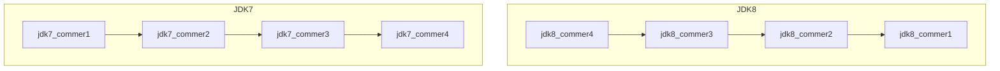
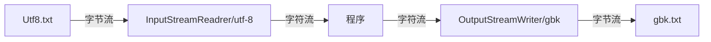
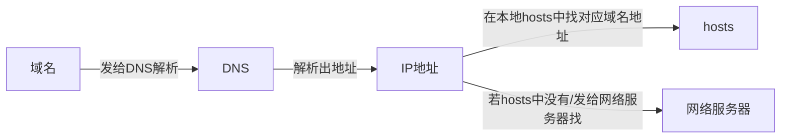
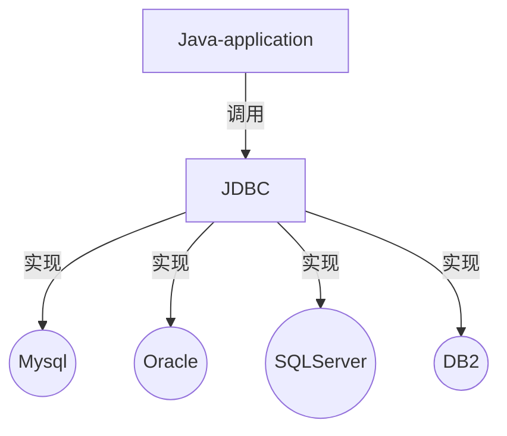

# VS Code + Java

## VS Code快捷键

```shell
Alt + Up : 上移选中代码
Fn + home/end ：快速到达行首或行尾

Ctrl + +/-:放大或缩小当前 光标选择的位置
Ctrl + B : 隐藏/展开左侧菜单
Ctrl + G : 挑到指定行号
Ctrl + T : 查看选中类或方法的源码

Ctrl + w : 关闭当前窗口
Ctrl + Shift+ w : 关闭当前窗口
Ctrl + D : 复制当前行代码

Ctrl + Home/End : 光标在单词间移动
Ctrl + Shift + Home/End : 选中光标👈或👉边的单词

Ctrl + Shift + k : 删除当前行
Ctrl + Shift + X : 将小写变为大写
Ctrl + Shift + P  + "New Java Project" ： 新建Java项目 
Ctrl + Shift + O 自动导包/在源码中查找类
```

在vscode中导入IDEA的快捷键包，可用下列快捷键

```shell
fori  : 生成变量为i的for循环
Alt + enter : 创建对象
```

IDEA快捷键：

```shell
想要输出内容.sout ： 打印输出内容
Alt + Shift + Up/Down : 将选中代码上/下移

Ctrl + Shift + - ： 折叠所有代码
Ctrl + Shift + + ： 展开所有代码
Ctrl + Shift + A :  搜索全局，比如搜索toolbar可快捷打开toolbar

Ctrl + Alt + B：查看源码
Ctrl + Alt + T: surround with，比如 try-catch,if-else等
Ctrl + Shift + S： Linux 下Ctrl + Alt + T与打开终端的 快捷键冲突。

Shift + Esc ：折叠左侧Project文件浏览窗口

F4：查看源代码
Ctrl + H: 查看当前类的继承关系
Ctrl + N：全局搜索
Ctrl + F12：查看当前方法目录
```


## VS Code使用JUnit

The `Test` annotation tells JUnit that the `public void` method to which it is attached can be run as a test case. To run the method, JUnit first constructs a fresh instance of the class then invokes the annotated method. Any exceptions thrown by the test will be reported by JUnit as a failure. If no exceptions are thrown, the test is assumed to have succeeded.

A simple test looks like this:

```java
import org.junit.Test;
public class Example {
    @Test
    public void method() {
       org.junit.Assert.assertTrue( new ArrayList().isEmpty() );
    }
}
```

```java
//若JUnit找不到包，界面不能运行，提示缺少main方法，在.project中nature标签处 加上下面语句：
	<natures>
		<nature>org.eclipse.jdt.core.javanature</nature>
	</natures>
//并在.classpath中 src和bin设置的中间 加上下面语句
<classpathentry kind="con" path="org.eclipse.jdt.junit.JUNIT_CONTAINER/4"/>

//更简单的方式是直接复制别的项目的.classpath 和.project文件
```


### 创建包

报错：[The declared package does not match the expected package Java](https://www.cnblogs.com/linux-centos/p/10784037.html)

用创建文件夹的形式创建包 如com/atguigu/java后，要先将当前文件添加到路径后才能正确导包。选中Java文件，Add foder to Java source path.

# Java basic

## Java学习的三条主线


​	

#### 数组

基本数据类型的值传递 ：值传递

引用数据类型（字符串、数组）的的传递：地址传递

#### Object 类

##### == 和 equals() 的区别

<u>基本数据类型用==，引用数据类型用equals()</u>。

 \* ====== 运算符 :

- 1. 以使用在基本数据类型变量和引用数据类型变量中

  2. 如果比较的是基本数据类型变量：比较两个变量保存的数据是否相等。（不一定类型要相同）

  3. 如果比较的是引用数据类型变量：比较两个对象的地址值是否相同.即两个引用是否指向同一个对象实体

     \* 补充： == 符号使用时，必须保证符号左右两边的变量类型一致。

==equals()方法==

- 1. 是一个方法，而非运算符

  2. 只能适用于引用数据类型

  3. Object类中equals()的定义：

     ```java
     public boolean equals(Object obj) {
           return (this == obj);
     }
     ```

     说明：Object类中定义的equals()和==的作用是相同的：比较两个对象的地址值是否相同.即两个引用是否指向同一个对象实体

  4. 像==String、Date、File、包装类等==都重写了Object类中的equals()方法。重写以后，比较的不是两个引用的地址是否相同，而是比较两个对象的"实体内容"是否相同。

  5. 通常情况下，我们自定义的类如果使用equals()的话，也通常是比较两个对象的"实体内容"是否相同。那么，我们就需要对Object类中的equals()进行重写

  6. ==重写==的原则：比较两个对象的"实体内容"（属性）是否相同.==注意是重写==

### 1. 类


类的成分：属性、方法、构造器

| 权限修饰符 | 类内部 | 同一个包 | 不同包的==子类== | 同一个工程 |
| ---------- | ------ | -------- | ---------------- | ---------- |
| private    | √      |          |                  |            |
| 缺省       | √      | √        |                  |            |
| protected  | √      | √        | √                |            |
| public     | √      | √        | √                | √          |
|            |        |          |                  |            |

重载（overload）和重写（override/overwrite）的区别:

1. 概念
2. 具体规则
3. 重写表现为多态性（晚绑定），重载（早绑定）不表现

#### 包装类

为了让基本数据类型更强大，引入了包装类。变成类以后就具有了类的特征

| **基本数据类型** |      | byte | short | int     | long | float | double | boolean | char |
| ---------------- | ---- | ---- | ----- | ------- | ---- | ----- | ------ | ------- | ---- |
| **包装类**       |      | Byte | Short | Integer | Long | Float | Double | Boolean | Char |

包装类的父类是Number

##### 包装类的转换


- String类型 --->基本数据类型、包装类：调用包装类的parseXxx(String s)

  JDK 5.0 新特性：==自动装箱== 与==自动拆箱==

```java
//自动装箱：基本数据类型 --->包装类
int num2 = 10;
Integer in1 = num2;//自动装箱
		
boolean b1 = true;
Boolean b2 = b1;//自动装箱
		
//自动拆箱：包装类--->基本数据类型
System.out.println(in1.toString());
int num3 = in1;//自动拆箱
```

- 基本数据类型、包装类--->String类型：调用String重载的valueOf(Xxx xxx)

  ```java
  int num1 = 10;
  //方式1：连接运算
  String str1 = num1 + "";
  //方式2：调用String的valueOf(Xxx xxx)
  float f1 = 12.3f;
  String str2 = String.valueOf(f1);//"12.3"
  Double d1 = new Double(12.4);
  String str3 = String.valueOf(d1);
  ```

  - String类型 --->基本数据类型、包装类：调用包装类的parseXxx(String s)

    ```java
    String str1 = "123";
    //错误的情况：
    //int num1 = (int)str1;
    //Integer in1 = (Integer)str1;
    //可能会报NumberFormatException
    int num2 = Integer.parseInt(str1);
    System.out.println(num2 + 1);
    
    String str2 = "true1";
    boolean b1 = Boolean.parseBoolean(str2);
    ```

    [面试题](#1.包装类)

#### 代码块

- 代码块的作用：用来初始化类、对象
- 代码块如果有修饰的话，只能使用static.
- 分类：静态代码块  vs 非静态代码块
- - ==静态代码块==
  - - 内部可以有输出语句
    - 随着类的加载而执行,而且只执行一次
    - 作用：初始化类的信息
    - 如果一个类中定义了多个静态代码块，则按照声明的先后顺序执行
    - 静态代码块的执行要优先于非静态代码块的执行
    - 静态代码块内只能调用静态的属性、静态的方法，不能调用非静态的结构
- - ==非静态代码块==
    - 内部可以有输出语句
    - 随着对象的创建而执行
    - 每创建一个对象，就执行一次非静态代码块
    - 作用：可以在创建对象时，对对象的属性等进行初始化
    - 如果一个类中定义了多个非静态代码块，则按照声明的先后顺序执行
    - 非静态代码块内可以调用静态的属性、静态的方法，或非静态的属性、非静态的方法

==对属性可以赋值的位置==（执行顺序：1 - 2/5 - 3 - 4 ，2和5的顺序看它们排放的顺序）

- 1. 默认初始化（静态）
- 1. 显式初始化（类内开始的地方初始化，且赋值。eg. int a = 5;）
- 1. 构造器中初始化
- 1. 有了对象以后，对象.属性 或对象.方法
- 1. 在<u>代码块</u>中赋值

静态代码块的应用情景：属性中不能对数值进行操作，如：`int a; a=1;`是错的。有些赋值想要是一次性的，不能写在方法中，也不能写在属性中，于是就有了静态代码块。既能只给对象赋值一次，又能调静态方法。

#### 内部类

- Java中允许将一个类A声明在另一个类B中，则类A就是内部类，类B称为外部类

- 内部类的分类：成员内部类（静态、非静态）  vs 局部内部类(方法内、代码块内、构造器内)

- ==成员内部类==： 

- - - 一方面，作为外部类的成员：
    - - - 调用外部类的结构
        - 可以被static修饰
        - 可以被4种不同的权限修饰
    - 另一方面，作为一个类：
    - - - 类内可以定义属性、方法、构造器等
        - 可以被final修饰，表示此类不能被继承。言外之意，不使用final，就可以被继承
        - 可以被abstract修饰

- 关注如下的3个问题：

  - 如何实例化成员内部类的对象

    //静态成员内部类

    Person.Dog dog = new Person.Dog();

    //非静态成员内部类

    Person p = new Person();

    Person.Bird bird = new p.Bird bird ();

  - 如何在成员内部类中区分调用外部类的结构

  - 开发中局部内部类的使用  见《InnerClassTest1.java》

在局部内部类的方法中（比如：show）如果调用局部内部类所声明的方法(比如：method)中的局部变量(比如：num)的话, 要求此局部变量声明为final的。

​     \* jdk 7及之前版本：要求此局部变量显式的声明为final的

​     \* jdk 8及之后的版本：可以省略final的声明

### 2. 面向对象的三大特征

#### 2.1 封装性

#### 2.2 继承性

继承格式：权限修饰符 + class + 子类名 + extends 父类名

==super== : 在子类中，当子类和父类的属性或方法出现重叠时，既想显示父类又想要子类就用super代表父类，this代表子类（默认是子类）。如：

```java
//假设子类(id=1002)和父类(id=1001)中都有id
System.out.println(id);//1002
System.out.println(this.id);//1002
System.out.println(super.id);//1001
```

super还可以调用父类中的构造器：

```java
super(name,age);
```

类的构造器中 this(形参列表) 和 super(形参列表) 只能二选一。

super可以继承父类的属性、方法、构造器

继承的时候，父类的形参列表是(int a , int... arr),子类的形参列表是(int a ,int[] arr)，也是可以用重写的

#### 2.3 多态性

对象的多态性，父类的引用指向子类的对象

```java
Person p = new Man();
```

多态的使用：当调用子父类同名同参数的方法时，编译是认为是父类的方法，执行时执行子类方法（实际执行的是子类重写父类的方法） ---==虚拟方法调用==


对象的多态性，只适用于方法，不适用于属性：

==方法== ： 编译看左边，运行看右边

==属性== ：编译和运行都看左边


多态是运行时行为(真正运行时才知道真正new的是谁)，详见InterViewTest.java


==早绑定/静态绑定==： 对于重载来说，在方法调用之前，编译器就已经确定了要调用的方法。

==晚绑定/静态绑定==： 对于多态，只有到方法调用的那一刻，解释运行器才知道索要调用的具体方法。


- **向上转型** : 通过子类对象(小范围)实例化父类对象(大范围),这种属于自动转换

  当我们需要多个同父的对象调用某个方法时,通过向上转换后,则可以确定参数的统一.方便程序设计

  ==向上转型时==(注意条件),父类只能调用父类方法或者子类覆写后的方法,而子类中的单独方法则是无法调用的。

- **向下转型** : 通过父类对象(大范围)实例化子类对象(小范围),这种属于强制转换

  向下转型则是为了,通过父类强制转换为子类,从而来调用子类<u>独有的方法</u>


为了避免在向下转型时出现异常，在向下转型前先用instanceof 判断

==A instanceof B== : 判断A是否是B 或者B的实例


### 3. 关键字

#### static:静态的

- static可以用来修饰：==属性、方法、代码块、内部类==

- 使用static修饰属性：静态变量（或类变量）

- - - 属性，按是否使用static修饰，又分为：静态属性  vs 非静态属性(实例变量)
    - - ==实例变量==：我们创建了类的多个对象，每个对象都独立的拥有一套类中的非静态属性。当修改其中一个对象中的非静态属性时，不会导致其他对象中同样的属性值的修改。
      - 静态变量：我们创建了类的多个对象，多个对象共享同一个静态变量。当通过某一个对象修改静态变量时，会导致其他对象调用此静态变量时，是修改过了的。

- static修饰属性的其他说明：

  ① 静态变量随着类的加载而加载。可以通过"类.静态变量"的方式进行调用

  ② 静态变量的加载要早于对象的创建。

  ③ 由于类只会加载一次，则静态变量在内存中也只会存在一份：存在方法区的静态域中。

  ④

  |      | 类变量 | 实例变量 |
  | ---- | ------ | -------- |
  | 类   | yes    | no       |
  | 对象 | yes    | yes      |

- - - 静态方法中，只能调用静态的方法或属性  (==静态属性==举例：System.out;  Math.PI;)
  - - 非静态方法中，既可以调用非静态的方法或属性，也可以调用静态的方法或属性

- static注意点：

- - - 在静态的方法内，不能使用this关键字、super关键字。==this();super();可分别调用当前;父类的的构造器==
  - - 关于静态属性和静态方法的使用，大家都从生命周期的角度去理解。

- 开发中，如何确定一个==属性==是否要声明为static的？
- - - 属性是可以被多个对象所共享的，不会随着对象的不同而不同的。
- - - 类中的常量也常常声明为static
- 开发中，如何确定一个==方法==是否要声明为static的？
- - - 操作静态属性的方法，通常设置为static的
    - 工具类中的方法，习惯上声明为static的。 比如：Math、Arrays、Collections


#### main

 \* 1. main()方法作为程序的入口

 \* 2. main()方法也是一个普通的静态方法

 \* 3. main()方法可以作为我们与控制台交互的方式。（之前：使用Scanner）

```shell
//去掉包名，在命令行中执行下面语句也是可以的
javac MainDemo.java
java MainDemo  22 33 44
```

#### final

- final可以用来修饰的结构：==类、方法、变量==
- final 用来修饰一个==类==:此类不能被其他类所继承。比如：==String类、System类、StringBuffer类==
- final 用来修饰==方法==：表明此方法不可以被重写，比如：==Object类中getClass()==
- final 用来修饰==变量==：此时的"变量"就称为是一个常量
- - - final修饰<u>属性</u>：可以考虑赋值的位置有：==显式初始化、代码块中初始化、构造器中初始化==
    - final修饰<u>局部变量</u>：
    - - - 尤其是使用final修饰<u>形参</u>时，表明此形参是一个常量。当我们调用此方法时，给常量形参赋一个实参。一旦赋值以后，就只能在方法体内使用此形参，但不能进行重新赋值。
- static final 用来修饰属性：全局常量

#### abstract -- 抽象类与抽象方法

- abstract可以用来修饰的结构：==类、方法==

- abstract修饰类：抽象类

- - - 此类不能实例化（不能建对象）
    - 抽象类中一定有构造器，便于子类实例化时调用（涉及：子类对象实例化的全过程）
    - 开发中，都会提供抽象类的子类，让子类对象实例化，完成相关的操作

- abstract修饰方法：抽象方法

- - - 抽象方法只有方法的声明，没有方法体

    - 包含抽象方法的类，一定是一个抽象类。反之，抽象类中可以没有抽象方法的

    - 若子类重写了父类中的所有的抽象方法后，此子类方可实例化

      若子类没有重写父类中的所有的抽象方法，则此子类也是一个抽象类，需要使用abstract修饰

- abstract不能用来修饰私有方法、静态方法、final的方法、final的类


#### Interface -- 接口

- 接口使用interface来定义
- Java中，接口和类是并列的两个结构
- 如何定义接口：定义接口中的成员
- - JDK7及以前：只能定义全局常量和抽象方法
- - - - 全局常量：==public static final==的.但是书写时，可以省略不写
    - - 抽象方法：==public abstract== 的
- - JDK8：除了定义全局常量和抽象方法之外，还可以定义==静态方法、默认方法==（略）
  - - - 接口中定义的全局常量只能接口用，不能通过实现该接口的类的对象用
      - 通过实现类的对象，可以调用接口中的默认方法。若对象重写了默认方法，则执行的是重写的方法
      - 如果子类(或实现类)继承的  父类 和 实现的接口 中声明了同名同参数的<u>默认方法</u>(不是属性)，那么子类在<u>没有重写</u>此方法的情况下，默认调用的是父类中的同名同参数的方法。-->类优先原则
      - 如果实现类实现了多个接口，而这多个接口中定义了同名同参数的默认方法，那么在实现类没有重写此方法的情况下，报错。-->接口冲突。这就需要我们必须在实现类中重写此方法
- 接口中不能定义构造器的！意味着接口不可以实例化
- Java开发中，接口通过让类去实现(==implements==)的方式来使用
- - - 如果实现类覆盖了接口中的所有抽象方法，则此实现类就可以实例化
    - 如果实现类没有覆盖接口中所有的抽象方法，则此实现类仍为一个抽象类
- Java类可以实现多个接口   --->弥补了Java单继承性的局限性
- - - class AA extends BB implements CC,DD,EE
- 接口与接口之间可以继承，而且可以多继承


- 接口的具体使用，体现多态性
- 接口，实际上可以看做是一种规范

# Java Senior

## 异常处理


### 异常体系结构

 \* 

 \* java.lang.Throwable

 \*      |-----java.lang.Error:一般不编写针对性的代码进行处理。

 \*      |-----java.lang.Exception:可以进行异常的处理

 \*          |------编译时异常(checked)

 \*                  |-----IOException

 \*                      |-----FileNotFoundException

 \*                  |-----ClassNotFoundException

 \*          |------运行时异常(unchecked,RuntimeException)

 \*                  |-----NullPointerException

 \*                  |-----ArrayIndexOutOfBoundsException

 \*                  |-----ClassCastException

 \*                  |-----NumberFormatException

 \*                  |-----InputMismatchException

 \*                  |-----ArithmeticException

### 异常处理机制

##### 1. try-catch-finally

- 过程一：=="抛"==：

  程序在正常执行的过程中，一旦出现异常，就会在异常代码处生成一个对应异常类的对象。并将此对象抛出。 一旦抛出对象以后，其后的代码就不再执行。

- - - - 关于异常对象的产生：

        ① 系统自动生成的异常对象

        ② ==手动==的生成一个异常对象，并抛出（==throw==）​         

- 过程二：=="抓"==：可以理解为异常的处理方式：① try-catch-finally  ② ==throws==

- try-catch-finally的使用

  ```java
   * try{
   * 		//可能出现异常的代码
   * 
   * }catch(异常类型1 变量名1){
   * 		//处理异常的方式1
   * }catch(异常类型2 变量名2){
   * 		//处理异常的方式2
   * }catch(异常类型3 变量名3){
   * 		//处理异常的方式3
   * }
   * ....
   * finally{
   * 		//一定会执行的代码
   * }
  ```

  - 1. finally是可选的。
  - 1. 使用try将可能出现异常代码包装起来，在执行过程中，一旦出现异常，就会生成一个对应异常类的对象，根据此对象的类型，去catch中进行匹配
  - 1. 一旦try中的异常对象匹配到某一个catch时，就进入catch中进行异常的处理。一旦处理完成，就跳出当前的 try-catch结构（在没有写finally的情况）。继续执行其后的代码
  - 1. catch中的异常类型如果没有子父类关系，则谁声明在上，谁声明在下无所谓。如果满足子父类关系，则要求子类一定声明在父类的上面。否则，报错
  - 1. 常用的异常对象处理的方式： ① String  getMessage()    ② printStackTrace()
  - 1. 在try结构中声明的变量，再出了try结构以后，就不能再被调用
  - 1. try-catch-finally结构可以嵌套
    2. finally中声明的是一定会被执行的代码。即使catch中又出现异常了，try中有return语句，catch中有return语句等情况。
    3. 像<u>数据库连接、输入输出流、网络编程Socket等资源</u>，JVM是不能自动的回收的，我们需要自己手动的进行资源的释放。此时的资源释放，就需要声明在finally中。


- 体会1：使用try-catch-finally处理编译时异常，是得程序在编译时就不再报错，但是运行时仍可能报错。相当于我们使用try-catch-finally将一个编译时可能出现的异常，延迟到运行时出现。
- 体会2：开发中，由于运行时异常比较常见，所以我们通常就不针对运行时异常编写try-catch-finally了。针对于编译时异常，我们说一定要考虑异常的处理。

##### 2.throws+异常类型

1. "throws + 异常类型"写在方法的声明处。指明此方法执行时，可能会抛出的异常类型。一旦当方法体执行时，出现异常，仍会在异常代码处生成一个异常类的对象，此对象满足throws后异常类型时，就会被抛出。异常代码后续的代码，就不再执行！

2. 体会：try-catch-finally:真正的将异常给处理掉了。throws的方式只是将异常抛给了方法的调用者。  并没有真正将异常处理掉。 

3. 子类重写的方法抛出的异常类型不大于父类被重写的方法抛出的异常类型

4. 开发中如何选择使用try-catch-finally 还是使用throws？

   4.1 如果父类中被重写的方法没有throws方式处理异常，则子类重写的方法也不能使用throws，意味着如果子类重写的方法中有异常，必须使用try-catch-finally方式处理。

   4.2 执行的方法a中，先后又调用了另外的几个方法，这几个方法是递进关系执行的。我们建议这几个方法使用throws的方式进行处理。而执行的方法a可以考虑使用try-catch-finally方式进行处理。

5. 

##### 3.如何自定义异常类

- 继承于现有的异常结构：RuntimeException 、Exception
- 提供全局常量：serialVersionUID
- 提供重载的构造器

## IntelliJ与多线程

**IntelliJ 配置**

- 鼠标滚轮放大字体

  Editor --> Genneral --> Mouse -->change fontsize(Zoom)....

- 鼠标悬浮提示

  Editor --> Genneral -->Show quick documentation on mouse move

- 自动导包

  Insert imports on paste:All

  Editor --> Genneral -->auto Import -->选择：

  Add unambiguous imports on the fly
  Optimize imports on the fly(for current project)

- 显示分隔符

  Editor --> Genneral -->Apperence-->Show method separators

- 设置取消单行显示tabs的操作

  Editor --> Genneral -->Editor Tabs -->Show tabs in one row

- 注解

  Editor  -->File and Code Templates --> Include -->File Header -->输入：

  ```java
  /**
      @author cxy
      @create ${YEAR}-${MONTH}-${DAY}-${TIME}
  */
  ```

- 更改编码方式

  Editor --> Genneral -->Code Style -->File Encoding-->全部改为UTF-8

  勾选Transparent native-to-ascii conversion

- 自动编译

  Build,Execution,Deployment --> Compiler -->勾选

  Compile independent modules in parallel 
  Rebuild module on dependency change


| software | Eclipse   | IntelliJ idea |
| -------- | --------- | ------------- |
| 等价     | workspace | project       |
| 等价     | project   | module        |

==线程==： 一条*线程* 指的是进程中一个单一顺序的控制流，是操作系统能够进行运算调度的最小单位。

==进程==：是计算机中的程序关于某数据集合上的一次运行活动，是系统进行资源分配和调度的基本单位。一个进程包含多个线程。

==CPU==：

- 单核CPU：假的多线程，一个时间单元内只能执行一个线程的任务，其它任务虽打开，但被挂起。
- 多核CPU：一个时间单元内能执行多个线程的任务

==并行==: 多个CPU同时执行多个任务

==并发==: 一个CPU（采用时间片）同时执行多个任务，如秒杀

**多线程的优点**

1. 提高应用程序的响应
2. 提高CPU的利用率
3. 改善程序结构

### 1. 多线程的创建方式

#### 1.1 继承于Thread类

```
 * 1. 创建一个继承于java.lang.Thread类的子类
 * 2. 重写Thread类的run() --> 将此线程执行的操作声明在run()中
 * 3. 创建Thread类的子类的对象
 * 4. 通过此对象调用start()  
```

- start 方法的作用：①启动当前线程 ② 调用当前线程的run()
- 我们不能通过直接调用 run() 的方式启动线程
- 不可以让已经start()的线程去执行，会报IllegalThreadStateException。需要重新创建一个线程的对象

**Thread类中常用方法** 

1. start():启动当前线程；调用当前线程的run()
2. run(): 通常需要重写Thread类中的此方法，将创建的线程要执行的操作声明在此方法中
3. currentThread():静态方法，返回执行当前代码的 *线程* 
4. getName():获取当前线程的名字
5. setName():设置当前线程的名字
6. yield():释放当前CPU的执行权
7. join():在线程a中调用线程b的join(),此时线程a就进入阻塞状态，直到线程b完全执行完以后，线程a才结束阻塞状态。
8. stop():已不用了。当执行此方法时，强制结束当前线程
9. sleep(long millitime):让当前线程“睡眠”指定的millitime毫秒。在指定的millitime毫秒时间内，当前线程是阻塞状态。
10. isAlive():判断当前线程是否存活

**线程的优先级**

- 1.1 

- - - MAX_PRIORITY：10
  - - MIN _PRIORITY：1
  - - NORM_PRIORITY：5  -->默认优先级

  1.2 如何获取和设置当前线程的优先级

- - - getPriority():获取线程的优先级
  - - setPriority(int p):设置线程的优先级

- 说明：高优先级的线程要抢占低优先级线程cpu的执行权。但是只是从概率上讲，高优先级的线程高概率的情况下被执行。并不意味着只有当高优先级的线程执行完以后，低优先级的线程才执行

#### 1.2. 实现Runnable接口

- 创建一个实现了Runnable接口的类

- 实现类去实现Runnable中的抽象方法：run()

- 创建实现类的对象

- 将此对象作为参数传递到Thread类的构造器中，创建Thread类的对象

- 通过Thread类的对象调用start() 。==谁start了 线程就是谁的==


**方式比较:  继承于Thread类 vs. 实现Runnable接**口

- 开发中：优先选择：实现Runnable接口的方式

  ​	原因：1.  实现的方式没有类的单继承性的局限性

  ​		    2. 实现的方式更适合来处理多个线程有==共享数据==的情况。

- 联系：public class Thread implements Runnable，==Thread本身也实现了Runnable接口==（因为Thread的子类可以实现Runnable接口）

- 相同点：两种方式都需要重写run(),将线程要执行的逻辑声明在run()中。


#### 1.3 实现Callable接口。 

--- JDK 5.0新增

- call()可以有返回值
- call()可以抛出异常，被外面的操作捕获，获取异常的信息
-  Callable支持泛型

- 步骤

- 1. 创建一个实现Callable的实现类
  2. 实现 call 方法，将此线程需要执行的操作声明在call()中
  3. 创建Callable接口实现类的对象
  4. 将此Callable接口实现类的对象作为传递到FutureTask构造器中，创建FutureTask的对象
  5. 将FutureTask的对象作为参数传递到Thread类的构造器中，创建Thread对象，并调用start()
  6. 获取Callable中call方法的返回值（可省，看具体情况）

#### 1.4 线程池

- 创建步骤

- 1. 提供指定线程数量的线程池
  2. 设置线程池的属性
  3. 执行指定的线程的操作。需要提供实现Runnable接口或Callable接口实现类的对象execute
  4. 关闭连接池 shutdown()

[面试题3](#3 创建多线程有几种方式？)


### 2. 线程的生命周期

生命周期：某个线程从出生到消亡这段时间

关注 ：状态 a --> 状态 b ：哪些方法执行了（去重写回调方法）

​		 某个方法主动调用导致  状态 a --> 状态 b 

阻塞：临时状态，不可以作为最终状态（死亡）

### 3. 线程的同步

- 线程安全问题之所以会出现，是因为有数据共享，比如账户。

- 在Java中，我们通过同步机制，来解决线程的安全问题。

- - 1. ==方式一：同步代码块==

       ```java
       synchronized(同步监视器){
           //需要被同步的代码
       }
       ```

       - 说明：

       - - 1. 操作共享数据的代码，即为需要被同步的代码。  -->包含代码不能多了，也不能少了。

         - 2. ==共享数据==：多个线程共同操作的变量。比如：ticket就是共享数据

           3. ==同步监视器==，俗称：==锁==。任何一个类的对象，都可以充当锁。

              要求：==<u>多个线程必须要共用同一把锁</u>==，即同一个对象。

       - 补充：在实现Runnable接口创建多线程的方式中，我们可以考虑使用this充当同步监视器。

       - 好处:  同步的方式，解决了线程的安全问题。

       - 局限性:  操作同步代码时，只能有一个线程参与，其他线程等待。相当于是一个单线程的过程，效率低。

    2. ==方式二：同步方法==

       如果操作共享数据的代码完整的声明在一个方法中，我们不妨将此方法声明同步的。

       -  \*  1. 同步方法仍然涉及到同步监视器，只是不需要我们显式的声明。

       - \*  2. 非静态的同步方法，同步监视器是：this

         ​         ==静态== 的同步方法，同步监视器是：当前类本身即 ==类.class==

    3. ==方式三：[Lock](#4.1 Lock)==


### 4. 线程的安全问题---死锁

- 死锁的理解：不同的线程分别占用对方需要的同步资源不放弃，都在等待对方放弃自己需要的同步资源，就形成了线程的死锁.
- 如果有2个线程，2个对象。一个线程先握a🔒，再b🔒，另一个线程先握b🔒，再a🔒。很容易造成死锁。如：线程1进入a后，若sleep，造成阻塞状态，则线程2开启，若sleep，造成阻塞状态。此时线程1和线程2都不释放对方想要的资源，造成死锁。

##### 4.1 Lock

-- JDK5.0后新增

-- 建议优先使用顺序：

 \* Lock--> 同步代码块（已经进入了方法体，分配了相应资源）--> 同步方法（在方法体之外）

##### 4.2 单例设计模式

所谓类的单例设计模式，就是采取一定的方法保证在整个的软件系统中，对某个类只能存在一个对象实例。

**实现**

 饿汉式  vs 懒汉式：

|              | 好处                     | 坏处             |
| ------------ | ------------------------ | ---------------- |
| 饿汉式       | 线程安全                 | 对象加载时间过长 |
| 懒汉式       | 延迟对象的创建           | 线程不安全       |
| 改进的懒汉式 | 延迟对象的创建，线程安全 |                  |

```java
//饿汉式：
public class SingletonTest1{
public static void main(String[] args) {
	Bank bank1 = Bank.getInastance();
	Bank bank2 = Bank.getInastance();
	System.out.println(bank1 ==bank2);
}
}
class Bank{
	private Bank(){
	}
	private static Bank instance = new Bank();
	public static Bank getInastance(){
		return instance;
	}
}

//改进前的懒汉式
public class SingletonTest2 {
	public static void main(String[] args) {
		Order order1 = Order.getInstance();
		Order order2 = Order.getInstance();
		System.out.println(order1 == order2);
	}
}
class Order{
	//1.私有化类的构造器
	private Order(){
	}
	//2.声明当前类对象，没有初始化
	//4.此对象也必须声明为static的
	private static Order instance = null;
	//3.声明public、static的返回当前类对象的方法
	public static Order getInstance(){	
		if(instance == null){
			instance = new Order();
		}
		return instance;
	}
}
//使用同步机制将单例模式中的懒汉式改写为线程安全的
public class BankTest {

}
class Bank{
    private Bank(){}
    private static Bank instance = null;
    public static Bank getInstance(){
        //方式一：效率稍差
//        synchronized (Bank.class) {
//            if(instance == null){
//
//                instance = new Bank();
//            }
//            return instance;
//        }
        //方式二：效率更高
        if(instance == null){
            synchronized (Bank.class) {
                if(instance == null){
                    instance = new Bank();
                }
            }
        }
        return instance;
    }

}
```


### 5. 线程通信

* 涉及到的三个方法：

  wait():   一旦执行此方法，<u>当前线程就进入阻塞状态，并==释放==同步监视器</u>。

  notify(): 一旦执行此方法，就会唤醒被wait的一个线程。如果有多个线程被wait，就唤醒优先级高的那个。

  notifyAll(): 一旦执行此方法，就会唤醒所有被wait的线程。

- wait()，notify()，notifyAll()三个方法:
  1. 必须使用在同步代码块或同步方法中
  2. 三个方法的调用者必须是同步代码块或同步方法中的同步监视器
  3. 三个方法是定义在==java.lang.Object类==中

- 线程通信的应用：经典例题：==生产者/消费者问题==

[面试题1](#1 synchronized 与 Lock的异同？)

[面试题2](#2 sleep() 和 wait()的异同？)

## 常用类

### 1. String 类

String:字符串，使用一对""引起来表示。

- 1. String声明为<u>final</u>的，不可被继承

  2. String实现了==Serializable==接口：表示字符串是支持序列化的。

     实现了Comparable接口：表示String可以比较大小

  3. String内部定义了final char[] value用于存储字符串数据

  4. String:代表不可变的字符序列。简称：==不可变性==。

     体现：

     - - 当对字符串重新赋值时，需要重写指定内存区域赋值，不能使用原有的value进行赋值
       - 当对现有的字符串进行连接操作时，也需要重新指定内存区域赋值，不能使用原有的value进行赋值
       -  当调用String的replace()方法修改指定字符或字符串时，也需要重新指定内存区域赋值，不能使用原有的value进行赋值

  5. 通过字面量的方式（区别于new）给一个字符串赋值，此时的字符串值声明在字符串==常量池==中。

     [面试题](#1. String)

  6. 字符串常量池中是不会存储相同内容的字符串的。

  7. 常量与常量的拼接结果在常量池。且常量池中不会存在相同内容的常量。

     只要其中有一个是变量（注意如果变量有final就不是变量了），结果就在堆中。

     如果拼接的结果调用==intern()== 方法，返回值就在常量池中

  8. String中常用的==方法==

     - int length()：返回字符串的长度

     - char charAt(int index)： 返回某索引处的字符

     - boolean isEmpty()：判断是否是空字符串：return value.length == 0

     - String toLowerCase()：使用默认语言环境，将 String 中的所有字符转换为小写

     - String toUpperCase()：使用默认语言环境，将 String 中的所有字符转换为大写

     - String ==trim()==：返回字符串的副本，忽略前导空白和尾部空白

     - boolean equals(Object obj)：比较字符串的==内容==是否相同

     - boolean equalsIgnoreCase(String anotherString)：与equals方法类似，忽略大小写

     - String concat(String str)：将指定字符串连接到此字符串的结尾。 等价于用“+”

     - int compareTo(String anotherString)：比较两个字符串的大小

     - String substring(int beginIndex)：返回一个新的字符串，它是此字符串的从beginIndex开始截取到最后的一个子字符串。

     - String substring(int beginIndex, int endIndex) ：返回一个新字符串，它是此字符串从beginIndex开始截取到endIndex(不包含)的一个子字符串。

     - boolean ==endsWith==(String suffix)：测试此字符串是否以指定的后缀结束

     - boolean startsWith(String prefix)：测试此字符串是否以指定的前缀开始

     - boolean startsWith(String prefix, int toffset)：测试此字符串从指定索引开始的子字符串是否以指定前缀开始

     - boolean ==contains==(CharSequence s)：当且仅当此字符串包含指定的 char 值序列时，返回 true

     - int ==indexOf==(String str)：返回指定子字符串在此字符串中第一次出现处的索引

     - int indexOf(String str, int fromIndex)：返回指定子字符串在此字符串中第一次出现处的索引，从指定的索引开始

     - int lastIndexOf(String str)：返回指定子字符串在此字符串中最右边出现处的索引

     - int lastIndexOf(String str, int fromIndex)：返回指定子字符串在此字符串中最后一次出现处的索引，从指定的索引开始反向搜索

       注：indexOf和lastIndexOf方法如果未找到都是返回-1

     - String ==replace== (char oldChar, char newChar)：返回一个新的字符串，它是通过用 newChar 替换此字符串中出现的<u>所有</u> oldChar 得到的。

     - String replace(CharSequence target, CharSequence replacement)：使用指定的字面值替换序列替换此字符串所有匹配字面值目标序列的子字符串。

     - String replaceAll(String regex, String replacement)：使用给定的 replacement 替换此字符串所有匹配给定的正则表达式的子字符串

     - String replaceFirst(String regex, String replacement)：使用给定的 replacement 替换此字符串匹配给定的正则表达式的第一个子字符串。

     - boolean ==matches==(String regex)：告知此字符串是否==匹配==给定的正则表达式。

     - String[] ==split==(String regex)：根据给定正则表达式的匹配拆分此字符串。

       String[] split(String regex, int limit)：根据匹配给定的正则表达式来拆分此字符串，最多不超过limit个，如果超过了，剩下的全部都放到最后一个元素中。

     - 

  9. [String 类与 char[] 的转换](#包装类的转换)

     ```java
     //String --> char[]:调用String的toCharArray()
     char[] charArray = str1.toCharArray();
     //char[] --> String:调用String的构造器
     String str2 = new String(arr);
     ```

  10. String类与Byte[] 的转换

      编码：字符串 -->字节  (看得懂 --->看不懂的二进制数据)

      解码：编码的逆过程，字节 --> 字符串 （看不懂的二进制数据 ---> 看得懂）

      说明：解码时，要求解码使用的字符集必须与编码时使用的字符集一致，否则会出现乱码。

  11. 

### 2. StringBuilder & StringBuffer

#### 2.1 String、StringBuffer、StringBuilder三者的异同？

|               | 是否可变         | 存储                 | 线程                          |
| ------------- | ---------------- | -------------------- | ----------------------------- |
| String        | 不可变的字符序列 | 底层使用 char[] 存储 |                               |
| StringBuffer  | 可变的字符序列   | 底层使用 char[] 存储 | 线程不安全的，效率高          |
| StringBuilder | 可变的字符序列   | 底层使用 char[] 存储 | jdk5.0新增,线程安全的，效率低 |

- 源码分析：

  ```java
  String str = new String();//char[] value = new char[0];
  String str1 = new String("abc");//char[] value = new char[]{'a','b','c'};
  
  StringBuffer sb1 = new StringBuffer();//char[] value = new char[16];底层创建了一个长度是16的数组。
  System.out.println(sb1.length());//
  sb1.append('a');//value[0] = 'a';
  sb1.append('b');//value[1] = 'b';
  
  StringBuffer sb2 = new StringBuffer("abc");//char[] value = new char["abc".length() + 16];
  ```

  - 问题 1

    `System.out.println(sb2.length());//3`

  - 问题 2 . 扩容问题

    如果要添加的数据底层数组盛不下了，那就需要扩容底层的数组。默认情况下，扩容为原来容量的 `2倍 + 2` ，同时将原有数组中的元素复制到新的数组中。

- - - 指导意义：开发中建议大家使用：StringBuffer(int capacity) 或 StringBuilder(int capacity)

#### 2.2 StringBuffer的常用方法

- StringBuffer append(xxx)：提供了很多的append()方法，用于进行字符串拼接
- StringBuffer delete(int start,int end)：删除指定位置的内容
- StringBuffer replace(int start, int end, String str)：把[start,end)位置替换为str
- StringBuffer insert(int offset, xxx)：在指定位置插入xxx
- StringBuffer reverse() ：把当前字符序列逆转
- public int indexOf(String str)
- public String ==substring==(int start,int end):==返回==一个从start开始到end索引结束的左闭右开区间的子字符串
- public int length()
- public char charAt(int n )
- public void setCharAt(int n ,char ch)

总结：

- 增：append(xxx)
- 删：delete(int start,int end)
- 改：setCharAt(int n ,char ch) / replace(int start, int end, String str)
- 查：charAt(int n )
- 插：insert(int offset, xxx)
- 长度：length();
- *遍历：for() + charAt() / toString()

效率：从高到低排列：StringBuilder > StringBuffer > String

### 3. 时间相关的API

##### 3.1 System.currentTimeMillis() 

```Java
long time = System.currentTimeMillis();
//返回当前时间与1970年1月1日0时0分0秒之间以毫秒为单位的时间差，称为时间戳
```

##### 3.2 Date类

java.util.Date类
​           |---java.sql.Date类

- 1. 两个构造器的使用

     > 构造器一：Date()：创建一个对应当前时间的Date对象
     >
     > 构造器二：创建指定毫秒数的Date对象2.

  2. 两个方法的使用

     > toString(): 显示当前的年、月、日、时、分、秒
     >
     > getTime():获取当前Date对象对应的毫秒数。（==时间戳== ）

  3. java.sql.Date对应着数据库中的日期类型的变量

     > 如何实例化
     >
     > 如何将java.util.Date对象转换为java.sql.Date对象

##### 3.3 SimpleDateFormat类

```java
SimpleDateFormat sdf1 = new SimpleDateFormat("yyyy-MM-dd hh:mm:ss");
Date date = new Date();
//格式化：日期 --->字符串
String format1 = sdf1.format(date);
System.out.println(format1);//2019-02-18 11:48:27

//解析: 字符串 ---> 日期
//要求字符串必须是符合SimpleDateFormat识别的格式(通过构造器参数体现),否则，抛异常
Date date2 = sdf1.parse("2020-02-18 11:48:27");
System.out.println(date2);
```

**java.util.Date --》 java.sql.Date**

```java
String birth = "2020-09-08";
SimpleDateFormat sdf1 = new SimpleDateFormat("yyyy-MM-dd");
Date date = sdf1.parse(birth);
java.sql.Date birthDate = new java.sql.Date(date.getTime());
System.out.println(birthDate);
```

##### 3.4 Calendar 日历类

Calendar 是抽象类

- 1. 实例化

     ```java
     //方式一：创建其子类（GregorianCalendar）的对象
     //方式二：调用其静态方法getInstance()
     Calendar calendar = Calendar.getInstance();
     ```

  2. 常用方法

     - get()获取常用属性，如本月的第几天

       ```java
       Calendar calendar = Calendar.getInstance();
       calendar.set(month, day, year);
       System.out.println(calendar.get(Calendar.DAY_OF_WEEK));
       ```

     - set()

     - add()当前日期加上某天数

     - getTime()：日历类-->Date

     - setTime()：Date --> 日历类

##### 3.5 Java 8 中的API

java.time

- 1. ==LocalDate、LocalTime、LocalDateTime== （类似于Calendar）

     LocalDateTime相较于LocalDate、LocalTime，使用频率要高

     ```java
     LocalDateTime localDateTime = LocalDateTime.now();
     ```

     方法：

     - now(): 获取当前的日期、时间、日期+时间
     - of(): 设置指定的年、月、日、时、分、秒。没有偏移量
     - getXxx()：获取属性
     - withXxx()：设置属性，体现==不可变性==
     - plusXxx()：加上年月日，体现==不可变性==
     - minusXxx()：减去年月日，体现==不可变性

  2. ==Instant 瞬时==（类似于 java.util.Date类）

     ```java
     Instant instant = Instant.now();
     ```

     方法：

     - now(): 获取本初子午线对应的标准时间
     - toEpochMilli():获取自1970年1月1日0时0分0秒（UTC）开始的毫秒数  ---> Date类的getTime()
     - ofEpochMilli():通过给定的毫秒数，获取Instant实例  -->Date(long millis)

  3. ==DateTimeFormatter:格式化或解析日期、时间==（类似于SimpleDateFormat）   

### 4. Java 比较器

实现对象的排序：Comparable 或 Comparator

- ==Comparable==  自然排序

  1. 像String、包装类等实现了Comparable接口，重写了compareTo(obj)方法，给出了比较两个对象大小的方式。

  2.  像String、包装类重写compareTo()方法以后，进行了从小到大的排列

  3. 重写compareTo(obj)的规则：

     > 如果当前对象this大于形参对象obj，则返回正整数，
     >
     > 如果当前对象this小于形参对象obj，则返回负整数，
     >
     > 如果当前对象this等于形参对象obj，则返回零。​    

  4. 对于自定义类来说，如果需要排序，我们可以让自定义类实现Comparable接口，重写compareTo(obj)方法。       在compareTo(obj)方法中指明如何排序

- ==Comparator==  定制排序

  1. 背景：

     > 当元素的类型没有实现java.lang.Comparable接口而又不方便修改代码，或者实现了java.lang.Comparable接口的排序规则不适合当前的操作，那么可以考虑使用 Comparator 的对象来排序

  2. 重写compare(Object o1,Object o2)方法，比较o1和o2的大小：

     > 如果方法返回正整数，则表示o1大于o2； 
     >
     > 如果返回0，表示相等； 
     >
     > 返回负整数，表示o1小于o2。   

-  Comparable接口与Comparator的使用的==对比==：

   \*    Comparable接口的方式一旦一定，保证Comparable接口实现类的对象在任何位置都可以比较大小。

   \*    Comparator接口属于临时性的比较。

### 5. System类

### 6. Math类

### 7.BigInteger 和 BigDecimal

### 8. 枚举类

**使用：**

- 类的<u>对象只有有限个</u>，确定的。我们称此类为枚举类

- 当需要定义一组常量时，强烈建议使用枚举类
- 如果枚举类中只有一个对象，则可以作为单例模式的实现方式。

**定义：**

 * 方式一：jdk5.0之前，自定义枚举类
 * 方式二：jdk5.0，可以使用enum关键字定义枚举类

```
定义的枚举类默认继承于java.lang.Enum类
```

**Enum类中的常用方法：**

- values()方法：返回枚举类型的对象数组。该方法可以很方便地遍历所有的枚举值。

 *    valueOf(String str)：可以把一个字符串转为对应的枚举类对象。要求字符串必须是枚举类对象的“名字”。如是，会有运行时异常：IllegalArgumentException。
 *    toString()：返回当前枚举类对象常量的名称

**使用enum关键字定义的枚举类实现接口的情况**

*   情况一：实现接口，在enum类中实现抽象方法
*   情况二：让枚举类的对象分别实现接口中的抽象方法

### 9. 注解（Anotation）

Annotation 其实就是代码里的特殊标记, 这些标记可以在编译, 类加载, 运行时被读取, 并执行相应的处理。通过使用 Annotation,程序员可以在不改变原有逻辑的情况下, 在源文件中嵌入一些补充信息。

```
如何自定义注解：参照@SuppressWarnings定义
    * ① 注解声明为：@interface
    * ② 内部定义成员，通常使用value表示
    * ③ 可以指定成员的默认值，使用default定义
    * ④ 如果自定义注解没有成员，表明是一个标识作用。
```

```
如果注解有成员，在使用注解时，需要指明成员的值
自定义注解必须配上注解的信息处理流程(使用反射)才有意义。
自定义注解通过都会指明两个元注解：Retention、Target
```

- jdk 提供的4种元注解

  ==元注解== ：对现有的注解进行解释说明的注解

  - 1. **Retention**：指定所修饰的 Annotation 的生命周期：

  - - - SOURCE：在源文件中有效（保留）

      - CLASS(默认行为)：在class文件中有效

      - RUNTIME：在运行是有效

        <u>只有声明为RUNTIME生命周期的注解，才能通过反射获取</u>

  - 2. **Target:** 用于指定被修饰的 Annotation 能用于修饰哪些程序元素

    ---

    *******出现的频率较低*******

- - 3. **Documented:** 表示所修饰的注解在被javadoc解析时，保留下来
  - 4. **Inherited:** 被它修饰的 Annotation 将具有继承性

- 通过反射获取注解信息 ---到反射内容时系统讲解

- jdk 8 中注解的新特性：可重复注解、类型注解

- - - 可重复注解：

      ​      ① 在MyAnnotation上声明@Repeatable，成员值为MyAnnotations.class

      ​      ② MyAnnotation的Target和Retention等元注解与MyAnnotations相同

    - 类型注解：
      ​       ElementType.TYPE_PARAMETER 表示该注解能写在类型变量的声明语句中（如：泛型声明）
      ​       ElementType.TYPE_USE 表示该注解能写在使用类型的任何语句中

## 集合

### 1. 概述

1. 集合、数组都是对多个数据进行存储操作的结构，简称Java容器。

   此时的存储，主要指的是内存层面的存储，不涉及到持久化的存储（.txt,.jpg,.avi，数据库中）

2. 数组在存储多个数据方面的优缺点：

   特点：

   >  一旦初始化以后，其长度就确定了
   >
   > 数组一旦定义好，其元素的类型也就确定了。我们也就只能操作指定类型的数据了

   缺点：

   > 一旦初始化以后，其长度就不可修改
   >
   > 数组中提供的方法非常有限，对于添加、删除、插入数据等操作，非常不便，同时效率不高
   >
   > 获取数组中实际元素的个数的需求，数组没有现成的属性或方法可用
   >
   > 数组存储数据的特点：有序、可重复。对于无序、不可重复的需求，不能满足

3. 集合框架

   > ----==Collection==接口：单列集合，用来存储一个一个的对象
   >
   > > ----List接口：==存储有序的、可重复的数据==。  -->“动态”数组
   > >
   > > > ----ArrayList、LinkedList、Vector
   > >
   > > ----Set接口：==存储无序的、不可重复的数据==   -->高中讲的“集合”
   > >
   > > >  ----HashSet、LinkedHashSet、TreeSet
   > > >
   > > >
   >
   > ----==Map==接口：双列集合，用来存储一对(key(相当于x) - value(相当于y))一对的数据   -->高中函数：==y = f(x)==
   >
   > > ----HashMap、LinkedHashMap、TreeMap、Hashtable、Properties
   > >
   > >

   ```mermaid
   graph TD
   	List --> collection
   	Set --> collection
   	
   	Vector -.-> List
   	ArrayList -.-> List
   	LinkList -.-> List
   	
   	HashSet -.-> Set
   	LinkedHashSet --> HashSet
   	
   	SortedSet --> Set
   	TreeSet -.-> SortedSet
   ```

### 2. Collection接口常用方法

向Collection接口的实现类的对象中添加数据obj时，==要求obj所在类要重写equals()==

注：<u>一旦用Collection创建类，则对集合的添加或者删除元素都是在一个大的全集里操作的</u>

```java
//创建全集
Collection coll = new ArrayList();
//创建子集
Collection coll1 = Arrays.asList(123,456,789);
```

- 1. ==contains==(Object obj):判断当前集合中是否包含obj，在判断时会调用obj对象所在类的equals()

  2. containsAll(Collection coll1):判断形参coll1中的所有元素是否都存在于当前集合中

  3. ==remove==(Object obj):从当前集合中移除obj元素

  4. removeAll(Collection coll1):**差集**：从当前集合中移除coll1中所有的元素（全集U - coll1）

  5. ==retainAll==(Collection coll1):**交集**：获取当前集合和coll1集合的交集，并返回给当前集合

  6. equals(Object obj): 要想返回true，需要当前集合和形参集合的元素及其<u>顺序</u>都相同。

  7. ==hashCode==(): 返回当前对象的哈希值

  8. toArray(): 集合 --->数组 

     ```java
     Object[] arr = coll.toArray();
     ```

  9. 数组 --->集合:调用Arrays类的静态方法asList()

     ```java
     List<String> list = Arrays.asList(new String[]{"AA", "BB", "CC"});
     ```

  10. ==iterator()==:返回Iterator接口的实例，用于遍历集合元素。放在IteratorTest.java中测试

      > ---- hasNext() : 判断是否还有下一个元素
      >
      > ---- next()：①指针下移 ②将下移以后集合位置上的元素返回
      >
      >

      ```java
      ArrayList list = new ArrayList();
      Iterator iterator = list.iterator();
      while(iterator.hasNext()){
          System.out.println(iterator.next());
      }
      ```

      注：集合对象<u>每次调用iterator()方法都得到一个全新的迭代器对象</u>，默认游标都在集合的<u>第一个元素之==前==</u>。

  11. ==foreach()==：jdk 5.0 新增，用于遍历集合、数组

      ```java
      //for(集合元素的类型 局部变量 : 集合对象),内部仍然调用了迭代器。
      for(Object obj : coll){
          System.out.println(obj);
      }
      ```

### 3. Collection 子接口

#### 3.1 List（有序的）

[面试题：ArrayList、LinkedList、Vector三者的异同](#1. ArrayList、LinkedList、Vector三者的异同？)

##### 3.1.1 ArrayList的源码分析：

**jdk 7情况下：**

```java
ArrayList list = new ArrayList();//底层创建了长度是10的Object[]数组elementData
list.add(123);//elementData[0] = new Integer(123);
...
list.add(11);//如果此次的添加导致底层elementData数组容量不够，则扩容。
```

​    默认情况下，扩容为原来的容量的==1.5倍==，同时需要将原有数组中的数据复制到新的数组中

**jdk 8中ArrayList的变化:**

```java
 ArrayList list = new ArrayList();//底层Object[] elementData初始化为{}.并没有创建长度为10的数组
 list.add(123);//第一次调用add()时，底层才创建了长度10的数组，并将数据123添加到elementData[0]
...
//后续的添加和扩容操作与jdk 7 无异。
```

**小结**：

​	jdk7中的ArrayList的对象的创建类似于单例的==饿汉式==，而jdk8中的ArrayList的对象的创建类似于单例的==懒汉式==，延迟了数组的创建，节省内存

##### 3.1.2 LinkedList的源码分析

```java
LinkedList list = new LinkedList(); //内部声明了Node类型的first和last属性，默认值为null
list.add(123);//将123封装到Node中，创建了Node对象
```

其中，Node定义为：

```java
private static class Node<E> {
     E item;
     Node<E> next;
     Node<E> prev;//体现了LinkedList的双向链表的说法
     Node(Node<E> prev, E element, Node<E> next) {
     this.item = element;
     this.next = next;
     this.prev = prev;
	}
}
```

##### 3.1.3 Vector的源码分析

jdk7和jdk8中通过Vector()构造器创建对象时，底层都创建了长度为10的数组。在扩容方面，默认扩容为原来的数组长度的==2倍==。

#### 3.2 LinkedList 

##### 3.2.1 List接口中的常用方法

- void add(int index, Object ele)：在index位置插入ele元素

- boolean addAll(int index, Collection eles)：从index位置开始将eles中的所有元素添加进来

- Object get(int index)：获取指定index位置的元素

- int ==indexOf==(Object obj)：返回obj在集合中首次出现的位置

- int lastIndexOf(Object obj)：返回obj在当前集合中末次出现的位置

- Object ==remove==(int index)：移除指定<u>index位置的元素</u>（不是删除对象，即区分Collection中的remove(Object obj)），并返回此元素

  ```java
  list.remove(2);//移除指定索引2处的元素
  list.remove(new Integer(2));//从当前集合中移除obj元素
  ```

- Object set(int index, Object ele)：设置指定index位置的元素为ele

- List subList(int fromIndex, int toIndex)：返回从 [fromIndex,oIndex) 位置的子集合

**总结常用方法：**

- 增：add(Object obj)

- 删：remove(int index) / remove(Object obj)

- 改：set(int index, Object ele)

- 查：get(int index)

- 插：add(int index, Object ele)

- 长度：size()

- 遍历：

  ​     ① Iterator迭代器方式
  ​     ② 增强for循环
  ​     ③ 普通的循环

#### 3.3 Set

##### 1. Set 接口的框架

> ----Collection接口：单列集合，用来存储一个一个的对象
>
> >----Set接口：存储无序的、不可重复的数据   -->高中讲的“集合”
> >
> >>----HashSet：作为Set接口的主要实现类；线程不安全的；可以存储null值
> >>
> >>>----LinkedHashSet：作为HashSet的子类；遍历其内部数据时，可以按照添加的顺序遍历对于频繁的遍历操作，LinkedHashSet效率高于HashSet
> >>
> >>----TreeSet：可以按照添加对象的指定属性，进行排序
> >
> >

注：

1. <u>Set接口中没有额外定义新的方法</u>，使用的都是Collection中声明过的方法。因为无序，不需要索引。
2. 要求：
   - 向Set(主要指：HashSet、LinkedHashSet)中添加的数据，其所在的类一定要==重写hashCode()和equals()==
   - 重写的hashCode()和equals()尽可能保持一致性：相等的对象必须具有相等的散列码

3. 重写两个方法的小技巧：对象中用作 equals() 方法比较的 Field，都应该用来计算 hashCode 值。


##### 2. Set：存储无序的、不可重复的数据--以HashSet为例

        1. 无序性：不等于随机性。存储的数据在底层数组中并非按照数组索引的顺序添加，而是数据的==哈希值==决定的。无序性是相对于List的有序（根据添加的顺序）来说的。
        2. 不可重复性：保证添加的元素按照equals()判断时，不能返回true.即：相同的元素只能添加一个。

##### 3. 添加元素的过程----以HashSet为例

​    我们向HashSet中添加元素a，首先调用元素a所在类的hashCode()方法，计算元素a的哈希值，此哈希值接着通过某种算法计算出在HashSet底层数组中的存放位置（即为：索引位置），判断数组此位置上是否已经有元素：

> 如果此位置上没有其他元素，则元素a添加成功。 ---> ==情况1==
>
> 如果此位置上有其他元素b(或以链表形式存在的多个元素），则比较元素a与元素b的hash值：
>
> >  如果hash值不相同，则元素a添加成功。---> ==情况2==
> >  如果hash值相同，进而需要调用元素a所在类的equals()方法：
> >
> > > equals()返回true，元素a添加失败
> > > equals()返回false，则元素a添加成功。---> ==情况2==


对于添加成功的情况 2 和情况 3 而言：元素a 与已经存在指定索引位置上数据以==链表==的方式存储。
jdk 7 :元素 a 放到数组中，指向原来的元素。
jdk 8 :原来的元素在数组中，指向元素 a
总结：七上八下

==HashSet底层：数组+链表的结构==

( 数字表示commer来的顺序 )



##### 4.  LinkedHashSet

- LinkedHashSet作为HashSet的子类，在添加数据的同时，每个数据还维护了两个引用，记录此数据前一个
  ​    数据和后一个数据。
- 优点：对于频繁的遍历操作，LinkedHashSet效率高于HashSet

##### 5. TreeSet

可以按照添加对象的指定属性，进行排序

1. 向TreeSet中添加的数据，要求是相同类的对象。
2. 两种排序方式：自然排序（实现Comparable接口） 和 定制排序（Comparator）
3. 自然排序中，比较两个对象是否相同的标准为：==compareTo==()返回0.不再是equals()
4. 定制排序中，比较两个对象是否相同的标准为：compare()返回0.不再是equals()

### 4. Map

#### 4.1. Map的实现类的结构：

 *  > **Map**:双列数据，存储key-value对的数据   ---类似于高中的函数：y = f(x)
   >
   > > 1. **HashMap**：作为Map的主要实现类；线程不安全的，效率高；==存储null的key和value==
   > >
   > >    > **LinkedHashMap**：保证在遍历map元素时，可以按照添加的顺序实现遍历。
   > >    >
   > >    > 原因：在原有的HashMap底层结构基础上，添加了一对指针，指向前一个和后一个元素。
   > >    >
   > >    > 对于频繁的遍历操作，此类执行效率高于HashMap
   > >
   > > 2. **TreeMap**：保证按照添加的key-value对进行排序，实现排序遍历。此时考虑key的<u>自然排序或定制排序</u>底层使用==红黑树==
   > >
   > > 3. **Hashtable**：作为古老的实现类；线程安全的，效率低；不能存储null的key和value
   > >
   > >    > **Properties**：常用来处理配置文件。key和value都是String类型


```mermaid
graph LR
	
	subgraph Set
	subgraph KeySet--Set
	AA
	BB
	CC
	DD 
	end
	
	
	subgraph Values--Collection
	90
	90
	56
	78
	end
	end
	
	AA --> 90
	BB --> 90
	CC --> 56
	DD --> 78
	
	4个Entry --> AA
	4个Entry --> BB
	4个Entry --> CC
	4个Entry --> DD

```

遍历：

```java
//遍历key
Set<String> keySet = map.keySet()；
for(String key:keySet){
	System.out.println(key);
}
//遍历value
Collection<Integer> values = map.values();
Iterator<Integer> iterator = values.iterator();
while (iterator.hasNext()){
    System.out.println(iterator.next());
}
//遍历Entry
Set<Map .Entry<String,Integer>> entrySet =  map.entrySet();
Iterator<Map.Entry<String,Integer>> iterator = entrySet.iterator();
while (iterator.hasNext()){
    Map.Entry<String ,Integer> entry = iterator.next();
    System.out.println(entry.getKey() + entry.getValue());
}
```


HashMap的底层：

1. 数组+链表  （jdk7及之前）
2. 数组+链表+红黑树 （jdk 8）

[面试题2](#2. Map)

#### 4.2. Map结构的理解：

1. Map中的 ==key==：无序的、不可重复的，使用==Set存储==所有的key ==> key所在的类要重写equals()和hashCode() （以HashMap为例）
2. Map中的 ==value== ：无序的、可重复的，使用==Collection存储==所有的value   ==> value所在的类要重写equals()
3. 一个键值对（==Entry对象==）：key-value构成了一个Entry对象。Map中的entry:无序的、不可重复的，使用Set存储所有的entry

#### 4.3 HashMap的底层实现原理？以jdk7为例说明：

```java
HashMap map = new HashMap();
//在实例化以后，底层创建了长度是16的一维数组Entry[] table
//...可能已经执行过多次put...
map.put(key1,value1);
```

1. put操作以后：

   首先，调用key1所在类的hashCode()计算key1哈希值，此哈希值经过某种算法计算以后，得到在Entry数组中的存放位置。

   > 如果此位置上的数据为空，此时的key1-value1添加成功。 ----==情况1==
   >
   > 如果此位置上的数据不为空，(意味着此位置上存在一个或多个数据(以链表形式存在))，比较key1和已经存在的一个或多个数据的哈希值：
   >
   > > 如果key1的哈希值与已经存在的数据的<u>哈希值都不相同</u>，此时key1-value1添加成功。----==情况2==
   > >
   > > 如果key1的哈希值和已经存在的某一个数据(key2-value2)的<u>哈希值相同</u>，继续比较：调用key1所在类的equals(key2)方法，比较：
   > >
   > > > 如果equals()返回false：此时key1-value1添加成功。----==情况3==
   > > >
   > > > 如果equals()返回true：使用value1替换value2（==修改==功能）

   补充：关于情况2和情况3：此时key1-value1和原来的数据以链表的方式存储

   在不断的添加过程中，会涉及到扩容问题，当超出临界值(且要存放的位置非空)时，扩容。默认的扩容方式：扩容为原来容量的2倍，并将原有的数据复制过来。

2. jdk8 相较于jdk7在底层实现方面的不同：

   - 1. new HashMap():底层没有创建一个长度为16的数组
     2. jdk 8底层的数组是：==Node[]==,而非Entry[]
     3. 首次调用==put()方法时，底层创建长度为16的数组==
     4. jdk7底层结构只有：数组+链表。jdk8中底层结构：数组+链表+红黑树。

     1. > 4.1 形成链表时，七上八下（jdk7:新的元素指向旧的元素。jdk8：旧的元素指向新的元素）.
        >
        > 4.2 当数组的某一个索引位置上的元素以链表形式存在的数据个数 > 8 且当前数组的长度 > 64时，此时此索引位置上的所数据改为使用红黑树存储。
        >
        > - DEFAULT_INITIAL_CAPACITY : HashMap的默认容量，16
        > - DEFAULT_LOAD_FACTOR：HashMap的==默认加载因子==：0.75
        > - threshold：==扩容的临界值==，=容量*填充因子：16 * 0.75 => 12
        > - TREEIFY_THRESHOLD：Bucket中链表长度大于该默认值，转化为红黑树:8
        > - MIN_TREEIFY_CAPACITY：桶中的Node被树化时最小的hash表容量:64

#### 4.4 LinkedHashMap的底层实现原理（了解）

 ```java
//源码中：
static class Entry<K,V> extends HashMap.Node<K,V> {
     Entry<K,V> before, after;//能够记录添加的元素的先后顺序
     Entry(int hash, K key, V value, Node<K,V> next) {
        super(hash, key, value, next);
     }
 }
 ```

#### 4.5 Map中定义的方法

1. 添加、删除、修改操作：
   - Object put(Object key,Object value)：将指定key-value添加到(或==修改==)当前map对象中
   - void putAll(Map m):将m中的所有key-value对存放到当前map中
   - Object remove(Object key)：移除指定key的key-value对，并返回value
   - void clear()：清空当前map中的所有==数据==，不是让对象等于null
2.  元素查询的操作
   - Object get(Object key)：获取指定key对应的value
   - boolean containsKey(Object key)：是否包含指定的key
   -  boolean containsValue(Object value)：是否包含指定的value
   -  int size()：返回map中key-value对的个数
   -  boolean isEmpty()：判断当前map是否为空
   -  boolean equals(Object obj)：判断当前map和参数==对象obj==是否相等
3. 元视图操作的方法：
   - Set ==keySet==()：返回所有key构成的Set集合
   -  Collection ==values==()：返回所有value构成的Collection集合
   -  Set ==entrySet==()：返回所有key-value对构成的Set集合 

 **总结**：常用方法：
 * 添加：put(Object key,Object value)
 * 删除：remove(Object key)
 * 修改：put(Object key,Object value)
 * 查询：get(Object key)
 * 长度：size()
 * 遍历：keySet() / values() / entrySet()

#### 4.6 TreeMap

向TreeMap中添加key-value，要求key必须是由同一个类创建的对象。因为要<u>按照key进行排序</u>：自然排序 、定制排序

#### 4.7 Hashtable-----Properties

Properties：常用来处理配置文件。key和value都是String类型

#### 4.8 Collections工具类

[面试题](#3. Collection和Collections的区别)

Collections：操作Collection、Map的工具类

常用方法：

- reverse(List)：反转 List 中元素的顺序

- shuffle(List)：对 List 集合元素进行随机排序

- sort(List)：根据元素的自然顺序对指定 List 集合元素按升序排序

- sort(List，Comparator)：根据指定的 Comparator 产生的顺序对 List 集合元素进行排序

- swap(List，int， int)：将指定 list 集合中的 i 处元素和 j 处元素进行交换

- Object max(Collection)：根据元素的自然顺序，返回给定集合中的最大元素

- Object max(Collection，Comparator)：根据 Comparator 指定的顺序，返回给定集合中的最大元素

- Object min(Collection)

- Object min(Collection，Comparator)

- int frequency(Collection，Object)：返回指定集合中指定元素的出现次数

- void copy(List dest,List src)：将src中的内容复制到dest中

  ​                  注：区分add了几个，和数组的长度（list.size）

- boolean replaceAll(List list，Object oldVal，Object newVal)：使用新值替换 List 对象的所有旧值

## 泛型

### 1.泛型的使用

```java
//泛型的嵌套
Set<Map.Entry<String,Integer>> entry = map.entrySet();
Iterator<Map.Entry<String, Integer>> iterator = entry.iterator();
```

==Map.Entry，其实Entry是Map的内部类==

1. jdk 5.0新增的特性
2. 在集合中使用泛型：

① 集合接口或集合类在jdk5.0时都修改成了带泛型的结构

② ==在实例化集合类时，可以指明具体的泛型类型==

③ 指明完以后，在集合==类==或==接口==中凡是定义类或接口时，内部结构（比如：方法、构造器、属性等）使用到类的

​      泛型的位置，都指定为实例化的泛型类型。

​      比如：add(E e)  --->实例化以后：add(Integer e)

④ 注意点：<u>泛型的类型必须是类</u>，不能是基本数据类型。需要用到基本数据类型的位置，拿包装类替换

⑤ 如果实例化时，没有指明泛型的类型。默认类型为java.lang.Object类型。

3. 如何自定义泛型结构：泛型类、泛型接口；泛型方法。见 GenericTest1.java
4. 如果定义了泛型类，实例化没有指明类的泛型，则认为此泛型类型为Object类型
   要求：如果大家定义了类是带泛型的，建议在实例化时要指明类的泛型
5. 由于子类在继承带泛型的父类时，指明了泛型类型。则实例化子类对象时，不再需要指明泛型。
6. 泛型不同的引用不能相互赋值
7. 静态方法中不能使用泛型
8. 异常类不能申明为泛型


- 泛型在继承方面的体现

虽然类A是类B的父类，但是G<A> 和G<B>二者不具备子父类关系，二者是并列关系。

 补充：类A是类B的父类，A<G> 是 B<G> 的父类

- 通配符的使用


2. 通配符的使用
   ​    通配符：?

       类A是类B的父类，G<A>和G<B>是没有关系的，二者共同的父类是：G<?>

- 添加(写入)：对于List<?>就不能向其内部添加数据，除了添加 null 之外。
- 获取(读取)：允许读取数据，读取的数据类型为Object

3. 有限制条件的通配符的使用

   ```java
   ? extends A:
          G<? extends A> 可以作为G<A>和G<B>的父类，其中B是A的子类
          （-∞，A]
   ? super A:
          G<? super A> 可以作为G<A>和G<B>的父类，其中B是A的父类
          [A,+∞)
   ```

4. ​        


## IO 流

### File类的使用

1.  File类的一个对象，代表一个文件或一个文件目录(俗称：文件夹)

2. File类声明在java.io包下

3. File类中涉及到关于文件或文件目录的创建、删除、重命名、修改时间、文件大小等方法，并未涉及到写入或读取文件内容的操作。<u>如果需要读取或写入文件内容，必须使用IO流来完成</u>

4. 后续File类的对象常会作为参数传递到流的构造器中，指明读取或写入的"终点"

5. 如何创建File类的实例

          ```java
      File(String filePath)
      File(String parentPath,String childPath)
      File(File parentFile,String childPath)
      ​    ```

6. File 常用方法

   ```java
   public String getAbsolutePath()：获取绝对路径
   public String getPath() ：获取路径
   public String getName() ：获取名称
   public String getParent()：获取上层文件目录路径。若无，返回null
   public long length() ：获取文件长度（即：字节数）。不能获取目录的长度。
   public long lastModified() ：获取最后一次的修改时间，毫秒值
   
   如下的两个方法适用于文件目录：
   public String[] list() ：获取指定目录下的所有文件或者文件目录的名称数组
   public File[] listFiles() ：获取指定目录下的所有文件或者文件目录的File数组
   ```

   - public boolean renameTo(File dest):把文件重命名为指定的文件路径
     ​     比如：file1.renameTo(file2)为例：
     ​    要想保证返回true,需要file1在硬盘中是存在的，且file2不能在硬盘中存在

7. File 类的判断功能

   ```java
   public boolean isDirectory()：判断是否是文件目录
   public boolean isFile() ：判断是否是文件
   public boolean exists() ：判断是否存在
   public boolean canRead() ：判断是否可读
   public boolean canWrite() ：判断是否可写
   public boolean isHidden() ：判断是否隐藏
   ```

8. 创建硬盘中对应的文件或文件目录

   - public boolean ==createNewFile()== ：创建文件。若文件存在，则不创建，返回false。区别于new File

   - public boolean mkdir() ：创建文件目录。如果此文件目录存在，就不创建了。如果此文件目录的<u>上层目录不存在</u>，也不创建。

   - public boolean mkdirs() ：创建文件目录。如果此文件目录存在，就不创建了。如果上层文件目录不存在，一并创建

   - 删除磁盘中的文件或文件目录

     public boolean delete()：删除文件或者文件夹
     ​    删除注意事项：Java中的删除不走回收站。

### I/O流的体系结构

#### 1. 流的分类

- 操作数据单位：字节流、字符流
- 数据的流向：输入流、输出流
- 流的角色：节点流、处理流

#### 2. 流的体系结构

|      | 抽象基类     | 节点流（或文件流）                            | 缓冲流（处理流的一种）                                     |
| ---- | ------------ | --------------------------------------------- | :--------------------------------------------------------- |
| 字节 | InputStream  | FileInputStream   (read(byte[] buffer))       | BufferedInputStream (read(byte[] buffer))                  |
| 流   | OutputStream | FileOutputStream  (write(byte[] buffer,0,len) | BufferedOutputStream (write(byte[] buffer,0,len) / flush() |
| 字符 | Reader       | FileReader (read(char[] cbuf))                | BufferedReader (read(char[] cbuf) / readLine())            |
| 流   | Writer       | FileWriter (write(char[] cbuf,0,len)          | BufferedWriter (write(char[] cbuf,0,len) / flush()         |

##### 2.1 抽象基类

**读入**

说明点：

    1. read()的理解：返回读入的一个字符。如果达到文件末尾，返回 -1
    
       ```java
       //1.实例化File类的对象，指明要操作的文件
       File file = new File("hello.txt");//相较于当前Module
       //2.提供具体的流
       FileReaderfr = new FileReader(file);
       //3.数据的读入
       int data;
       while((data = fr.read()) != -1){
       	System.out.print((char)data);
           //fr.read()一个一个的读，想要多个读入，可以带参，如fr.read(char[])
       }
       //4.流的关闭操作
       if(fr != null){
           try {
               fr.close();
           } catch (IOException e) {
               e.printStackTrace();
           }
       }
       ```
    
    2. 异常的处理：为了保证流资源一定可以执行关闭操作。需要使用try-catch-finally处理
    
    3. 读入的文件一定要存在，否则就会报FileNotFoundException。

**写出**

从内存中写出数据到硬盘的文件里。

```java
//1.提供File类的对象，指明写出到的文件
File file = new File("hello1.txt");
//2.提供FileWriter的对象，用于数据的写出
fw = new FileWriter(file,false);
//3.写出的操作
fw.write("I have a dream!\n");
```

说明：

1. 输出操作，对应的 ==File可以不存在==的。并不会报异常

2. > File对应的硬盘中的文件如果不存在，在输出的过程中，会自动创建此文件。
   > File对应的硬盘中的文件如果存在：
   >
   > > 如果流使用的构造器是：FileWriter(file,==false==) / FileWriter(file):对原有文件的==覆盖==
   > >
   > > 如果流使用的构造器是：FileWriter(file,==true==):不会对原有文件覆盖，而是在原有文件基础上==追加==内容​     


##### 2. 节点流/文件流

**FileInputStream和FileOutputStream的使用**

 * 结论：
 * 1. 对于文本文件(.txt,.java,.c,.cpp)，使用==字符流==处理
 * 2. 对于非文本文件(.jpg,.mp3,.mp4,.avi,.doc,.ppt,...)，使用==字节流==处理

##### 3. 缓冲流

 1.  缓冲流：

     * BufferedInputStream
     * BufferedOutputStream
     * BufferedReader
     * BufferedWriter

 2.  作用：提供流的读取、写入的速度

     提高读写速度的原因：内部提供了一个缓冲区

 3.  ==处理流==，就是“套接”在已有的流的基础上

##### 4. 转换流



处理流之二：转换流的使用
1. 转换流：属于==字符流==

   - InputStreamReader：将一个字节的输入流转换为字符的输入流
   - OutputStreamWriter：将一个字符的输出流转换为字节的输出流

2. 作用：提供字节流与字符流之间的转换

3. 解码：字节、字节数组  --->字符数组、字符串

   编码：字符数组、字符串 ---> 字节、字节数组

4. 字符集

   - ASCII：美国标准信息交换码。

     > 用一个字节的7位可以表示。

   -  ISO8859-1：拉丁码表。欧洲码表

     > 用一个字节的8位表示。

   - GB2312：中国的中文编码表

     > 最多两个字节编码所有字符

   - GBK：中国的中文编码表升级，融合了更多的中文文字符号

     > 最多两个字节编码

   -  Unicode：国际标准码，融合了目前人类使用的所有字符。

     > 为每个字符分配唯一的字符码。所有的文字都用两个字节来表示。

   -  UTF-8：变长的编码方式，可用1-4个字节来表示一个字符。

##### 5. 其它流

**标准的输入、输出流**

1.1

> System.in:标准的输入流，默认从键盘输入
> System.out:标准的输出流，默认从控制台输出  

1.2

> System类的setIn(InputStream is) / setOut(PrintStream ps)方式重新指定输入和输出的流。

1.3 练习：

> 从键盘输入字符串，要求将读取到的整行字符串转成大写输出。然后继续进行输入操作，
> 直至当输入“e”或者“exit”时，退出程序。

>  方法一：使用Scanner实现，调用next()返回一个字符串
> 方法二：使用System.in实现。System.in  --->  转换流 ---> BufferedReader的readLine()


**打印流：PrintStream 和PrintWriter**

2.1 提供了一系列重载的print() 和 println()
2.2 练习：

**数据流**
3.1  DataInputStream 和 DataOutputStream
3.2 作用：用于读取或写出基本数据类型的变量或字符串

练习：将内存中的字符串、基本数据类型的变量写出到文件中。

注意：处理异常的话，仍然应该使用try-catch-finally.

**对象流**

1. 序列化与反序列化

对象流的使用

- 1. ObjectInputStream 和 ObjectOutputStream

  2. 作用：用于存储和读取基本数据类型数据或对象的处理流。它的强大之处就是可以把Java中的对象写入到数据源中，也能把对象从数据源中还原回来。

  3. 要想一个java对象是可序列化的，需要满足相应的要求。见Person.java

  4. 序列化机制：

     对象序列化机制允许把内存中的Java对象转换成平台无关的二进制流，从而允许把这种二进制流持久地保存在磁盘上，或通过网络将这种二进制流传输到另一个网络节点。

  当其它程序获取了这种二进制流，就可以恢复成原来的Java对象。


==序列化== 过程：将内存中的java对象保存到磁盘中或通过网络传输出去，使用==ObjectOutputStream==实现

==反序列== 化：将磁盘文件中的对象还原为内存中的一个java对象，使用  ==ObjectInputStream== 来实现


满足如下的要求，方==可序列化==

- 1.需要实现接口：==Serializable==
- 2.当前类提供一个全局常量：serialVersionUID
- 3.除了当前Person类需要实现Serializable接口之外，还必须保证其内部所有属性
- 也必须是可序列化的。（默认情况下，基本数据类型可序列化）
- 补充：ObjectOutputStream和ObjectInputStream不能序列化static和transient修饰的成员变量


**RandomAccessFile**类

RandomAccessFile的使用

- 1. RandomAccessFile直接继承于java.lang.Object类，实现了DataInput和DataOutput接口
- 1. RandomAccessFile<u>既可以作为一个输入流，又可以作为一个输出流</u>
- 1. 如果RandomAccessFile作为输出流时，写出到的文件如果不存在，则在执行过程中自动创建。如果写出到的文件存在，则会对原有文件内容进行覆盖。（默认情况下，从头覆盖）
- 1. 可以通过相关的操作，实现RandomAccessFile“插入”数据的效果

## 网络编程

### InetAddress

一、网络编程中有两个主要的问题：

- 1. 如何准确地定位网络上一台或多台主机；定位主机上的特定的应用
  2. 找到主机后如何可靠高效地进行数据传输

二、网络编程中的两个要素：

- 1. 对应问题一：IP和端口号
  2. 对应问题二：提供网络通信协议：TCP/IP参考模型（应用层、传输层、网络层、物理+数据链路层）

三、通信要素一：IP和端口号




 * 1. ==IP==: 唯一的标识 Internet 上的计算机（通信实体）
 * 2. 在Java中使用 ==InetAddress== 类代表IP
 * 3. ==IP分类== ：IPv4 和 IPv6 ; 万维网 和 局域网
 * 4. 域名(IP难记 于是有了域名):   www.baidu.com   www.mi.com  www.sina.com  www.jd.com www.vip.com
 * 5. ==本地回路地址==：==127.0.0.1 对应着：localhost==
 * 6. 如何实例化InetAddress:两个方法：getByName(String host) 、 getLocalHost()

       两个常用方法：getHostName() / getHostAddress()
  
 * 7. 端口号：==正在计算机上运行的进程==

       要求：不同的进程有不同的端口号

       范围：被规定为一个 16 位的整数 0~65535。
 * 8. 端口号与IP地址的组合得出一个==网络套接字：Socket==

### TCP网络协议编程

### UDP网络协议编程

代码：Java Senior day10,java1

### URL编程

 * 1. URL:统一资源定位符，对应着互联网的某一资源地址
 * 2. 格式：

      http://localhost:8080/examples/beauty.jpg?username=Tom

      协议   主机名    端口号  资源地址           参数列表

      ```java
      URL url = new URL("http://localhost:8080/examples/beauty.jpg?username=Tom");
      ```

- 3. 常用方法

     ```java
     public String getProtocol()     获取该URL的协议名
     public String getHost()         获取该URL的主机名
     public String getPort()         获取该URL的端口号
     public String getPath()         获取该URL的文件路径
     public String getFile()         获取该URL的文件名
     public String getQuery()        获取该URL的查询名
     ```


## 反射

### 疑问

1. 通过直接new的方式或反射的方式都可以调用公共的结构，开发中到底用那个？
   建议：直接new的方式。

   什么时候会使用反射的方式：当不确定对象是谁的时候。比如注册、登录时，发送注册信息，服务器跑起来，再去造相应的对象。

    ==反射的特征：动态性==。

2. 反射机制与面向对象中的封装性是不是矛盾的？如何看待两个技术？
   不矛盾。封装性是建议你调不调内部的私有或公有属性和方法，而反射机制是能不能调的问题

### 关于java.lang.Class类的理解

1. 类的加载过程：
   程序经过javac.exe命令以后，会生成一个或多个字节码文件(.class结尾)。
   接着我们使用java.exe命令对某个字节码文件(==含有main方法的class文件== )进行解释运行。相当于将某个字节码文件加载到内存中。此过程就称为==类的加载== 。<u>加载到内存中的类，我们就称为==运行时类==，此时运行时类，就作为Class 的一个实例</u>。

   ```java
   万事万物皆对象？对象.xxx,File,URL,反射,前端、数据库操作
   ```

2. 换句话说，Class的实例就对应着一个运行时类。
3. 加载到内存中的运行时类，会缓存一定的时间。在此时间之内，我们可以通过不同的方式来获取此运行时类。

### 创建运行时类的对象

通过发射创建对应的运行时类的对象

newInstance():调用此方法，创建对应的运行时类的对象。内部调用了运行时类的空参的构造器。

要想此方法正常的创建运行时类的对象，要求：
​        1. 运行时类必须==提供空参的构造器==
​        2. 空参的构造器的访问权限得够。通常，设置为public。

 在javabean中要求提供一个public的空参构造器。原因：
​    1.便于通过反射，创建运行时类的对象
​    2.便于子类继承此运行时类时，默认调用super()时，保证父类有此构造器

#### 创建运行时类的对象的方式

```java
//1.调用运行时类本身的.class属性
Class clazz1 = Person.class;
//2.通过运行时类的对象获取
Person p = new Person();
Class clazz2 = p.getClass();
//3.通过Class的静态方法获取
String className = "com.test.Person";
Class clazz3 = Class.forName(className);
//    clazz3.newInstance();//Deprecated
//4.通过类的加载器
ClassLoader classLoader = this.getClass().getClassLoader();
Class clazz4 = classLoader.loadClass(className);
System.out.println(clazz1 == clazz4); //true 即只加载一次
System.out.println(clazz2 == clazz3); //true
```

#### 获取运行时类的属性

- getFields():获取当前运行时类及其父类中声明为public访问权限的属性

- getDeclaredFields():获取当前运行时类中声明的所有属性。（不包含父类中声明的属性）

  可以用foreach语句遍历属性

#### 获取运行时类的方法结构

-  getMethods():获取当前运行时类及其所有父类中声明为public权限的方法

- getDeclaredMethods():获取当前运行时类中声明的所有方法。（不包含父类中声明的方法）

  可以用foreach语句遍历方法

#### 获取运行时类的方法的内部结构

方法的内部结构：

```java
@Xxxx
权限修饰符  返回值类型  方法名(参数类型1 形参名1,...) throws XxxException{}
```

```java
//1.获取方法声明的注解
Annotation[] annos = m.getAnnotations();
//2.权限修饰符
 System.out.print(Modifier.toString(m.getModifiers()) + "\t");
//3.返回值类型
System.out.print(m.getReturnType().getName() + "\t");
//4.方法名
System.out.print(m.getName());
System.out.print("(");
//5.形参列表
Class[] parameterTypes = m.getParameterTypes();
```

##### 其它

获取运行时类实现的接口

- getConstructors():获取当前运行时类中声明为public的构造器
- getDeclaredConstructors():获取当前运行时类中声明的所有的构造器
- getSuperclass()获取运行时类的父类
- getGenericSuperclass() 获取运行时类的带泛型的父类
- getInterfaces() 获取运行时类实现的接口
- getPackage() 获取运行时类所在的包
- getAnnotations 获取运行时类声明的注解

##### 调用运行时类中==指定==的结构：属性、方法、构造器

- getDeclaredField(String fieldName):获取运行时类中指定变量名的==属性==

  ```java
  //获取运行时类中指定变量名的属性
  Field name = clazz.getDeclaredField("name");
  //保证当前属性是可访问的
  name.setAccessible(true);
  //获取、设置指定对象的此属性值
  name.set(p,"Tom");
  System.out.println(name.get(p));
  ```

- getDeclaredMethod():参数1 ：指明获取的==方法==的名称  参数2：指明获取的方法的形参列表

  ```java
  //getDeclaredMethod():参数1 ：指明获取的方法的名称  参数2：指明获取的方法的形参列表
  Method show = clazz.getDeclaredMethod("show", String.class);
  //2.保证当前方法是可访问的
  show.setAccessible(true);
  //3. 调用方法的invoke():参数1：方法的调用者  参数2：给方法形参赋值的实参invoke()的返回值即为对应类中调用的方法的返回值。
  Object returnValue = show.invoke(p,"CHN"); //String nation = p.show("CHN");
  ```

- ==获取指定的构造器==

  ```java
  //getDeclaredConstructor():参数：指明构造器的参数列表
  Constructor constructor = clazz.getDeclaredConstructor(String.class);
  //2.保证此构造器是可访问的
  constructor.setAccessible(true);
  //3.调用此构造器创建运行时类的对象
  Person per = (Person) constructor.newInstance("Tom");
  ```

##### 反射的应用——动态代理

静态代理：代理类和被代理类在编译期间，就确定下来了。

# MySQL核心技术

## 为什么学数据库

1. 实现数据的持久化
2. 使用完整的管理系统统一管理，易于查询

## 数据库的相关概念

#### DB

database是存储数据的仓库，保存了一系列有组织的数据

#### DBMS

Database Management System ，又称为数据库软件（产品），用于管理DB中的数据

#### SQL

Structure Query Language （结构化查询语言）：专门用来与数据库通信的语言。几乎所有的数据库软件都支持SQL

## 数据库存储数据的的特点

1. 先将数据放在表中，再把表放到库中
2. 一个数据库可以有多个表，每个表都有名字，表名具有唯一性
3. 表具有一些特性，定义了数据在表中如何存储，类似于---  “类”
4. 表由列组成，也称为==字段==。所有表都由一个或多个列组成，每一列类似于Java中的 --- “属性”。
5. 表中的数据是按行存储的，每一行类似于Java中的 --- “对象”

## MySQL基础

一、数据库概述
1、为什么要用数据库？
程序中的数据是在内存中，一旦程序关了，数据就没了，没法永久保存。
所以我们需要把数据“持久化”。

我们虽然学过IO流和File类，可以实现数据的持久化，但是用普通的文件保存的话
（1）数据的格式
（2）检索、管理（增加、修改、删除）等操作及其不方便

因此我们要用特殊的文件来存储我们的数据，这个特殊的文件就是数据库。
数据库就是有组织/有结构的方式来存储我们的数据。

结论：
（1）数据“持久化”。
（2）有组织/有结构的方式来存储我们的数据，更方便增、删、改、查...

2、什么是数据库
DB：Database，数据库->数据仓库，存储数据用的，并有结构的存储。
DBMS：Database Management  System  数据库管理系统，
​	mysql,oracle,sql server, access, redis,mango db...
SQL:Structured 	Query Language 结构化查询语言

3、安装DBMS

4、mysql属于==关系型数据库== 
二维（行、列）表格的形式

mysql的DBMS系统中会有很多库DB，
但是一个DB数据库中又会有很多张表格table，
每一个表格中会有很多的列column和行record。

#### MySQL软件

MySQL、Oracle、SqlServer都属于C/S型软件，需要安装客户端和服务端，一般我们在开发时都是安装的服务端

## 1. 启动、登录和登出服务器

注意：我们刚才安装的 mysql 是==服务器端== 的程序。
我们使用时要分为两步：启动 + 登录

#### 检查服务的启动与停止

任务管理器-->服务-->mysql5.5

方式一：计算机，右键 --> 管理 -->  服务和应用程序 --> MySQL --> 启动/停止

方式二 ： 以管理员的方式启动cmd，执行：

```shell
//启动
net start mysql//
//停止
net stop mysql//mysql是安装时自己设置的MySQL软件的名字
```

#### MySQL服务的登录和退出

方式一：通过mysql自带的客户端，只限于root用户

方式二：通过windows自带的客户端

```
//登录：
mysql 【-h主机名 -P端口号 】-u用户名 -p密码
如：
mysql -h localhost -P 3306 -u root -p
mysql -u root -p
//退出：
exit或ctrl+C
```

## 2. 客户端连接服务器端

客户端的种类有很多，常见的：
（1）命令行客户端
（2）Java程序
（3）可视化工具，SQLyog，Navicat，Mysql admin....

## 3. 使用命令行客户端

（1）确定环境变量正确
可以使用mysql命令
（2）mysql命令的格式：
mysql -h localhost -P 3306 -u root -p
Enter password:密码

说明：
（1）-h,-P,-u后面可以有空格也可以没有空格，但是最后-p后面不要加空格
（2）如果你是默认连接本机localhost，那么可以省略-h localhost
（3）如果你是默认用 ==3306== 端口号，那么可以省略-P 3306

## 4. 常见命令

##### 1. 创建、查看数据库

```mysql
CREATE DATABASE name;   //创建数据库name
show databases;   //查看当前所有的数据库
```

##### 2. 打开指定的库  

```mysql
use 库名
```

##### 3. 查看库的所有表

```mysql
show tables; //查看当前库的所有表
show tables from 库名; //查看其它库的所有表
```

##### 4. 创建表

```mysql
create table 表名(

列名 列类型,
列名 列类型，
。。。
);
//如：
create table firstTable(
    id int,
    name varchar(20),
    age int
    );
```

##### 5. 查看表中的数据

```mysql
select * from firstTable;
```

##### 6. 在表中添加记录

```mysql
insert into test.firstTable values(1,'吴猪猪',23);
```

注：如果客户端（现在用的terminal）编码是GBK，可以通过如下的语句，告知服务器当前的客户端是GBK。

```mysql
set names gbk;
```

1. 查看表结构

```mysql
desc 表名;
```

## 5. MySql 的数据类型

##### 1. 整型

```mysql
Java：byte,short,int,long
mysql：
tinyint     byte  1个字节   -128~127, unsigned 0~255
smallint    short 2个字节
mediumint         3个字节
int				 4个字节
bigint	    long  8个字节
```

例如：
id int(8)  等价于 int(11)，

`int(8)` 与`int(11)`后的括号中的字符表示==显示==宽度，整数列的显示宽度与 MySQL 需要用多少个字符来显示该列数值，与该整数需要的==存储空间的大小==都没有关系

int(M)：这个 M 是指==最大显示宽度== ，如果单独使用(M)是没有意义，必须结合 ==zerofill unsigned== 

id int(8) zerofill unsigned： 1表示为：00000001

##### 2. 浮点型

```java
Java：float,double
mysql：float,double

mysql中的float和double可以指定宽度和精度
double(M,D)，例如：double(5,2)  存储范围是-999.99~999.99
	   M是一共有几位，D表示小数点后有几位
double(M,D) unsigned	，例如：double(5,2) unsigned  存储范围：0~999.99
```

##### 3. 定点型

Java：BigDecimal,BigInteger
mysql：DECIMAL和NUMERIC  都是可以表示小数

##### 4. 日期时间类型

```mysql
Java：java.sql.Date,java.sql.Time,java.sql.Timestamp
mysql：date,time,timestamp,datetime,year
date：日期
time：时间
timestamp,datetime：日期加时间
year：只有年份

timestamp,datetime：
	timestamp底层是使用毫秒表示，可以区分时区的（同一个毫秒值，在不同的时区，显示的结果是适用当前时区）
	范围：1970 ... ~ 2038....
    datetime是日期和时分秒表示，不区分时区，什么值就是什么值
    范围：1000....~ 9999....
```

##### 5. 字符串类型

```mysql
Java中分为字符类型char和字符串类型String
Mysql没有字符类型，都是字符串类型
	char：也是字符串类型
	varchar：也是字符串类型，如果是varchar，使用时，必须指定varchar(M)
	text：也是字符串类型
	
	char或char(1)表示存1个字符，如果char(M)存储M个字符
	char和varchar的区别：
	char一个是定长字符串，例如：char(8)，'尚'  用'\u0000'补全8位，char的读写速度快
	varchar一个是变长字符串	,例如：varchar(8)，'尚'  实际占尚这个字和这个字的字节数，varchar读写速度慢，节省空间
	例如是UTF-8   占3个字节 + 1个字节（存3这个数字）
```

##### 6. 其他类型

```mysql
xxxbit
xxxblob：二进制类型 	可以存储二维码，小头像
枚举类型：预定义几个值，从中选一个
集合类型：预定义几个值，从中选多个
```

##### 7. 特殊值：null

- 在Java中，只有引用数据类型才能赋值为null

  > 要判断null值，  if(变量 == null)  或 if(变量 !=null)
  >
  > null值不能用来计算，用来计算是要报错

- 在MySQL中，所有类型都可以赋值为null

  > 要判断null值，  is null  或   is  not  null
  > null值用来计算不会报错，但是结果都是null

## 6. Structure Query Language，结构化查询语言

##### 规范

（1）mysql对于SQL语句==不区分大小写== ，SQL语句关键字尽量大写

（2）值，除了数值型，==字符串==型和==日期时间==类型使用单引号  ' '
（3）==列/字段别名==，尽量使用双引号（""），而且不建议省略 as
（4）所有标点符号使用英文状态下的半角输入方式
（5）必须保证所有( ),单引号，双引号是成对结束的
（6）可以使用（1）#单行注释 （2）-- 空格单行注释 （3）/*  多行注释  */

##### 命名规则

（1）必须只能包含 A–Z, a–z, 0–9, _共63个字符
（2）长度不宜过长
（3）==不能包含空格==
（4）不要重名
​	   	  同一张表 字段不能同名，不同的表 字段可以重名
​		  同一个库，表不能重名，不同的库，表可以重名
​		  同一个DBMS中，库不能同名，不同的DBMS系统中，库可以重名
（5）必须保证你的字段没有和保留字、数据库系统或常用方法冲突		
（6）如果某个字段在<u>不同的表中，表示的意思是一样的，那么数据类型必须相同</u>


## 7. SQL 语言

DDL：数据==定义==语言，定义库、表结构用的
DML：数据==操作==语言，增、删、改、查
DCL：数据==控制==语言，权限、事务等控制语句

### 1. DDL

##### 1.1 操作数据库的语句

> show databases;   查看当前DBMS中的所有数据库
> create database 数据库名;  创建一个数据库
>
> drop database 数据库名;   删除一个数据库
>
> use 数据库名;   使用/指定使用哪个数据库，有了这句后，下面的sql都是默认针对这个数据库的操作。

##### 1.2 操作表格的语句

>1. show : 查看某个库的所有表格:
>
>```mysql
>show tables;  #必须前面有use 数据库名;的语句  否则报no database select的错误
>show tables from 数据库名;
>```
>
>2. create：创建表格
>
>   ```mysql
>   //基本版：
>   create table [数据库名.]表名称(
>   	字段名1  数据类型,
>   	字段名2  数据类型,
>   	字段名2  数据类型,
>   	....
>   );
>   create table [数据库名.]表名称(字段名1  数据类型,字段名2  数据类型,字段名2  数据类型,....);
>   ```
>
>   注意：最后一个字段名的数据类型后面就不用加 "," ，例如：
>
>   ```mysql
>   create table employee(
>   	id int,
>   	name varchar(20),
>   	age int,
>   	salary double,
>   	gender char,
>   	birthday date
>   );
>   ```
>
>3. desc ：查询表结构
>
>   ```mysql
>   desc 表名称;
>   ```
>
>4. alter + add : 修改表结构：增加一列
>
>   ```mysql
>   alter table 表名称 add 字段名  数据类型 [after 字段名/ first];
>   #e.g.
>   alter table employee add tel char(11);
>   alter table employee add tel char(11)  after name;
>   ```
>
>5. alter + drop : 修改表结构：删除一==列==
>
>   ```mysql
>   alter table 表名称 drop 字段名;
>   #e.g.
>   alter table employee drop tel;
>   ```
>
>6. alter + modify : 修改表结构：修改列的类型，位置等
>
>   ```mysql
>   alter table 表名称 modify 字段名  数据类型 【after 字段名/ first】;
>   #e.g.
>   alter table employee modify gender char(2) after age;
>   ```
>
>7. alter + change: 修改表结构：修改列的名称
>
>   ```mysql
>   alter table 表名称 change  旧字段名  新的字段名 数据类型 【after 字段名/ first】;
>   #e.g.
>   alter table employee change gender sex char(2) after age;
>   ```
>
>8. alter + rename to : 修改表名称
>
>   ```mysql
>   alter table 表名称  rename to 新名称;
>   #e.g.
>   alter table employee rename to emp;
>   ```
>
>9. drop table删除整张表，包括数据和表结构
>
>   ```mysql
>   drop table 表名称;
>   ```
>

### 2. DML

##### 2.1 insert into : 添加数据

>1. 为表的所有列赋值
>
>   ```mysql
>   insert into 表名称 values(值列表);
>   #e.g.
>   insert into employee values(1,'吴猪猪',22,10000,'男','1997-10-05');
>   ```
>
>2. 为表的部分列赋值
>
>   ```mysql
>   insert into 表名称(字段列表) values(值列表);
>   #e.g.
>   insert into employee(id,name) values(2,'李四');
>   
>   # 一次性增加多行
>   insert into 表名称 values(值列表1),(值列表2),....;
>   insert into 表名称(字段列表) values(值列表1),(值列表2),....;
>   #e.g. 
>   insert into employee(id,name) values(3,'王五'),(4,'赵六'),(5,'钱七');
>   ```

##### 2.2 update + set : 修改数据

```mysql
- update 表名称  set  字段名1 = 字段值1, 字段名2 = 字段值2  [where 条件];
#e.g.  
update employee set gender = '男';# 所有成员的性别都变成男
update employee set age = 24 where name = '李四';
update employee set salary = salary * 2; #给所有人涨薪
```

##### 2.3 delete / truncate 删除数据

```mysql
delete from 表名称 【where 条件】;
#delete e.g.
delete from employee;
delete from employee where name = '赵六';

#truncate
truncate 表名称;
#比较
truncate比delete效率要高。
truncate是不能回滚。因为它是将整张表drop掉，新建一张。而delete是真的一条一条删除的。
```

##### 2.4 查看数据

> 1. 查看所有的数据
>
>    ```mysql
>    select * from 表名称;
>    ```
>
> 2. 查看部分列
>
>    ```mysql
>    select 字段列表 from 表名称;
>    #e.g.
>    select id,name from employee;
>    ```
>
> 3. 查看部分行(==*表示所有==)
>
>    ```mysql
>    select * from 表名称 [where 条件];
>    select 字段列表 from 表名称 [where 条件];
>    #e.g.
>    select * from employee where name ='张三';
>    #查看张三的薪资
>    select salary from employee where name ='张三';
>    ```

##### 2.5 可以在查询结果时，给字段取别名

```mysql
select 字段名1 as "别名1",字段名2 as "别名2" ... from 表名称 [where 条件];
#e.g.
select id as "编号", name as "姓名", salary as "薪资" from employee;
select id  "编 号", name 姓名, salary  薪资 from employee;
```

###### **复习**

> **DDL（至少能够看得懂，如果会就更好了）**
>
> 1. 数据库相关
>
>    > - show databases;
>    >
>    > - use 数据库名;
>    >
>    > - create database 数据库名;
>    >
>    > - drop database 数据库名;
>
> 2. 表结构相关
>
>    > - show tables; 
>    >
>    > - show tables from 数据库名;
>    > - create table 【数据库名.】表名称(
>    >   字段名1 数据类型1,
>    >   字段名2 数据类型2,
>    >   ...
>    >   );
>    > - ==drop== table 表名称;
>    > - desc 表名称;
>    > - alter table 表名称  add 字段名 数据类型 【first/after 另一个字段】;
>    >   alter table 表名称  modify 字段名 数据类型 【first/after 另一个字段】;
>    >   alter table 表名称  change 旧字段名 新字段名 数据类型 【first/after 另一个字段】;
>    >   alter table 表名称  ==drop== 字段名;
>    >   alter table 旧表名称  rename to 新表名;
>
> **DML（必须会写）**
>
> 1. 添加
>
>    > - insert into 表名称 values(值列表);  #要求值列表的数量、顺序与表结构中字段的数量和顺序一致
>    > - insert into 表名称(字段列表) values(值列表); #要求值列表的数量、顺序与前面的字段列表一致
>    > - insert into 表名称(字段列表) values(值列表),(值列表),(值列表)...;
>    > - insert into 表名称 values(值列表),(值列表),(值列表)...;
>
> 2. 修改
>
>    > - update 表名称 set 字段名1 = 值,字段名2 = 值,...  【where 条件】;
>
> 3. 删除
>
>    > ==delete== from 表名称 【where 条件】;
>    >
>    > ==truncate== 表名称;
>
> 4. 查询
>
>    >- select * from 表名称 【where 条件】;
>    >- select 字段列表  from 表名称 【where 条件】;

##### 2.6 约束

目的：使得数据更准确，更完整。
约束的分类：

> 1. 键约束
>
>   - ==主键约束==
>
>     > 1. 概述
>  >
>  >- 关键字 ：primary key
>  >- 特点：增加主键约束的列（字段）的值必须是==非空== + 唯一的，一个表只有一个主键约束
>  >- 作用：保证表中不会出现两条无法区分的记录
>  >- 要求：每一张表都必须有主键约束
>  >- 分类 : 单列主键约束 、复合主键约束
>  >- 
>  >
>  >2. 使用主键约束
>  >
>  >2.1 创建主键约束(primary key)
>  >
>  >- 建表时指定主键约束
>  >
>  >```mysql
>  >create table 【数据库名.】表名称(
>  >	字段1 数据类型 primary key,
>  >	字段2 数据类型,
>  >	....
>  >);
>  >create table dept(
>  >id int,
>  >name varchar(20),
>  >description varchar(20));
>  >create table 【数据库名.】表名称(
>  >	字段1 数据类型,
>  >	字段2 数据类型,
>  >	....,
>  >	primary key(字段1)
>  >);
>  >```
>  >
>  >- 建表后指定主键约束
>  >
>  >```mysql
>  >create table dept(
>  >	id int,
>  >	name varchar(20),
>  >	description varchar(100)
>  >);
>  >修改表结构：
>  >alter table dept add primary key(id);
>  >```
>  >
>  >2.2  删除主键约束
>  >
>  >```mysql
>  >alter table 表名称 drop primary key;
>  >```
>  >
>  >3. ==复合主键==
>  >
>  >3.1 建表时指定主键约束
>  >
>  >> 1. ```mysql
>  >>   create table 【数据库.】表名称(
>  >>   字段1 数据类型,
>  >>   字段2 数据类型,
>  >>   字段3 数据类型,
>  >>   ...,
>  >>   primary key(字段列表)
>  >>   );
>  >>   ```
>  >> #e.g.
>  >> create table score(
>  >> sid int,		#学号
>  >> cid int,		#课程编号
>  >> score int,		#对应的成绩
>  >> primary key(sid,cid)
>  >> );
>  >> ```
>  >> 
>  >> ```
>  >>
>  >> ```
>  >> 
>  >> ```
>  >>
>  >> ```
>  >> 
>  >> ```
>  >>
>  >> ​    说明：复合主键不能在列后面加，需要单独指定
>  >>
>  >> ```
>  >> 
>  >> ```
>  >>
>  >> ```
>  >> 
>  >> ```
>  >>
>  >> ```
>  >> 
>  >> ```
>  >
>  >3.2 建表后指定主键约束
>  >
>  >>alter table 【数据库.】表名称 add primary key(字段列表);
>  >>
>  >>```mysql
>  >>create table stu(
>  >>	sid int,
>  >>    sname varchar(20)
>  >>);
>  >>create table course(
>  >>	cid int,
>  >>    cname varchar(20)
>  >>);
>  >>create table score(
>  >>    sid int,
>  >>    cid int,
>  >>    score int
>  >>);
>  >>insert into stu values(1,'张三'),values(2,'李四');
>  >>insert into course values(1001,'mysql'),(1002,'java');
>  >>insert into score values(1,1001,89),(1,1002,90),(2,1001,88),(2,1002,92);
>  >># score:
>  >>+------+------+-------+
>  >>| sid  | cid  | score |
>  >>+------+------+-------+
>  >>|    1 | 1001 |    89 |
>  >>|    1 | 1002 |    90 |
>  >>|    2 | 1001 |    88 |
>  >>|    2 | 1002 |    92 |
>  >>+------+------+-------+
>  >>sid和cid都可能不止出现一次，于是出现复合主键，将两者一起设置为主键：
>  >>alter table score add primary key(sid,cid);
>  >>
>  >>#也可以通过唯一标记行，不用符合主键
>  >>create table score(
>  >>	id int,			#没有业务意义，只是唯一标记一行
>  >>	sid int,		#学号
>  >>	cid int,		#课程编号
>  >>	score int,		#对应的成绩
>  >>	primary key(id)
>  >>);
>  >>```
>  >
>  >4. ==唯一键约束== 
>  >
>  >- 概述
>  >
>  >> 1、关键字：unique key
>  >> 2、特点：指定了唯一键的列的值必须唯一，不能重复
>  >> 3、作用：给主键以外的列，限定唯一性
>  >> 4、唯一键分类：单列的唯一，复合唯一
>  >>
>  >> 5、唯一键和主键的区别： 
>  >> （1）主键不能为空，唯一键可以为空
>  >> （2）主键约束，一个表只能有一个，而唯一键可以有很多个
>  >
>  >- 使用唯一键
>  >
>  >（1）在建表时
>  >
>  >```mysql
>  >
>  >create table 【数据库名.】表名称(
>  >	字段1 数据类型  primary key,
>  >字段2 数据类型 【unique key】,
>  >字段3 数据类型 【unique key】,
>  >	...
>  >);
>  >或
>  >create table 【数据库名.】表名称(
>  >	字段1 数据类型  primary key,
>  >	字段2 数据类型 ,
>  >	字段3 数据类型 ,
>  >	...,
>  >	unique key(字段2),  #分别唯一
>  >	unique key(字段3)
>  >);
>  >
>  >create table 【数据库名.】表名称(
>  >	字段1 数据类型  primary key,
>  >	字段2 数据类型 ,
>  >	字段3 数据类型 ,
>  >	...,
>  >	unique key(字段列表)  #复合唯一
>  >);
>  >
>  >create table emp(
>  >	eid int primary key,  #员工编号
>  >	ename varchar(20),   #姓名
>  >	cardid varchar(18)  unique key,		#身份证号
>  >	tel varchar(11) unique key
>  >);
>  >
>  >insert into emp values(1,'张三','123456789123456789','12345678912');
>  >insert into emp values(2,'李四','123456789123456788','12345678912');
>  >
>  >mysql> insert into emp values(2,'李四','123456789123456788','12345678912');
>  >ERROR 1062 (23000): Duplicate entry '12345678912' for key 'tel'
>  >```
>  >
>  >(2) 在建表后
>  >
>  >```mysql
>  >alter table 【数据库名.】表名称 add unique key(字段名);
>  >alter table 【数据库名.】表名称 add unique key(字段列表);  #复合唯一
>  >```
>  >
>  >- 删除唯一键
>  >
>  >```mysql
>  >alter table 【数据库名.】表名称 drop index 索引名;
>  >
>  >#如果不知道索引名，可以通过如下的语句查询：
>  >show index from 表名称;
>  >
>  >alter table emp drop unique key;  #错误
>  >alter table emp drop unique key(cardid);  #错误
>  >alter table emp drop index cardid;#正确
>  >```
>  >
>  >索引：index   
>  >​	作用：为了提高查询效率，而设置索引。我们的键约束（主键、唯一键、外键），都会自动创建索引。
>  >​	因为既然你建立键约束，那么该列的值一定很关键，那么在实际中肯定经常用他们的值来查询。
>  >​	因此，为了提高查询效率，会自动在这些列上增加索引。
>  >
>  >5. ==非空约束和默认值约束== 
>  >
>  >- 指定非空约束
>  >
>  >> - 建表时
>  >>
>  >> ```mysql
>  >> create table emp(
>  >> 	eid int primary key,  #员工编号
>  >>   	ename varchar(20) not null,   #姓名
>  >>   	cardid varchar(18)  unique key not null , #身份证号
>  >>   	tel varchar(11) unique key not null,
>  >>   	gender char not null default '男'
>  >>   );
>  >> 
>  >> insert into emp values(1,'张三','111','10086','女');
>  >> insert into emp values(2,'李四','111','女');  #错误的，原因是值的数量和列的数量不匹配
>  >> insert into emp(eid,ename,cardid,gender) values(2,'李四','111','女');   #错误的  因为tel设置非空，但是又没指定默认值
>  >> insert into emp(eid,ename,cardid,tel) values(2,'李四','222','10010'); 
>  >> insert into emp values(3,'王五','3333','10011',default); 
>  >> ```
>  >>    
>  >> - 建表后
>  >>    
>  >>   ```mysql
>  >>   create table 【数据库名.】表名称(
>  >>   	字段1 数据类型 primary key,
>  >>   	字段2 数据类型 【unique key】【not null】【default 默认值】,
>  >>   	字段2 数据类型 【unique key】【not null】【default 默认值】,
>  >>   	...
>  >>   );
>  >>   
>  >>   create table emp(
>  >>   	eid int primary key,  #员工编号
>  >>   	ename varchar(20) not null,   #姓名
>  >>   	cardid varchar(18)  unique key  ,#身份证号
>  >>   	tel varchar(11) unique key ,
>  >>   	gender char 
>  >>   );
>  >>   
>  >>   alter table emp modify cardid varchar(18) unique key  not null;
>  >>   alter table emp modify tel varchar(11)   not null;
>  >>   alter table emp modify gender char not null default '男';
>  >>   ```
>  >
>  >- - 如何去掉非空和默认值约束
>  >
>  >```mysql
>  >alter table emp modify gender char ;
>  >```
>  >
>  >6. ==自增约束== 
>  >
>  >1. 关键字：auto_increment
>  >
>  >2. 特点
>  >
>  >（1）一个表只能有一个自增列
>  >（2）自增列必须是整型的
>  >（3）自增列必须是==键列==，例如：主键，唯一键
>  >
>  >3. 如何指定自增
>  >
>  >```mysql
>  >create table emp(
>  >	eid int primary key auto_increment,
>  >	ename varchar(20) not null
>  >);
>  >#不管eid处设置多少，只要前面设置了值，就会一直增加下去
>  >insert into emp values(2,'张三'); # eid = 2
>  >insert into emp(ename)values('李四');# eid = 3
>  >insert into emp values(0,'王五');# eid = 4
>  >insert into emp values(null,'赵六');# eid = 5
>  >```
>  >
>  >7. ==外键约束==（了解）
>  >
>  >七、外键约束（了解）
>  >外键约束不是必须的，而且现在很多大的公司，数据量比较大时，不建议在数据库层面设计外键，因为他觉得这样效率低，把这个数据的约束挪到代码层面去判断。
>  >
>  >1. 概述
>  >
>  > - 关键字：foreign key
>  >
>  > - 特点：
>  >
>  >   > 1. 约束的是两张表的关系，需要两张表，或者一张表虚拟成两张表
>  >   > 2. 两张表分为主表（父表）和从表（子表），外键的建立/指定是在从表（子表）上建立
>  >   > 3. 被参考的表称为主表，主表的被参考列必须是主键或唯一键
>  >   > 4. 一个表可以有多个外键
>  >
>  >2. 指定外键
>  >
>  > - 建表时指定外键
>  >
>  >   > 要求：
>  >
>  >>
>  >>1. 建表的顺序：先建主表，再建从表。从表的语法：
>  >>       
>  >>```mysql
>  >>create table 【数据库名.】表名称(
>  >>	字段1 数据类型  primary key,
>  >>	字段2 数据类型 【unique key】【not null】【default 默认值】,
>  >>	字段3 数据类型 【unique key】【not null】【default 默认值】,
>  >>	...,
>  >>	foreign key(从表的外键列) references 主表名(主表被参考的列名)
>  >>);
>  >>```
>  >>
>  >>2. 删表的顺序
>  >>先删从表，再删除主表。
>  >>   
>  >>3. 添加/修改从表数据
>  >>       
>  >>
>  >>添加/修改从表记录时，引用主表的列的值必须是存在的。
>  >>例如：添加/修改员工表时，员工所在部门的值必须引用部门表的部门编号，保证该部门编号是存在的。
>  >>     
>  >>4. 删除/修改主表记录
>  >>       
>  >>   - 默认情况下，如果主表的被参考列的值被引用，那么就不能轻易的被删除和修改。
>  >>     
>  >>
>  >> 例如：2号部门被员工引用了，那么这个2号部门就不能被删除，并且2这个编号值不能被修改。
>  >>     
>  >> ```mysql
>  >> foreign key(从表的外键列) references 主表名(主表被参考的列名) 【on update restrict/no action】 【on delete restrict/no action】
>  >> ```
>  >>
>  >>   - 如果在建立外键时，指定了“级联”策略，那么可以做到级联修改和删除
>  >>     
>  >> ```mysql
>  >> foreign key(从表的外键列) references 主表名(主表被参考的列名) 【on update cascade】 【on delete cascade】
>  >> ```
>  >>
>  >>   - C:如果在建立外键时，指定了“置空”策略，那么可以做到主表的记录被修改或删除时，从表的对应字段变为NULL
>  >>     
>  >> ```mysql
>  >> foreign key(从表的外键列) references 主表名(主表被参考的列名) 【on update set null】 【on delete set null】
>  >> ```
>  >>
>  >>```mysql
>  >>#部门表：主表
>  >>create table dept(
>  >>	did int primary key,		#部门编号
>  >>	dname varchar(20) not null unique key,  #部门名称
>  >>	description varchar(100)				#部门简介
>  >>);
>  >>insert into dept values(1,'财务部','发钱的'),(2,'后勤部','发礼物的');
>  >>
>  >>#职位表：主表
>  >>create table job(
>  >>	jid int primary key,		#职位编号
>  >>	title varchar(20) not null , #职位名称
>  >>	description varchar(100)	#职位简介
>  >>);
>  >>insert into job values(1,'会计','算钱的'),(2,'助理','修电脑的');
>  >>
>  >>#员工表：从表
>  >>create table emp(
>  >>	eid int primary key,			#员工编号
>  >>	ename varchar(20) not null,  #员工姓名
>  >>	deptid int,    #所在的部门编号   deptid可以取名did
>  >>	jobid int,     #职位编号
>  >>	foreign key(deptid) references dept(did),
>  >>	foreign key(jobid) references job(jid) on update set null on delete set null
>  >>);
>  >>
>  >>insert into emp values(1,'张三',1,1),(2,'李四',1,1),(3,'王五',2,2),(4,'赵六',2,2);
>  >>```
>  >>
>  >
>  > - 建表后指定外键
>  >
>  >```mysql
>  >alter table 从表名称 add foreign key(从表的字段) references 主表名(主表被参考的列名);
>  >```
>  >
>  >3. 同一张表，自引用
>  >
>  >```mysql
>  >create table emp(
>  >eid int primary key,
>  >ename varchar(20) not null,
>  >managerid int,
>  >foreign key(managerid) references emp(eid);
>  >);
>  >insert into emp values(1,'张三',1);#张三自己管自己
>  >insert into emp values(2,'李四',1);#张三管李四
>  >insert into emp values(3,'王五',2);#李四管王五
>  >```
>  >
>  >4. 删除外键
>  >
>  >```mysql
>  >alter table 从表名称 drop foreign key 外键约束名;
>  >#查看外键约束名
>  >SELECT * FROM information_schema.table_constraints WHERE table_name = '表名称';
>  >```
>  >
>  >8. 
>
>   - 
>
> 

### 3. DCL

#### 客户端：

- 命令行

  ```mysql
  mysql -h 主机地址 -P 端口号 -u 用户名 -p回车
  Enter Password: 密码
  ```

- MySQL

- SQLyog

- Navicat

- JDBC程序

客户端要连接 MsySQL 服务器才能操作数据库

#### 运算符

##### 1. 算术运算符

- 加：+
- 减：-
- 乘：*
- 除：/  或  div
  ​	div只保留整数部分
- 模：%  或  mod

```mysql
#查询员工的姓名和薪资
SELECT ename,salary FROM t_employee;

#查询员工的姓名和原来的薪资和涨薪1000元后的薪资
SELECT ename,salary,salary + 1000 FROM t_employee;

#查询9/4的结果
SELECT 9/4

#查询9/4的结果
SELECT 9 DIV 4

#查询员工的姓名，和每天的薪资，假设每个月的工作日是22天
SELECT ename AS "姓名", salary / 22 AS "日薪" FROM t_employee

#查询9%4的结果
SELECT 9%4, 9 MOD 4;
```

##### 2. 比较运算符

- 大于：>
- 小于：<
- 大于等于：>=
- 小于等于：<=
- 等于：=====    
     赋值和比较都是用 =
- 不等于：!=  或  ==<>== 
- 安全等于：==<=>==，避免与null比较出错

```mysql
#查询薪资大于20000的员工
SELECT * FROM t_employee WHERE salary > 20000;

#查询薪资等于9000
SELECT * FROM t_employee WHERE salary = 9000;

#查询部门编号不是1的员工
SELECT * FROM t_employee WHERE did != 1;
SELECT * FROM t_employee WHERE did <> 1;

#查询奖金比例是NULL的员工
SELECT * FROM t_employee WHERE commission_pct = NULL;#错误的
SELECT * FROM t_employee WHERE commission_pct <=> NULL;
SELECT * FROM t_employee WHERE commission_pct IS NULL;
```

##### 3. 逻辑运算符

- 与：&& 或 and
- 或：|| 或 or
- 非：!  或 not

```mysql
#查询薪资高于10000 并且低于15000的女员工
SELECT * FROM t_employee
WHERE salary > 10000 && salary <15000 AND gender = '女'

#查询薪资高于20000  或者  籍贯是 浙江
SELECT * FROM t_employee
WHERE salary > 20000 || native_place = '浙江';

#查询非浙江籍的男生
SELECT * FROM t_employee
WHERE NOT native_place = '浙江' AND gender = '男';

#查询奖金比例非空的员工
SELECT * FROM t_employee
WHERE commission_pct IS NOT NULL;
```

##### 4. 区间范围和集合运算符

- 区间范围

  > between xx and yy：[xx,yy]
  > not between xx and yy：  小于xx 或 大于yy

- 集合范围

  > in (值列表)
  > not in(值列表)

```mysql
#查询薪资大于等于10000 并且小于等于15000的员工
SELECT * FROM t_employee
WHERE salary BETWEEN 10000 AND 15000;

#查询籍贯是 “浙江”、“北京”、“上海”、“黑龙江”的员工
SELECT * FROM t_employee
WHERE native_place IN ('浙江','上海','北京','黑龙江');

#查询籍贯不是 “浙江”、“北京”、“上海”、“黑龙江”的员工
SELECT * FROM t_employee
WHERE native_place NOT IN ('浙江','上海','北京','黑龙江');
```

##### 5. 模糊查询

- like 'xx'

  > xx可以用占位符：
  >
  > **_**  代表确定的一个字符

-  %：代表是任意个数的字符，0~n个

```mysql
#查询名字中，第二个字是“冰”
SELECT * FROM t_employee
WHERE ename LIKE '_冰%';
```

#### 联合查询


关联查询包括：

- 1. 内连接：inner join

  2. 外连接
     （1）左外连接：left join
     （2）右外连接：right join
     （3）全外连接：full join  mysql不支持

  3. 关联查询分类：

     > 关联查询必须有两张或两张以上，以下用两张来示例：
     >
     > 1. A ∩ B  ： 内连接
     >
     > 2. A  ： 左连接
     >
     > 3. A - A ∩ B：左连接
     >
     > 4. B ： 右连接
     >
     > 5. B - A ∩ B ： 右连接
     >
     > 6. A ∪ B
     >
     > 7. A ∪ B - A ∩ B
     >
     >    ​	6、7 本应该用全外连接，现在用 union（序号对应上述连接的序号）
     >    ​	6 = 2  union  4
     >    ​	7 = 3  union 5 

##### 1. 内连接

- 形式一

  ```mysql
  select 字段列表
  from A表 inner join B表 
  on 关联条件 
  【where 其他筛选条件】
  ```

  说明：
     如果不写关联条件，会出现一种现象：==笛卡尔积==
     关联条件的个数 = n - 1，n是几张表关联
     on 只能和 join 一起用


- 形式二

  ```mysql
  select 字段列表
  from A表 , B表
  where 关联条件 【and 其他筛选条件】
  ```

  ```mysql
  #查询所有的员工的姓名和他所在部门的编号和部门的名称，不包括那些没有安排部门的员工
  SELECT ename,did,dname FROM t_employee INNER JOIN t_department  #错误
  #错误：Column 'did' in field list is ambiguous，因为did没有说明是哪个表的
  #方式一
  SELECT ename,t_employee.did,dname 
  FROM t_employee INNER JOIN t_department
  ON t_employee.did = t_department.did
  #方式二
  FROM t_employee , t_department
  WHERE t_employee.did = t_department.did 
  
  #查询所有的==女==员工的姓名和他所在部门的编号和部门的名称，不包括那些没有安排部门的员工
  #方式一
  SELECT ename,t_employee.did,dname 
  FROM t_employee INNER JOIN t_department
  ON t_employee.did = t_department.did
  WHERE gender = '女';
  #方式二
  SELECT ename,t_employee.did,dname 
  FROM t_employee , t_department
  WHERE t_employee.did = t_department.did AND gender = '女'
  
  #查询员工编号，员工的姓名，部门编号，部门名称，职位编号，职位名称
  #需要t_employee,t_department, t_job
  SELECT t_employee.eid, t_employee.`ename`, t_department.did,t_department.`dname`, t_job.`job_id`,t_job.`job_name`
  FROM t_employee INNER JOIN t_department INNER JOIN t_job
  ON t_employee.did = t_department.did AND t_employee.`job_id` = t_job.`job_id`
  
  SELECT t_employee.eid, t_employee.`ename`, t_department.did,t_department.`dname`, t_job.`job_id`,t_job.`job_name`
  FROM t_employee , t_department , t_job
  WHERE t_employee.did = t_department.did AND t_employee.`job_id` = t_job.`job_id`
  ```

##### 2. 左连接

第一种结果：A

```mysql
select 字段列表
from A表 left join B表
on 关联条件
```

第二种结果：A - A∩B

```mysql
select 字段列表
from A表 left join B表
on 关联条件
where 从表的关联字段 is null
```

```mysql
#查询所有员工和他的部门编号，部门名称，包括那些没有部门的员工
SELECT * 
FROM t_employee LEFT JOIN t_department
ON t_employee.did = t_department.did

#查询所有没有部门的员工
##不用关联查询也可以实现
SELECT * FROM t_employee WHERE did IS NULL

##用关联查询
SELECT * 
FROM t_employee LEFT JOIN t_department
ON t_employee.did = t_department.did
WHERE t_employee.did IS NULL
```

##### 3. 右连接

1. 左连接和右连接的区别：

- left换成right
- 左边的表为主还是以右边的表为主

2. 右连接第一种结果：B

   ```mysql
   select 字段列表
   from A表 right join B表
   on 关联条件
   ```

3. 右连接第二种结果：B - A∩B

   ```mysql
   select 字段列表
   from A表 right join B表
   on 关联条件
   where 从表的关联字段 is null
   ```

##### 4. 联合查询

使用union实现全连接的效果

- A ∪ B

  ```mysql
  select 字段列表
  from A表 left join B表
  on 关联条件
  
  union 
  
  select 字段列表
  from A表 right join B表
  on 关联条件
  ```

- A ∪ B - A ∩ B （相当于 A - A∩B  union B - A∩B）

  ```mysql
  select 字段列表
  from A表 left join B表
  on 关联条件
  where 从表的关联字段 is null
  
  union
  
  select 字段列表
  from A表 right join B表
  on 关联条件
  where 从表的关联字段 is null
  ```


```mysql
#查询所有员工和部门信息，包括那些没有部门的员工和没有员工的部门
SELECT *
FROM t_employee LEFT JOIN t_department
ON t_employee.did = t_department.did

UNION

SELECT *
FROM t_employee RIGHT JOIN t_department
ON t_employee.did = t_department.did

#查询那些没有部门的员工和没有员工的部门
/*
where xxx  is null
xxx 看从表

员工表和部门表来说，员工表是从表。
因为主表的字段，例如did是不可能为null
*/
SELECT *
FROM t_employee LEFT JOIN t_department
ON t_employee.did = t_department.did
WHERE t_employee.did IS NULL

UNION 

SELECT *
FROM t_employee RIGHT JOIN t_department
ON t_employee.did = t_department.did
WHERE t_employee.did IS NULL
```

##### 5. 特例：自连接

联合查询需要两张表，现在自连接，就一张表当两张表用。通过给表取别名的方式，把一张表变成“两张表”
表的别名不要加 " "

```mysql
#查询员工的编号，员工的姓名，领导的编号，领导的姓名
#员工的信息和领导的信息都在t_employee表

SELECT emp.eid,emp.ename,emp.`mid`,mgr.ename
FROM t_employee AS emp INNER JOIN t_employee AS mgr  #emp代表员工表，mgr代表领导表
ON emp.`mid` = mgr.`eid`  #员工的领导编号 = 领导的员工编号
```

#### select 的5个子句

之前：

```mysql
select * from 表名称 【where 条件】;
select 字段列表 from 表名称 【where 条件】;
```

现在select语句的5个子句：

- > - where
  >
  >   where 条件   用于从表中筛选出符合条件的记录（行）
  >
  > - group by
  >
  > - having
  >
  > - order by
  >
  > - limit


这5个子句可以同时出现，也可以只出现其中的一部分，其中如果有having前面得有group by，但是有group by不一定有having
如果5个子句有多个==同时出现的，那么必须按照（1）-（5）的顺序==
例如：要分组统计之前，需要把满足条件的行先筛选出来，或者说把不满足条件的行排除掉才能统计

##### 1. where

```mysql
#查询所有的女员工
SELECT * FROM t_employee WHERE gender = '女';

#查询所有女员工的姓名和薪资
SELECT ename,salary FROM t_employee WHERE gender = '女';
```

**分组函数**

| sum  | count | avg  | max  | min  |
| ---- | ----- | ---- | ---- | ---- |
|      |       |      |      |      |

```mysql
#查询全公司本月要发多少钱，暂时不考虑奖金和扣除的钱
#即查询全公司所有员工的工资总数
SELECT SUM(salary) AS "工资总数" FROM t_employee;

#查询全公司的员工总数
SELECT COUNT(eid) AS "总人数" FROM t_employee;  #如果count(字段名)那么会排除该字段是null值的行
SELECT COUNT(1) AS "总人数" FROM t_employee;    #如果count(常量值)或count(*)那么统计的是行数
SELECT COUNT(*) AS "总人数" FROM t_employee;

#查询全公司的平均工资
SELECT AVG(salary) AS "全公司的平均工资" FROM t_employee;

#查询全公司的最高工资
SELECT MAX(salary) AS "全公司的最高工资" FROM t_employee;

#查询全公司的最低工资
SELECT MIN(salary) AS "全公司的最低工资" FROM t_employee;

#查询全公司的女员工的平均工资和最高工资、总工资
SELECT AVG(salary),MAX(salary),SUM(salary) FROM t_employee WHERE gender = '女';

#查询did=5部门的女员工的平均工资和最高工资、总工资
SELECT AVG(salary),MAX(salary),SUM(salary) FROM t_employee WHERE gender = '女' AND did = 5;
```

##### 2. group by : 分组统计

```mysql
#查询每个部门的平均工资
SELECT did,AVG(salary) FROM t_employee GROUP BY did;

#查询每个部门的平均工资，排除没有部门的员工
SELECT did,AVG(salary) FROM t_employee WHERE did IS NOT NULL GROUP BY did ;

#查询每个部门编号，部门名称，和平均工资，排除没有部门的员工
#需要联合查询
#用SELECT did,AVG(salary) FROM t_employee WHERE did IS NOT NULL GROUP BY did ;结果和部门表联合查询

#查询每个部门的女员工的最高工资
SELECT did,MAX(salary) FROM t_employee WHERE gender = '女' GROUP BY did;
SELECT did,MAX(salary) FROM t_employee WHERE gender = '女' AND did IS NOT NULL GROUP BY did;

#查询男、女员工的平均工资
SELECT gender,AVG(salary) FROM t_employee GROUP BY gender;

#查询每个部门的男、女员工的平均工资分别是多少
#先按部门再按男女
SELECT did, gender, AVG(salary) FROM t_employee GROUP BY did,gender;
SELECT did, gender, AVG(salary) FROM t_employee WHERE did IS NOT NULL GROUP BY did,gender;

#查询每个部门的工资总数
SELECT did,SUM(salary) FROM t_employee GROUP BY did;

#查询每个部门的男、女员工的人数
SELECT did, gender, COUNT(*) FROM t_employee WHERE did IS NOT NULL GROUP BY did,gender;
```

##### 3. having：写条件

where和having的区别：

- where后面是不允许使用分组函数，having后面可以加分组函数
- where是用于“原”表中的记录的筛选，而having是用于“统计结果”的筛选

```mysql
#查询每个部门的平均工资，只显示平均工资在12000以上的
SELECT did,AVG(salary) FROM t_employee  GROUP BY did HAVING AVG(salary) > 12000

#查询每个部门的最高工资，要求显示最高工资低于12000
SELECT did,MAX(salary) FROM t_employee GROUP BY did HAVING MAX(salary) < 12000
SELECT did,MAX(salary) AS "m" FROM t_employee GROUP BY did HAVING m < 12000
```

##### 4. order by：排序

```mysql
order by 字段名/统计结果 【DESC/ASC】, 字段名/统计结果 【DESC/ASC】 ...
DESC ：降序
ASC：升序
```

```mysql
#查询员工的姓名和薪资，按照薪资的从高到低排序
SELECT ename,salary FROM t_employee ORDER BY salary DESC;

#查询员工的编号，姓名和薪资，按照薪资的从高到低排序，如果薪资相同，再按照编号升序排列
SELECT eid,ename,salary FROM t_employee ORDER BY salary DESC,eid ASC;

#查询每个部门的平均工资，按照平均工资的升序排序
SELECT did,AVG(salary) FROM t_employee GROUP BY did ORDER BY AVG(salary) ASC;

#查询每个部门的女员工的平均工资，按照平均工资的升序排序，并且只显示平均工资高于12000的
SELECT did,AVG(salary) 
FROM t_employee 
WHERE gender = '女' 
GROUP BY did 
HAVING AVG(salary) > 12000
ORDER BY AVG(salary) ASC;
```

##### 5. limit：分页显示

```mysql
limit m,n
m = (page - 1)*每页的记录数
n = 每页的记录数
```

```mysql
#查询员工信息，每页显示10条，显示第一页
SELECT * FROM t_employee LIMIT 0,10

#查询员工信息，每页显示10条，显示第二页
SELECT * FROM t_employee LIMIT 10,10

#查询员工信息，每页显示5条，显示第三页
SELECT * FROM t_employee LIMIT 10,5

#查询每个部门的女员工的平均工资，按照平均工资的升序排序，并且只显示平均工资高于12000的，
#每页显示1条，显示第二页
SELECT did,AVG(salary) 
FROM t_employee 
WHERE gender = '女' 
GROUP BY did 
HAVING AVG(salary) > 12000
ORDER BY AVG(salary) ASC
LIMIT 1,1;
```

#### 子查询

场景：当进行一个查询时，需要的条件或数据要用另外一个 select 语句的结果，这个时候，就要用到子查询。

定义：先于当前查询执行的，并且是嵌套在当前查询中的查询叫做子查询。

分类：

1. where 型

   定义：子查询嵌套在where + 条件 里面

   条件的运算符分为两类：

   > - =，>，>=，<，<=，!=  后面接子查询的结果必须是 ==“单值”== 
   > - in，= any，>all，>= ，<all.....  后面接子查询的结果可以是 ==“多值”== 

2. from 型
   定义：子查询嵌套在from后面

3. exists型

   子查询嵌套在where exists后面，把where前面的查询的每一行的记录代入exists后面的子查询中，看是否是否有记录，如果有，就保留这个行，否则就去掉。


```mysql
################  where型  #################

#查询全公司最高工资的员工的信息
#(1)查询最高工资
SELECT MAX(salary) FROM t_employee;

#(2)查询最高工资的员工的信息
SELECT * FROM t_employee WHERE salary = 130990

#(3)合起来
SELECT * FROM t_employee WHERE salary = (SELECT MAX(salary) FROM t_employee)

#查询和孙红雷，刘烨，范冰冰三个人中任意一个工资一样的员工
#查询孙红雷，刘烨，范冰冰三个人工资
SELECT salary FROM t_employee WHERE ename IN ('孙红雷','刘烨','范冰冰');

#查询和孙红雷，刘烨，范冰冰三个人中任意一个工资一样的员工
SELECT * FROM t_employee WHERE salary IN (SELECT salary FROM t_employee WHERE ename IN ('孙红雷','刘烨','范冰冰'))
SELECT * FROM t_employee WHERE salary = ANY (SELECT salary FROM t_employee WHERE ename IN ('孙红雷','刘烨','范冰冰'))

#查询比李冰冰工资高的女员工
SELECT * FROM t_employee WHERE gender = '女' AND salary > (SELECT salary FROM t_employee WHERE ename = '李冰冰');

#查询全公司最高工资的员工的信息
SELECT * FROM t_employee WHERE salary >= ALL(SELECT salary FROM t_employee)

###################  from型  ###################

#查询每个部门编号，部门名称，和平均工资，排除没有部门的员工，包括那些没有员工的部门
#第一步，查询每个部门的平均工资，排除没有部门的员工
SELECT did,AVG(salary) FROM t_employee  WHERE did IS NOT NULL GROUP BY did;

#第二步：用刚才的结果和t_department联合查询
SELECT t_department.*, temp.pingjun
FROM t_department LEFT JOIN (SELECT did,AVG(salary) AS pingjun FROM t_employee  WHERE did IS NOT NULL GROUP BY did) AS temp
ON t_department.did = temp.did

#################  exists型  ######################

#查询部门信息，该部门必须有员工
SELECT * FROM t_department
WHERE EXISTS (SELECT * FROM t_employee WHERE t_employee.did = t_department.did)

#把SELECT * FROM t_department的每一行记录，根据t_employee.did = t_department.did，代入到(SELECT * FROM t_employee)中查，如果可以查到结果，说明该行要留下，否则就排除掉

#查询部门信息，该部门必须有员工
#使用内连接查询，也可以实现
SELECT  DISTINCT t_department.* 
FROM t_department INNER JOIN t_employee
ON t_employee.did = t_department.did

SELECT  t_department.* 
FROM t_department INNER JOIN t_employee
ON t_employee.did = t_department.did
GROUP BY did
```

#### 函数

##### 1. 单行函数：数学函数

单行函数和分组函数：

- 单行函数：只对某一行的记录做运算

- 分组函数：多行一起统计/合计运算

  > sum,count,avg,max,min都是针对多行求一个结果


数学函数：

- round(x,y)：小数点后取 y 位,并且四舍五入
- truncate(x,y)：直接截掉，保留 x 的小数点后取 y 位

```mysql
#查询员工的姓名，薪资，薪资保留小数点后一位
SELECT ename,salary,ROUND(salary,1) FROM t_employee;

#查询员工的姓名，薪资，薪资保留小数点后一位
SELECT ename,salary,TRUNCATE(salary,1) FROM t_employee;

#select ceil(2.2),floor(2,2);
SELECT CEIL(2.2),FLOOR(2.2);

#求每个部门的平均工资
SELECT did, ROUND(AVG(salary),2) FROM t_employee GROUP BY did;
```

##### 2. 字符串函数

```mysql
#查询每个员工的姓，不考虑复姓
SELECT ename AS "姓名", LEFT(ename,1) AS "姓" FROM t_employee;

/*
java：下标从 0 开始，
	str.substring(index)
	str.substring(start,end)

mysql：下标从 1 开始
	substring(str,index)
	substring(str,start,len)
*/

SELECT ename AS "姓名", SUBSTRING(ename,1,1) AS "姓" FROM t_employee;

#查询员工的姓名的长度
/*
java中：
str.length()
mysql中：
length(str)：求字符串的长度，字节数
char_length(str)
*/
SELECT ename, LENGTH(ename) FROM t_employee;
SELECT ename, CHAR_LENGTH(ename) FROM t_employee;

#查询所有名字是3个字的员工
SELECT * FROM t_employee WHERE CHAR_LENGTH(ename) = 3;

/*
java中字符串拼接：
（1）+
（2）str.concat(xx)
mysql中字符串的拼接：
只能用concat()

在mysql中的+，都是求和，如果不是数字，会尽力而为求和，结果不一定对
*/
#查询员工的姓名和手机号码，结果要显示为：孙红雷:13789098765
SELECT CONCAT(ename,':',tel) FROM t_employee;

/*
在java中trim()表示去掉前后空白格
在mysql中，trim系列的函数
*/
SELECT CONCAT('[',TRIM('     hello world    '),']')
SELECT CONCAT('[',LTRIM('     hello world    '),']')
SELECT CONCAT('[',RTRIM('     hello world    '),']')


SELECT CONCAT('[',TRIM(BOTH '&' FROM '&&&&&hello world&&&&'),']')
SELECT CONCAT('[',TRIM(LEADING '&' FROM '&&&&&hello world&&&&'),']')
SELECT CONCAT('[',TRIM(TRAILING '&' FROM '&&&&&hello world&&&&'),']')
```

##### 3. 日期时间函数

```mysql
#获取当前的系统时间
SELECT NOW(),SYSDATE()
SELECT CURRENT_DATE(),CURRENT_TIME()

#查询当前的年份
SELECT YEAR(CURRENT_DATE())

#查询满足40岁的员工
SELECT * FROM t_employee WHERE YEAR(NOW()) - YEAR(birthday) > 40

#查询入职已经满5年的员工
SELECT * FROM t_employee 
WHERE YEAR(NOW()) - YEAR(hiredate) > 5;

SELECT * FROM t_employee WHERE (DATEDIFF(CURRENT_DATE(),hiredate) DIV 365) >=5;


#计算当前日期，再过130天是什么日期
SELECT DATE_ADD(CURRENT_DATE(),INTERVAL  130 DAY)

#计算当前日期，45天前是什么日期
SELECT DATE_ADD(CURRENT_DATE(),INTERVAL  -45 DAY)

/*
除了在JAVA中可以把字符串转日期时间，或者把日期时间转字符串，
在mysql中也可以
*/
SELECT DATE_FORMAT(NOW(),'%y年%c月%e日');

SELECT STR_TO_DATE('19年1月18日','%y年%c月%e日')
```

##### 4. 控制流程语句

在Java中有if..else,switch...case等流程控制语句结构
mysql中有对应的函数

> 1. ifnull(x,value)：如果x是null，就用value计算，否则还是用x计算
> 2. CASE 
>    WHEN 条件1 THEN result1
>    WHEN 条件2 THEN result2
>    ....
>    [ELSE resultn]
>    END

```mysql
#查询员工的姓名，薪资，奖金比例，实发工资
#实发工资 = 薪资 + 薪资 * 奖金比例
SELECT ename,salary,commission_pct, salary + salary * IFNULL(commission_pct,0)  AS "实发工资" FROM t_employee;

/*查询员工的信息，
如果薪资高于20000，显示该员工是“高富帅”，
如果薪资在15000-20000之间，显示“潜力股”
如果薪资在10000-15000之间，显示“有为青年”
如果薪资在10000以下，显示“屌丝"

相当于if...else if...
*/
SELECT ename, salary, 
CASE
WHEN salary>=20000 THEN "高富帅"
WHEN salary>=15000 THEN "潜力股"
WHEN salary>=10000 THEN "有为青年"
ELSE "屌丝"
END AS "标签" #取别名
FROM t_employee;

#查询订单表，显示订单编号，和订单状态，如果订单状态是0，显示新订单，是1，显示已付款...
/*
相当于switch...case
*/
SELECT oid ,price,
CASE state
WHEN 0 THEN "新建订单"
WHEN 1 THEN "已付款"
WHEN 2 THEN "已发货"
WHEN 3 THEN "已收货"
END
FROM t_order
```

##### 5. 加密函数

1. password(x)

2. md5(x)

   ```mysql
   insert into album (id,name, limit, userid) values (3,'accp',MD5('123456'));
   INSERT INTO user VALUES(3,'kmd33',MD5('1234567'));
   ```

   password在新版本中不能用了，建议用MD5

```mysql
INSERT INTO t_user VALUES(2,'lin',PASSWORD('123456'));
INSERT INTO t_user VALUES(3,'yan',MD5('123456'));

SELECT * FROM t_user WHERE username='lin' AND `password` = PASSWORD('123456');#需要解密
```

#### 事务

定义：表示一组操作（sql），要么同时成功，要么同时失败，那么这种操作就构成了一个事务。
例如：

> 张三  给  李四  转账  500元
>
> 1. 把张三的余额减少500
>
>    ​	...
>
> 2. 把李四的余额增加500


不允许出现：张三的钱减少了500，而李四的钱没有加。需要在（1）之前开启事务，如果同时成功，那么就提交这个事务，否则就回滚（还原到（1））之前的状态。


##### 1. 开启事务

```mysql
start transaction;
```

##### 2. 提交/回滚事务

```mysql
commit;
rollback;
```

mysql默认情况下是自动提交事务模式，即执行一句，自动提交一句，一旦提交就不能回滚。如果想要开始手动提交模式，那么可以通过以下语句完成： `set autocommit = false;`

**手动提交模式**

如果开始了手动提交模式，那么一组 sql 语句，直到 commit 或 rollback 才算是结束，从这个 commit/rollback 到下一个 commit 或 rollback 之间算是一个==事务==。<u> 每一组操作都要手动提交或回滚</u> 。

**自动提交模式** 

总的来说使用自动提交模式，单独的一组操作想要开始手动提交模式的话，可以使用

```mysql
start transaction;  #只能用于命令行，不能用于JDBC的Java代码
#...
commit; #或 rollback;
```


```mysql
#开启手动提交模式，作用范围是一次连接（从登录到退出）
SET autocommit = FALSE;

DELETE FROM t_department WHERE did > 5;

INSERT INTO t_department VALUES(NULL,'yy','yyyy');

ROLLBACK;
#COMMIT;

SET autocommit = TRUE;

DELETE FROM t_department WHERE did > 5;

START TRANSACTION;
INSERT INTO t_department VALUES(NULL,'yy','yyyy');
UPDATE t_department SET dname = '后勤服务部' WHERE did = 5;
COMMIT;
```

[面试题](#1.  事务的特点、特性？)

##### 3. 事务的隔离

事务的隔离级别：

1、为什么要隔离？
保证事务的独立的。
但是很多时候，事务之间有互相影响的。两个事务对同一个表的同一个记录的修改，这就互相影响了。

在Java中就是线程安全问题。在mysql中这种问题也是线程安全问题。那么它表现出来的问题现象：

1. 脏读
   一个事务读取了另一个事务还未提交的数据

2. 不可重复读

   一个事务读取了另一个事务“修改”已提交的数据，导致一个事务期间对同一个数据的前后两次读取，结果不一致。

3. 幻读
   ​     一个事务读取了另一个事务新增加并已经提交的数据，导致一个事务期间记录数不一样。
   ​     一个事务读取了另一个事务删除并已经提交的数据，导致一个事务期间记录数不一样。

mysql的默认隔离级别是：（3）
（1）READ-UNCOMMITTED：读取未提交的数据
（2）READ-COMMITTED：读取已提交的数据
（3）REPEATABLE-READ：可重复读取
（4）SERIALIZABLE：序列化
serializable

查看当前连接的隔离级别：select @@tx_isolation;
修改当前连接的隔离级别：set tx_isolation = 'READ-UNCOMMITTED';

如果当前连接的隔离级别是READ-UNCOMMITTED，你会读取到别人未提交的数据，这个现象称为==脏读== 。
如果避免“脏读”，就是提高隔离级别，提高为READ-COMMITTED或它以上。

如果当前连接的隔离级别是READ-UNCOMMITTED和READ-COMMITTED，都会出现不可重复的的现象，
如果要避免“不可重复读”，还是提高隔离级别，提高为REPEATABLE-READ或它以上。

（3）REPEATABLE-READ和（4）SERIALIZABLE都能避免脏读、不可重复读、幻读，那么有什么区别呢？
REPEATABLE-READ：行
SERIALIZABLE：表

#### 用户与权限

mysql的权限验证分两个阶段

1. 能否连接

   - mysql 的用户的 ==认证==：==主机地址 + 用户名 + 密码==
   - 如果主机地址写 %，就表示任意 IP 都可以访问
   - 如果主机地址写 localhost，那么说明只能本机并且用localhost/127.0.0.1 才能访问

2. 验证权限

   - A：全局权限，针对所有库，所有表，所有字段的权限

     如果某个操作有全局权限，那么就不判断对象级别权限了

   - B：对象级别权限
        库 --> 表 --> 字段   
        每一种操作单独设置权限。

# JDBC

## 1. 什么是JDBC

- Java Database Connectivity：Java数据库连接

- JDBC是一组API，一个独立于特定 DBMS 的、通用的SQL 数据库存取和操作的公共接口。
- SUM公司为了使得 Java 代码可以==跨数据库==，设计了一组公共的接口（标准），规定了所有操作数据库的代码应该用那些类型和方法。JDBC为访问<u>不同的数据库提供了统一的途径</u>
- 这些**操作数据库底层的具体代码**由数据库厂商来实现，这些实现类称为==数据库驱动（Driver)== 。要连接哪个数据库就要拿到该数据库的驱动。
-  Java 中通过 ==接口 + 驱动 + 标准的 SQL 语句==，就可以实现 Java 代码与各种数据库的连接操作
- JDBC API 是 SUM 公司提供的，而这些==接口的实现类（Driver）==是由数据库厂商提供的



## 2. 获取数据库连接

##### 1. 导入驱动的 jar 包

- 在 Project Structure 中将 jar 包导入 Library。

- 如果是 Java 工程，需要在工程下创建 lib 文件夹，然后把 jar 包复制到该目录下，且将其标记为 Library
- 如果的 web 工程，直接第一步就够了

##### 2. 注册驱动，加载驱动类到内存中，即在内存中有驱动类的Class对象

```java
//在main方法中写：
String driverClass = "com.mysql.cj.jdbc.Driver";
Class.forName(driverClass);
```

##### 3. 获取连接，即登录，要用URL : 统一资源定位符

```tex
URL: http://localhost:8080/day31/index.html
	 协议//主机地址:端口号/文件路径

MySQL：
	jdbc:mysql://localhost:3306/test
	主协议:子协议://主机地址:端口号/数据库名
```

用到的API：

- java.sql.Connection;
- java.sql.DriverManager;

```java
//获取连接
String url = "jdbc:mysql://localhost:3306/test?serverTimezone=UTC";
String uer = "root";
String password = "12345c";//注意 mysql 登陆密码不要写错
Connection connection = DriverManager.getConnection(url,uer,password);
```

##### 4. 传输/执行SQL

```java
//执行sql

//编写sql语句
String sql = "insert into user values(4,'测试名','测试密码')";

//创建Statement对象
Statement st = connection.createStatement();

//处理执行结果: 获取更新的行数
int len = st.executeUpdate(sql);//insert,update,delete都会更新数据库，select是查询Query
System.out.println(len > 0 ? "添加成功" : "添加失败");

```

##### 6. 释放资源

```java
//关闭资源
st.close();
connection.close();
```

##### 遇到的问题总结

- 报错找不到驱动类

  > 解决：新版本的 jdbc 驱动由原来的 `com.mysql.jdbc.Driver` 变成了 `com.mysql.cj.jdbc.Driver` 。如果建立的是 Java 工程，需要在工程下建一个 lib 文件夹，把驱动的 jar 包导入 并标记为 Library

- 服务器拒绝访问

  > 登录密码写错了

- 时间不匹配

  >  在 url 后加上：`?serverTimezone=UTC`
  >
  > ```java
  > String url = "jdbc:mysql://localhost:3306/test?serverTimezone=UTC";
  > ```

## 3. JDBC 操作与连接池

### 1. Statement 的三个问题

#### 1. 1sql 拼接

> Statement的第一个问题：需要 sql 的拼接，很麻烦。
>
> ```java
> String sql = "INSERT INTO employee(ename,age,salary,gender) VALUES('" + ename + "','"+age+"','"+salary+"','"+ gender +"')";
> ```
>
> 这里 employee 的字段没有按顺序，所以叫拼接


##### PreparedStatement 解决拼接问题

```java
//编写 sql
String sql = "INSERT INTO employee(ename,age,salary,gender) VALUES(?,?,?,?)";

//创建 PreparedStatement 对象
//Statement st = connection.createStatement();
PreparedStatement pst = connection.prepareStatement(sql);//先传入 sql，对带？的sql进行预编译

//把问号的具体值传入
pst.setObject(1,ename);
pst.setObject(2,age);
pst.setObject(3,salary);
pst.setObject(4,gender);

//执行更新sql
//int len = st.executeUpdate(sql);
int len = pst.executeUpdate();//括号内不需要再赋值sql了
```

#### 1.2 sql 注入

Statement的第二个问题：sql 注入，==盗窃信息== 

```java
输入 : cxy
输出 ：可得到cxy的信息

输入 ：胡歌' or '1'='1
输出 : 表内所有
```

```java
String sql = "select * from employee where ename = '"+ename+"'";
// 输入：cxy' or '1'='1，带入上式：select * from employee where ename = 'cxy' or '1'='1'。or 后面的条件恒成立，故输出所有
```

PreparedStatement 解决注入问题 类似解决拼接问题。

#### 1.3 处理blob 等类型

Statement的第三个问题：sql 拼接不支持 blob  等二进制类型类型

PreparedStatement 解决blob 等类型

```java
//读取图片
FileInputStream fis = new FileInputStream("E:\\Pictures\\ww1.jpg");
//...
//编写 sql
String sql = "UPDATE employee SET PHOTO = ? WHERE ename = '刘亦菲';";
pst.setObject(1,fis);
//...
```

在表格中新建一列命名为 photo，格式选择Mediumblob（最大传输16M），再在 mysql 安装目录下的my.ini文件中写下：

```ini
max_allowed_packet=16M
```

### 2. JDBC 获取数据库自动生成的主键

- Statement 是 PreparedStatement 的父接口

* 在Statement 接口中有个常量值：RETURN_GENERATED_KEYS

```java
String sql = "INSERT INTO dept VALUES(NULL,?,?)";

//Statement.RETURN_GENERATED_KEYS表示执行完 sql 后，返回自增长的键值
PreparedStatement pst = connection.prepareStatement(sql, Statement.RETURN_GENERATED_KEYS);

ResultSet generatedKeys = pst.getGeneratedKeys();//获取自增长的键值，被包装在一个ResultSet 的结果集中
if(generatedKeys.next()){//自增长的键值只有一个单值
    System.out.println("部门编号：" + generatedKeys.getObject(1));
}
```

### 3. 批处理

从excel等文件中获把原始数据迁移到当前数据库中时，用批处理可减少工作量

- addPath() ：把sql 语句先添加到批处理命令中缓存起来

- executeBatch()：执行批处理语句

```java
	String sql = "INSERT INTO dept VALUES(NULL,?,?)";
	PreparedStatement pst = connection.prepareStatement(sql);

     for (int i = 1; i <= 1000; i++) {
            pst.setObject(1,"测试部门" + i);
            pst.setObject(2,"测试简介" + i);
            pst.addBatch();//添加到批处理。先缓存，缓存满之后会自动执行一批
      }

      //返回1000个结果
      int[] results = pst.executeBatch();
```

* 注意：
* 在 url 后面加一个数据：?rewriteBatchedStatements=true
* 添加数据时用 VALUES 不要用 VALUE

### 4. 事务

mysql 默认自动提交事务，执行一句提交一句

跳过，有需要再回头学

### 5. JDBC 工具类

- 问题一：注册驱动、获取连接等写了很多遍

- 问题二：每次都从数据库获取新的连接

  mysql是一个 TCP/IP 协议的网络程序，

  > - 每获取一次连接的成本很高，连接需要“三次握手”，断开需要“四次挥手”等过程
  >
  > - 每一个客户端都有单独的线程来维护它的通信，如果很多客户端同时连接mysql服务器就会造成：
  >
  >   > 1. mysql 的并发量就会有风险，如果太多服务器可能会挂，特别是获取完连接没有关闭
  >   > 2. 连接只是用一次太浪费资源了，我们希望能==重复利用连接对象==


Solution：

- 问题一：把注册驱动、获取连接等方法封装到一个工具类中
- 问题二：使用数据库连接池

##### 数据库连接池技术

- 先创建一个连接池pool，然后在池中放一些连接对象，程序可以直接在池中直接获取现有的对象
- 可以设置连接池的最大连接数，如果池中的所有连接都在使用，可以让“客户端”等待。不至于让服务器挂了。
- 创建连接池时，一开始是初始化少量的连接，等用户并发量上来后会增加连接数，直到增加到最大连接数
- 用完连接后，之前是用connection.close与服务器断开，现在从是还给连接池

##### Druid 数据库连接池

**Druid** 是阿里提供的数据库连接池，集 DBCP(Apache) 、C3P0、Proxool 优点于一身的数据库连接池。

1. 导入 <a href="https://repo1.maven.org/maven2/com/alibaba/druid/1.1.16">druid-1.1.16.jar </a>到当前工程的 library

2. 新建 Properties 设置连接参数

   ```
   为了获取连接，需设置：主机名、端口号、用户名、密码、驱动类名
   其它参数：初始化连接数、最多连接数...
   ```

   在 src 下创建一个 druid.properties文件。src就是sources类型，而配置文件应该是resources类型，所以我们在idea当中新建一个properties时，就要新建一个ResourceBundle类型的文件。配置如下：

   url 后本应加这句：`?rewriteBatchedStatements=true`，但加了`?serverTimezone=UTC`冲突了

   ```properties
   url=jdbc:mysql://localhost:3306/test?serverTimezone=UTC
   username=root
   password=12345c
   driverClassName=com.mysql.cj.jdbc.Driver
   initialSize=10
   maxActive=20
   maxWait=1000
   filters=wall
   ```

3. 创建连接池

   创建一个连接池，一个系统只创建一个

   ```java
   private static DataSource ds;
   ```

4. 提供一个可以从数据库连接池中取对象的方法

5. 提供一个关闭连接的方法

### 6. DAO : 数据访问接口和相关的类

DAO：Data Access Object


# 面试题

## Java 基础

### 1.包装类

```java
Object o1 = true ? new Integer(1) : new Double(2.0);
System.out.println(o1);// 1.0，自动类型提升

Object o2;
if (true)
	o2 = new Integer(1);
else
	o2 = new Double(2.0);
System.out.println(o2);// 1

//Integer内部定义了IntegerCache结构，IntegerCache中定义了Integer[],
//保存了从-128~127范围的整数。如果我们使用自动装箱的方式，给Integer赋值的范围在
//-128~127范围内时，可以直接使用数组中的元素，不用再去new了。目的：提高效率
Integer m = 1;
Integer n = 1;
System.out.println(m == n);//true

Integer x = 128;//相当于new了一个Integer对象
Integer y = 128;//相当于new了一个Integer对象
System.out.println(x == y);//false
```


### 2. 面向对象


## Java 高级

### 多线程

#### 1 synchronized 与 Lock的异同？

- 相同：二者都可以解决线程安全问题

- 不同：synchronized机制在执行完相应的同步代码以后，==自动==的释放同步监视器,

  ​	    Lock需要==手动==的启动同步（lock()），同时结束同步也需要手动的实现（unlock()）

#### 2 sleep() 和 wait()的异同？

- 相同：一旦执行方法，都可以使得当前的线程进入<u>阻塞</u>状态。
- 不同：
- - 1. 两个方法声明的位置不同：Thread类中声明sleep() , Object类中声明wait()
    2. 调用的要求不同：sleep()可以在任何需要的场景下调用。 wait()必须使用在同步代码块或同步方法中
    3. 关于是否释放同步监视器：如果两个方法都使用在同步代码块或同步方法中，sleep()不会释放锁，wait()会==释放锁== 。

#### 3 创建多线程有几种方式？

四种！

### 常用类

#### 1. String

```java
//通过字面量定义的方式：此时的s1和s2的数据javaEE声明在方法区中的字符串常量池中。
String s1 = "javaEE";
String s2 = "javaEE";
//通过new + 构造器的方式:此时的s3和s4保存的地址值，是数据在堆空间中开辟空间以后对应的地址值。
String s3 = new String("javaEE");
String s4 = new String("javaEE");
System.out.println(s1 == s2);//true
System.out.println(s1 == s3);//false
System.out.println(s1 == s4);//false
System.out.println(s3 == s4);//false
```


- String s = new String("abc");方式创建对象，在内存中创建了几个对象？

  两个:一个是堆空间中new结构，另一个是char[]对应的常量池中的数据："abc"(假设常量池中原来没有abc)

### 集合

#### 1. ArrayList、LinkedList、Vector三者的异同？

*  同：三个类都是实现了List接口，存储数据的特点相同：存储有序的、可重复的数据

*  不同：

*  - 1. ArrayList：作为List接口的主要实现类；线程不安全的，效率高；底层使用Object[] elementData存储
     2. LinkedList：对于频繁的插入、删除操作，使用此类效率比ArrayList高；底层使用双向链表存储
     3. Vector：作为List接口的古老实现类；线程安全的，效率低；底层使用Object[] elementData存储

#### 2. Map

- 1. HashMap的底层实现原理？
  2. HashMap 和 Hashtable的异同？
  3. CurrentHashMap 与 Hashtable的异同？（暂时不讲）

#### 3. Collection和Collections的区别 


## MySQL

### 事务

#### 1.  事务的特点、特性？

ACID：

1. 原子性

   事务的sql语句的划分，必须小到不能在小。 这一组操作是否真的要求：要么同时成功，要么同时失败。

2. 一致性

   保证事务前后数据一致性 。

   例如：张三原来余额：500，李四原来余额：2000，张三要给李四转 500 

   > 一致性：事务之前  张三原来余额：500，李四原来余额：2000。
   >
   > 事务之后：
   >
   > > 如果失败，张三余额：500，李四原来余额：2000
   > > 如果成功，张三余额：0，李四原来余额：2500

3. 隔离性

   两个事务之间是独立。
   例如：张三给李四转500，李四给王五转1000，赵六给李四转800，

   ​            这三个事务是独立的，张三给李四转账的成功与失败与  其他两个操作无关。

4. 持久性：一旦提交就确定了。

mysql中只有 ==Innodb 引擎== 才支持事务。事务只对DML语句有效，对DDL语句无效。